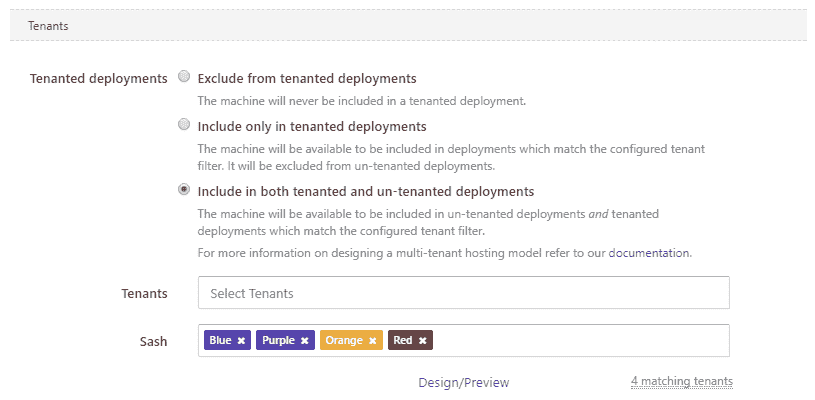

# 八达通 7 月版 3.15 -八达通部署

> 原文：<https://octopus.com/blog/octopus-release-3-15>

这个月的版本包括对多租户部署的一个大的改进，Octopus Server Let ' s Encrypt integration，以及一些更小的改进！

## 在这篇文章中

## 发布之旅

[https://www.youtube.com/embed/mPhwHndEEzk](https://www.youtube.com/embed/mPhwHndEEzk)

VIDEO

## 让我们加密集成

我们是 Octopus 安全的忠实粉丝，我们也希望让您的安全变得更容易。为此，我们添加了对自动管理 Octopus 门户使用的 SSL 证书的支持，使用[来加密](https://letsencrypt.org)。通过几个简单的步骤，您可以配置 Octopus 进行注册、请求证书并将其应用到门户。更好的是，当证书接近到期日时，它会自动更新，所以你不必担心手动更新和重新配置你的八达通服务器。如果你目前已经通过 HTTP 在互联网上安装了服务器，那再简单不过了- [今天就搬到 HTTPS](https://octopus.com/docs/administration/lets-encrypt-integration) 。

## 允许将未租赁的项目部署到租赁的机器上

在多租户部署的开发过程中，我们决定明确区分租赁和未租赁的部署目标。因此，我们防止未租用的项目被部署到租用的机器上。我们的推理本质上是安全第一；我们不想泄露租赁部署或变量。

然而，这阻止了许多有效的场景。例如，将公共组件(例如遥测服务)部署到租用的机器上，或者在租用和未租用的项目之间简单地共享开发服务器。

*注意:这也适用于帐户和证书，因为它们也可以作用于租户。*

你让我们知道我们的决定是错误的(或者至少是不完整的)。你通过我们的支持，通过[用户之声](https://octopusdeploy.uservoice.com/forums/170787-general/suggestions/16616209-allow-non-tenant-and-multi-tenant-deployments-to-t)和通过 [GitHub 问题](https://github.com/OctopusDeploy/Issues/issues/2722)告诉我们。

因此，从 Octopus 3.15 开始，机器、帐户和证书如何参与租用部署是显式可配置的。

## 命令行界面的改进

在这个版本中，我们对 Octopus 和触手的命令行界面(CLI)进行了一些改进:

*   我们已经重新工作并清理了我们的日志记录，因此`stdout`可以更可靠地使用
*   错误现在被写入`stderr`并配有可靠的退出代码
*   `--help`在任何地方都能工作，比以往任何时候都更容易获得特定命令的帮助
*   我们添加了一个版本命令，以便您可以获得详细的版本信息
*   我们增加了对`--format=json`的支持，使 Octopus CLI 可查询，这对自动化特别有用
    *   甚至帮助也是可查询的，因此您可以进行功能检测
*   我们已经开始将数据库配置从过载的`configure`命令转移到`database`命令
*   我们已经废弃了一些不再需要的选项和开关，比如`--noconsolelogging`和`--thumbprintonly`
    *   在 Octopus 4.0 中，这些仍然受支持，但将被删除
*   许多其他小但有用的功能

我们认为这些改进对于自动安装 Octopus 和触手的团队来说是一个受欢迎的补充。

## 重大变化

作为命令行界面改进的一部分，我们清理了写入到`stdout`的内容，将错误重定向到`stderr`，并弃用了一些不再需要的开关。我们尽可能保持向后兼容性。如果您自动安装 Octopus 或触手，我们建议在升级时测试您的自动化脚本，以确保它们仍按预期工作，并查看 Octopus 4.0 中将删除哪些命令和选项。

## 升级

此版本包含安装后数据修复，这可能需要一些时间(取决于事件表的大小)，因此请确保您有时间来完成此操作。如果您正在运行[看门狗服务](https://octopus.com/docs/administration/service-watchdog)，请确保在升级期间停止该服务。

升级 Octopus Deploy 的所有常规[步骤都适用。更多信息请参见](https://octopus.com/docs/administration/upgrading)[发行说明](https://octopus.com/downloads/compare?to=3.14.0)。

## 包裹

这个月到此为止。我们希望你喜欢最新的功能和我们的新版本。欢迎给我们留下评论，让我们知道你的想法！愉快的部署！