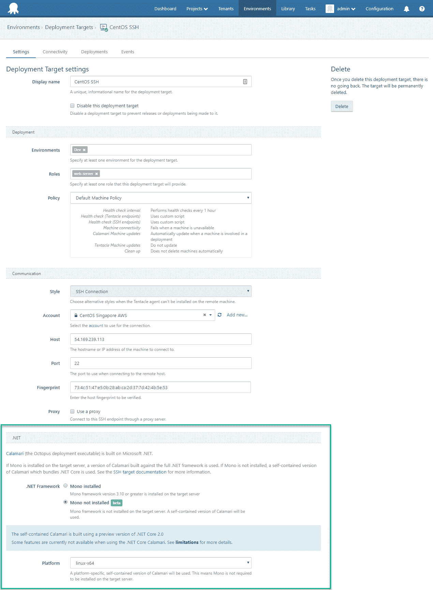

# 八达通 8 月版 3.16 -八达通部署

> 原文：<https://octopus.com/blog/octopus-release-3-16>

虽然这个月的版本比往常小了一点(我们一直在忙于一些超级令人兴奋的东西)，但它仍然有一些令人敬畏的功能。最大的变化是，我们通过消除对 Mono 框架的需求，使部署到 SSH 部署目标变得更加容易，如 Ubuntu、Red Hat Enterprise Linux 或 macOS。这使得部署到这些平台更加容易。我们还升级了 ScriptCS 以更好地使用 C#编写脚本，为 [Okta 身份管理服务](https://okta.com)添加了一个新的身份验证提供者，并包括许多其他小的增强和修复。详情请继续阅读。

## 在这篇文章中

## 发布之旅

[https://www.youtube.com/embed/FmyE4v68MPQ](https://www.youtube.com/embed/FmyE4v68MPQ)

VIDEO

## SSH 以 sans Mono 为目标

Octopus Deploy 支持通过 [SSH 目标](https://octopus.com/docs/deployment-targets/ssh-targets)部署到 Linux 和 macOS。因为[枪乌贼](https://octopus.com/docs/octopus-rest-api/calamari)(章鱼部署可执行文件)是用。NET， [Mono](http://www.mono-project.com/) 是 SSH 目标服务器的先决条件。

从章鱼 3.16 开始，不再需要 Mono 了！

SSH 目标现在提供了一个使用自包含的 Calamari 的选项。

独立的鱿鱼是用。网芯 2.0。因为。NET Core 2.0 目前是一个预览版，我们觉得有必要将这个特性标记为 *beta* 。但是请放心，这是完全支持的。我们相信。NET Core 将在未来为 Octopus Deploy 的跨平台支持提供基础，我们可能会在某个时候放弃基于 Mono 的选项。

## ScriptCS 升级到 0.17.1

Octopus 支持用 C#编写的自定义脚本，这由 [ScriptCS](http://scriptcs.net/) 提供支持。在此版本中，我们升级了库，因此您可以获得最现代的 ScriptCS 支持。在这个 ScriptCS 版本中有一些突破性的变化——阅读下面的更多内容。

我们的[定制脚本文档](https://octopus.com/docs/deployments/custom-scripts)涵盖了编写 C#脚本或任何其他支持的语言所需的一切。

## Okta 认证提供者

八达通现在包括一个 Okta 认证提供商，所以你可以很容易地通过这项服务进行认证。非常感谢[布伦特·蒙塔古](https://github.com/brentm5)的出色表现，并为此提交了一份公关。

我们的[认证提供者文档](https://octopus.com/docs/administration/authentication-providers)提供了更多关于如何使用这个新提供者或任何现有提供者的信息。

## 让我们加密所需的更新

让我们加密最近部署的更新，从特定的 API 调用返回更多的数据。不幸的是，我们用来与 Let's Encrypt 通信的库无法处理这个问题，这意味着新注册和续订都无法成功完成。如果您已经设置了让我们加密集成，请升级以确保您的门户证书正确续订。

## 重大变化

我们需要指出的是，最新的 ScriptCS 已经引入了一些突破性的变化，所以在升级之前查看他们的[发行说明](https://github.com/scriptcs/scriptcs/releases/tag/v0.17.0)是很重要的。这只会影响使用 C#编写脚本步骤的项目，这些项目由幕后的 ScriptCS 提供支持。

## 升级

此版本包含安装后数据修复，这可能需要一些时间(取决于事件表的大小)，因此请确保您有时间来完成此操作。如果您正在运行[看门狗服务](https://octopus.com/docs/administration/service-watchdog)，请确保在升级期间停止该服务。

升级 Octopus Deploy 的所有常规[步骤都适用。更多信息请参见](https://octopus.com/docs/administration/upgrading)[发行说明](https://octopus.com/downloads/compare?to=3.16.0)。

## 包裹

这个月到此为止。我们希望你喜欢我们的新功能和最新版本。欢迎给我们留下评论，让我们知道你的想法！愉快的部署！