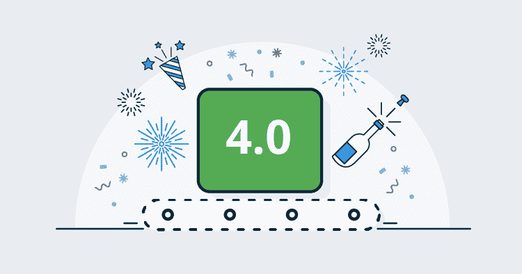
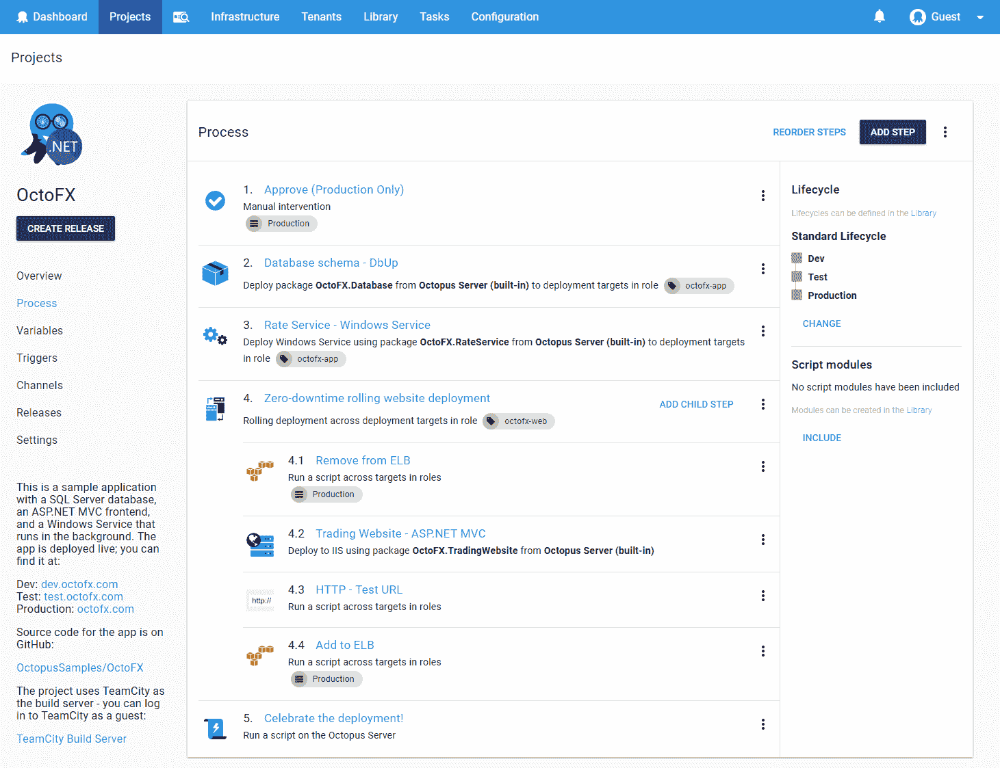
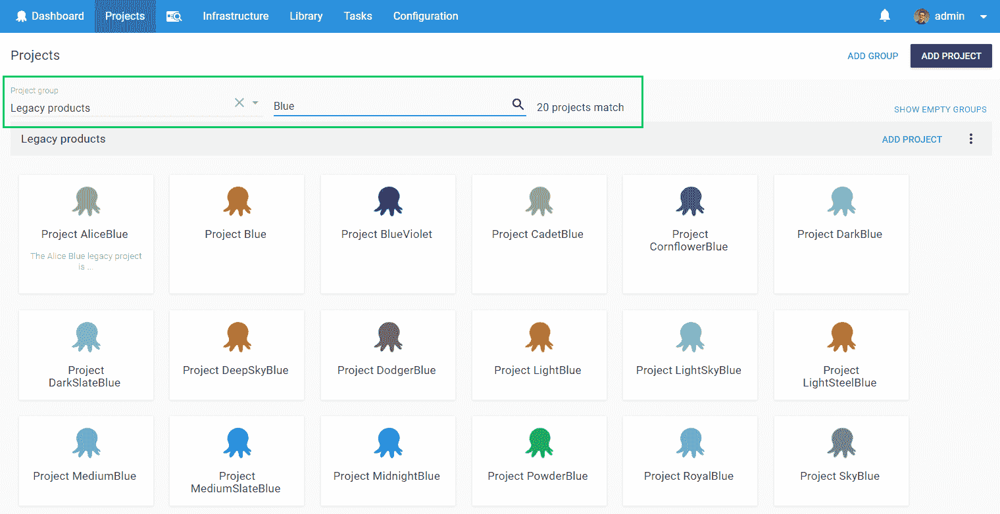
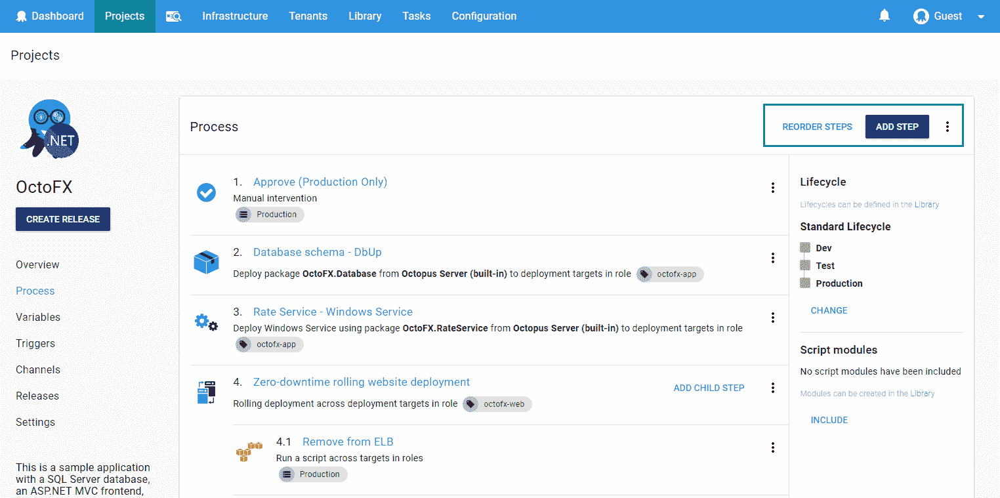
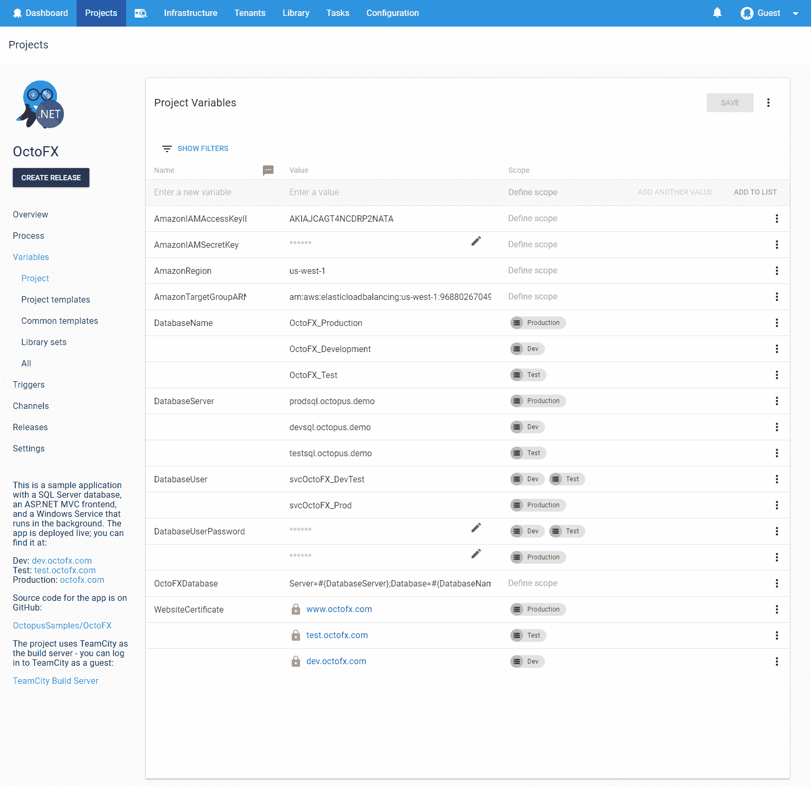
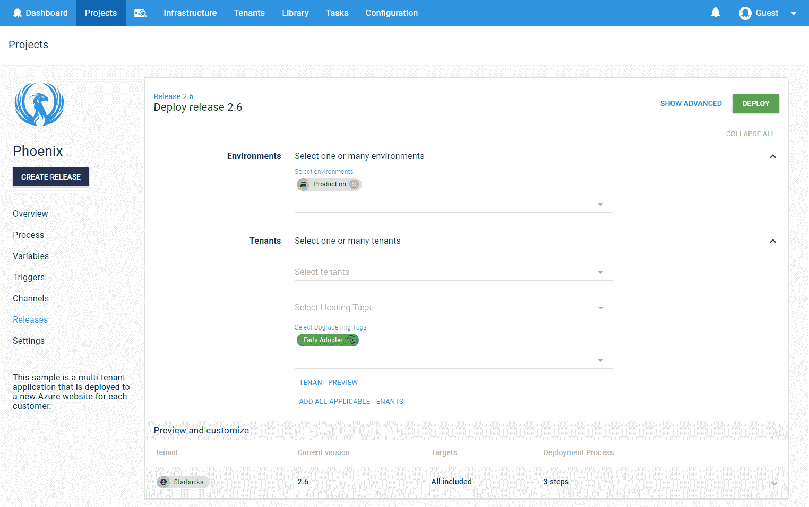
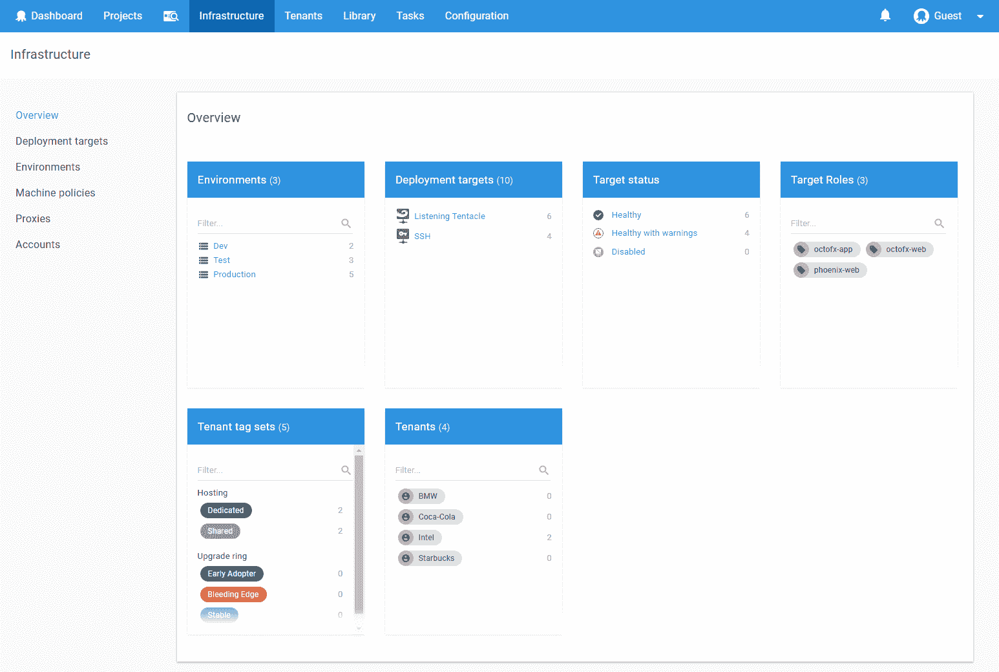

# 八达通部署版本 4.0 -八达通部署

> 原文：<https://octopus.com/blog/octopus-release-4-0>

* * *

我们很高兴发布 Octopus Deploy 4.0，整个团队都很高兴能与全世界分享它！[今天就下载](https://octopus.com/downloads)吧！在这个版本中，最大的变化是[改进的 UI 和用户体验](/blog/octopus-v4-uxui)。Octopus 现在有一个现代化的外观和感觉，我们重新设计了应用程序的一些关键区域。从技术角度来看，这涉及到我们前端的完全重写，从 [Angular 1.4 迁移到 React 和 Redux](/blog/octopus-v4-angular-to-react) 。

我们[因为技术原因](/blog/octopus-v4-history)开始了这个过程，但是随着我们的进展，出现了两个主题。第一个是让 Octopus 更容易使用和更一致，第二个是为规模设计。

## 在这篇文章中

## 发布之旅

[https://www.youtube.com/embed/i-NdrYnmhNU](https://www.youtube.com/embed/i-NdrYnmhNU)

VIDEO

## 易用性

八达通一直都很好用，现在比以前更好用了。我们努力确保每一页都尽可能直观和一致。

 
我们使用谷歌的材料设计指南更新了我们的外观，但我们也保持了简单的东西，以保留章鱼的个性。

 
我们在整个用户界面中添加了过滤器和搜索控件，以便您可以专注于对您来说重要的事情，快速轻松地完成工作。

 
章鱼的动作和按钮是一致的，所以你再也不用去找那个存扣了！

 
我们完全[重新设计并重写了我们的变量编辑器](/blog/octopus-v4-variable-editor)，因此管理大量变量变得更加简单和容易。我们还包括完整的键盘支持。

 
我们[重新设计并简化了我们的部署发布页面](/blog/octopus-v4-create-deployments)，允许您指定何时何地部署您的项目，以及查看预览和进一步定制。

## 规模设计

我们希望 Octopus 是一个很好的体验，无论您是一个只有一个实例的小团队，还是一个有高可用性节点的大企业！我们的一些大客户有数千个项目和数千台机器。过去，我们对 Octopus 服务器进行了有针对性的更改以提高性能，但在 Octopus 4 中，我们重新考虑了用户界面，以便为大量安装的客户提供更好的体验。

更新的项目页面现在有一个卡片布局，您可以使用过滤器和项目切换器快速轻松地访问您喜爱的项目。

我们[重新设计了我们的环境页面](/blog/octopus-v4-infrastructure)，现在它被称为基础架构页面，以更好地适应其目的和意图。处理成百上千个环境和部署目标要简单得多。新的 overview 页面为您提供了基础架构的摘要，选择一个摘要项目会将您带到相关部署目标的筛选视图。

## 重大变化

此版本中有突破性的变化，我们建议您查看以下列表，看看是否有相关的内容。

## 升级

此版本包含一些安装后数据修复，这可能需要一些时间(取决于您的`DeploymentProcess`和`User`表的大小)，因此请确保您有时间来完成此操作。如果您正在运行[看门狗服务](https://octopus.com/docs/administration/service-watchdog)，请确保在升级期间停止该服务。

一如既往，阅读[升级指南](https://octopus.com/docs/administration/upgrading)了解升级到 Octopus 4.0 的更多细节。

## 包裹

我们非常自豪地向我们所有的客户提供 Octopus 4.0，我们希望您和我们一样喜欢它。[今天就下载](https://octopus.com/downloads)吧！