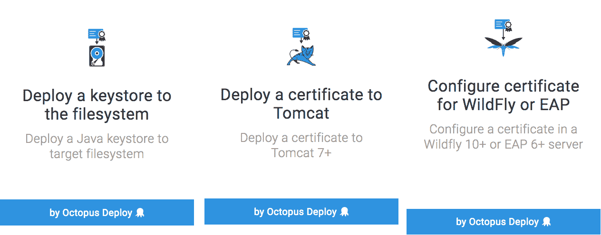
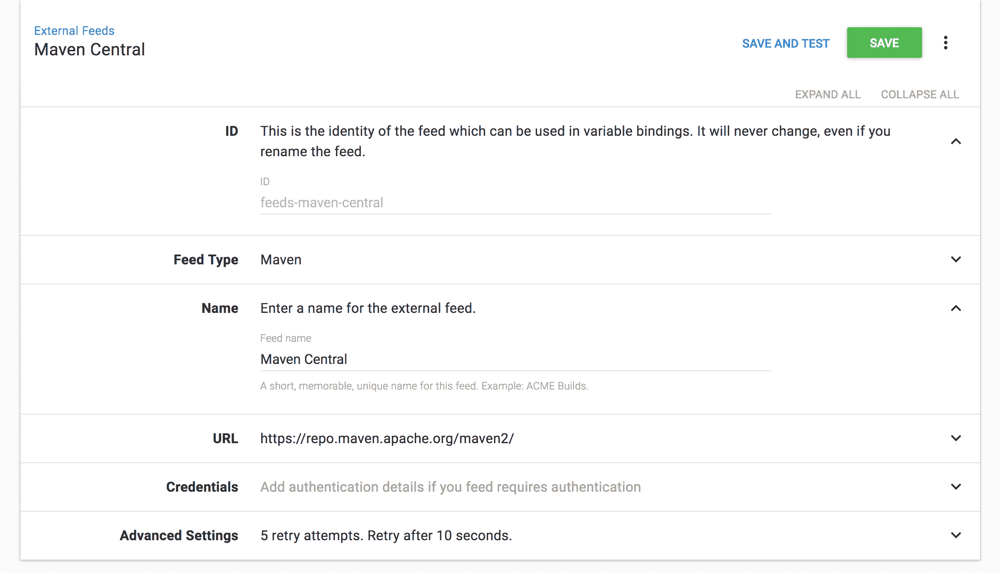
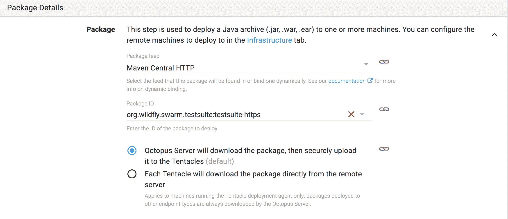
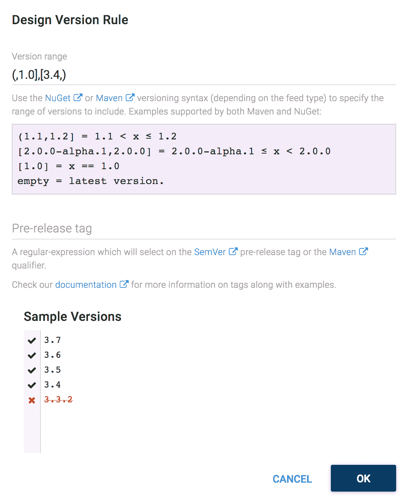

# 八达通 12 月版 4.1 -八达通部署

> 原文：<https://octopus.com/blog/octopus-release-4-1>

今年 12 月发布的 Octopus 继续支持早在 3.17 中引入的 Java，能够将证书导出为 Java 密钥库，并直接在现有的 Tomcat 7+、wildly 10+和 Red Hat JBoss EAP 6+应用服务器中配置证书。这个版本还允许将 Maven 存储库配置为外部 Octopus 提要，这意味着 Octopus 现在可以在部署中使用 Maven 工件。请继续阅读所有激动人心的细节！

## 在这篇文章中

## 发布之旅

[https://www.youtube.com/embed/vKwv56oYSyY](https://www.youtube.com/embed/vKwv56oYSyY)

VIDEO

## 将证书作为 Java 密钥库导出到 WildFly、JBoss EAP 和 Tomcat

Octopus 已经具备了[管理您的证书](https://octopus.com/docs/deployments/certificates)的能力，现在这些证书可以通过`Configure certificate for WildFly or EAP`步骤直接在现有的 wildly 10+或 Red Hat JBoss EAP 6+应用服务器中配置，或者通过`Deploy a certificate to Tomcat`步骤在现有的 Tomcat 7+应用服务器中配置。对于那些希望手动配置证书的人来说，新的`Deploy a keystore to the filesystem`步骤允许将由 Octopus 管理的证书保存为 Java 密钥库。

您可以通过查看这些步骤的文档来了解更多信息:

## 作为外部提要的 Maven 存储库

Maven 存储库非常受 Java 开发人员的欢迎，在这个版本中，Maven 存储库可以配置为 Octopus 中的外部提要。

这意味着 Maven 工件现在可以像任何其他提要一样作为部署的一部分下载。

所有您喜欢的特性，比如频道和版本规则，也可以用于 Maven 提要，您也可以使用标准的 [Maven 版本范围语法](https://g.octopushq.com/MavenVersioning)！

在我们的[文档](https://octopus.com/docs/packaging-applications/package-repositories/maven-feeds)中获得更多关于使用 Maven 仓库作为外部提要的细节。

## 更多配置增强

基于我们在 4.0 中所做的配置增强，我们在此版本中添加了一些新功能。

首先是调整如何处理任务日志、工件和包存储库的目录路径。这些路径先前被默认为相对于服务器主目录的路径，但被存储为绝对路径。如果您出于某种原因需要移动整个文件夹结构，这会很困难，因为您必须单独更改所有路径。我们现在默认将路径存储为相对值，并在运行时计算绝对路径。如果您覆盖了任何路径，并且它们不是相对于主目录的，例如，当您使用 HA 的共享位置时，那么我们将它们存储为绝对值。

第二个新特性也与这些路径相关。现在你可以在设置界面和`show-configuration`命令的输出中看到它们。

## 重大变化

这个版本没有重大变化。

## 升级

升级 Octopus Deploy 的所有常规[步骤都适用。更多信息，请参见](https://octopus.com/docs/administration/upgrading)[发行说明](https://octopus.com/downloads/compare?to=4.1.0)。

## 包裹

这个月到此为止。我们希望你喜欢我们的新功能和最新版本。欢迎给我们留下评论，让我们知道你的想法！愉快的部署！