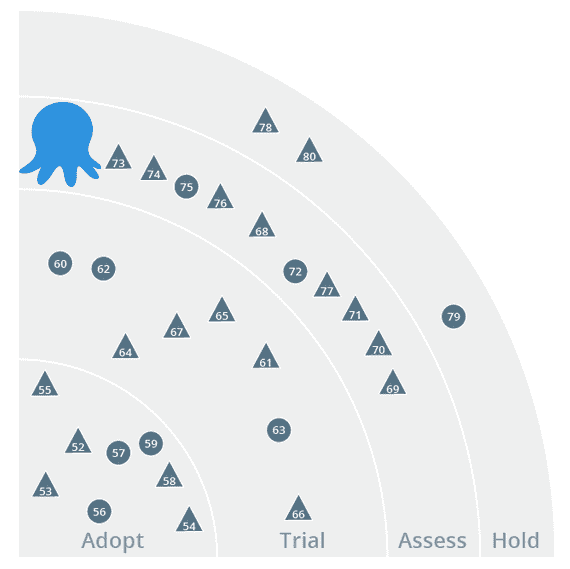

# ThoughtWorks 技术雷达中的章鱼部署-章鱼部署

> 原文：<https://octopus.com/blog/octopus-thoughtworks-radar>

我发布的有点晚，但是 Octopus Deploy 在去年 5 月赢得了 Thoughtworks 技术雷达的一席之地:

什么是科技雷达？

> ThoughtWorks 技术顾问委员会是一个由 ThoughtWorks 的高级技术领导者组成的小组，负责创建雷达。他们定期会面，讨论 ThoughtWorks 的全球技术战略以及对我们的行业产生重大影响的技术趋势。雷达捕捉技术顾问委员会讨论的结果，以一种格式为从首席信息官到开发人员的广泛利益相关者提供价值。

八达通被列入评估类别，这意味着:

> 评估:值得探索，目标是了解它将如何影响您的企业。

我认为这是公平的，因为新的自动化部署解决方案在。网络生态系统。我发现有趣的是，像微软的 Team Foundation Server 这样的产品被列在“保留”类别中。

来自 [PDF](http://thoughtworks.fileburst.com/assets/technology-radar-may-2013.pdf) :

> 应该采用 Windows 基础设施自动化，但是它仍然比 Unix 平台上的自动化更困难。像 Chef 和 Puppet 这样的工具正在增加它们的支持，但是也有像 Octopus 这样的 Windows 专用解决方案正在开发中。Octopus 允许自动部署您的 ASP.NET 应用程序和 Windows 服务，并减少对 PowerShell 的依赖。它可以与使用 Octopak 的 NuGet 和 TeamCity 一起使用，以创建完整的构建、打包和部署管道。