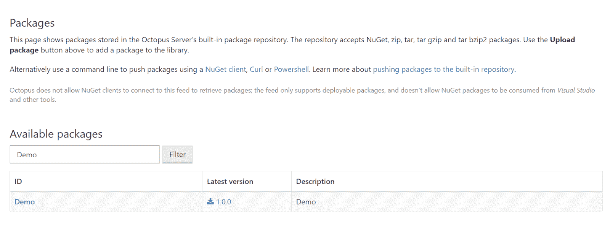
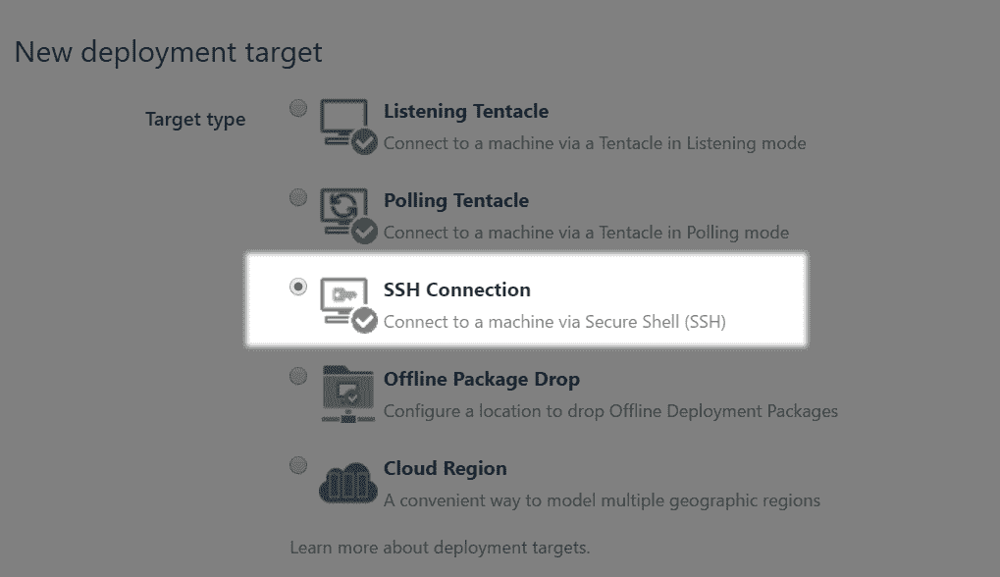
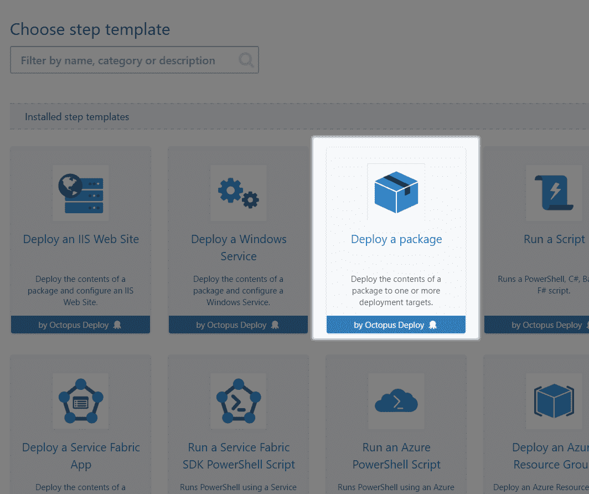
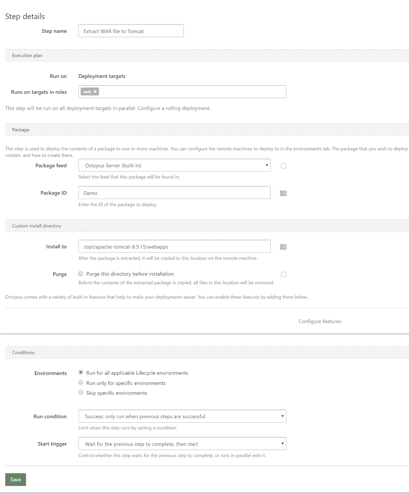

# 从 Octopus Deploy - Octopus Deploy 部署到 Tomcat

> 原文：<https://octopus.com/blog/octopus-tomcat>

Octopus Deploy 提供了大量有用的步骤(包括自带的和社区提供的)，可用于通过不同的方法将包部署到各种不同的目的地。

幸运的是，这些相同的部署步骤可以用来将 Java 包部署到运行在 Linux 上的 Java web 服务器上。

有一些警告，我要大声说出来。Octopus Deploy 团队正在积极研究如何改进对 Java 的支持，所以期待在未来的版本中看到对 Java 开发人员的改进。

下面的步骤提供了一个可以用 Octopus Deploy 实现的过程示例，用于将 WAR 文件部署到运行在 Linux 中的 Tomcat 服务器。

## 构建战争文件

首先，我假设您手边有一个构建 WAR 文件的 Maven 项目。如果没有，在[https://github.com/OctopusDeploy/ThymeleafSpringDemo](https://github.com/OctopusDeploy/ThymeleafSpringDemo)有一个小的演示应用程序将用于这个例子。

这个项目使用 [Maven 包装器](https://github.com/takari/maven-wrapper)，所以所有 Maven 命令都通过`mvnw`脚本传递。如果本地还没有合适的 Maven 版本，这个脚本将为您下载并安装它，然后将参数传递给`mvn`可执行文件。

要构建 WAR 文件，请运行以下命令:

```
./mvnw clean package 
```

这将导致在`target`目录中创建文件`demo##<timestamp>.war`(例如`demo##201705290808.war`)。

WAR 文件的时间戳部分由 [Tomcat 并行部署特性](https://tomcat.apache.org/tomcat-8.0-doc/config/context.html#Parallel_deployment)使用。它允许 Tomcat 排出旧版本 web 应用程序的连接，同时将新流量导向最新版本。

## 打包 WAR 文件

这就是 Octopus Deploy 所需的一些约定不同于 Java 通常使用的那些约定的地方。

要将一个包上传到 Octopus Deploy，它必须遵循许多[版本控制规则](https://octopus.com/docs/packaging-applications/versioning-in-octopus-deploy)。在实践中，这意味着用类似于`demo.0.0.1.zip`的文件名创建一个 zip 或 tar.gz 档案。

在 Java 中，版本控制主要是通过 [Maven](https://docs.oracle.com/middleware/1212/core/MAVEN/maven_version.htm#MAVEN8855) 来完成的。此外，上面创建的 WAR 文件在 WAR 文件名中嵌入了时间戳版本，Tomcat 可以识别该版本。另一方面章鱼部署使用[永远](http://semver.org/)。所有这些版本控制方案大多是不兼容的，并且内置的存储库目前不支持 WAR 文件，这意味着我们不能照原样上传 WAR 文件。

解决方案是将 WAR 文件打包成一个适当命名的 ZIP 文件，然后可以上传到 Octopus Deploy。这个“WAR in a ZIP”包允许我们用 Octopus Deploy 管理 WAR 文件，但是确实有一些缺点，我将在后面提到。

要打包 WAR 文件，请使用 [Octopus Deploy CLI 工具](https://octopus.com/docs/octopus-rest-api/octopus-cli)。CLI 工具是一个[。NET Core](https://github.com/dotnet/core) 应用程序，它公开了一些可以在 Octopus Deploy 中执行的常见操作，以及一些方便的特性，比如使用正确的命名约定创建 ZIP 存档。

如果你不熟悉。NET Core，对于这篇博文来说，知道它允许。NET 应用程序可以跨操作系统运行，包括 Linux。Octopus Deploy CLI 工具是一个独立的软件包，包括。NET 核心运行时，所以当您下载 Linux 发行版的版本时，您就(几乎)获得了运行 CLI 所需的一切。

您可能需要安装一些额外的依赖项，以便从使用“最小”安装选项安装的 Linux 环境中运行 CLI 工具。从[的文档开始。NET Core](https://www.microsoft.com/net/core#linuxcentos) 页面列出了各种 Linux 发行版所需的包。

要创建包，请运行命令:

```
octo pack --id=Demo --version=1.0.0 --basePath=target --include=*.war --format=zip 
```

这将创建包含 WAR 文件的文件`Demo.1.0.0.zip`。

创建 ZIP 文件不需要使用 CLI 工具。任何压缩工具都可以。然而，Octopus Deploy 提供的工具旨在根据打包文件的实际内容大幅缩减文件大小。更多信息见[包传输的增量压缩](https://octopus.com/docs/deployments/packages/delta-compression-for-package-transfers#OptimizingDeltaCompression)。

## 推动包装

要推动包装，使用[推动命令](https://octopus.com/docs/octopus-rest-api/octopus-cli/push):

```
octo push --package Demo.1.0.0.zip --server http://my.octopus.url --apiKey API-XXXXXXXXXXXXXXXX 
```

您可以在[如何创建 API 密钥](https://octopus.com/docs/how-to/how-to-create-an-api-key)中找到关于 API 密钥的信息。

这将把包添加到 Octopus Deploy 内置包存储库中，以便可以在部署中使用。更多信息见[软件包库](https://octopus.com/docs/packaging-applications/package-repositories)。

【T2 

## 创建 Octopus 部署环境

在 Octopus 中，环境是您将同时部署到的一组机器；环境的常见示例有测试、验收、试运行或生产。[入门](https://octopus.com/docs/getting-started#Gettingstarted-Createenvironments)文档详细介绍了在 Octopus Deploy 中创建新环境的过程。

## 创建 Octopus Deploy 部署目标

部署目标代表您的应用程序和服务将被部署到的服务器、机器和云服务。[入门](https://octopus.com/docs/getting-started#Gettingstarted-Adddeploymenttargets)文档详细介绍了在 Octopus Deploy 中创建新部署目标的过程。

在本例中，我们将创建一个部署目标来代表运行在 Linux 主机上的 Tomcat 服务器。几乎所有的 Linux 服务器都运行 SSH 作为远程管理的手段，而 [Octopus Deploy 本机支持 SSH](https://octopus.com/docs/deployment-targets/ssh-targets)，所以这是我们将用来部署 WAR 文件的通信手段。

[](#)

Octopus 使用一个名为 [Calamari](https://octopus.com/docs/octopus-rest-api/calamari) 的组件作为引擎在部署目标上执行部署。Calamari 目前需要依赖 [Mono](http://www.mono-project.com/) 来提供一个. NET 环境，以便在 Linux 上运行。您需要在 Tomcat 服务器上安装 Mono 来运行 Calamari。在未来，这将被简化使用。NET 核心，而不需要额外的依赖。

这对刚接触 Octopus 的人来说可能会很困惑，所以我将回顾一下。你只需要知道:

*   Octopus 部署 CLI 工具使用。NET 核心，并且是自包含的，尽管您可能需要安装额外的依赖项。CLI 工具既可以在您自己的 PC 上运行，也可以在诸如 TeamCity 或 Bamboo 等 CI 服务器上运行。
*   章鱼部署执行引擎 Calamari 使用。NET，还有。NET 由 Linux 下的 Mono 提供。Calamari 运行在您要部署到的主机上，就像 Tomcat 服务器一样，这意味着 Tomcat 服务器也需要安装 Mono。

SSH 部署目标需要记住的一点是，建立 SSH 连接的用户需要拥有部署到 Tomcat `webapps`目录的权限。稍后，我们将定义一些部署步骤，将 WAR 文件从之前上传的包中复制到 webapps 目录中，如果 SSH 用户没有将文件复制到该位置的正确权限，此步骤将会失败。

可以从 Octopus Deploy 部署到 Linux 服务器，而无需安装 Mono。这很方便，但是代价是您会失去很多 Calamari 在执行部署时提供的功能。更多信息请参见[尝试生吃章鱼](https://octopus.com/blog/trying-raw-octopus)。

## 创建 Octopus 部署项目

项目定义了您希望 Octopus 执行的一组部署步骤，以及它们的配置变量。[入门](https://octopus.com/docs/getting-started#Gettingstarted-Createaproject)文档详细介绍了在 Octopus Deploy 中创建新部署目标的过程。

在项目内部，我们需要打开 Process 部分，并添加`Deploy a package`步骤。

[](#)

`Deploy a package`步骤为我们提供了一种方法，将包提取到部署目标上的期望位置。在我们的例子中，我们将 ZIP 包和 WAR 文件解压到 Tomcat `webapps`目录。

`Configuration Variables`和`Configuration transforms`部分提供了很多我们在部署 Java 应用程序时无法使用的功能。这些选项假设某些 XML 文件可以直接在包中获得。当包包含 WAR 文件，并且在部署期间不能修改 WAR 文件中包含的任何配置文件时，情况就不同了。这是将 Octopus Deploy 与 Java 工件一起使用的一个限制，但是 Octopus 团队正在研究这个问题，以便在未来的版本中更好地支持 Java。

为了定义提取 WAR 文件的位置，点击`Configure features`链接。选择`Custom installation directory`选项并点击`Apply`。

屏幕上将添加一个`Custom install directory`部分。将`Install to`字段设置为`webapps`文件夹的本地路径，例如`/opt/apache-tomcat-8.5.15/webapps`。

您很可能希望不选择`Purge`选项，因为 Tomcat 可能会托管其他 WAR 文件，您不希望在解压缩`demo##<timetstamp>.war`文件时删除这些文件。

[](#)

## 创建一个 Octopus 部署版本

一个发布捕获了所有的项目和包的细节，所以它可以以一种安全的和可重复的方式被一遍又一遍地部署。[入门](https://octopus.com/docs/getting-started#Gettingstarted-Createareleaseanddeployit)文档详细介绍了在 Octopus Deploy 中创建新版本的过程。

## 部署八达通部署释放

部署是将版本部署到环境中的步骤的执行。一个单独的版本可以多次部署到不同的环境中。[入门](https://octopus.com/docs/getting-started#deploy-a-release)文档详细介绍了在 Octopus Deploy 中部署新版本的过程。

在我们的例子中，部署发行版意味着获取被推送到 Octopus Deploy 的包，在 Tomcat 服务器上安装 Calamari，将包发送到 Tomcat 服务器，并使用 Calamari 将包中的 WAR 文件提取到 Tomcat `webapps`目录中。

## 摘要

此时，Tomcat 已经将 WAR 文件提取到了`webapps`目录中，Java 应用程序将由 Tomcat 部署并运行。

我们目前正在为 CI 服务器开发插件，如 Bamboo，它将自动完成打包、推送和发布部署的过程，并且已经有了一个用于 [TeamCity](https://octopus.com/docs/packaging-applications/build-servers/teamcity) 的插件。

将来，我们会寻找将配置转换等特性引入 Java 包的方法，这意味着特定于环境的配置(如数据库连接字符串)将应用于 JAR、WAR 和 EAR 文件，就像它们应用于新环境一样。