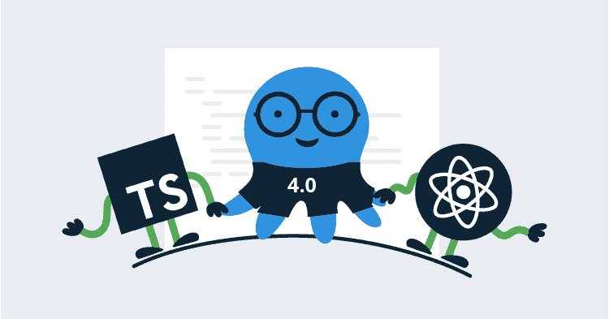
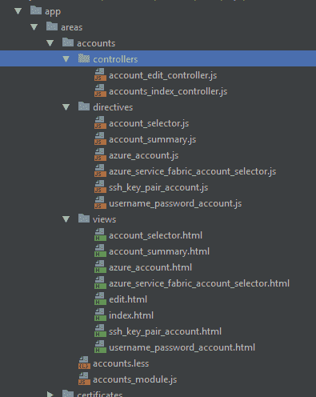
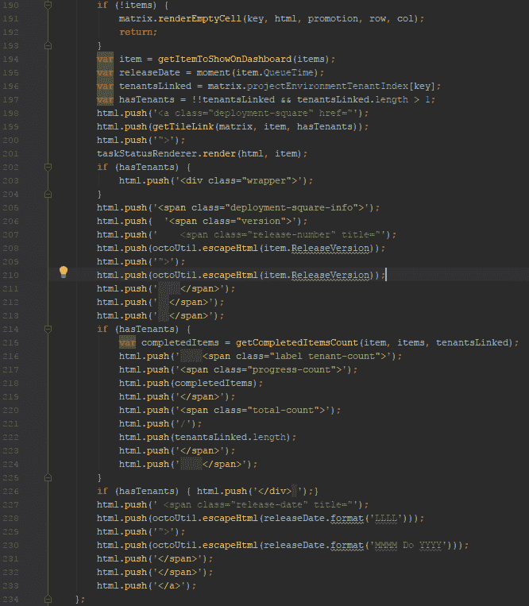
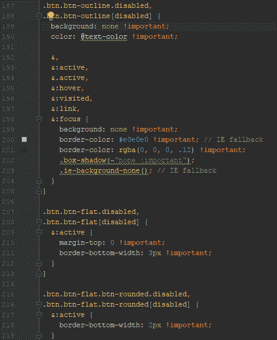
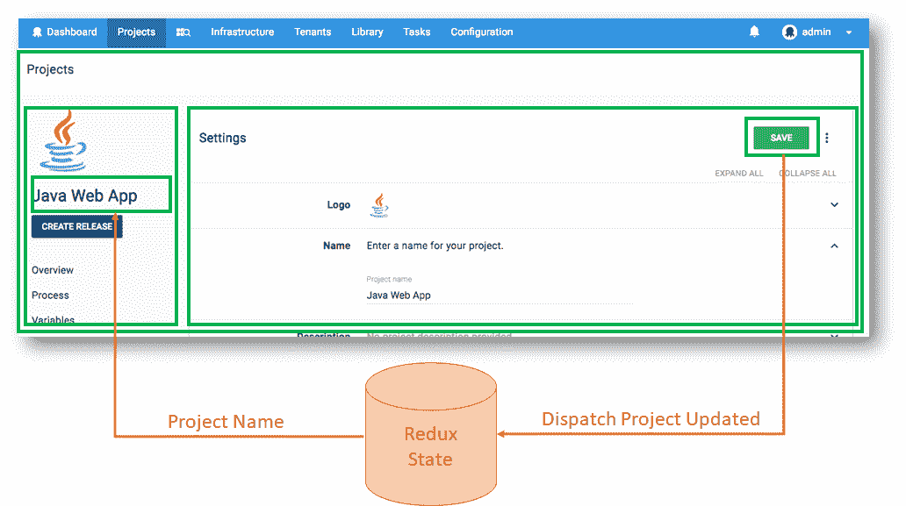
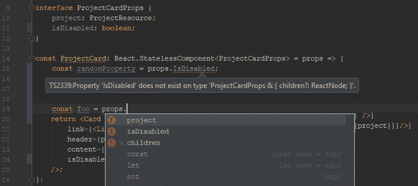

# Octopus Deploy 4.0 -为什么我们在重写 Octopus 4.0 UI 时选择 React 而不是 Angular

> 原文：<https://octopus.com/blog/octopus-v4-angular-to-react>

这篇文章是我们章鱼 4.0 博客系列的一部分。在我们的[博客](https://octopus.com/blog)或我们的[推特](https://twitter.com/octopusdeploy)上关注它。

**Octopus Deploy 4.0 已经发货！今天就阅读[博文](/blog/octopus-release-4-0)和[下载](https://octopus.com/downloads)吧！**

* * *

作为我们在 Octopus 4.0 中对门户网站进行大规模改造的一部分，我们从 Angular 迁移到 React。很多用户问我们为什么要搬家的细节，所以这篇文章的目的是通过我们在这个过程中所做的一些选择来回顾一些关于转变的关键点。

## 决策点

### 成熟的代码库

Octopus Deploy 的`3.x`版本中的前端代码库在我们的 [`2.0`迁移到 Angular](https://octopus.com/blog/2.0) 时开始了它的生命。2013 年 Angular 1.2 风靡一时，dependencies 由 bower 管理，由 gulp 构建，而 [Thrift Shop](https://www.youtube.com/watch?v=QK8mJJJvaes) 则在电视上大放异彩。自最初发布以来，门户已经升级了许多次，但是它已经开始感受到产品在功能和活跃开发人员数量方面的巨大增长。在 Octopus Web Portal `2.0`的最初开发阶段，团队成员只有 3 人，现在使用这个代码库的开发人员已经达到 23 人。截至 Octopus Deploy 的当前`3.17`版本，连接到`application.js`的旧门户网站包含近 1000 个文件，覆盖 40000 多行代码(不包括第三方库和 CSS)。

管理一个由 3 个开发人员组成的小型代码库比管理一个由 20 多个不同人员组成的大型代码库要简单得多，而且像任何代码库一样，现有的架构已经变得臃肿、不一致和过时。它大致遵循了构建“类 mvc”应用程序的老方法，一个目录用于控制器，一个用于视图，另一个用于指令

【T2 

很明显，一旦你有了更多的 UI 元素，这些元素的组成部分就会分散到几个目录中，很快就会分崩离析。如今，更具可伸缩性的模式是将组成单个组件的文件放在一起。当 Octopus 提供更简单的特性时，这种代码库可能是可管理的，但现在由于门户网站提供了更多的支持和控制，这种情况就不那么容易管理了。虽然像这样的结构性问题除了我们自己没有人可以责怪，但总会有这样的问题，这些问题产生于需要偶尔修剪的不断发展的代码库。在我们的情况下，花园已经变得泛滥成灾，是时候考虑砍掉它，重新种植了。

### 性能考虑因素

随着越来越大的客户在处理成千上万的机器、项目或步骤时开始注意到门户中的性能问题，规模也成为一个问题。这很大一部分是由于 Angular(2.0 之前)处理和渲染状态的方式。每当对一个对象进行更改时，都是通过对`$scope.apply()`的显式或隐式调用来启动一个摘要周期。Angular 然后需要检查该范围内的所有观察器(再次通过显式的`.watch()`注册或隐式的通过 UI 绑定),并比较它们的 before 和 after 值，以检查是否需要调用任何更新。当处理一个大的对象图时，这可能会变得非常昂贵。

这是一个突击测验。下面的代码是什么样子的？

不，这不是一个如何在 JQuery 之前构建动态网站的例子，这是我们发现的解决渲染项目仪表板屏幕的角度性能问题的最佳方法。当从 api 调用返回数千个部署项时，每隔几秒钟就会更新一次，这会造成相当明显的延迟。将它显示在屏幕上的最快方法是在内存中构建一个 html 字符串，并将其推送到 DOM 中。可以想象，代码库的这些部分虽然很少，但却很少受到喜爱和关注。

作为一项实验，我们最终使用[n React](https://github.com/ngReact/ngReact)将我们的角度代码的某些部分替换为 React 的小岛屿，希望利用虚拟 dom 的优势，并消除摘要循环。结果很明显。渲染几千个租户的屏幕从 Angular 的 20 秒到 React 的 2 秒。虽然这部分可能是由于我们现有的 Angular 代码急需清理，但它确实表明，如果我们重新思考我们现有的代码库，就可以实现一些真正的改进。使用虚拟 DOM 所增加的成本在很大程度上得到了补偿，因为我们避免了重新渲染甚至没有改变的大部分屏幕。令人惊讶的是，使用 React 得到了与旧的“HTML 字符串”方法相当的性能结果。

### 半铸钢ˌ钢性铸铁(Cast Semi-Steel)

最初，Octopus 2.0 是以 Bootstrap 2.3.2 为基础设计的，定制的 Octopus CSS 位于基础之上(这有时会涉及修改 Bootstrap 样式表本身！).在`3.0`中，一个新的定制设计模板被添加到组合中，正好在升级版 Bootstrap 和定制 Octopus 风格之间。就像在现有的四层建筑上增加一个新的二层，当然理论上是可行的，但是会有很多隐藏的管道和电线需要排成直线*。除此之外，还有各种组件所需的所有其他样式，如 [Angular UI](https://angular-ui.github.io/bootstrap/) 、 [select2](https://select2.org/) 等。这是超过 3 种不同的设计结构相互作用(和反对)。我不打算添加我确信我们都见过的 [Family Guy CSS GIF](https://imgur.com/gallery/Q3cUg29) ，但我只想说，在你的 CSS 中出现`!important`通常是有问题的迹象。我们的构建过程甚至需要分割串接的 CSS 文件，以绕过 IE 对每个样式表最多 4095 条规则的限制！为了提供一个[全新的设计](/blog/octopus-v4-uxui)来提高可用性，一个全站点范围的重建在很多方面都像是最合理的解决方案。*

 *

*这些款式一定真的很重要！(好吧，这是一个特别不好的例子)*

## 仍然...为什么要反应？

随着我们门户的 Angular 1.4 版本明显超出了自身的发展，我们决定在开发的便利性和最终用户的性能方面更好地适应未来，重建前端是至关重要的。无论如何，从 Angular framework 1.x 到 2.0 几乎可以被认为是一个完全的重写，所以还有什么更好的机会来评估还有什么其他的选择。

React 已经表明自己是一个明显的竞争者。通过利用虚拟 DOM(不要与浏览器原生特性 [Shadow DOM](https://developer.mozilla.org/en-US/docs/Web/Web_Components/Shadow_DOM) 相混淆)，React 能够将文档渲染减少到那些实际需要更改的情况。当处理数千台机器时，正如我们的一些用户所做的那样，UI 的任何改进都是显而易见的。在整个消化周期中提供的观察模式 Angular 只会加剧这个问题。在任何改变之后比较我们所有组件的状态被证明是非常昂贵的。

最终，没有人是在真空中发展的(我所说的发展“真空”指的是缺乏 StackOverflow 而不是空气的环境)，所以社区参与是我们决策的一个关键因素。React 生态系统拥有一个庞大的活跃贡献者社区，与 Angular 2.0 相比，React 轻松获胜。React 也从一个简单的前端网站框架发展起来，现在可以作为一个工具来构建“原生”浏览器应用程序(用于我们的迷你 IOS 应用程序 [OctoWatch](https://itunes.apple.com/us/app/octowatch/id1232940032?mt=8) )或网站的服务器端渲染。

尽管如此，React 在我们的特殊情况下是赢家，当然，这并不是说对于某些场景，Angular 不是一种合适的方法。

## 新的希望

选择 React 作为新门户的核心引擎之后，让我们看看我们最终是如何使用它来构建全新的 Web Portal 4.0 的。

### 没有冗余

在社区的某些地方似乎有一点假设，如果不在 Redux 中管理所有状态，就无法构建 React 应用程序。Redux 的作者之一丹·阿布拉莫夫在他的博客[“你可能不需要 Redux”](https://medium.com/@dan_abramov/you-might-not-need-redux-be46360cf367)中说得很好

> ...如果你只是在学习 React，不要把 Redux 作为你的首选。相反，要学会在反应中思考。如果你真的需要它，或者你想尝试一些新的东西，请回到 Redux。但是要小心对待它，就像对待任何固执己见的工具一样。

后来在回应一条推特帖子时。

在构建门户的最初尝试中，我们打算尽可能多地使用 Redux 来维护整个项目的状态。当我们看到执行最平凡的任务所需的锅炉板数量时，我们的担忧开始了。我们还担心将如此多的数据存储到一个单一的静态(出于各种目的)状态中。一些拥有大型部署仪表板的用户的数据可能有几兆字节大小。确保这种状态被适当地清理包括在组件生命周期中的正确时间分派事件，然而这感觉起来像一个泄漏的抽象(和一个手动的垃圾收集行为)，要求组件知道一些关于存储机制的事情，以便告诉它什么时候数据需要被清理，什么时候它可以被留下。最终，这些数据的上下文只在仪表板组件上有意义。

了解对象图中的正确位置还需要了解应用程序整体的上下文。当我检索`Project`资源时，我应该把它放在“Project”的根级别吗？如果另一个组件出于不同的目的突然需要另一个项目，或者如果我们决定现在可以为屏幕的不同部分同时加载多个项目，该怎么办？这些问题都有约定、规则或库形式的答案，但是它们的存在让我们停下来思考我们最初用 Redux 做什么。

我们的回应是取消 Redux 和*的使用，只在组件级状态机制不再有意义或不切实际的地方使用它们*。是的，子标题有点像点击诱饵，*我们仍然使用 Redux* ，但是，我们只在需要的时候才根据具体情况添加状态。我们的应用程序中需要通信或处理非本地化状态的部分，生活在 Redux 提供的非本地化状态管理中是有意义的。例如，我们希望页面标题和侧栏显示项目名称，项目名称本身可能需要更新，以响应有人更新它在组件树深处的值。

与一些最初的担忧相反，我们发现这并不比“Redux 中的整个应用程序状态”方法声称的更糟糕。唯一的缺点是这会使测试稍微复杂一点，因为数据不是通过 Redux 注入的，而是由组件本身在`componentDidMount`生命周期阶段加载的。

戴夫·塞迪亚在【Redux 做什么”中总结道

> 但是这里的这个东西，“将任何数据插入任何组件”，是主要事件。如果不需要那个，大概也不需要 Redux。

关键的一课是在寻找解决方案之前了解你的问题和局限，并且只在有意义的地方使用解决方案，而不仅仅是因为其他人都喜欢它。

### 带有类型的 Javascript

作为一个在 Notepad.exe 还是最好的 IDE 的时候就开始建立网站的人，在之前的一个项目中第一次有人向我提出 TypeScript (TS)的时候，我毫不掩饰地反对这个想法。“外部类型框架只会让它变得脆弱，增加开销！为什么要通过静态输入来失去 Javascript 的一些功能呢？没有人把宝贝放在角落里！”从这个新的 Octopus 4.0 项目开始就介绍了 TS，我可以说我现在是一个皈依者。

我们发现，在将一些旧代码移植到新门户时，引入 TS 实际上暴露了一些错误和代码做出的错误假设，否则我们不会发现这些错误和假设。TS 只是 JavaScript 的一个超集，所以你可以把你的`.js`文件转换成`.ts`，然后在合适的地方慢慢使用它。我们同时添加了 [tslint](https://palantir.github.io/tslint/) 来帮助维护整个项目的一致性。最简单的事情是从一套宽松的规则开始，当你觉得有能力处理其余开发人员的愤怒时，通过逐步启用更多规则来拧紧螺丝。我听说过这样的情况，其他开发人员对 TS 完全不感兴趣，因为从一开始就应用了过多的规则，而不是先学习如何使用它。

TypeScript 可能并不适合所有人，但是从我的经验来看，能够自信地推断什么被传递到您的函数或组件中，可以在重构或尝试使用另一个开发人员的代码时节省大量时间。当一个 JS 项目只有一两个开发人员时，没有某种类型的输入系统可能是可行的，但是当您有超过 20 个开发人员，处理数百个文件时，这就是它真正开始为自己说话的时候(我甚至发现自己在自己的个人项目中使用它)。能够重构 JS 代码并自信地知道您的更改将会影响什么，而不是必须非常了解代码库及其相互交织的依赖关系，这在鼓励您维护代码方面非常有效。作为 Babel 的替代品，它允许我们使用即将标准化的原生语法来编写在旧浏览器中具有 pollyfills 特性的 JavaScript。也有可能通过一点努力来克服处理第三方库类型的小问题。相反，我发现与这种规模的其他项目相比，TS 提高了生产率，因为它消除了一些测试小事情的需要，比如检查函数中的输入处理，这些检查以前会确保有效类型被传入(我说过我们能够通过少*个*个测试，不要引用我说的*无*)。有时，编译器会发现一些愚蠢的错误，比如属性大写，否则可能会被忽略。

*有用的智能感知(注意它发现了道具也有孩子，并发现了我的大写错误。)*

我无法用更高的标准来表述这一点:

> TypeScript 减少了我头脑中解构和跟踪其他开发人员编写的代码的调用堆栈所需的时间。这一点它做得更准确。

## 你有哪些经历？

我们很幸运，我们的客户基本上和我们一样。我们说同样的语言，并且倾向于寻求同样的目标。虽然这意味着我们可以利用我们在软件行业的经验来开发一个我们喜欢使用的产品，但这也意味着我们用户的经验可以教会我们一些东西。让我们知道你是否已经转移到或离开 React。你发现最大的教训或陷阱是什么？*