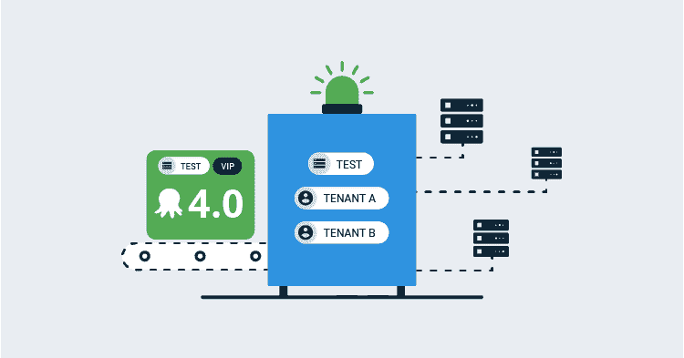
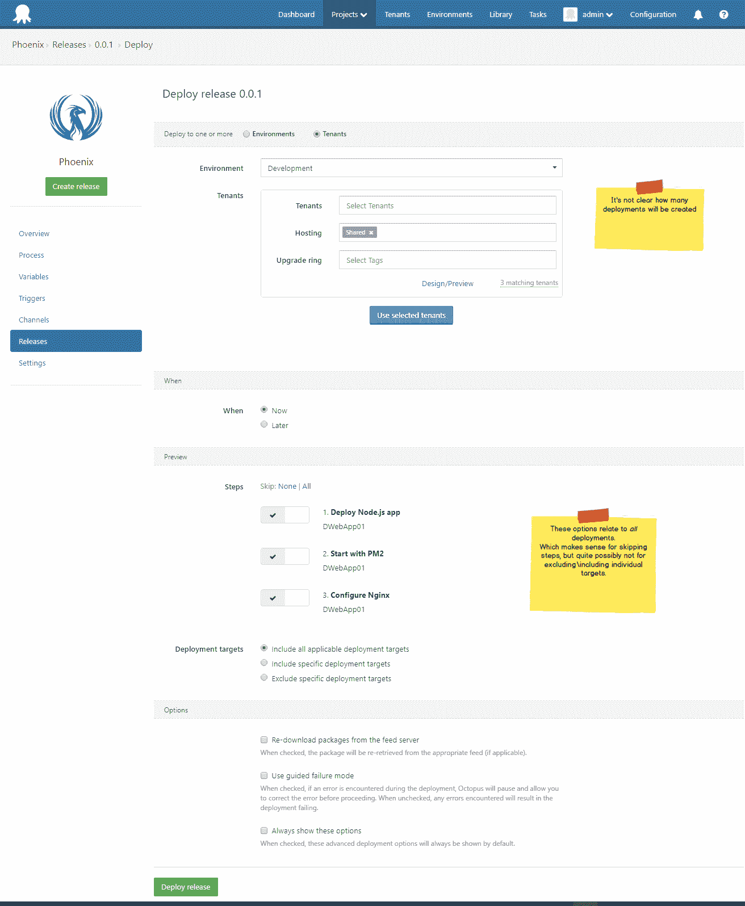
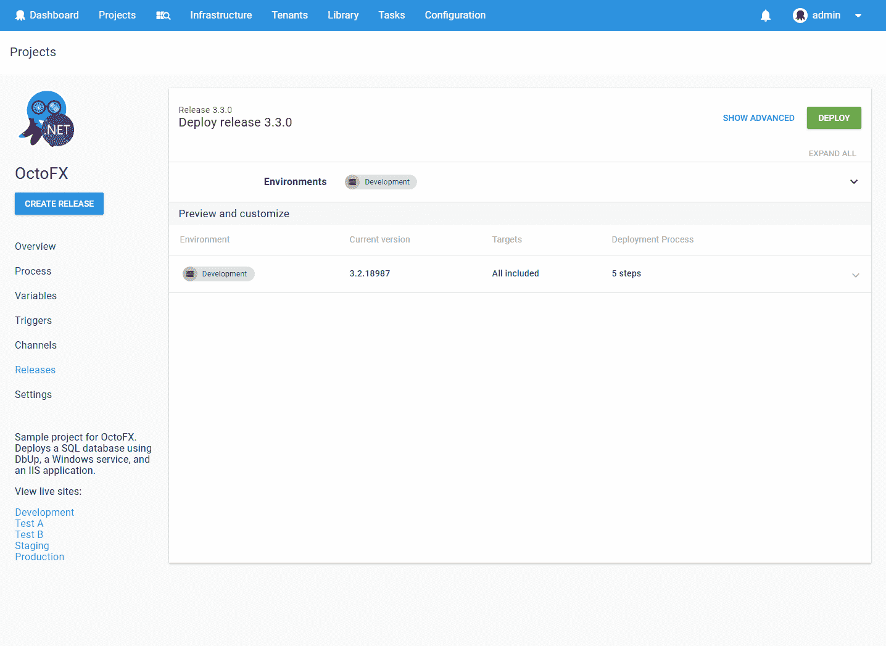
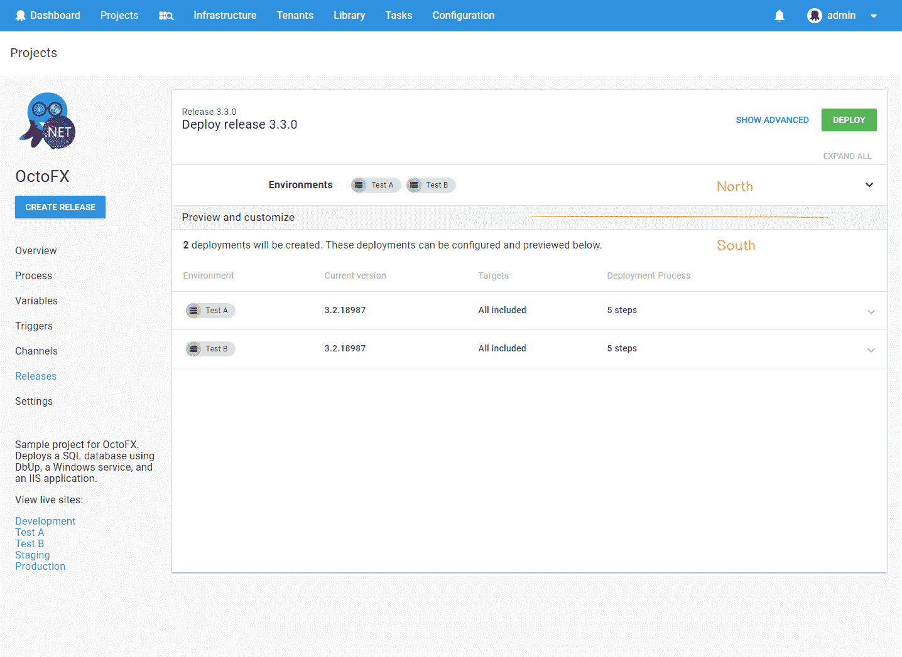
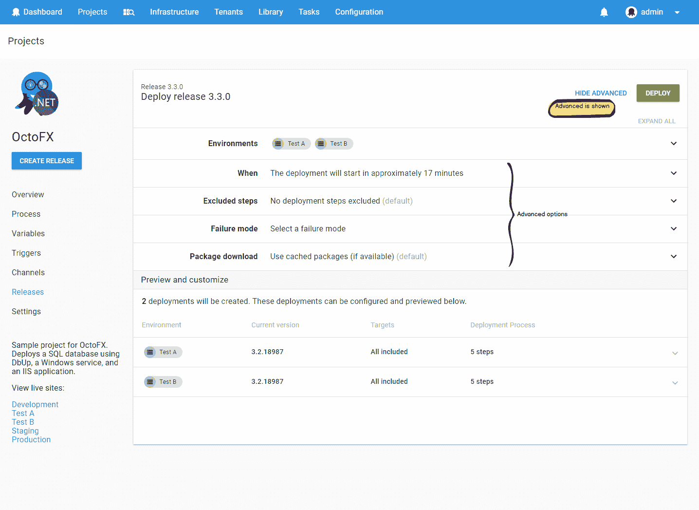
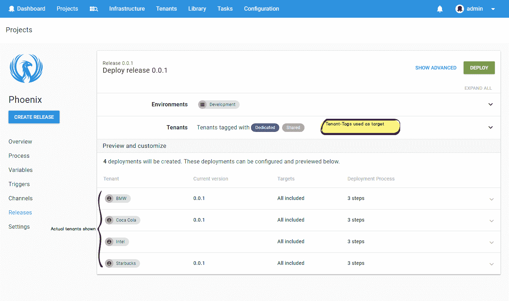
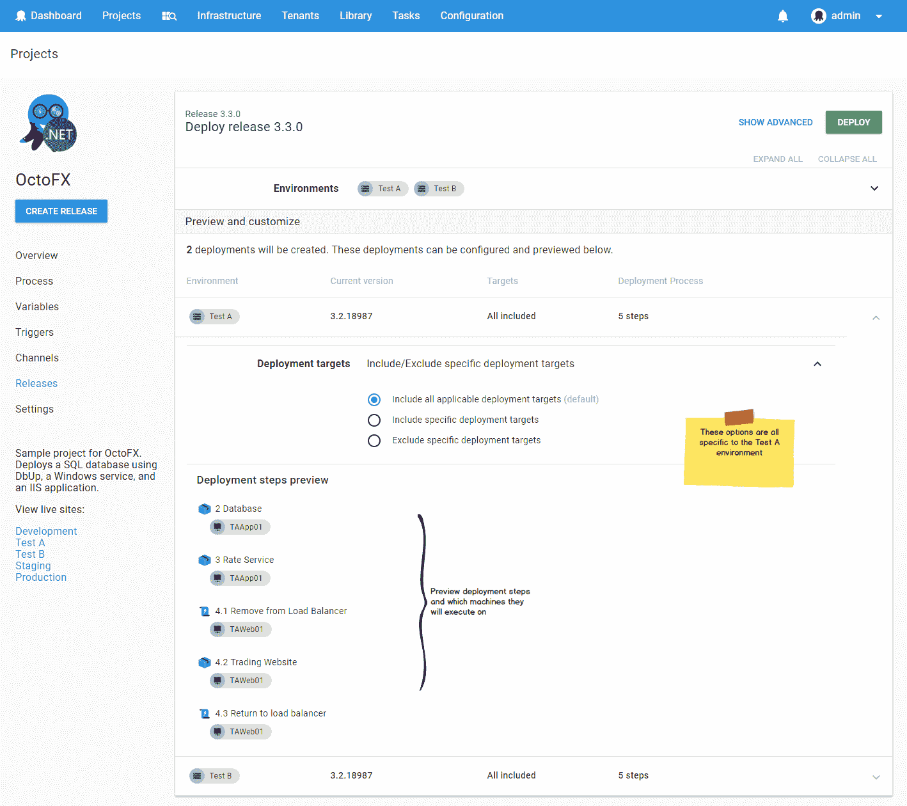
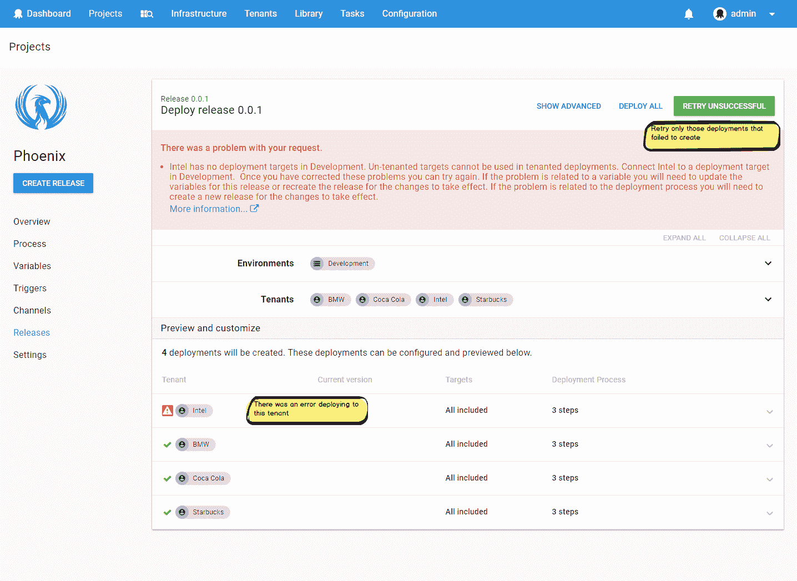

# 八达通部署 4.0 -部署发布页面重新设计-八达通部署

> 原文：<https://octopus.com/blog/octopus-v4-create-deployments>

这篇文章是我们章鱼 4.0 博客系列的一部分。在我们的[博客](https://octopus.com/blog)或我们的[推特](https://twitter.com/octopusdeploy)上关注它。

**Octopus Deploy 4.0 已经发货！今天就阅读[博文](/blog/octopus-release-4-0)和[下载](https://octopus.com/downloads)吧！**

* * *

在为 Octopus 4.0 进行 UI 刷新时，许多页面实际上是新外观的直接接口。但是有几次我们抓住机会重新思考了设计。

其中之一是部署一个版本的页面。

最初创建现有页面是为了将一个版本部署到单个环境中。后来，它被扩展到允许部署到多个环境中。然后多租户特性出现了，我们增加了为一个或多个租户创建部署的能力。

老实说，早就该重新设计了。

## 介绍新的部署发布页面

将一个版本部署到多个环境或租户时，可以看到最显著的变化。

我们在概念上将页面分成两个部分:北边的**和南边的**(好吧，也许我们中的一些人当时看了太多的《权力的游戏》)。****

 **在下图中，*预览和自定义*分隔符形成赤道。

*   北部是您选择*的地方，在那里*发布将被部署(环境和租户)。它还允许您配置一些选项，这些选项适用于将被创建的*所有*部署。

*   南部显示将要创建的部署，并提供额外的*每部署*配置的能力。

### 北

在北部，您选择希望部署到的环境和租户(如果是多租户项目)。

*显示高级*按钮显示附加选项，例如:

*   为将来的时间安排部署
*   从部署中排除步骤

### 南方

南部部分有望清楚地显示将要创建的部署。这是现有设计没有有效传达的内容。

当在北方使用复杂的租户标签表达式时，这变得特别重要。在这种情况下，South 将评估标记表达式，并准确显示将创建哪些租赁部署。

展开部署允许您预览将在哪些目标上执行哪些部署步骤。

您还可以在此包括\排除特定的部署目标。

### 当不是彩虹和棒棒糖的时候

有时创建部署会失败。
您可能在环境中没有任何匹配的目标，或者您可能缺少一个必需的变量。

#### 老人

当部署到许多环境或租户时，一些部署成功创建，而另一些部署失败，这使用户处于不利地位。解决错误后，需要重新配置部署选项，以确保成功创建的部署不会被重新部署。

#### 新的

在新版本中，我们提供了一个*重试失败*按钮。

例如，在下图中，无法创建对英特尔租户*的部署。点击*重试不成功*将仅对该租户进行重试(还有一个*部署所有*按钮)。*

## 告诉我们你的想法

我们总是喜欢您的反馈。

请告诉我们你对新设计的看法。如果您对之前的版本有任何问题，我们特别希望您能留下评论。我们解决了吗？

愉快的部署！
*(希望通过 Octopus v4 创建)***