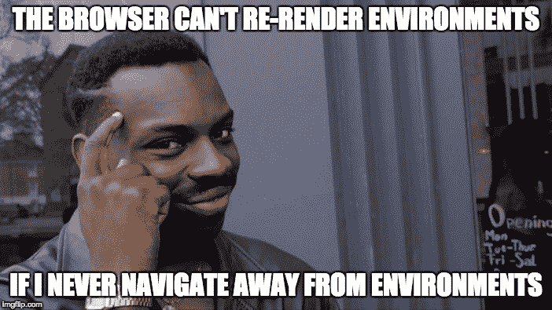
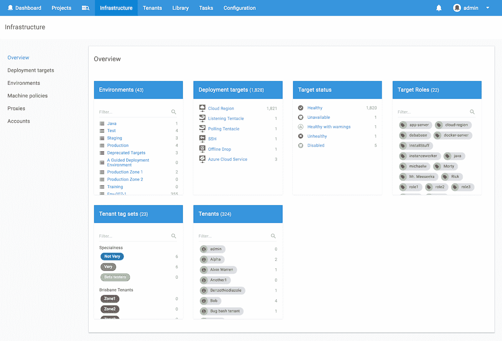
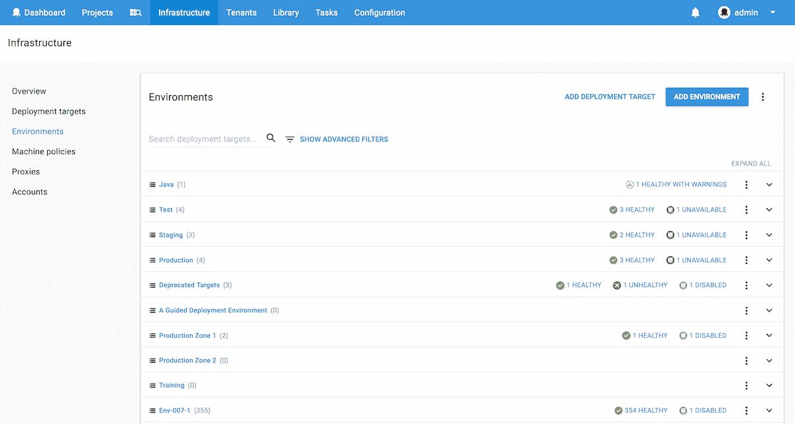
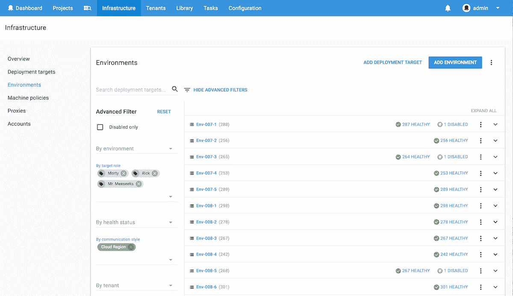
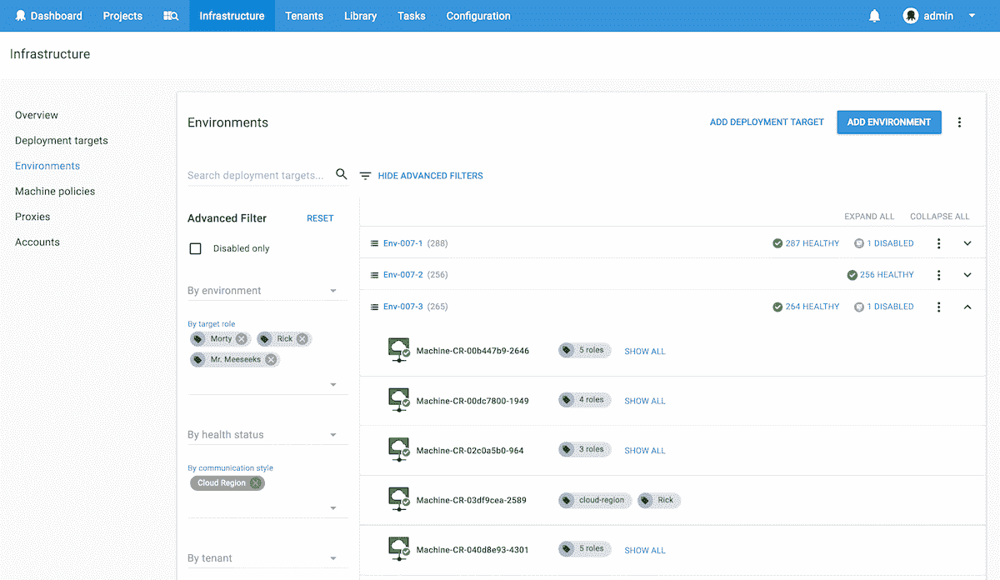
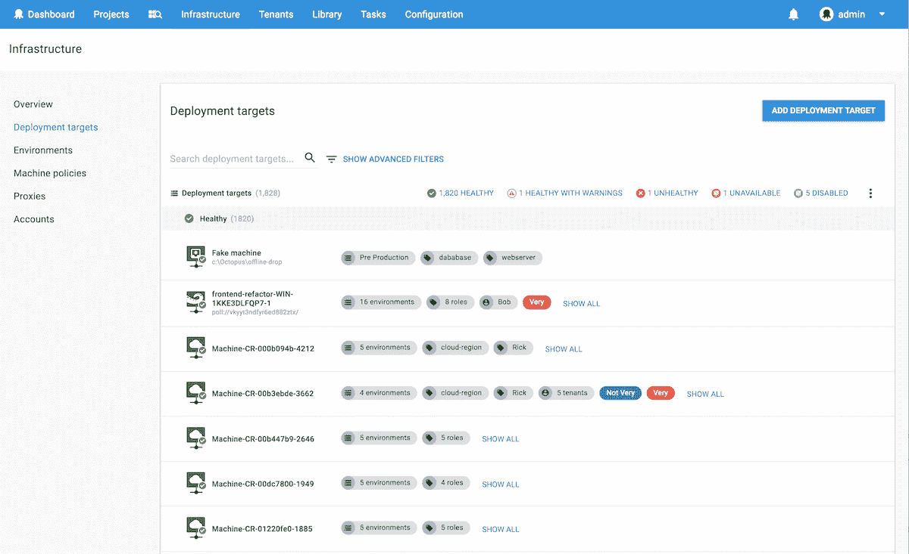

# 八达通部署 4.0 -基础设施重新设计-八达通部署

> 原文：<https://octopus.com/blog/octopus-v4-infrastructure>

这篇文章是我们章鱼 4.0 博客系列的一部分。在我们的[博客](https://octopus.com/blog)或我们的[推特](https://twitter.com/octopusdeploy)上关注它。

**Octopus Deploy 4.0 已经发货！今天就阅读[博文](/blog/octopus-release-4-0)和[下载](https://octopus.com/downloads)吧！**

* * *

对于那些使用 Octopus 处理过几百个以上部署目标的人来说，您会非常了解当前环境屏幕的令人沮丧之处😃

有些客户使用 Octopus 有几千个部署目标，有些有几万个部署目标。对于在这种规模下操作的客户来说，呈现所有这些目标的渲染时间并不长，甚至不好...这是翻转表格的材料(因为页面一旦达到一定的内存限制，就会在渲染过程中超时)。除此之外，它还无法搜索、过滤或浏览结果，因此根本无法扩展。

还有一些客户只需要少数几个部署目标，他们不希望被只满足大规模运营客户*需求的解决方案所束缚。*

因此，我们有一个需要改进的高级清单，即:

*   改善大量环境和部署目标的渲染时间
*   增加了根据各种标准进行搜索和过滤的能力
*   切换到列表布局，使内容一目了然
*   添加概述页面，提供有用的摘要，以便您可以快速找到您想要的内容

我们也知道想要管理环境(以及那些环境中的部署目标)和仅仅想要管理部署目标之间的区别。关键是，不同的客户有不同的需求，试图将所有需求压缩到一个屏幕上被证明是不可行的，所以我们决定给我们的用户选择，并且两者都做😃

## 理解问题

为了进入这种思维模式，我们编写了一个脚本，加载了 2000 多个随机数据的部署目标，并开放了(当前的)门户网站...

是的，这是 environments 页面所呈现内容的一个长包装版本(这些小蓝点中的每一个都是一个机器图标)。为了客观地看待这个问题，我的“全屏截图”插件在试图在我的 retina iMac 上捕捉它们时耗尽了内存并崩溃了，所以我不得不从 DPI 设置较低的虚拟机上捕捉😃

显然，我们注意到的第一件事是渲染花费了大量时间。这个屏幕上没有实现分页，所以如果您有超过 9000 个部署目标，那么您的 web 浏览器需要生成和呈现超过 9000 个 HTML 行项目(更不用说还需要发生的所有环境和健康状态分组)。

我们注意到的第二件事是找到任何东西是多么困难。你只能在浏览器中按 Ctrl-F 键，因为网格布局使得快速浏览和查找变得非常困难。

更糟糕的是，如果你点击了一个目标，然后点击了返回，你必须等待一切重新加载(渲染，Ctrl-F 再次找到你的位置...你只想尖叫或哭泣，通常两者都想)。在这种状态下生活一段时间后，你会学会适应并避免重新加载环境页面...

但是这正是我们通过编写如此多的部署目标所想要的，因为现在我们亲身经历了痛苦。现在我们有一个问题要解决，也有动力去看看我们能想出什么😃

## 4.0 解决方案

### 介绍新的基础架构概述

以前，所有环境和部署目标都位于一个名为“环境”的区域。这个环境区域在顶部菜单中也有到机器策略、代理和帐户的链接，这总感觉有点“附加的”,与环境完全不相关。因此，首先我们决定清理门户，创建一个名为**基础设施**的全新区域，所有的基础设施都将位于此处(如果您有任何与环境相关的书签，请不要担心，我们已经添加了旧 v3 路由的重定向😉 ).

现在，您可以一目了然地了解您的环境、部署目标以及它们在角色和租户等方面的使用情况。我们发现该视图对于了解某些目标何时可能不健康或不可用非常有用，并且它使得获得特定*类型*部署目标的过程变得更加容易。

例如:

*   *想要快速点击进入标有“docker-server”角色的目标吗？点击链接，你就可以直接找到他们。*
*   想只看到你的投票触角，或者只是你的残疾目标？现在这很容易。

此外，对于使用多租户的客户，我们将为您提供全面的服务。现在，您可以通过租户或租户标签集快速找到部署目标。

### 介绍新的环境屏幕

新的环境屏幕利用了 Octopus 4.0 重新设计中可用的高级滤镜(然后为每个环境添加了更多滤镜*“我们有~~假门~~滤镜，你不会相信的！”*)，使得加载环境和查看其中包含的部署目标的摘要变得更快。

这个屏幕对于大规模操作的客户来说特别有用，他们不希望 Octopus 开始加载和渲染成千上万的目标，直到他们明确指定了他们要找的东西。

例如，如果您正在寻找具有特定角色的云区域目标，只需展开并分配您的过滤器，列表将根据相关环境进行刷新。

然后，您可以单击一个环境来展开并查看符合标准的部署目标。

### 介绍新的部署目标屏幕

对于那些只想快速到达其部署目标(而不想通过环境屏幕进行额外点击)的客户，我们专门为您制作了一个部署目标区域😃

该屏幕包含与环境屏幕相同的搜索和过滤机制，但是它直接向您显示您的部署目标。

无论选择哪种方式，我们都在客户端添加了分页支持，以减少呈现数千个不必要的目标，并在选定的端点上添加了客户端缓存支持，以尽可能快地加载。

这些屏幕上的过滤还包括深层链接，因此当您单击部署目标并单击 back 时，当您返回到#NoMoreTableFlipping 列表时，这些过滤器仍将被应用。

## 就这些了，伙计们！

我们真的很兴奋很快就能拿到你的手中。欢迎给我们留下评论，让我们知道你的想法😃

感谢您的阅读，祝您部署愉快！