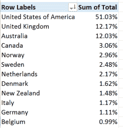
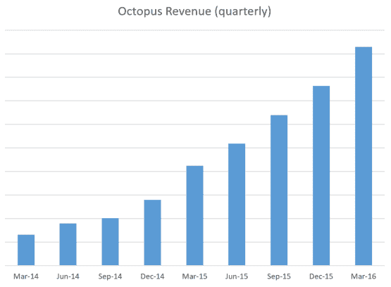
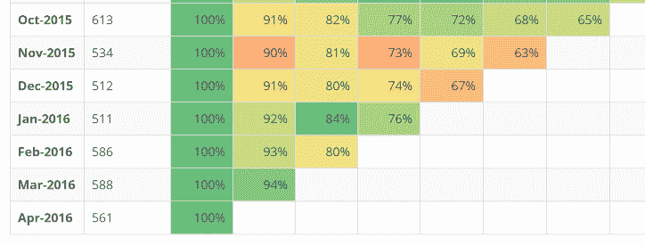
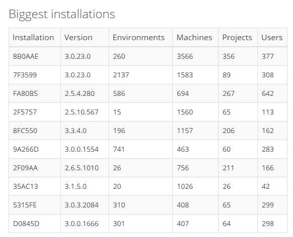
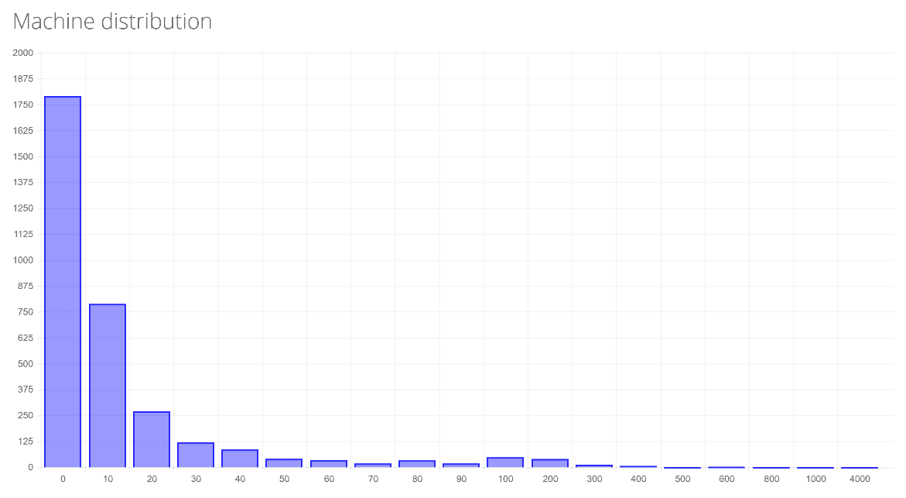

# octo stats- Octopus Deploy 的使用和采用-Octopus Deploy

> 原文：<https://octopus.com/blog/octostats>

像大多数科技公司一样，Octopus 收集有关我们的业务和产品表现的指标。在过去的几年里，我们做得非常好，所以我想让你们看一下这些指标会很棒。

我把这篇文章分成三个部分:

*   牵引力
*   转换
*   典型和最大的安装

我们从两个主要来源收集这些数据:

*   我们的许可证和订单数据库-如果您开始试用或购买许可证，它会记录在这里
*   遥测([使用统计](http://docs.octopusdeploy.com/display/OD/Outbound+requests) ) -用户可以在设置期间将其关闭。我们猜测至少有一半的安装是关闭的，但是我们下面给出的任何东西都是基于我们实际记录的(也就是说，如果我们说有 6500 个活动安装，这意味着遥测告诉我们是 6500 -实际数字可能是两倍高。

在 SaaS 公司可以很容易地看到有人最后一次登录他们的帐户，或衡量流失率，我们处于劣势。Octopus 是可下载的软件，由于我们重视用户的隐私，我们的遥测数据是我们能够获得使用情况近似值的最接近的东西。

## 牵引力

现在在野外有超过 6500 只章鱼在活动。这来自我们的遥测数据——每次 Octopus 服务器检查更新时，我们都会记录 ping。因此，在过去几天的某个时候，有 6500 个 Octopus 实例检查了更新(同样，许多用户可能已经关闭了这一功能)。由于 Octopus 通常安装在一个虚拟机/服务器上，所以它们很少被“遗忘”并在后台运行。在过去的 12 个月中，活跃安装的数量翻了一番。

25%的财富 100 强公司已经购买了八达通卡。我们已经在 62 个国家出售了八达通卡。我们排名靠前的国家是:

(按人口平均，斯堪的纳维亚国家真的很爱章鱼！)

我不会分享我们的收入数字，但增长看起来是这样的:

## 转换

今年四月章鱼有 **1008** 个新试验。三月和二月也差不多。鉴于 Octopus 是我五年前在业余时间开始的一个项目，很难想象每个月都有超过 1000 人开始试用 Octopus。新试验的数量也在增长——上一季度的试验数量比上一季度多 10%。

在下一部分之前，我应该解释一下，我们提供 45 天的免费试用，然后可以变成付费许可证，或者您可以选择使用免费的社区版本(部署到多达 10 台服务器)。

我们有多擅长让人们坚持使用章鱼？这是对我们遥测数据的群组分析:

2016 年 1 月，511 个新实例首次向我们发送了遥测数据。四个月后，到 2016 年 4 月，**我们看到的 76%** 的实例仍在向我们发送遥测数据。由于 45 天的试用期已经到期，那些没有购买许可证的人必须使用免费版本。

(我说的是 2016 年 4 月，开始了 1008 个章鱼的新试验。这来自我们的许可证数据库——我们知道我们发放了 1008 个新的试用许可证。群组分析来自遥测数据，用户会被告知这些数据，并且可以在设置向导中关闭这些数据，因此我们只看到了来自 561 个新实例的遥测数据。)

三月，我们出售了 **261** 新的八达通卡。如果您将我们每月发布的试用版数量与我们发布的新购买许可证数量进行比较，它会在每月 23-27%之间徘徊。

综上所述，我们的漏斗看起来像这样:

*   在一个月内，大约有 1000 人开始尝试章鱼
*   大约 75%的用户在试用期满四个月后仍会使用它(大部分是社区版)
*   23-27%的人最终会购买许可证

就我而言，这是一个非常好的转化率。

我们的许可证是永久的，您可以每年续订许可证，以继续获得新功能和支持。我们的续租率目前约为 **63%** 。就我所见，对于可下载的软件来说，这并不可怕，但也不惊人。我觉得有几个原因(借口？)为此:

*   Octopus 是那种一旦运行就忘得一干二净的软件。人们投入大量时间建立他们的构建/部署管道，然后一旦它运行，他们就专注于他们真正的项目，让它运行。
*   Octopus 用于自动化部署的项目可能已经结束，或者进入维护模式(Octopus 通常由单个项目团队使用，而不是一些大型企业计划)
*   SaaS 公司会存储您的付款信息，并自动向您收取费用，我们必须向您发送电子邮件，要求您进行续订，这需要您付出更多的努力。

## 典型和最大的安装

我们收集的遥测数据有两部分。通过启用“检查更新”，我们至少知道在世界的某个地方有一个 Octopus 服务器正在运行。但是通过启用“包含特性使用统计”，我们还可以看到每个实例正在使用什么样的特性。

“典型的”Octopus 实例和我们一些最大的装置之间有着巨大的差异。这里有一个典型的例子——中位章鱼服务器:

*   3 个环境
*   4 台机器(几乎全是监听模式)
*   3 个项目
*   78 次部署
*   23 个打包步骤，9 个脚本步骤
*   4 个用户

更大的服务器(第 75 个百分点):

*   6 个环境
*   12 台机器(10 种监听模式)
*   10 个项目
*   382 次部署
*   140 个打包步骤，120 个脚本步骤
*   10 个用户

这里是一些我们最大的服务器:

是的，在世界的某个地方有一个部署了超过 3566 个触角的章鱼服务器！

这对我们如何进行功能设计有相当大的影响。我们总是假设大多数安装都有少数几个环境和项目，在很大程度上这是正确的。但是有一个很长的尾巴，人们有大量的装置。这是机器尾巴的样子(X 轴是机器的数量，Y 是用户的数量——所以大多数人都有< 10 machines, some have 10-20, and then a decreasing amount have more).

## 摘要

当你把我们有遥测数据的所有 Octopus 实例加起来，总的来说，Octopus 已经执行了超过 260 万次部署。每个月有 1000 人在尝试 Octopus，大多数人会坚持一段时间——这是一种非常“粘性”的产品。而且有一些难以置信的大型 Octopus 服务器正在进行严肃的部署自动化。章鱼做的这么好，我太骄傲了。

我们成功的秘密是在过去几年里一直关注我们的旅程的了不起的人们。我希望你会喜欢这个窥视我们如何跟踪！

如果你对其他数字感兴趣，请在下面的评论中告诉我。我不能保证分享一切(嘿，我们必须有一些秘密！)但我会尽力:-)