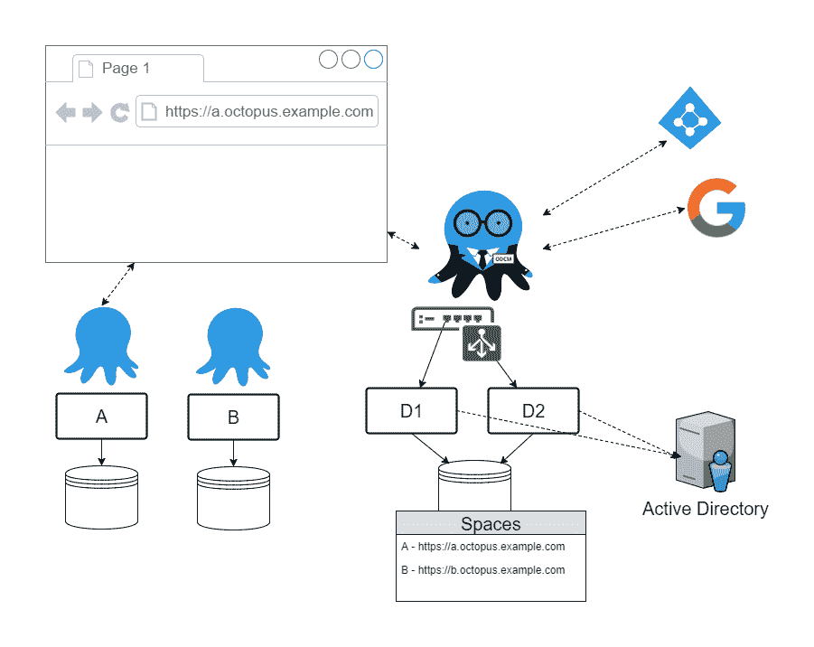
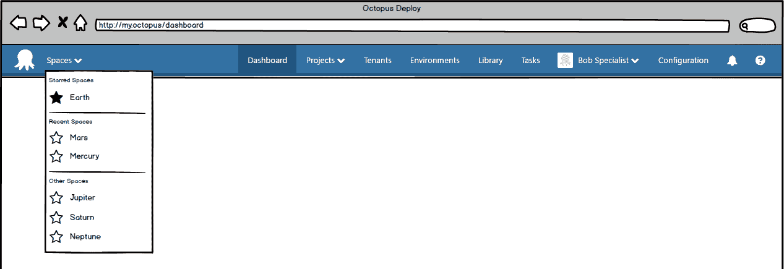
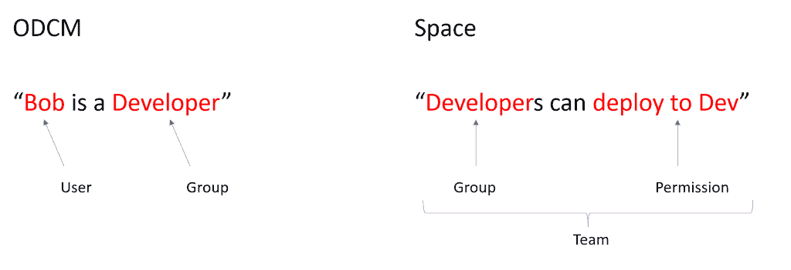

# 使用 Octopus 数据中心管理器 RFC - Octopus Deploy 管理空间

> 原文：<https://octopus.com/blog/odcm-rfc>

**更新 2019 年 1 月**
在 [2019.1](https://octopus.com/downloads) 发布的 Octopus Deploy 中我们有了一个名为 [Spaces](https://octopus.com/blog/octopus-spaces-blog-series-kick-off) 的新功能，已经实现了 ODCM 功能提出的最初目标。

看看这里的[空间，现在可以下载了。](https://octopus.com/blog/octopus-release-2019.1)

* * *

在之前的一篇文章中，我们谈到了我们的客户在大规模使用 Octopus 时遇到的一些现实问题，并介绍了我们在 Octopus 4.0 中解决这些问题的一些设想。在那篇文章中，我们提出了一个集中管理大量 Octopus 服务器的工具的想法。

在这篇文章中，我们将更多地讨论这个暂时命名为 **Octopus 数据中心经理** (ODCM)的工具的外观。

## 使用场景

现在让我们向您介绍一些用户，他们为一个希望集中管理大量 Octopus 服务器的组织工作。

### 用户 1:丽莎航运

Lisa 负责一个团队，该团队正在交付一些新的内部软件。他们正在接近他们的第一个交付里程碑，不希望有任何惊喜。他们一直愉快地使用 Octopus 的特定版本，他们没有遇到任何问题，并且他们希望保持这种状态。

在项目过程中，很明显，一些专业技能将有助于更快地完成一个功能，Lisa 已经能够在组织的另一个团队中找到一个可以提供帮助的开发人员。对 Lisa 来说，允许开发人员快速、轻松地访问非常重要。

### 用户 2:鲍勃专家

Bob 是一名具有专业技能的开发人员，他将与 Lisa 的团队一起完成一些工作。他已经通过他的另一个团队访问了 Octopus，他不想要新的凭证或者必须记住新的 Url。

### 用户 3:杰夫局外人

Geoff 是一家外部机构的顾问，他也加入了 Lisa 的团队。他已经有了一个由他的组织管理的 Azure AD 登录，并且真的不希望有另一组凭证来管理。

### 用户 4:屏障基础设施

巴里负责该组织的八达通基础设施。一些关键项目依赖于这种基础设施，重要的是他知道任何 Octopus 服务器何时离线。

他还负责帮助团队实现 Octopus 实践的标准化，并在组织内分享相关知识。

## 特征

现在让我们来谈谈这些用户在处理多个 Octopus 服务器时所面临的一些挑战，并看看将对他们有所帮助的 ODCM 功能。

组织的 ODCM 安装可能如下所示。

ODCM 以一种[高可用性](https://g.octopushq.com/HighAvailability)配置展示(它将支持单节点和 HA 配置)，这对 Barry 很重要。项目依赖于这些 Octopus 服务器，他希望确保可靠和及时的反馈。

### 给团队自己的空间

当我们开始谈论 ODCM 及其内部功能时，一些事情很快变得显而易见，一些术语可能会过载和令人困惑。这是我们团队内部的事情，我们每天都在经历这种事情，所以让我们来看一些定义以避免混淆。

Instance

a running [instance of Octopus server or Tentacle EXE](https://octopus.com/docs/administration/managing-multiple-instances)

Server

a machine on which an instance runs

Node

an Octopus Deploy server instance

Node Set

a number of nodes that share an Octopus database and work together to provide High Availability

Space

a container for Octopus Deploy concerns (e.g. Projects, Environments, Variables, Deployment Targets), as bounded by a single Octopus database. (i.e. it's Octopus as you know it today)

这里关键的新定义是空间。这个概念来自一个大章鱼被分开的想法，这样项目/团队就有了自己独立的工作空间。

现在，回到我们的朋友巴里基础设施。他将在日常的章鱼管理中直接处理空间。其他用户都在一个空间内操作，但是这个空间是相当透明的。

ODCM 将为巴里提供如下功能:

*   利用一只现存的章鱼作为空间，
*   将现有空间中的东西分离到一个新的空间中，
*   创建一个新的空白空间
*   通过仪表板和警报监控空间
*   跨空间报告

### 身份管理

跨多个空间工作的关键之一是处理用户身份和访问控制。我们可以通过让 ODCM 承担责任来解决这些问题。

当空间向 ODCM 登记时，其身份验证将被配置为指向 ODCM，这将集中身份管理并允许跨空间的 SSO。ODCM 将支持 Octopus Deploy 目前支持的所有[认证提供商](https://g.octopushq.com/AuthenticationProviders)(即用户名密码、活动目录、Azure AD、GoogleApps)。

许多用户受益于这种集中化。

*   Bob Specialist 可以移动团队，不需要新的身份或找到新的 URL
*   Barry Infrastructure 可以定位 Bob 的现有身份，以授权他访问 Lisa Shipping 的空间
*   Barry 可以为 Geoff Outsider 创建一个外部身份，然后他可以使用现有凭证登录。

让我们想象 Bob 现在可以访问多个空间，他如何快速轻松地在它们之间切换呢？我们认为它看起来会像这样。

用户体验可能类似于 Trello 用于管理和交换电路板的东西，具有如下特性:

*   快速查看并选择您最近访问过的共享空间
*   “收藏”一个空间，因此它总是出现在顶部附近
*   链接到以平铺方式显示空间并允许搜索的页面

### 访问控制

我们从两个层面描述了跨空间的访问控制操作:

1.  谁可以访问空间？
2.  用户在一个空间内可以做什么？

作为 ODCM 管理员，Barry Infrastructure 将能够控制哪些用户组可以访问哪些空间。一个组可能由用户和/或外部组组成(即那些来自 Active Directory 或 Azure AD 的组)。

Lisa Shipping 作为一名空间管理员，将能够使用团队来管理哪些用户组在她的空间中拥有哪些权限，就像今天在 Octopus 中一样。例如，她可以指定一个团队，允许开发人员将东西部署到开发环境中。如果 Bob Specialist 是 ODCM 开发组的成员，那么当他被授予访问空间的权限时，他将能够立即部署到 Dev。

### 共享

我们对空间的愿景是，它们应该是相关事物的集合，因此共享的需求应该是最小的。我们考虑了哪些东西可能需要共享，并认为应该是这样的东西:

#### 步骤模板和服务器扩展

Barry Infrastructure 将再次成为主要负责管理这些事情的人，我们再次考虑让他通过 ODCM 来完成这项工作。它将:

*   能够托管社区步骤模板库的版本
*   有类似的东西来托管服务器扩展

#### 变量

现在，Barry 负责标准化，作为标准化的一部分，他希望定义/管理一些变量供团队使用。我们想象他可以这样做:

*   他创造了一个空间来容纳他想要分享的变量
*   他在这个空间和他想要分享的人(例如 Lisa)之间增加了信任
*   他在空间中创建了一个变量集，并指定了他想要共享它的空间

我们正在考虑在共享中支持两种同步模式。第一种模式让发布者指定更新必须自动推送给订阅者，第二种模式让订阅者选择更新是自动推送给他们还是按需同步。在上面的场景中，Barry 可以通过指定需要自动推送来确保所有空间保持最新。如果 Lisa 将变量集订阅到她的空间中，她将不得不接受这一点。

无论同步模式如何，变量集在订户空间中都将显示为只读，并且可以像任何其他变量集一样添加到项目中。

我们考虑了几种可能的工作方式，并基于几个原因选择了这种模式。一个关键原因是一致性，ODCM 经纪信息从发布者到订阅者符合上述所有的共享场景。它不需要理解任何信息，它只是帮助信息到达它需要去的地方。

#### 放

发布的共享是即将到来的 RFC 的主题，所以我们在这里不会谈论太多。在这次讨论(ODCM 管理)的背景下，我们认为它将与变量有许多共同之处。

#### 触须

关于共享的最后一点，触须已经可以被多个 Octopus 服务器使用，所以这仍然适用，它可以被多个空间使用。

### 多个 Octopus 部署版本

接下来，让我们考虑当另一个团队开始工作，Barry Infrastructure 收到一个新空间请求时会发生什么。比方说，他看了看当前的机器，发现其中一个有能力托管另一个空间。那台机器恰好是莉萨·航运公司的主机。因此，虽然机器有能力，丽莎的空间使用的八达通版本不能改变。

当前的 Octopus Deploy MSI 安装程序在这里产生了一个问题，因为它只允许在一台机器上安装一个版本，通过“ *C:\Program Files* ”。您可以使用 Octopus 服务器管理器在一台机器上配置多个实例，但是它们都共享相同的二进制文件，因此是相同的版本。

今天你可以绕过 MSI，但这需要一些努力。我们想让它变得简单。为此，ODCM 将接管服务器上的 Octopus 管理，并自动部署 Octopus。

每个空间都将是 Octopus 的一个独立副本，保持这种独立非常重要。这在某些层面上比其他层面更容易。例如，基于二进制文件的实例版本隔离相当简单。CPU、RAM 和磁盘等共享资源之间的隔离更成问题。我们目前正在研究各种选择，一旦完成，我们将分享更多信息。

### Octopus 部署监控和报告

Barry Infrastructure 的一个关键角色是监控 Octopus 服务器并报告它们的使用情况。我们看到 ODCM 在为此提供便利，因为它处于收集和汇总这些信息的最佳位置。我们设想它将有一个实时监控的仪表板和一些报告统计数据和使用信息的页面。

我们并不期望所有的仪表板功能和报告都包含在初始版本中。我们将关注一个最小的集合，并在随后的版本中以此为基础。初始版本可能包含如下内容:

*   显示共享空间及其服务器版本和当前状态(在线/离线)的仪表板
*   显示每个空间的项目计数和目标计数的报告
*   显示给定时间段内每个空间的部署计数(成功和失败的部署数量)的报告

如果您认为还有其他有价值的指标，请告诉我们。

## 批准

ODCM 将是八达通自行部署的独立产品，并将有不同的许可证模式。该模型仍在讨论中，我们将分享更多的细节，因为他们变得可用。价格将是友好的关于运行大量的空间。

## 反馈

我们上面谈到的是我们认为对 ODCM 来说最不可行的产品。一如既往，我们渴望得到您的反馈，并在接下来的几周内开始实施。

我们已经创建了一个[新的存储库](https://github.com/OctopusDeploy/Specs)，在那里你会找到一个 ODCM 的[规范文档。该规范最初基于我们在此分享的内容，我们的计划是使用问题和 pr 来收集反馈，并在未来几周和几个月内对其进行改进。它将是一个活的文档，并将发展成为一个特性和它们如何实现的规范。我们希望通过这些问题和公关，会有一个好的故事来追踪功能是如何形成的。](https://github.com/OctopusDeploy/Specs/blob/master/ODCM/index.md)

我们想问的是，如果你只是想提供一些快速反馈，那么像往常一样在下面做。如果有更大的事情需要更详细的讨论，我们希望在 GitHub 上进行，所以去那里制造一个问题。