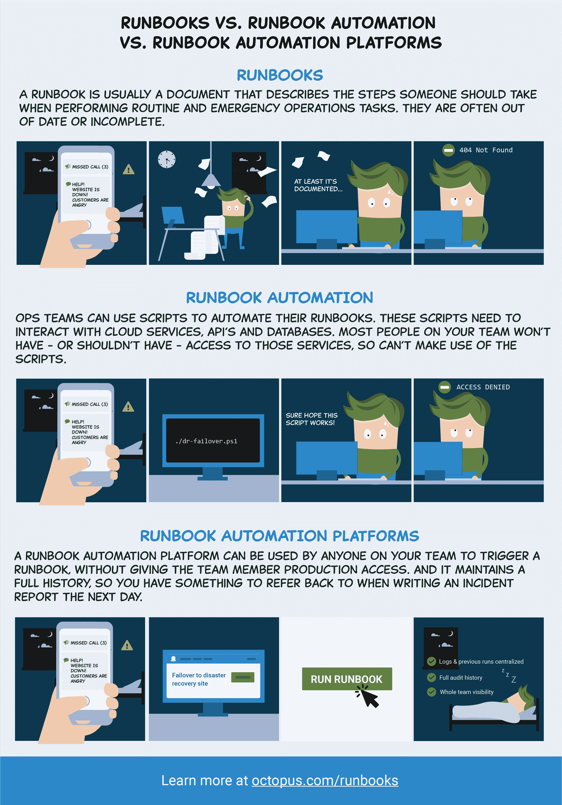

# 操作手册:将操作置于 DevOps - Octopus 部署中

> 原文：<https://octopus.com/blog/operations-runbooks>

[https://www.youtube.com/embed/Uc5TFqswJkM](https://www.youtube.com/embed/Uc5TFqswJkM)

VIDEO

Octopus 中的操作手册将 Ops 置于 DevOps 中。这篇文章是一系列文章的一部分:

* * *

我们最近为运行 Octopus 2019.11.0 或更新版本的[章鱼云](https://octopus.com/cloud)和[自托管](https://octopus.com/downloads)客户提供了运营操作手册。运行手册是 DevOps 中的操作，可自动执行日常维护和紧急操作(事故响应)任务，例如:

*   基础设施供应
*   数据库管理
*   网站故障转移和恢复
*   服务器维护

在这篇博文中，我们回答了这个问题，什么是 runbook，为什么 Octopus 对 runbook 自动化有用，并分享了一些 runbook 示例，它们确实可以提供帮助。

## 在这篇文章中

## 什么是 runbook？

传统上，runbook 是一个文档，它列出了保持应用程序平稳运行所需执行的 IT 流程。大多数团队都有这样的东西。它们通常以 Word 文档、wiki 页面或服务管理系统的形式出现。人们通常会将它们打印出来，并在走过这些步骤时打勾。

团队使用操作手册有两个核心原因:

1.  日常操作任务，如数据库管理和服务维护。
2.  紧急情况和事件响应，如网站故障转移和计划外基础设施中断。

运行手册自动化是一种通过自动化执行操作程序和解决事故的步骤来改进传统运行手册文档的方法。runbook 文档和 runbook 自动化的结合带来了许多好处:

*   Runbooks 在团队之间获取和共享知识，它们非常适合 DevOps 世界中的团队。开发人员、运营人员以及随叫随到的员工。不需要专业领域知识。
*   Runbook 自动化速度更快，减少了人为错误。传统上，操作手册是书面流程，虽然文档很好，但自动化更好。脚本是可测试的、可重复的，并且可以随着时间的推移而改进。
*   减少摩擦和事故解决时间。在紧急情况下，运行手册自动化减少了以快速有效的方式解决问题的摩擦。

## 为什么使用 Octopus 进行 runbook 自动化？

记录和编写操作流程已经成为可能，那么为什么还要使用 Octopus 操作手册呢？

*   操作手册和部署流程是并行的。Octopus 中的 Runbooks 旨在自动化操作任务，它们可以共享配置设置、秘密、步骤模板、脚本等。操作手册是轻量级的自动化流程，针对您的基础架构执行，无需经过部署生命周期(即开发、测试、生产)。
*   **八达通已经知道你的基础设施。**运行手册利用您的应用所部署到的基础设施，因此无需新的配置，减少了开始运行运营流程的摩擦。
*   **安全性、权限和审计。**运行手册由 Octopus 管理和执行，为您提供可在回顾中查看的完整审计跟踪，让您轻松了解发生了什么、何时发生、为什么发生，以及是否需要更改任何内容。Octopus 使团队能够通过高级安全性和权限控制谁可以在什么环境中执行哪些操作手册。
*   **更好的应急管理和更短的事件解决时间。有了 Octopus Runbooks，不需要本地工具，不需要额外的权限，并且您有一个详细的审计日志。随叫随到的团队成员可以快速执行操作手册，而无需担心依赖性或基础设施。**
*   **可发现性和可见性。Octopus 为团队创建了一个管理、控制、审计、安排和执行操作手册的中心位置。您可以看到 runbook 最后一次执行的时间，可以看到 runbook 的更改，并且可以针对不同的环境运行相同的 runbook。团队成员可以很容易地找到一本操作手册，然后点击一个绿色的大按钮来运行它。每个人都可以看到最后一次运行的输出，以及它是否成功。**
*   **世界级的调度和执行。**按需执行运行手册或以任意频率进行调度。

## 运行手册场景

我想强调一些 runbooks 大放异彩的场景。

### Runbook 示例:web 应用程序和 web 服务恢复

[https://www.youtube.com/embed/VuSHB0Re9Mo](https://www.youtube.com/embed/VuSHB0Re9Mo)

VIDEO

由于各种各样的问题，web 应用程序和服务出现问题是很常见的。这些可能是内存泄漏或无法解释的性能问题。在 Windows 服务器领域，这些问题通常通过回收 IIS web 服务器应用程序池来解决，而在 Linux 领域，通常需要重新加载 NGINX 或重启托管应用程序的 docker 容器。这并没有解决潜在的问题，但是它使团队能够解决问题，以便他们能够进行适当的修复。有时，这种情况偶尔发生，执行操作手册是长期的解决方案。

在 Octopus 中，构建一个 runbook 过程(runbook 示例)来自动化这个过程是很简单的:

*   Web 服务器步骤模板或定制脚本(PowerShell、Bash 或 Python)。
*   时差或电子邮件通知。

这是一个非常常见的 runbook 示例。

### Runbook 示例:数据库管理

[https://www.youtube.com/embed/dAYx8fMV4to](https://www.youtube.com/embed/dAYx8fMV4to)

VIDEO

数据库管理通常是一个缓慢的过程，需要给数据库管理团队(DBA)发电子邮件才能完成。DBA 不信任开发人员或操作人员是很常见的。数据库是现代应用程序的重要组成部分，有大量的数据库任务可以被请求，包括:

*   数据库备份。
*   用清理过的生产数据刷新测试数据库。
*   重建索引以解决缓慢的查询。
*   当员工离开公司时撤销权限。

这些流程是运行手册自动化的理想选择。与数据库管理员合作在 Octopus 中构建这些操作手册是建立信任和减少 DBA 日常维护请求数量的好方法。

在 Octopus 中，很容易通过以下步骤为这些任务配置 runbook 流程(runbook 示例):

*   SQL 步骤模板或自定义脚本(PowerShell、Bash 或 Python)。
*   时差或电子邮件通知。

这个项目可以被认为是一个 runbook 模板，因为它可以被克隆用于不同的任务。

## 结论

Operations Runbooks 已经发布，它帮助团队保持他们的应用程序平稳运行。Octopus 中的 Runbooks 从其发布管理和部署自动化的历史中带来了许多好处。它们帮助团队自动化日常维护等操作任务，并在出现问题时进行恢复。