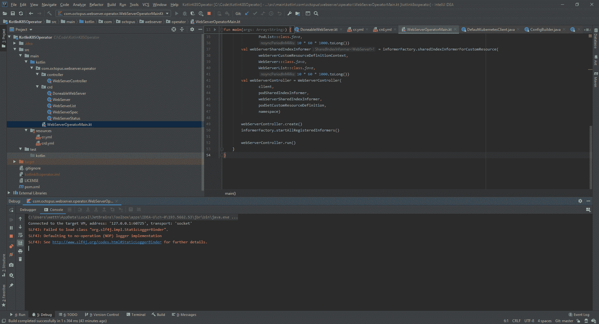

# 使用 Kotlin - Octopus Deploy 创建 Kubernetes 操作员

> 原文：<https://octopus.com/blog/operators-with-kotlin>

[](#)

大多数环境最初会将其 Kubernetes 集群视为编排容器和配置容器间流量的工具。Kubernetes 通过提供所需容器状态及其连接的声明性描述，很好地支持了这个用例。

当以这种方式使用时，开发人员和操作人员坐在集群之外，向内看。集群是通过对`kubectl`的调用来管理的，这些调用是以特别的方式或从 CI/CD 管道发出的。这意味着 Kubernetes 本身是相当天真的；它知道如何重新配置自己以匹配所需的状态，但它不知道该状态代表什么。

例如，一个常见的 Kubernetes 部署可能会创建三个 pod:一个前端 web 应用程序、一个后端 web 服务和一个数据库。开发人员很好地理解了这些 pod 之间的关系，将它们部署为经典的三层架构，但是 Kubernetes 实际上只看到了三个要部署、监控和暴露于网络流量的 pod。

operator 模式已经发展成为一种在 Kubernetes 集群本身中封装业务知识和操作工作流的方式，允许一个集群使用公共的低级资源(如 pods、服务和部署等)来实现高级的、特定于领域的概念。

该术语最初是由 Brandon Philips 在博客文章[中提出的，他给出了如下定义:](https://coreos.com/blog/introducing-operators.html)

> 它建立在基本的 Kubernetes 资源和控制器概念的基础上，但是包含了用于自动化常见任务的领域或应用程序特定的知识。

该定义中确定的三个关键组成部分是:

*   资源
*   控制器
*   特定于领域或应用的知识

实际上，*资源*意味着自定义资源定义(CRD)，*控制器*意味着集成到 Kubernetes API 并对其做出响应的应用，*应用特定知识*是在*控制器*中实现的逻辑，以具体化来自标准 Kubernetes 资源的高级概念。

为了理解操作符模式，让我们看一个用 Kotlin 编写的简单例子。这个操作符的代码可以从 [GitHub](https://github.com/OctopusSamples/KotlinK8SOperator) 获得，它基于这个 [RedHat 博客](https://developers.redhat.com/blog/2019/10/07/write-a-simple-kubernetes-operator-in-java-using-the-fabric8-kubernetes-client/)的代码。运营商将使用带有`WebServer` CRD 的 web 服务器和控制器的概念来扩展 Kubernetes 集群，该控制器使用已知的映像来构建 pod，以公开一个示例 web 服务器。

CRD 满足*资源*需求，我们将编写的与 Kubernetes API 交互的代码满足*控制器*需求，并且特定 Docker 映像用于公开样本 web 服务器的知识是*应用特定知识*。

## pom.xml 文件

我们从 Maven `pom.xml`文件开始。该文件定义了 Kotlin 本身和 [fabric8 Kubernetes 客户端库](https://github.com/fabric8io/kubernetes-client)所需的依赖关系。完整的`pom.xml`文件如下所示:

```
<?xml version="1.0" encoding="UTF-8"?>
<project>
    <modelVersion>4.0.0</modelVersion>
    <groupId>com.octopus</groupId>
    <artifactId>kotlink8soperator</artifactId>
    <version>1.0</version>

    <properties>
        <kotlin.version>1.3.61</kotlin.version>
        <version.fabric8.client>4.7.0</version.fabric8.client>
    </properties>

    <dependencies>
        <dependency>
            <groupId>org.jetbrains.kotlin</groupId>
            <artifactId>kotlin-stdlib</artifactId>
            <version>${kotlin.version}</version>
        </dependency>
        <dependency>
            <groupId>io.fabric8</groupId>
            <artifactId>kubernetes-client</artifactId>
            <version>${version.fabric8.client}</version>
        </dependency>
    </dependencies>

    <build>
        <sourceDirectory>${project.basedir}/src/main/kotlin</sourceDirectory>
        <testSourceDirectory>${project.basedir}/src/test/kotlin</testSourceDirectory>

        <plugins>
            <plugin>
                <groupId>org.jetbrains.kotlin</groupId>
                <artifactId>kotlin-maven-plugin</artifactId>
                <version>${kotlin.version}</version>

                <executions>
                    <execution>
                        <id>compile</id>
                        <goals>
                            <goal>compile</goal>
                        </goals>
                    </execution>

                    <execution>
                        <id>test-compile</id>
                        <goals>
                            <goal>test-compile</goal>
                        </goals>
                    </execution>
                </executions>
            </plugin>
        </plugins>
    </build>
</project> 
```

## 剖析库伯内特斯资源

在深入研究 Kotlin 代码之前，我们需要了解所有 Kubernetes 资源的公共结构。下面是 YAML 对部署资源的定义，我们将以此为例:

```
apiVersion: apps/v1
kind: Deployment
metadata:
  name: nginx-deployment
  labels:
    app: nginx
spec:
  replicas: 3
  selector:
    matchLabels:
      app: nginx
  template:
    metadata:
      labels:
        app: nginx
    spec:
      containers:
      - name: nginx
        image: nginx:1.7.9
        ports:
        - containerPort: 80
status:
  availableReplicas: 2
  observedGeneration: 1
  readyReplicas: 2
  replicas: 2
  updatedReplicas: 2 
```

这种资源可以分为四个部分。

第一个组件是组、版本和种类(GVK)。部署资源有一组`apps`，一个版本的`v1`，一种`Deployment`:

```
apiVersion: apps/v1
kind: Deployment 
```

第二个组成部分是元数据。这是定义标签、注释、名称和命名空间的地方:

```
metadata:
  name: nginx-deployment
  labels:
    app: nginx 
```

第三个组件是规范，它定义了特定资源的属性:

```
spec:
  replicas: 3
  selector:
    matchLabels:
      app: nginx
  template:
    metadata:
      labels:
        app: nginx
    spec:
      containers:
      - name: nginx
        image: nginx:1.7.9
        ports:
        - containerPort: 80 
```

第四个组成部分是地位。该组件中的详细信息由 Kubernetes 生成，以反映资源的当前状态:

```
status:
  availableReplicas: 2
  observedGeneration: 1
  readyReplicas: 2
  replicas: 2
  updatedReplicas: 2 
```

## CRD 班级

现在我们知道了构成 Kubernetes 资源的组件，我们可以看看反映由操作者实现的 CRD 的代码。

我们正在创建一个名为`WebServer`的新 CRD，它由一个名为`WebServer`的类来表示。该类有两个定义规格和状态的属性:

```
package com.octopus.webserver.operator.crd

import io.fabric8.kubernetes.client.CustomResource

data class WebServer(var spec: WebServerSpec = WebServerSpec(),
                     var status: WebServerStatus = WebServerStatus()) : CustomResource() 
```

我们的 CRD 的规格在`WebServerSpec`类中表示。它有一个名为`replicas`的字段，指示这个 CRD 负责创建多少个 web 服务器单元:

```
package com.octopus.webserver.operator.crd

import com.fasterxml.jackson.databind.annotation.JsonDeserialize
import io.fabric8.kubernetes.api.model.KubernetesResource

@JsonDeserialize
data class WebServerSpec(val replicas: Int = 0) : KubernetesResource 
```

我们 CRD 的地位是在`WebServerStatus`类中表现出来的。它包含一个名为`count`的字段，报告已经创建了多少个 pod:

```
package com.octopus.webserver.operator.crd

import com.fasterxml.jackson.databind.annotation.JsonDeserialize
import io.fabric8.kubernetes.api.model.KubernetesResource

@JsonDeserialize
data class WebServerStatus(var count: Int = 0) : KubernetesResource 
```

最后两个类称为`WebServerList`和`DoneableWebServer`，不包含定制属性或逻辑，是 fabric8 库所需的样板代码:

```
package com.octopus.webserver.operator.crd

import io.fabric8.kubernetes.client.CustomResourceList

class WebServerList : CustomResourceList<WebServer>() 
```

```
package com.octopus.webserver.operator.crd

import io.fabric8.kubernetes.client.CustomResourceDoneable
import io.fabric8.kubernetes.api.builder.Function

class DoneableWebServer(resource: WebServer, function: Function<WebServer,WebServer>) :
        CustomResourceDoneable<WebServer>(resource, function) 
```

## 主要功能

`main()`函数是我们控制器的入口点。以下是完整的代码:

```
package com.octopus.webserver.operator

import com.octopus.webserver.operator.controller.WebServerController
import com.octopus.webserver.operator.crd.WebServer
import com.octopus.webserver.operator.crd.WebServerList
import io.fabric8.kubernetes.api.model.Pod
import io.fabric8.kubernetes.api.model.PodList
import io.fabric8.kubernetes.api.model.apiextensions.CustomResourceDefinitionBuilder
import io.fabric8.kubernetes.client.DefaultKubernetesClient
import io.fabric8.kubernetes.client.dsl.base.CustomResourceDefinitionContext

fun main(args: Array<String>) {
    val client = DefaultKubernetesClient()
    client.use {
        val namespace = client.namespace ?: "default"
        val podSetCustomResourceDefinition = CustomResourceDefinitionBuilder()
                .withNewMetadata().withName("webservers.demo.k8s.io").endMetadata()
                .withNewSpec()
                .withGroup("demo.k8s.io")
                .withVersion("v1alpha1")
                .withNewNames().withKind("WebServer").withPlural("webservers").endNames()
                .withScope("Namespaced")
                .endSpec()
                .build()
        val webServerCustomResourceDefinitionContext = CustomResourceDefinitionContext.Builder()
                .withVersion("v1alpha1")
                .withScope("Namespaced")
                .withGroup("demo.k8s.io")
                .withPlural("webservers")
                .build()
        val informerFactory = client.informers()
        val podSharedIndexInformer = informerFactory.sharedIndexInformerFor(
                Pod::class.java,
                PodList::class.java,
                10 * 60 * 1000.toLong())
        val webServerSharedIndexInformer = informerFactory.sharedIndexInformerForCustomResource(
                webServerCustomResourceDefinitionContext,
                WebServer::class.java,
                WebServerList::class.java,
                10 * 60 * 1000.toLong())
        val webServerController = WebServerController(
                client,
                podSharedIndexInformer,
                webServerSharedIndexInformer,
                podSetCustomResourceDefinition,
                namespace)

        webServerController.create()
        informerFactory.startAllRegisteredInformers()

        webServerController.run()
    }
} 
```

我们创建了一个`DefaultKubernetesClient`，它允许我们访问 Kubernetes API:

```
val client = DefaultKubernetesClient() 
```

客户机知道如何根据它执行的环境来配置自己。测试时，我们将在本地运行这段代码，这意味着客户端将从`~/.kube/config`文件中访问 Kubernetes 集群的详细信息。然后从客户端的配置中提取名称空间，或者如果没有找到名称空间设置，则设置为`default`:

```
val namespace = client.namespace ?: "default" 
```

`CustomResourceDefinitionBuilder`定义了该控制器管理的`WebServer` CRD。这在与客户端一起更新群集中的资源时使用。

```
val podSetCustomResourceDefinition = CustomResourceDefinitionBuilder()
        .withNewMetadata().withName("webservers.demo.k8s.io").endMetadata()
        .withNewSpec()
        .withGroup("demo.k8s.io")
        .withVersion("v1alpha1")
        .withNewNames().withKind("WebServer").withPlural("webservers").endNames()
        .withScope("Namespaced")
        .endSpec()
        .build() 
```

控制器通过监听指示它应该管理的资源已经改变的事件来工作。为了监听与`WebServer` CRD 相关的事件，我们创建了一个`CustomResourceDefinitionContext`:

```
val webServerCustomResourceDefinitionContext = CustomResourceDefinitionContext.Builder()
        .withVersion("v1alpha1")
        .withScope("Namespaced")
        .withGroup("demo.k8s.io")
        .withPlural("webservers")
        .build() 
```

我们通过通知者得到事件通知，而通知者是从客户提供的工厂创建的:

```
val informerFactory = client.informers() 
```

在这里，我们创建一个通知程序，通知我们与 pod 相关的事件。因为 pods 是 Kubernetes 中的标准资源，所以创建这个 informer 不需要`CustomResourceDefinitionContext`:

```
val podSharedIndexInformer = informerFactory.sharedIndexInformerFor(
        Pod::class.java,
        PodList::class.java,
        10 * 60 * 1000.toLong()) 
```

在这里，我们创建一个线人，它会通知我们与 CRD 相关的事件。这需要之前创建的`CustomResourceDefinitionContext`:

```
val webServerSharedIndexInformer = informerFactory.sharedIndexInformerForCustomResource(
        webServerCustomResourceDefinitionContext,
        WebServer::class.java,
        WebServerList::class.java,
        10 * 60 * 1000.toLong()) 
```

操作符的逻辑包含在控制器中。在这个项目中，`WebServerController`类完成了控制器的角色:

```
val webServerController = WebServerController(
        client,
        podSharedIndexInformer,
        webServerSharedIndexInformer,
        podSetCustomResourceDefinition,
        namespace) 
```

控制器在`create()`方法中链接事件处理程序，我们开始监听事件，然后通过调用`run()`方法进入协调循环:

```
webServerController.create()
informerFactory.startAllRegisteredInformers()

webServerController.run() 
```

## 控制器

`WebServerController`类在我们的操作符中实现控制器。它的工作是监听 Kubernetes 资源的变化，并使当前状态与期望状态相一致。该类的完整代码如下所示:

```
package com.octopus.webserver.operator.controller

import com.octopus.webserver.operator.crd.DoneableWebServer
import com.octopus.webserver.operator.crd.WebServer
import com.octopus.webserver.operator.crd.WebServerList
import io.fabric8.kubernetes.api.model.OwnerReference
import io.fabric8.kubernetes.api.model.Pod
import io.fabric8.kubernetes.api.model.PodBuilder
import io.fabric8.kubernetes.api.model.apiextensions.CustomResourceDefinition
import io.fabric8.kubernetes.client.KubernetesClient
import io.fabric8.kubernetes.client.informers.ResourceEventHandler
import io.fabric8.kubernetes.client.informers.SharedIndexInformer
import io.fabric8.kubernetes.client.informers.cache.Cache
import io.fabric8.kubernetes.client.informers.cache.Lister
import java.util.*
import java.util.AbstractMap.SimpleEntry
import java.util.concurrent.ArrayBlockingQueue

class WebServerController(private val kubernetesClient: KubernetesClient,
                          private val podInformer: SharedIndexInformer<Pod>,
                          private val webServerInformer: SharedIndexInformer<WebServer>,
                          private val webServerResourceDefinition: CustomResourceDefinition,
                          private val namespace: String) {
    private val APP_LABEL = "app"
    private val webServerLister = Lister<WebServer>(webServerInformer.indexer, namespace)
    private val podLister = Lister<Pod>(podInformer.indexer, namespace)
    private val workQueue = ArrayBlockingQueue<String>(1024)

    fun create() {
        webServerInformer.addEventHandler(object : ResourceEventHandler<WebServer> {
            override fun onAdd(webServer: WebServer) {
                enqueueWebServer(webServer)
            }

            override fun onUpdate(webServer: WebServer, newWebServer: WebServer) {
                enqueueWebServer(newWebServer)
            }

            override fun onDelete(webServer: WebServer, b: Boolean) {}
        })

        podInformer.addEventHandler(object : ResourceEventHandler<Pod> {
            override fun onAdd(pod: Pod) {
                handlePodObject(pod)
            }

            override fun onUpdate(oldPod: Pod, newPod: Pod) {
                if (oldPod.metadata.resourceVersion == newPod.metadata.resourceVersion) {
                    return
                }
                handlePodObject(newPod)
            }

            override fun onDelete(pod: Pod, b: Boolean) {}
        })
    }

    private fun enqueueWebServer(webServer: WebServer) {
        val key: String = Cache.metaNamespaceKeyFunc(webServer)
        if (key.isNotEmpty()) {
            workQueue.add(key)
        }
    }

    private fun handlePodObject(pod: Pod) {
        val ownerReference = getControllerOf(pod)

        if (ownerReference?.kind?.equals("WebServer", ignoreCase = true) != true) {
            return
        }

        webServerLister
                .get(ownerReference.name)
                ?.also { enqueueWebServer(it) }
    }

    private fun getControllerOf(pod: Pod): OwnerReference? =
            pod.metadata.ownerReferences.firstOrNull { it.controller }

    private fun reconcile(webServer: WebServer) {
        val pods = podCountByLabel(APP_LABEL, webServer.metadata.name)
        val existingPods = pods.size

        webServer.status.count = existingPods
        updateStatus(webServer)

        if (existingPods < webServer.spec.replicas) {
            createPod(webServer)
        } else if (existingPods > webServer.spec.replicas) {
            kubernetesClient
                    .pods()
                    .inNamespace(webServer.metadata.namespace)
                    .withName(pods[0])
                    .delete()
        }
    }

    private fun updateStatus(webServer: WebServer) =
            kubernetesClient.customResources(webServerResourceDefinition, WebServer::class.java, WebServerList::class.java, DoneableWebServer::class.java)
                    .inNamespace(webServer.metadata.namespace)
                    .withName(webServer.metadata.name)
                    .updateStatus(webServer)

    private fun podCountByLabel(label: String, webServerName: String): List<String> =
            podLister.list()
                    .filter { it.metadata.labels.entries.contains(SimpleEntry(label, webServerName)) }
                    .filter { it.status.phase == "Running" || it.status.phase == "Pending" }
                    .map { it.metadata.name }

    private fun createPod(webServer: WebServer) =
            createNewPod(webServer).let { pod ->
                kubernetesClient.pods().inNamespace(webServer.metadata.namespace).create(pod)
            }

    private fun createNewPod(webServer: WebServer): Pod =
            PodBuilder()
                    .withNewMetadata()
                    .withGenerateName(webServer.metadata.name.toString() + "-pod")
                    .withNamespace(webServer.metadata.namespace)
                    .withLabels(Collections.singletonMap(APP_LABEL, webServer.metadata.name))
                    .addNewOwnerReference()
                    .withController(true)
                    .withKind("WebServer")
                    .withApiVersion("demo.k8s.io/v1alpha1")
                    .withName(webServer.metadata.name)
                    .withNewUid(webServer.metadata.uid)
                    .endOwnerReference()
                    .endMetadata()
                    .withNewSpec()
                    .addNewContainer().withName("nginx").withImage("nginxdemos/hello").endContainer()
                    .endSpec()
                    .build()

    fun run() {
        blockUntilSynced()
        while (true) {
            try {
                workQueue
                        .take()
                        .split("/")
                        .toTypedArray()[1]
                        .let { webServerLister.get(it) }
                        ?.also { reconcile(it) }
            } catch (interruptedException: InterruptedException) {
                // ignored
            }
        }
    }

    private fun blockUntilSynced() {
        while (!podInformer.hasSynced() || !webServerInformer.hasSynced()) {}
    }
} 
```

`create()`方法将匿名类指定为 informer 事件处理程序。事件处理器通过调用`enqueueWebServer()`或`handlePodObject()`来识别需要处理的`WebServer` CRDs 的实例:

```
fun create() {
        webServerInformer.addEventHandler(object : ResourceEventHandler<WebServer> {
            override fun onAdd(webServer: WebServer) {
                enqueueWebServer(webServer)
            }

            override fun onUpdate(webServer: WebServer, newWebServer: WebServer) {
                enqueueWebServer(newWebServer)
            }

            override fun onDelete(webServer: WebServer, b: Boolean) {}
        })

        podInformer.addEventHandler(object : ResourceEventHandler<Pod> {
            override fun onAdd(pod: Pod) {
                handlePodObject(pod)
            }

            override fun onUpdate(oldPod: Pod, newPod: Pod) {
                if (oldPod.metadata.resourceVersion == newPod.metadata.resourceVersion) {
                    return
                }
                handlePodObject(newPod)
            }

            override fun onDelete(pod: Pod, b: Boolean) {}
        })
    } 
```

`enqueueWebServer()`创建一个标识`WebServer` CRD 的关键字，并将其添加到`workQueue`:

```
private fun enqueueWebServer(webServer: WebServer) {
    val key: String = Cache.metaNamespaceKeyFunc(webServer)
    if (key.isNotEmpty()) {
        workQueue.add(key)
    }
} 
```

`handlePodObject()`首先通过 ownerReference 确定 pod 是否由`WebServer`管理。如果是，通过调用`enqueueWebServer()`将所属`WebServer`添加到`workQueue`中:

```
private fun handlePodObject(pod: Pod) {
    val ownerReference = getControllerOf(pod)

    if (ownerReference?.kind?.equals("WebServer", ignoreCase = true) != true) {
        return
    }

    webServerLister
            .get(ownerReference.name)
            ?.also { enqueueWebServer(it) }
}

private fun getControllerOf(pod: Pod): OwnerReference? =
        pod.metadata.ownerReferences.firstOrNull { it.controller } 
```

`reconcile()`提供逻辑，确保集群拥有与`WebServer` CRD 所需数量一样多的机架。它调用`podCountByLabel()`来找出存在多少个 pod，并通过调用`updateStatus()`来更新 CRD 的状态。如果满足要求的荚太少，就叫`createPod()`。如果有太多的 pod，则删除一个。

通过不断地创建或删除 pod 来将集群推向期望的状态，我们将最终满足`WebServer` CRD 的要求:

```
private fun reconcile(webServer: WebServer) {
    val pods = podCountByLabel(APP_LABEL, webServer.metadata.name)
    val existingPods = pods.size

    webServer.status.count = existingPods
    updateStatus(webServer)

    if (existingPods < webServer.spec.replicas) {
        createPod(webServer)
    } else if (existingPods > webServer.spec.replicas) {
        kubernetesClient
                .pods()
                .inNamespace(webServer.metadata.namespace)
                .withName(pods[0])
                .delete()
    }
} 
```

使用客户端更新我们的定制资源的状态组件。状态组件是唯一的，因为更新它不会在我们的代码中触发更新事件。只有控制器可以更新资源的状态组件，Kubernetes 被设计为防止状态更新触发无限事件循环:

```
private fun updateStatus(webServer: WebServer) =
        kubernetesClient.customResources(webServerResourceDefinition, WebServer::class.java, WebServerList::class.java, DoneableWebServer::class.java)
                .inNamespace(webServer.metadata.namespace)
                .withName(webServer.metadata.name)
                .updateStatus(webServer) 
```

`podCountByLabel()`返回由 CRD 管理的正在运行或正在创建的 pod 的名称:

```
private fun podCountByLabel(label: String, webServerName: String): List<String> =
        podLister.list()
                .filter { it.metadata.labels.entries.contains(SimpleEntry(label, webServerName)) }
                .filter { it.status.phase == "Running" || it.status.phase == "Pending" }
                .map { it.metadata.name } 
```

`createPod()`和`createNewPod()`创建一个新的 pod。正是在这里，我们的业务逻辑通过使用`nginxdemos/hello` Docker 映像作为我们的测试 web 服务器而被编码:

```
private fun createPod(webServer: WebServer) =
        createNewPod(webServer).let { pod ->
            kubernetesClient.pods().inNamespace(webServer.metadata.namespace).create(pod)
        }

private fun createNewPod(webServer: WebServer): Pod =
        PodBuilder()
                .withNewMetadata()
                .withGenerateName(webServer.metadata.name.toString() + "-pod")
                .withNamespace(webServer.metadata.namespace)
                .withLabels(Collections.singletonMap(APP_LABEL, webServer.metadata.name))
                .addNewOwnerReference()
                .withController(true)
                .withKind("WebServer")
                .withApiVersion("demo.k8s.io/v1alpha1")
                .withName(webServer.metadata.name)
                .withNewUid(webServer.metadata.uid)
                .endOwnerReference()
                .endMetadata()
                .withNewSpec()
                .addNewContainer().withName("nginx").withImage("nginxdemos/hello").endContainer()
                .endSpec()
                .build() 
```

`run()`方法是一个无限循环，不断消耗由事件监听器添加到`workQueue`的 web 服务器资源 ID，并将其传递给`reconcile()`方法:

```
fun run() {
    blockUntilSynced()
    while (true) {
        try {
            workQueue
                    .take()
                    .split("/")
                    .toTypedArray()[1]
                    .let { webServerLister.get(it) }
                    ?.also { reconcile(it) }
        } catch (interruptedException: InterruptedException) {
            // ignored
        }
    }
}

private fun blockUntilSynced() {
    while (!podInformer.hasSynced() || !webServerInformer.hasSynced()) {}
} 
```

## CRD·YAML

操作符的最后一部分是 CRD 本身。CRD 是另一种 Kubernetes 资源，我们在以下 YAML 中对其进行了定义:

```
apiVersion: apiextensions.k8s.io/v1beta1
kind: CustomResourceDefinition
metadata:
  name: webservers.demo.k8s.io
spec:
  group: demo.k8s.io
  version: v1alpha1
  names:
    kind: WebServer
    plural: webservers
  scope: Namespaced
  subresources:
    status: {} 
```

## 把所有的放在一起

要运行该操作符，我们首先需要应用 CRD YAML:

```
kubectl apply -f crd.yml 
```

然后，我们用 YAML 创建 CRD 的一个实例:

```
apiVersion: demo.k8s.io/v1alpha1
kind: WebServer
metadata:
  name: example-webserver
spec:
  replicas: 5 
```

然后，控制器可以在本地运行。因为我们在代码中使用的客户端知道如何根据它运行的位置来配置自己，所以在本地执行我们的代码意味着客户端从`~/.kube/config`文件中配置自己。在下面的截图中，您可以看到控制器直接从我的 IDE 中运行:

[](#)

控制器响应新的 web 服务器 CRD 并创建所需的 pod:

```
$ kubectl get pods
NAME                         READY   STATUS    RESTARTS   AGE
example-webserver-pod92ht9   1/1     Running   0          54s
example-webserver-podgbz86   1/1     Running   0          54s
example-webserver-podk58gz   1/1     Running   0          54s
example-webserver-podkftmp   1/1     Running   0          54s
example-webserver-podpwzrt   1/1     Running   0          54s 
```

web 服务器资源的状态更新为其成功创建的 pod 的`count`:

```
$ kubectl get webservers -n default -o yaml
apiVersion: v1
items:
- apiVersion: demo.k8s.io/v1alpha1
  kind: WebServer
  metadata:
    annotations:
      kubectl.kubernetes.io/last-applied-configuration: |
        {"apiVersion":"demo.k8s.io/v1alpha1","kind":"WebServer","metadata":{"annotations":{},"name":"example-webserver","namespace":"default"},"spec":{"replicas":5}}
    creationTimestamp: "2020-01-16T20:19:23Z"
    generation: 1
    name: example-webserver
    namespace: default
    resourceVersion: "112308"
    selfLink: /apis/demo.k8s.io/v1alpha1/namespaces/default/webservers/example-webserver
    uid: 9eb08575-8fa1-4bc9-bb2b-6f11b7285b68
  spec:
    replicas: 5
  status:
    count: 5
kind: List
metadata:
  resourceVersion: ""
  selfLink: "" 
```

## 运营商的力量

没有操作员，测试 web 服务器的概念就存在于集群之外。开发人员可能已经在他们用来创建测试舱的 YAML 周围发了电子邮件，但是更有可能的是，每个人都有自己对测试 web 服务器的看法。

我们创建的操作符用一个测试 web 服务器的特定实现扩展了我们的 Kubernetes 集群。封装这些业务知识允许集群创建和管理特定于我们环境的高级概念。

创建和管理新资源只是运营商可以做的事情的一个例子。像安全扫描、报告和负载测试这样的自动化任务对于操作员来说都是有效的用例。热门运营商列表可在[这里](https://github.com/operator-framework/awesome-operators)获得。

## 结论

操作符是一种被大肆宣传但通常很少被理解的模式。根据描述操作符的原始博客文章中的定义，我们看到了操作符的三个简单部分:定义它们的资源、作用于 Kubernetes 资源的控制器和实现特定于应用程序的知识的逻辑。然后，我们在 Kotlin 中实现了一个简单的操作符来创建测试 web 服务器。