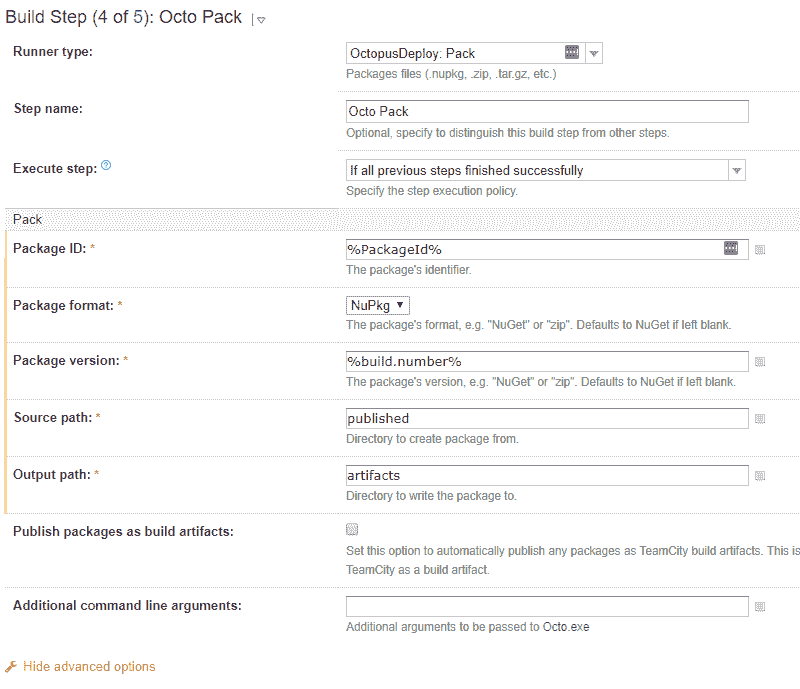

# 使用构建管道和应用程序打包。NETCore - Octopus 部署

> 原文：<https://octopus.com/blog/packaging-netcore>

[](#)

我们最近发布了对我们新的[打包功能的介绍。NET 核心应用程序。网芯](/blog/octopus-and-netcore)。在这篇文章中，我们将亲自动手，深入研究如何为. NET 核心应用程序构建一个构建管道。

不管构建机器本身是否有完整的。NET 框架或者。网芯。它们也适用于许多完整的框架场景，所以即使你没有这样做。NET Core，这里可能有你想要的东西。

在这个过程中，我们将使用不同的构建服务器和工具，多次构建管道。

## 在我们开始之前

这篇文章的重点是说明构建设置，所以我假设你已经熟悉了开始构建所需的一切。我使用一个 Git repo 和一个简单的 ASP.NET Web 应用程序进行说明，但是应用程序的内容和机制对整个故事并不重要。

## 成功的三个步骤

所以当你为一个。网芯，什么重要？对我来说，最重要的是，不要对抗工具。我在上一篇文章中提到，OctoPack 的做事方式不符合。NET 核心世界，所以我们必须改变我们的思维，以适应那个世界。

为此，在以下所有示例中，都使用了一个包含三个核心步骤的基础模式:

1.  将应用程序发布到文件夹。
2.  打包应用程序。
3.  把包裹推到章鱼可以利用的饲料。

现在 [OctoPack](https://g.octopushq.com/ExternalToolOctoPack) 也使用这三个相同的概念步骤，它只是在内部完成，所以不一定很明显。OctoPack 的问题是它有自己的发布方式，而不是遵从微软的工具，该工具是为处理您可以打包的所有较新的应用程序类型而构建的。

## TeamCity

好了，事不宜迟，让我们进入第一个例子。这里先睹为快，看看我们的构建步骤完成后会是什么样子。

[](#)

TeamCity 可以为你提供相当多的帮助。一旦您创建了您的项目并配置了您的 VCS 根，转到构建步骤，让 TeamCity 根据它在 repo 中看到的内容尝试创建构建步骤，它应该会为您提供步骤 1-3。

现在，让我们通过设置一个特定的输出目录来微调发布步骤，该目录便于后续步骤找到。请注意，输出目录是相对于 csproj 文件夹位置的。我喜欢在回购的根层之外使用一个文件夹，即`../../`。

[](#)

这使我们获得了发布的应用程序内容。接下来我们包装它。

[](#)

这一步是最近添加到我们的[团队城市扩展](https://g.octopushq.com/OnboardingPackagingTeamCityLearnMore)中的，所以如果你看不到它，你需要更新扩展。*包 ID* 被声明为一个 TeamCity 变量，因为我们稍后将在 Push 步骤中再次使用它，实际值对于我们的示例并不重要。

*源路径*是我们在上一步中发布到的文件夹(注意，这一次它是相对于根签出文件夹的),而*输出路径*是我们将要放置结果包的地方。

只是重申一下，几乎所有这些字段使用的实际值都不是特别重要，只要您理解每个步骤中哪些字段需要对齐。虽然*包版本*通常总是会是`%build.number%`😃

好了，我们到了最后阶段，让我们把这个包推到章鱼可以使用的地方。此时，您有两个选择，这取决于您是希望使用 TeamCity 的提要作为 Octopus 的外部提要，还是希望使用 Octopus 的内部提要。对于前者，您只需勾选*将包发布为构建工件*即可。

对于后者，您添加了一个`OctopusDeploy: PushPackages`步骤。

[](#)

这里的*包路径*是从在打包步骤中用作*输出路径*的文件夹中构建的，以及包的特定文件名。您可以使用通配符作为文件名(例如`artifacts/*.nupkg`)，但我们不建议这样做。如果在两次构建之间没有可靠地清理文件夹，您将最终尝试从以前的构建中推出包。

就这样，你打包了你的。NET 核心应用程序，它在 Octopus 可以使用的提要中。是时候添加一个`OctopusDeploy: Create release`步骤，坐下来观察部署的展开了。嗯，也许吧...😉

### 构建链

如果你使用 TeamCity feed 作为 Octopus 的外部 feed，那就有问题了。在我们解释细节之前，让我们看一下创建发布的步骤:

[](#)

在设置这一步时，我特意做了两件事，以确保如果 TeamCity 和 Octopus 的世界没有正确对齐，事情会顺利进行。第一种方法是在 TeamCity 中将*发布号*留空，并在 Octopus 中配置项目设置，以使用*发布版本*设置中的包版本。第二个是明确地指定我们刚刚推送到提要的确切的包版本，作为发布必须使用的包版本，我们通过附加的参数来完成(是的，事后来看，这可能作为一个一级字段更好，我们可能在将来会看到这一点)。

这使我们陷入困境，如果你触发释放包可能还没有在饲料，章鱼将无法找到它。通过提供包的特定版本，如果包不可用，我们将在这里强制构建失败。如果没有这个，发布创建将默认自动选择最新的包，一切看起来都很好，直到你意识到一些你认为已经发布的补丁实际上并不存在。许多小时的挠头将接踵而至，直到你碰巧注意到软件包版本与发布版本之间的一位数差异。

那么，当你经常看到*发布号*被设置为`%build.number%`时，为什么我还把它留为空白呢？如果我忘记通过附加参数明确设置版本，那么 Octopus 中的版本将以自动选择的旧包的版本结束(我将 Octopus 中的项目设置为使用该包进行版本控制)，如果该版本已经存在，这将很难失败，或者当您查看项目概述时，这将很突出。也就是说，不正确的版本号是大而粗的，在 UI 中比版本中不正确的包版本更容易被发现。

好的，现在这些都是很好的对策，但它们只是警告我们，如果一切都出错了，我们如何确保不会出错？我们发现的最好的方法是[建链](https://confluence.jetbrains.com/display/TCD10/Build+Chain)。我将把如何处理构建链的大部分内容留给您作为家庭作业，但这里是我在演示项目中用于“发布”构建配置的设置。

[](#)

[](#)

[](#)

该构建配置依赖于“构建”构建配置，并在成功时被触发。这个构建的版本号也被直接设置为它的依赖项中的构建号，直到它的依赖项完成，并且产生的工件被发布和索引后，它才会开始。

## VSTS

好了，第二回合开始了。我在这个设置中使用了相同的源代码，所以它实际上是相同的应用程序。设置中唯一真正的不同是我决定为我创建的包使用不同的 ID，只是为了确保当我将包推送到我的 Octopus 服务器时不会出现版本冲突。

像以前一样，这里的管道先睹为快，然后我们将深入细节。

[](#)

我已经提过几次了。NET 工具知道做这些事情的正确方法。在上面的管道中，我所做的就是请求一个新的管道并选择。列表中的. NET 核心模板。它创建了前五个步骤，第五个是我禁用的步骤。为了再次演示这个模式，我禁用了这个步骤，而不是删除它。默认情况下，VSTS 希望您发布到一个文件夹，然后以此为基础将内容移动到部署的目标，就像我们一直在谈论的那样。我们在这里所做的就是用来自 [Octopus VSTS 扩展](https://g.octopushq.com/OnboardingPackagingVstsLearnMore)的打包和推送步骤替换发布工件步骤，打包文件夹内容并将包推送到 Octopus，就像我们在 TeamCity 示例中看到的那样。

下面是发布步骤中的内容。这一步我什么都没改；我在这里展示它是因为它使用的输出文件夹对于下一步中的*源路径*很重要。

[](#)

一旦我们得到了输出文件夹，那么是时候设置打包步骤了。

[](#)

我禁用的发布工件步骤使用一个名为`drop`的文件夹作为输出，所以为了简单起见，我也这样做了。

[](#)

这就进入了最后一步，将包裹推给 Octopus。Octopus URL 和 API 键由 VSTS 的服务连接负责，您可以从步骤的下拉列表中选择。

唯一需要注意的另一点是`$(Build.BuildNumber)`。这是一个内置变量，但是您可以控制它的格式(使用左上角附近的`Options`选项卡)。在这个演示中，我已经将默认设置改为`1.0.0$(rev:.r)`。默认方案有效，但我倾向于谨慎使用。它创建基于当前日期的 SemVer 版本，这并不真正符合 SemVer 的精神。你每天都做突破性的改变吗？没关系，你不需要回答😉另一个问题是，如果你决定退出这个计划，现有的主要数字将会非常大，所以几乎任何其他计划都会产生比现有版本更老的版本。

## 蛋糕脚本

叮，叮，第三回合！在前面的例子中，我们使用了围绕将构建过程定义为工具本身中的一系列步骤而构建的工具。如果我们想变得更加工具不可知呢？如果我们希望能够在我们的开发机器上本地运行构建来测试它呢？[蛋糕](https://cakebuild.net/)对于这两种情况都是一个很好的选择。同样，让我们从看一个示例脚本开始:

```
#tool "nuget:?package=GitVersion.CommandLine&prerelease"
#tool "nuget:?package=OctopusTools"

using Path = System.IO.Path;
using IO = System.IO;
using Cake.Common.Tools;

var target = Argument("target", "Default");
var configuration = Argument("configuration", "Release");
var octopusServer = Argument("octopusServer", "");
var octopusApikey = Argument("octopusApiKey", "");

var isLocalBuild = string.IsNullOrWhiteSpace(octopusServer);

var packageId = "CakeDemoAspNetCoreApp";

var publishDir = "./publish";
var artifactsDir = "./artifacts";
var localPackagesDir = "../LocalPackages";

var gitVersionInfo = GitVersion(new GitVersionSettings {
    OutputType = GitVersionOutput.Json
});

var nugetVersion = gitVersionInfo.NuGetVersion;

Setup(context =>
{
    if(BuildSystem.IsRunningOnTeamCity)
        BuildSystem.TeamCity.SetBuildNumber(gitVersionInfo.NuGetVersion);

    Information("Building v{0}", nugetVersion);
});

Teardown(context =>
{
    Information("Finished running tasks.");
});

Task("__Default")
    .IsDependentOn("__Clean")
    .IsDependentOn("__Restore")
    .IsDependentOn("__Build")
    .IsDependentOn("__Publish")
    .IsDependentOn("__Pack")
    .IsDependentOn("__Push");

Task("__Clean")
    .Does(() =>
{
    CleanDirectory(artifactsDir);
    CleanDirectory(publishDir);
    CleanDirectories("./source/**/bin");
    CleanDirectories("./source/**/obj");
});

Task("__Restore")
    .Does(() => DotNetCoreRestore("source", new DotNetCoreRestoreSettings
    {
        ArgumentCustomization = args => args.Append($"/p:Version={nugetVersion}")
    })
);

Task("__Build")
    .Does(() =>
{
    DotNetCoreBuild("source", new DotNetCoreBuildSettings
    {
        Configuration = configuration,
        ArgumentCustomization = args => args.Append($"/p:Version={nugetVersion}")
    });
});

Task("__Publish")
    .Does(() =>
{
    DotNetCorePublish("source", new DotNetCorePublishSettings
    {
        Framework = "netcoreapp2.0",
        Configuration = configuration,
        OutputDirectory = publishDir,
        ArgumentCustomization = args => args.Append($"--no-build")
    });
});

Task("__Pack")
    .Does(() => {

    OctoPack(packageId, new OctopusPackSettings{
        BasePath = publishDir,
        Version=nugetVersion,
        OutFolder=artifactsDir
        });
});

Task("__Push")
    .Does(() => {

    var packageFile = $"{artifactsDir}\\{packageId}.{nugetVersion}.nupkg";

    if (!isLocalBuild)
    {
        OctoPush(octopusServer, octopusApiKey, new FilePath(packageFile), new OctopusPushSettings());
    }
    else
    {
        CreateDirectory(localPackagesDir);
        CopyFileToDirectory(packageFile, localPackagesDir);
    }
});

Task("Default")
    .IsDependentOn("__Default");

RunTarget(target); 
```

我不打算一行一行地浏览这个脚本。希望通过通读可以清楚地看到，它完全遵循了我们在其他示例中使用的相同流程。我要介绍的是脚本显示如何处理的几个问题，以及我们在 Octopus 中使用的一个模式，我发现这个模式非常有用。

我先说模式。你会看到靠近顶部有一个名为 *isLocalBuild* 的变量正在被计算，然后在 *__Push* 任务中，我们使用它在实际执行`octo push`和通过将文件复制到本地文件夹来模拟推送之间进行切换。这样做让我们做两件事。首先，我们可以在测试时重复运行脚本，而不必担心强制覆盖包等。第二点也是更重要的一点是，它让我们可以构建包的本地版本，然后无需等待构建服务器就可以使用和测试这些包。这通常在构建库包时比应用程序包更有用，但是我在这里包含它是因为我们发现它真的很有用，我想分享它😃

现在是抓住你的时候了。第一个与恢复任务有关，并不是应用程序包构建所真正需要的。如果您正在构建一个库包，并且您的解决方案中有多个相互引用的项目，那么它会让您措手不及。这种情况下的不同之处在于，您可能也想使用`dotnet pack`而不是`dotnet octo pack`，它将为每个库项目文件生成一个 NuGet 包，而不是一个单独的包文件。如果您在进行`dotnet restore`时没有包括版本号，那么多个包之间的依赖关系将以错误的版本号结束。这是`dotnet`不做蛋糕的行为。

第二个陷阱与在 *__Publish* 任务中传递的`--no-build`参数有关，这一个确实与应用程序包有关，并且会悄悄地抓住你。如果您没有传递这个参数，为了确保安全，`dotnet publish`将再次运行构建，但是不会包含您传递给原始构建的版本参数。因此，这是浪费时间和精力再次建设，并在此过程中失去的东西😦如果你弄错了，你仍然会得到一个有正确版本的包，但是其中的二进制文件会有错误的版本，而且你可能不会注意到这一点，直到有什么地方出错了。

在这个例子中，我使用了 [GitVersion](https://github.com/GitTools/GitVersion) ，并包含了一个如何将派生版本推回 TeamCity 的例子，如果它碰巧在 TeamCity 运行的话。为了在 VSTS 实现这一点，你最好的办法是从市场上获取 GitVersion 任务，并将其作为第一步添加到你的管道中(还要将内部版本号格式设置为`$(GITVERSION_FullSemVer)`，在 [GitVersion 文档](https://gitversion.readthedocs.io/en/latest/build-server-support/build-server/tfs-build-vnext/#running-inside-tfs)中有更多关于这方面的信息)。TeamCity 或 VSTS 的设置被简化为一个调用 Cake 来运行脚本的步骤。如果您已经遵循了 [Cake 的入门指南](https://cakebuild.net/docs/tutorials/getting-started)，您将拥有所需的引导脚本，并且您的步骤将不得不最终执行如下内容:

```
build.ps1 -octopusServer=http://yourserverurl -octopusApikey=yourapikey 
```

### `dotnet octo`安装

我在这篇文章的开头就说过:

> 这些概念同样适用，不管构建机器本身是否具有完整的。NET 框架或者。网芯。

这是真的。概念是一样的。不过，我知道有一种机械装置会让人昏昏欲睡，那就是 Octo。Net CLI 扩展安装。

如果你使用团队城市或 VSTS 步骤，你不需要担心这一点；我们的分机可以确保为您完成安装。

当你使用 Cake 时，你必须确保自己安装了`dotnet octo`。根据您的场景，您有几个如何做到这一点的选项。

一种选择是全局安装(`dotnet tool install Octopus.DotNet.Cli -g`)。如果您可以在宠物代理或牲畜代理映像上预安装，并且对共享代理的构建(牲畜代理仍然可以存在并在它们存在时服务多个构建)不需要冲突版本的 CLI 扩展感到满意，这就可以工作。

另一个选择是安装到一个相对于构建工作文件夹的文件夹中(例如`dotnet tool install Octopus.DotNet.Cli --tool-path octoTools`)。这个方法的诀窍是文件夹(`octoTools`)也必须在路径中结束，否则`dotnet`看不到它。

## 包扎

呜哇！你坚持到了最后，谢谢你！这确实是一个比我最初预期的要大得多的帖子，但这是我们被问到的一些问题，所以希望这将对你们中的一些人有所帮助。

一如既往，如果您有任何问题或反馈，请在下面告诉我们。

更新 2019-02-11:在这个帖子发布后不久，照看[蛋糕章鱼工具](https://cakebuild.net/api/Cake.Common.Tools.OctopusDeploy/)的美好的人们发布了一个更新，所以它利用了章鱼 dotnet CLI 扩展。蛋糕脚本示例已更新为使用`OctoPack`和`OctoPush`。