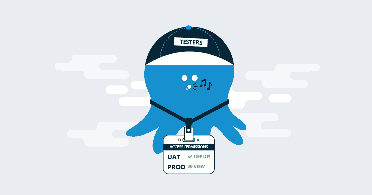

# Octopus React UI 权限- Octopus 部署

> 原文：<https://octopus.com/blog/permissions-in-react>

作为我们在 Octopus 4.0 中 UI 革新的一部分，我们将[从 Angular 改为 React](https://octopus.com/blog/octopus-v4-angular-to-react) ，一些很棒的背景细节在那篇文章中有所介绍。

Octopus 具有广泛的功能集。伴随着广泛的功能，还有一个复杂的基于角色的访问权限系统，它已经发展到支持限制用户可以看到什么和做什么。许多客户选择避免调整权限，并作为一组具有完全访问权限的管理员进行操作。对于许多组织来说，这是不合适的，他们选择了对团队和团队成员所能看到和做的事情进行细粒度的控制。

我们半开玩笑半认真地想完全去除细粒度的权限和大量基于角色的分组，并将客户推向章鱼内部的简化读写模型。除了一些例外情况，如围绕敏感数据密码、私钥等提供安全性。

但那会激怒成千上万的顾客。

在这篇博文中，我想分享为什么我们这些维护权限系统并与之交互的人喜欢在 Octopus 中梦想一个权限远为简单的世界。

[](#)

## 在这篇文章中

## 访问权限背景

当前基于角色的访问控制系统是如何演变成现在这个样子的，历史悠久。最初，我们将其建模为防火墙，并试图阻止对受限项目的访问。不久之后，它演变成一组用户可以做的动作，这些动作被限定在一组项目、环境和租户的范围内。当用户尝试执行某项操作时，我们会计算他们是否拥有对他们尝试操作的资源的适当权限，例如，将 ABC 项目部署到暂存区。

我失去你了吗？我希望不会。稍后我会在基于角色的访问控制部分给出更多的细节。

关键的一点是，Octopus 中的当前系统有一个重要的学习曲线，有细微差别，最重要的是，它被广泛使用，我们的客户进行了大量投资。

许多客户花费了大量精力为其庞大的用户群微调权限。这意味着许可系统目前的能力有很大的价值，也意味着我们不能彻底改变它，或者减少它的读写权限。

我们对更简单的许可系统的梦想来自于减少许可代码库某些方面的维护的愿望。在排除了完全移除它以及对它所能做的任何重大破坏之后，这给我们留下了安全合理的第三种选择。

使它目前做的事情更容易推理，使代码更好维护，并减少重复代码。

## 从角度用户界面到反应用户界面

Angular UI 由客户端代码演变而来，用于检查权限；该代码本质上断言用户有足够的特权来查看某些内容。同时，API 用自己的代码断言同样的事情，如果用户请求他们不能访问的数据或试图执行他们不能执行的操作，将返回 401 响应。

作为 Octopus 4.0 的一部分，对我们使用权限的方式进行重大更改不在范围之内，所以这是 Angular 代码中逻辑的一个紧密的一对一端口。如果我们没有正确地编写权限断言，Angular 代码将会无声无息地失败。这意味着，它更加宽容，在这种情况下它不会做任何事情。

在 React 和 TypeScript 的世界中，如果我们犯了一个错误，没有考虑正确的访问权限检查输入，那么当子组件试图呈现和操作它们期望在那里的数据和属性时，UI 将会崩溃。

Octopus 数据和功能的真正守护者是 API。在 4.0 中没有重大变化，因此，我们知道我们不会暴露信息或允许用户执行他们不能执行的操作。最糟糕的事情将会发生(也确实发生了),那就是用户界面会崩溃，变得不可用。这意味着我们必须把它做好，而且需要做大量的 bug 修复工作。

## 补丁，补丁，补丁

在 4.0 的最初几个补丁发布中，在早期采用者的帮助下，我们找到了在 alpha 和 beta 测试中遗漏的边缘案例。如果您查看发行说明，4.0.x 分支中的前 11 个补丁中有一半都有与权限相关的修复。对于受影响的客户，我们提供了解决方案或快速补丁，但它们通常是令人无法忍受的错误。与所有主要变化一样，特别是全新的 UI，我们预计会有我们在发货时遗漏的错误，到 4.0.11，当考虑复杂的访问权限组合并在 UI 中迎合它们时，UI 与版本 3 中一样稳定。

在我们发布补丁时，React 和 TypeScript 继续为我们带来回报，特别是当我们调整布局以匹配我们没有考虑到的情况的访问权限时，这给了我们重构的信心。

## React 用户界面错误

这些错误分为三类:

*   我们移植过来的老错误
*   全新的错误
*   新的用户界面意味着权限需要更多的思考

前两个很简单，通过仔细检查和客户报告，我们可以发现旧代码中的错误，并确保它在新代码中是正确的。新的错误是类似的，因为我们只是在如何做访问权限检查和报告表单方面犯了一个错误，客户也是关键。

第三类是最耗时的，在少数情况下，它涉及一组特定的用户角色和权限(我们在测试中没有遇到过),以及显示数据和操作的不同结构如何无法应对。这包括根据用户角色和作用域组合，调整 API 调用的方式和时间，以及导致崩溃的 react 组件的层次结构。

## 基于角色的访问控制

为了全面描述 Octopus 中的用户角色以及它们是如何驱动访问权限的，我们将安全权限列表分组到用户角色中，这些用户角色与在 Octopus 中执行任务的常见访问中断方式相一致。如果您使用我们内置的用户角色来控制安全性，并且您只是简单地确定它们的范围，那么您不太可能碰到 React UI 权限代码的边缘情况。

它是为那些已经为他们的用户精心设计了非常严格的权限配置的客户准备的，在这种情况下会出现边缘情况。这类客户拥有经过微调的用户角色，以最大限度地减少用户可以做的事情。在撰写本文时，我们有 103 个这样的权限角色。是的，103，它们的作用范围各不相同，从全局(无)到项目、项目组、环境和租户。这转化为大量的访问权限排列(比方说，快 3 倍)。显示 React UI 的某些部分所需的权限之间也有不明显的联系，即使您每天都在使用访问角色，每次您以细粒度的方式调整访问权限时，都需要进行大量的测试和调整，直到您做对为止。

我们将在不久的将来解决这种可用性和配置复杂性。

## 用户界面访问权限代码

典型的例子是，您正在访问一个项目，您进入概览屏幕，我们会向您显示每个相关环境的版本，当启用了[租赁部署](https://octopus.com/docs/deployment-patterns/multi-tenant-deployments)时，我们还会显示租户。对于页面层次结构中的每个组件，我们需要考虑项目、环境和(可能)租户。

这是我们的包装 React 组件，用于检查您是否可以部署:

```
 <PermissionCheck
        permission={Permission.DeploymentCreate}
        project={projectId}
        environment={environmentId}
        tenant={tenantId}>
            <NavigationButton label="Deploy" href={deployUri} />
    </PermissionCheck> 
```

在 4.0 UI 中，到处都有 react 访问控制组件，这是一个好处，我们可以清楚地告诉你为什么你看不到一些东西，那就是 call out 元素和文本。

```
 <PermissionCheck 
        permission={Permission.LifecycleView} 
        alternate={
            <Callout type={CalloutType.Information}>
                The {Permission.LifecycleView} permission is required to view the deployments
            </Callout>
        }>
            ...
    </PermissionCheck> 
```

一旦你习惯了，就没问题了，但是它有很大的出错空间，输入是文档 id 和字符串，它们很容易被应用到错误的过滤器。一些更好的类型安全可以缓解这种情况。如果这已经解决了，下一个重大挑战仍然存在；实际编写代码并确保它在正确的位置。

UI 中有相当多的代码重复了我们必须在服务器端检查的内容。我在我们的代码中搜索了这篇博文，我们在 61 个 TSX 文件中使用了 96 次`<PermissionCheck />`，在 45 个 React TSX 和 TypeScript 文件中使用了 137 次`isAllowed()`。

这就引出了这个计划...

## 前进

我们正在进行一些工作来更好地配置基于角色的访问权限，以确保我们的客户在尝试利用权限来管理他们的用户可以看到什么和做什么时落入成功的陷阱，当然也不会中断或导致现有客户的大量新工作。这项工作符合我们在 [2018 年路线图](https://octopus.com/blog/roadmap-2018)中讨论的空间特征。

计划的第一部分是清理并简化服务器端权限的测试，使其更健壮，更容易用于驱动 UI。我们的目标是定义可以对 API 返回的资源执行什么操作，这样我们就不需要 React 中的大部分额外代码了。更少的代码意味着更多的安全，更少的维护，让我们有更多的时间去开发更重要的功能。

API 驱动的权限的另一个受益者将是利用我们的 API 的其他应用程序，如 iOS [OctoWatch](https://itunes.apple.com/us/app/octowatch/id1232940032?mt=8) 如果你对它感兴趣，这里有一个我们的[TL；DR 视频](https://www.youtube.com/watch?v=mxKBxHNDLzc))涵盖了它的创建和使用 React Native 的开发。

## 包裹

回到让 Octopus API 驱动的焦点上，我们将尽可能多地移除客户端权限检查，以支持通过从 API 返回的数据来驱动 UI。

在接下来的几周里，我们将继续关注更多关于共享空间和权限的帖子。