# 如何为 Octopus Deploy 构建 PowerBI 报告

> 原文：<https://octopus.com/blog/powerbi-report-for-octopus-deploy>

最近，我使用 PowerBI Desktop 对从 Octopus Deploy 数据库中提取的一些数据进行了分析。我创建的报告强调了自动化为我的公司节省了多少时间和金钱，这些报告帮助我发现了减缓部署的潜在开发问题；例如，由于在较低级别的环境中没有发现 bug 而跳过了多少次发布。

在这篇文章的最后，我分享了我创建的模板，这样你就不必从头开始了(模板既适用于章鱼云，也适用于自托管章鱼)。希望它们能为您指出正确的方向，帮助您强调自动化可以为您节省多少时间和金钱，甚至证明自动化和测试资源的必要性。

在这篇文章中，我预览了我整理的内容。我还将介绍如何创建连接并从 Octopus Deploy 实例中提取数据。

[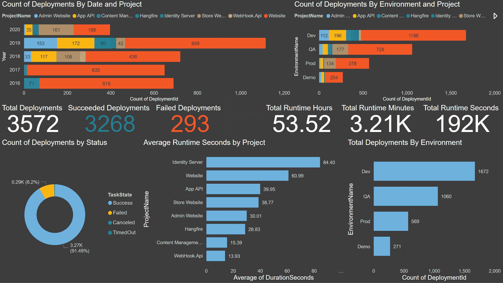](#)

这篇文章分为以下几个部分:

1.  [先决条件](#prerequisites)
2.  [部署历史图表](#deployment-history-charts)
3.  [Runbooks 历史图表](#runbooks-history-charts)
4.  [报告](#reports)
5.  [ROI](#roi)
6.  [结论](#conclusion)

## 先决条件

您需要具备几个先决条件:

## 部署历史图表

部署历史产生了一些非常有趣的模式和结果。来自不同分组(项目、环境等)的原始部署计数。)，部署执行时间以及成功率和失败率。

**按日期和项目统计部署数量**:这是我整理的第一张图表，看到过去五年我们每年完成的部署数量，我感到震惊。这份报告每年分解一次，把项目堆起来。在此图表中，您可以按季度、月份和日期深入查看部署计数。点击*向下双箭头*向下钻取，然后点击*向上箭头*返回:

[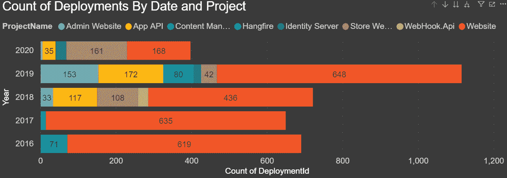](#)

[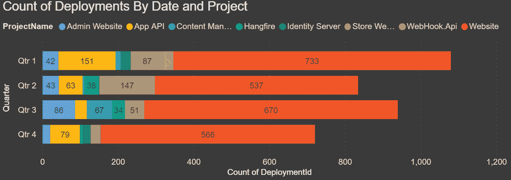](#)

**按环境和项目划分的部署数量**:下图显示了我们在每个环境中按项目划分的部署数量:

[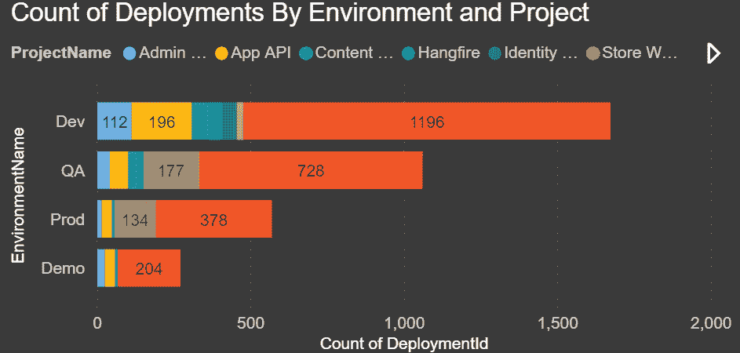](#)

**总部署**:这是部署历史表中所有记录的计数，即所有的部署。

**成功部署**:这是所有部署的计数，由`TaskState` `Succeeded`过滤。

**部署失败**:这是所有部署的计数，由`TaskState`T3 过滤。

[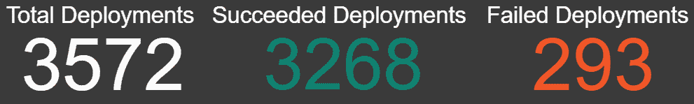](#)

**总运行时间**:这是一个以小时为单位告诉我们所有部署的总时间的度量。持续时间是以秒为单位存储的，所以我将它除以总小时数。

**总运行时间分钟数**:这是一个度量，它告诉我们所有部署的总时间，以分钟为单位。持续时间是以秒为单位存储的，所以我再一次用它除以总分钟数。

**总运行时间秒数**:这是所有部署的总持续时间的总和。

[T31](#)

**按状态划分的部署计数**:下图显示了按任务状态划分的所有部署的摘要和计数:

[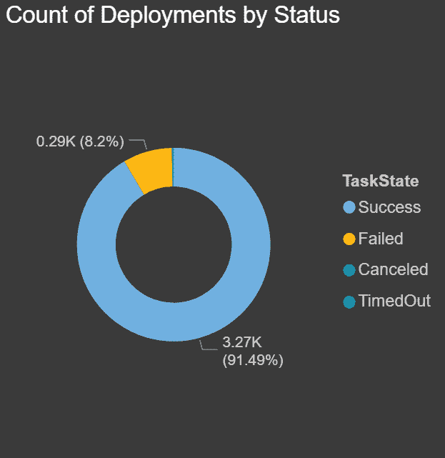](#)

**按项目划分的平均运行时间秒数**:下面的图表显示了每个项目的每次部署平均需要多长时间。这适用于所有环境:

[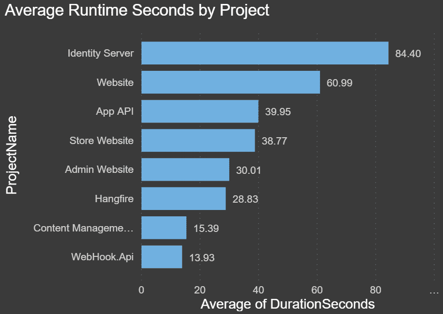](#)

**按环境划分的总部署数**:下图显示了每个环境中的总部署数:

[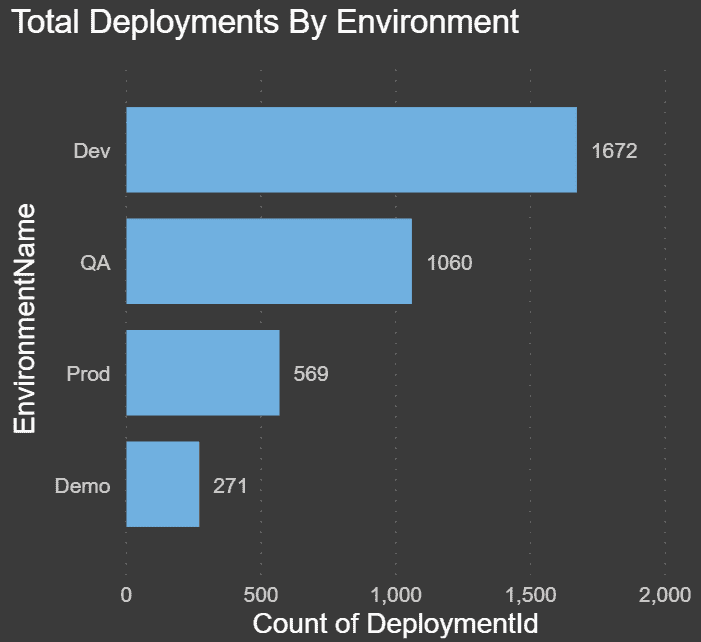](#)

**基于部署数量，按项目和环境列出的问题百分比**:通过下面的图表，我想显示我们按项目对每个环境进行的部署或重新部署的比率。这可能不是一个准确的表示，但是如果部署到较低环境(开发和 QA)的百分比较高，这可能意味着发现了问题并修复了部署，然后重新部署。如果我们在每个环境中都有一个均匀的部署百分比，这可能意味着没有发现任何错误/问题，并且部署通过了生产。

如果您在此图表中注意到，QA 和 Prod 中的*商店网站*几乎具有相同的部署百分比。对我来说，这意味着不是在 QA 中测试和发现问题，而是在生产中发现错误。我认为这意味着有一个代码质量问题需要解决。

将*商店网站*与*网站*进行比较，您可以看到与生产相比，开发和 QA 中的百分比差异要高得多。我认为这意味着开发人员在开发中发现 bug，然后他们错过的 bug 在 QA 中被发现。在过去的 5 年里，我们已经发布了 16 个主要的稳定版本的网站。

虽然这可能不是 100%准确，但是您可以引入一些数据，并从您的票证系统中创建一个关系，以便使用支持数据使其更加准确。

[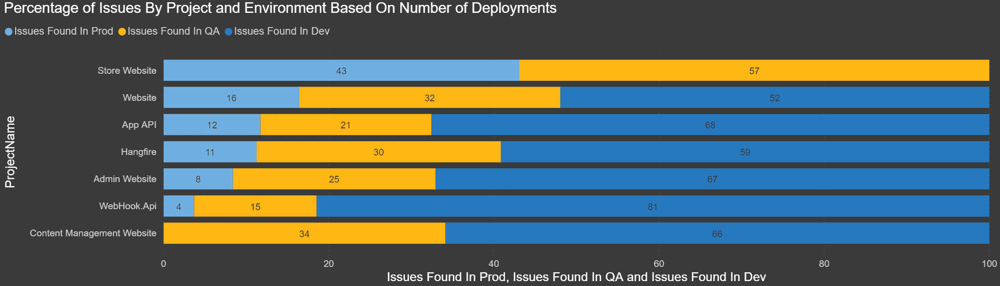](#)

**计划与实际的百分比**:下图比较了开发和生产的发布。目标是查看有多少项目版本打算投入生产，但由于代码问题或错误，它们必须在投入生产之前重新发布:

[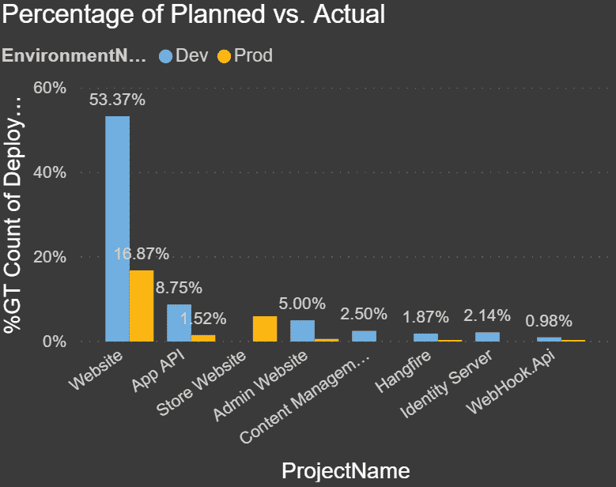](#)

**部署取消/超时最多的应用**:下图显示了哪个项目的部署取消或超时最多。如果超时，这可能表示脚本或进程花费的时间太长。这可能是一个大型数据库更改脚本或大型文件传输:

[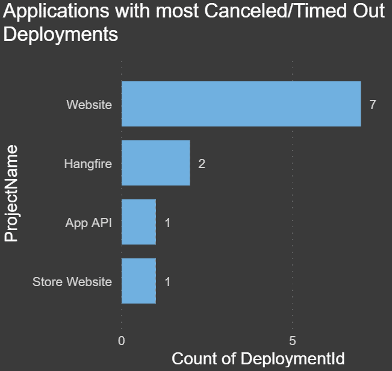](#)

**部署失败次数最多的应用**:下图显示了哪个项目/应用的部署失败次数最多。这可能有许多原因，例如错误配置的变量、更改的服务器、第三方组件更改或升级、服务器关闭、脚本失败等。如果有一个很高的数字，这可能是一个值得研究的问题:

[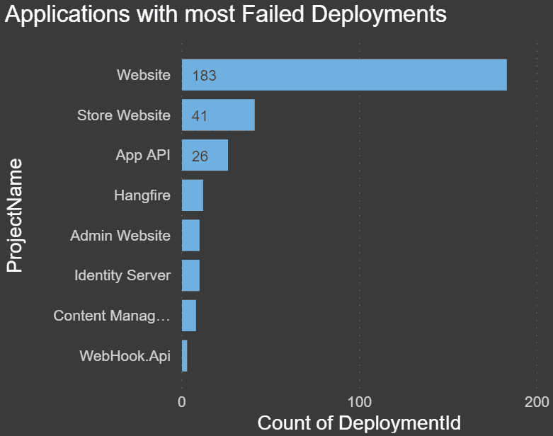](#)

**部署最多的应用**:下图显示了哪个项目/应用的部署最成功。

[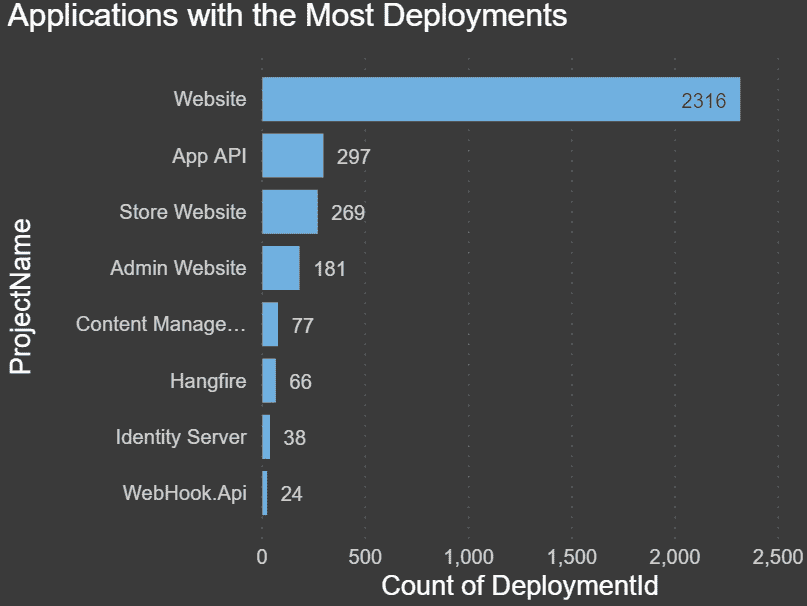](#)

**项目和环境的最大持续时间(秒)**:下图显示了每个项目在每个环境下的最大持续时间(秒)。这允许您比较为每个项目部署代码需要多长时间:

[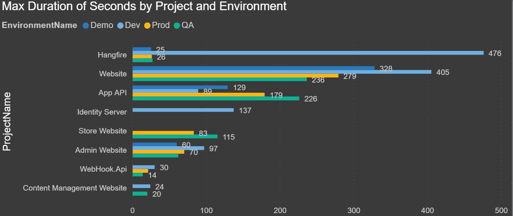](#)

**按项目从开发到生产的平均天数**:下图显示了从一个版本被部署到开发到它被提升到生产的平均持续天数:

[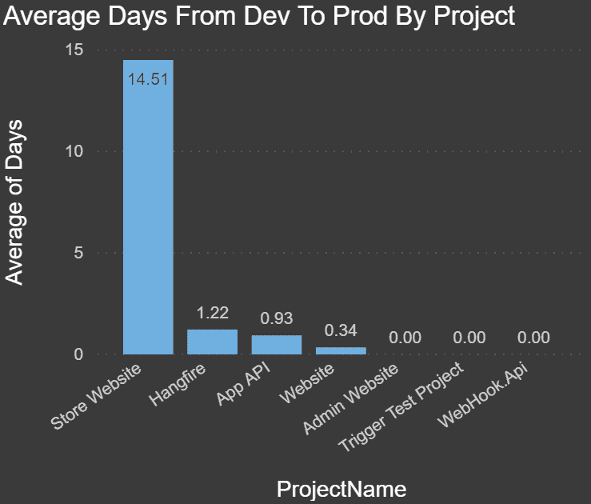](#)

**发布到产品的最短天数**:下图显示了从开发到生产的最短发布时间。在我们的例子中，我们在同一天从开发到生产部署了发布:

[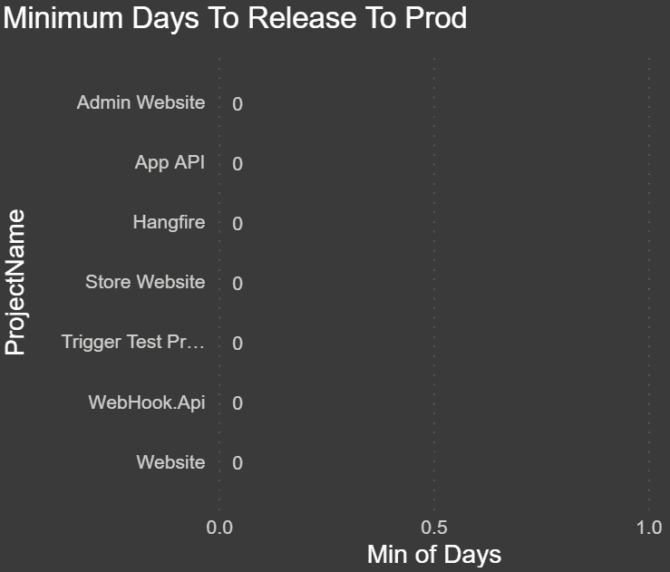](#)

**发布到产品的最大天数**:下图显示了从开发到生产的最大发布时间:

[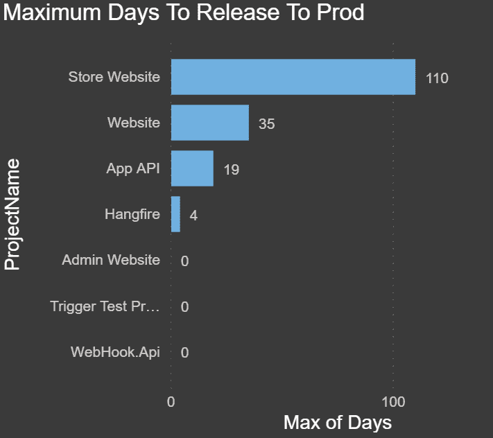](#)

## Runbooks 历史图表

Runbooks 于 2019 年底推出，我最近开始使用它们完成一些基本的操作任务。这些图表按日期、执行时间和成功与失败总结了运行手册的执行情况。

这些报告目前仅适用于 Octopus Deploy 的本地实例，因为 Octopus Cloud 实例上没有`RunbookHistory` API 调用。

**按日期统计的运行频率**:下图显示了按日期统计的执行频率。因为我们最近才开始使用 runbooks，所以我深入了解了当天的情况，看看这个月我们已经运行了多少次:

[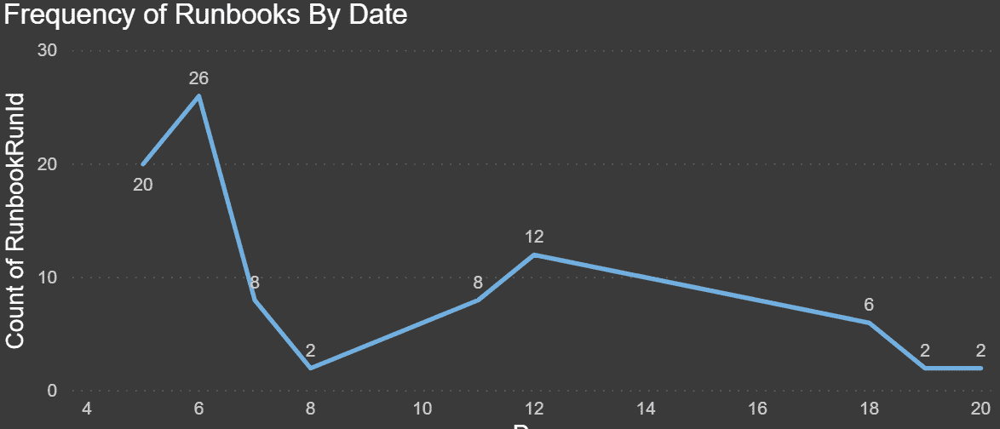](#)

**Runbook 执行**:这是 runbooks 历史表中所有记录的计数，即所有 Runbook 的所有执行。

**成功运行**:这是所有运行的计数，由`TaskState` `Succeeded`过滤。

**运行失败**:这是所有运行的计数，由`TaskState`T3 过滤。

[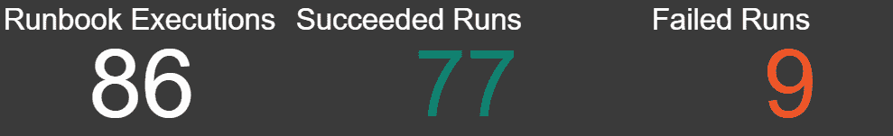](#)

**总运行时间**:这是一个度量，告诉我们所有运行手册执行的总时间，以小时为单位。持续时间是以秒为单位存储的，所以我将它除以总小时数。

**总运行时间分钟**:这是一个度量，告诉我们所有 runbook 执行的总时间，以分钟为单位。持续时间是以秒为单位存储的，所以我将它除以总分钟数。

**总运行时间秒数**:这是所有 runbook 执行的总持续时间的总和。

[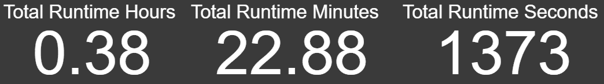](#)

**Runbook 成功率**:下图显示了基于任务状态的 Runbook 执行计数，由`IsPublished`T5 过滤。我们在测试时遇到了一些故障，但我们只想知道这些故障是否在发布并被我们的最终用户使用后才出现:

[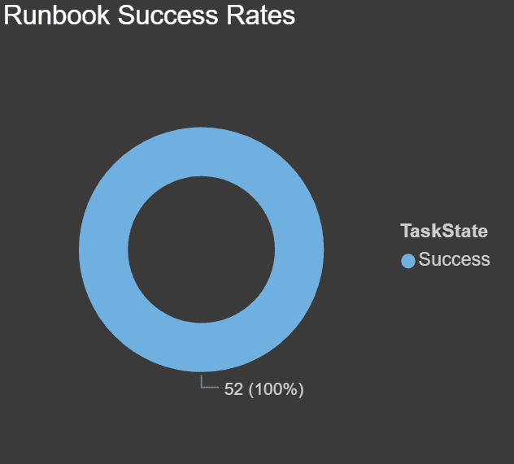](#)

**执行操作手册的用户**:下图显示了哪些用户正在执行操作手册，以及每个用户已经执行了多少次:

【T2 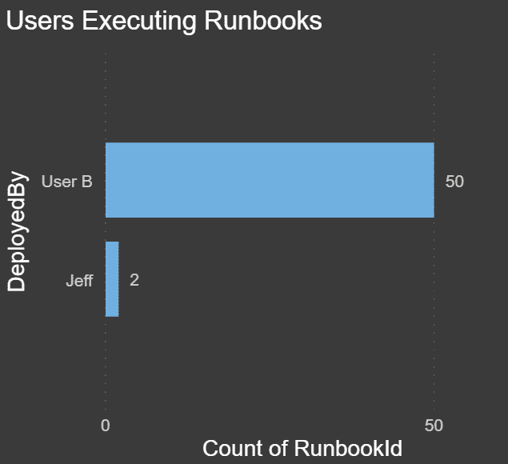

**Runbook 的平均持续时间(秒)**:下图显示了每个 run book 被执行的次数。这张图表也是按`IsPublished` `true`过滤的:

[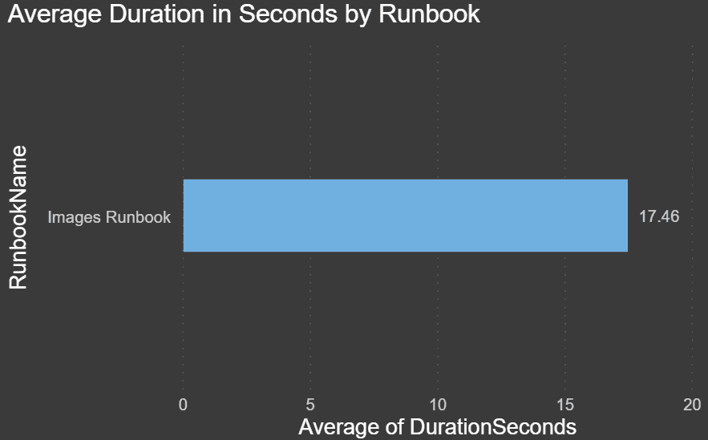](#)

## 报告

创建这些报告可能看起来工作量很大，确实如此。但是我有好吃的给你！我复制了我的 PowerBI 报告，并为 SQL Server 和 Octopus Cloud 实例创建了一个模板。下面是每个模板的链接和我的博客的链接，其中包括设置连接字符串、API URL 和 API 键，以便您可以访问您的数据。

现在我们有了数据，我们可以查看我们创建的所有图表。我将图表整理成四页，包含大量有用的信息:

1.  部署
2.  问题
3.  期间
4.  运行手册

* * *

第一页称为**部署**。下面是过去五年中我的本地 Octopus Deploy 实例的数据示例截图:

[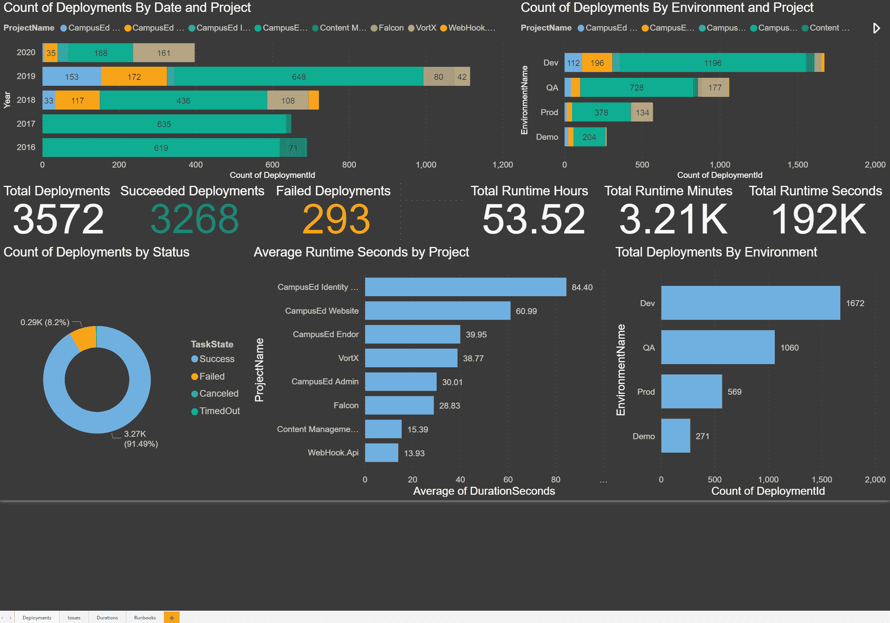](#)

*本地实例:部署页面*

第二页是**问题**。这是我的报告的屏幕截图，其中包含与潜在问题相关的所有图表:

[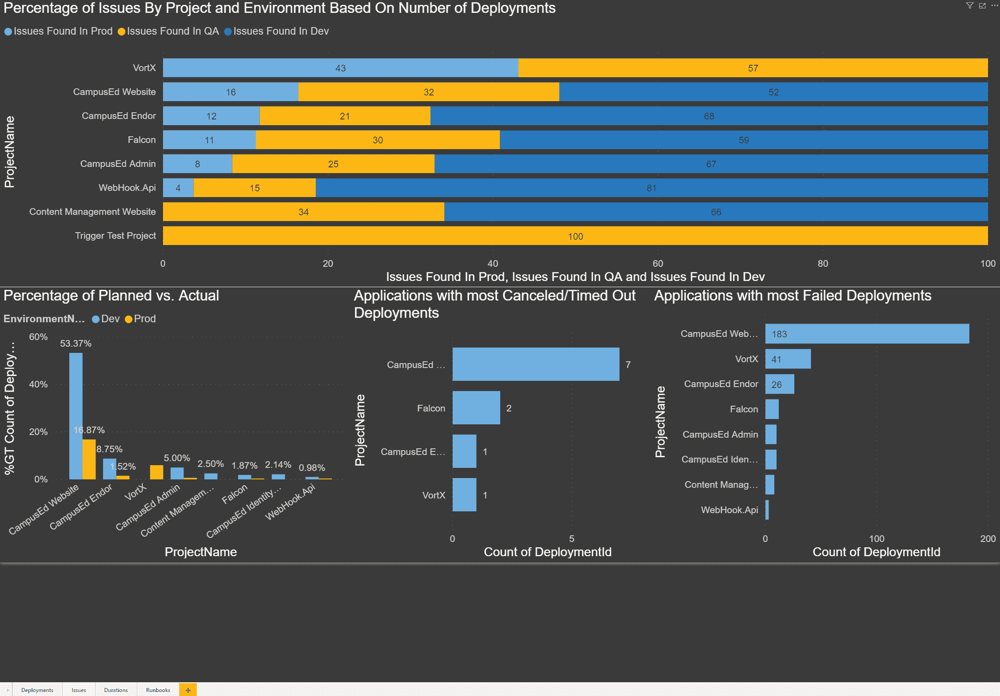](#)

*本地实例:问题页面*

第三页称为**持续时间**，包含所有与执行持续时间相关的图表:

[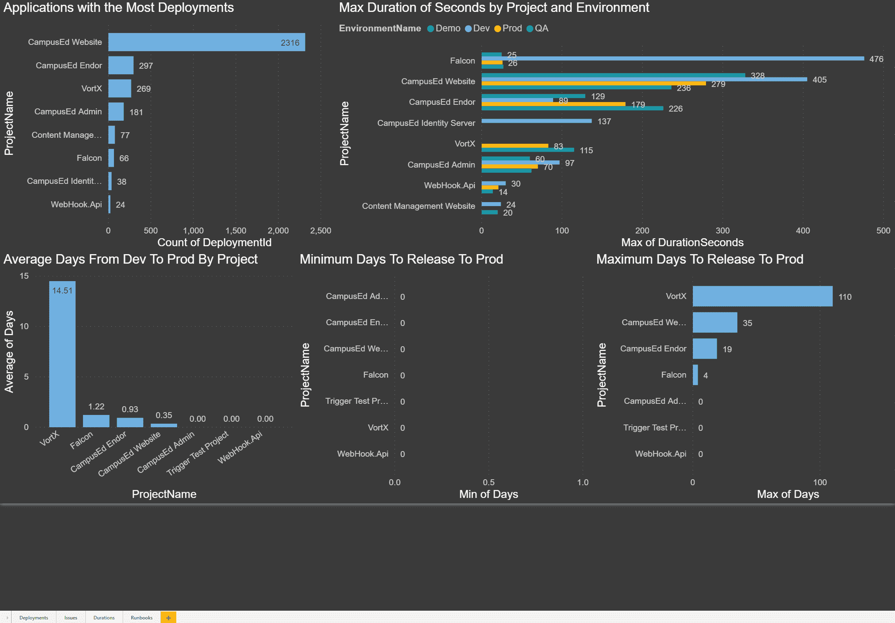](#)

*本地实例:持续时间页面*

最后一个页面名为 **Runbooks** ，这目前只是 Octopus Deploy 的本地实例的一个选项，因为 Octopus Cloud 实例上没有`RunbookHistory` API 调用。

[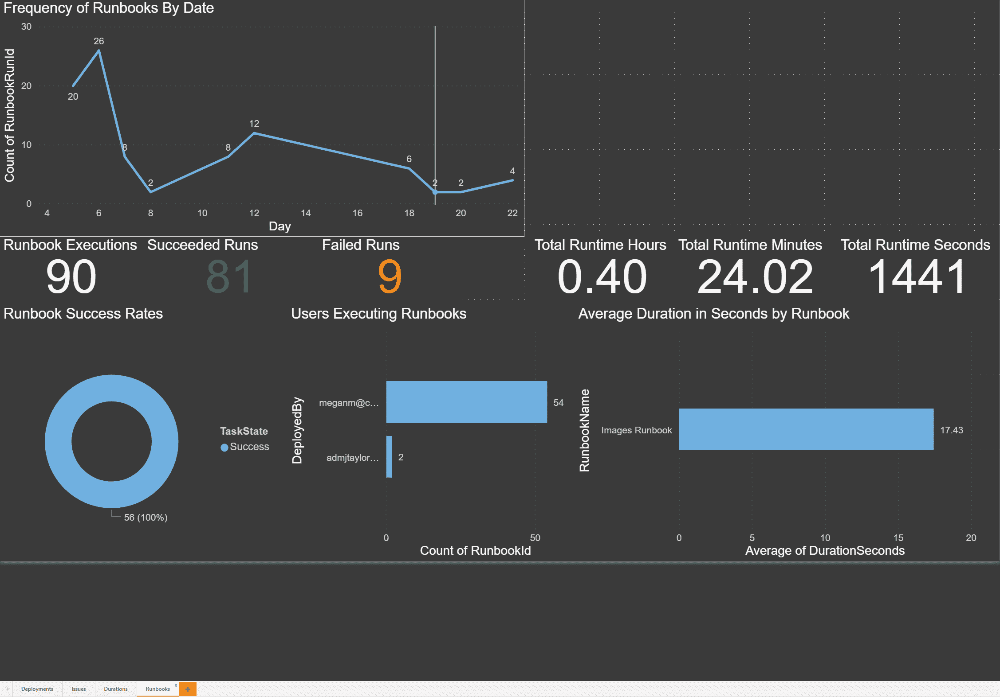](#)

*本地实例:运行手册页面*

## 投资收益率

那么 Octopus Deploy 为我的公司节省了多少钱呢？来看看我收集的数据。

在过去五年中，Octopus Deploy 已经执行了 3，572 次部署。假设在典型的手动部署中，每个部署需要一个小时来部署到多个服务器。在我的例子中，我们至少有一个网站、一个 API 和两个数据库。我们的其他环境有更多的 web 服务器(在 web 场中)和更多的 API。

最少也要 3，572 个小时，我们可以肯定，对于较大的环境来说，这需要更多的时间。手动执行 3572 小时，但 Octopus Deploy 的自动执行仅用了 53.5 小时。

如果我们有一个人来处理部署，那么在一个典型的 168 小时工作月中，仅执行部署就要花费他们每月大约三分之一的时间。

如果他们的时薪是每小时 80 美元，我们每年就要花费 57，000 美元，持续五年，总计 285，760 美元。

现在，如果我能说服我的公司从我节省下来的 267，360 美元中给我一点奖金，那就太棒了。

## 结论

现在您可以看到您的数据了，我希望您会发现其中一些报告和图表很有用，也许您甚至会想出新的报告和图表来添加到这些报告和图表中。如果你这样做了，评论和分享你的想法，也许我可以把它们纳入我的下一个版本。