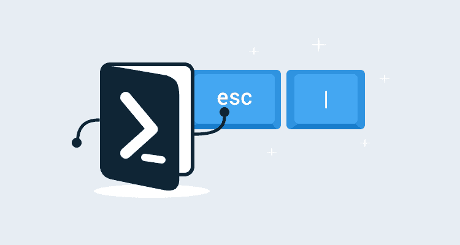

# 在 PowerShell 命令中转义管道字符- Octopus Deploy

> 原文：<https://octopus.com/blog/powershell-pipe-escaping>

[](#)

最近，我的任务是开发一些 Azure web 应用程序，为了节省时间，我使用 Azure CLI 来运行命令`az webapp create -g testgroup -p testplan -n testapp --runtime "node|10.6"`。这导致了非常迟钝的错误`'10.6' is not recognized as an internal or external command, operable program or batch file.`，我花了一些谷歌来理解这个问题。PowerShell 转义字符没有按照我预期的方式提供帮助。

在这篇博文中，我们将看看解决这个错误的一些方法。

## 用引号将字符串括起来

解决此错误的第一种方法是用单引号将包含管道字符的字符串括起来，如下所示:

```
az webapp create -g testgroup -p testplan -n testapp --runtime '"node|10.6"' 
```

或者:

```
az webapp create -g testgroup -p testplan -n testapp --runtime 'node"|"10.6' 
```

您也可以用转义双引号将字符串括起来:

```
az webapp create -g testgroup -p testplan -n testapp --runtime "`"node|10.6`"" 
```

这也适用于`Start-Process` CmdLet:

```
start-process az -argumentlist @("webapp", "create", "-g", "testgroup", "-p", "testplan", "-n", "testapp", "--runtime", '"node|10.6"') -nonewwindow -wait 
```

您可以在外部变量中定义参数，并用引号将管道字符括起来:

```
$runtime='node"|"10.6'
az webapp create -g testgroup -p testplan -n testapp --runtime $runtime 
```

## 使用 PowerShell 停止解析符号

可以将停止解析符号(- %)添加到命令中，以指示 PowerShell 停止尝试解释字符串，从而生成类似以下的命令:

```
az webapp create -g testgroup -p testplan -n testapp --runtime --% "node|10.6" 
```

您可以在 [PowerShell 文档](https://docs.microsoft.com/en-us/powershell/module/microsoft.powershell.core/about/about_parsing?view=powershell-6)中找到关于此符号的更多信息。

## 什么不起作用

用单引号括住管道字符不起作用:

```
PS C:\Users\Matthew> az webapp create -g testgroup -p testplan -n testapp --runtime "node'|'10.6"
''10.6' is not recognized as an internal or external command,
operable program or batch file. 
```

使用单引号不起作用:

```
PS C:\Users\Matthew> az webapp create -g testgroup -p testplan -n testapp --runtime 'node|10.6'
'10.6' is not recognized as an internal or external command,
operable program or batch file. 
```

将运行时字符串放入变量是行不通的:

```
PS C:\Users\Matthew> $runtime = "node|10.6"
PS C:\Users\Matthew> az webapp create -g testgroup -p testplan -n testapp --runtime $runtime
'10.6' is not recognized as an internal or external command,
operable program or batch file. 
```

使用`Start-Process`也不起作用:

```
PS C:\Users\Matthew> start-process az -argumentlist @("webapp", "create", "-g", "testgroup", "-p", "testplan", "-n", "testapp", "--runtime", "node|10.6") -nonewwindow -wait
'10.6' is not recognized as an internal or external command,
operable program or batch file. 
```

转义竖线字符不起作用:

```
PS C:\Users\Matthew> az webapp create -g testgroup -p testplan -n testapp --runtime "node`|10.6"
'10.6' is not recognized as an internal or external command,
operable program or batch file. 
```

使用 PowerShell 转义字符`^`不起作用。这是您在 Windows 命令提示符下转义管道字符的方式，我曾看到它被错误地建议作为 PowerShell 的解决方案:

```
PS C:\Users\Matthew> az webapp create -g testgroup -p testplan -n testapp --runtime "node^|10.6"
'10.6' is not recognized as an internal or external command,
operable program or batch file. 
```

## 结论

在 PowerShell 中使用管道字符传递参数需要一些特殊的处理，这并不是显而易见的，但是停止处理符号或一些特殊的带引号的转义将会使您摆脱麻烦。