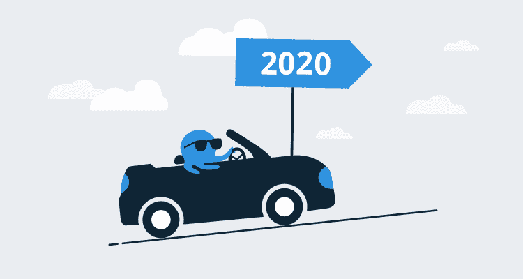

# 提高托管和使用八达通服务器的最低要求-八达通部署

> 原文：<https://octopus.com/blog/raising-minimum-requirements-for-octopus-server>

【2020 年 9 月更新

我们听取了客户的意见，并将我们的 SQL Server 要求从 SQL Server 2017+下调至 SQL Server 2016+

这从以下版本开始生效:

*   2020.1 . x*(2020.1 . x 中未强制执行 SQL 版本变更)*
*   ➜最新版
*   ➜2020 . 3 . 6 最新
*   2020.4.0 ➜最新

以下版本范围内的任何版本仍然强制执行 SQL Server 2017+版本要求

*   2020.2.0 ➜ 2020.2.17
*   2020.3.0 ➜ 2020.3.5

## 原始帖子

2020 年，我们将提高托管和使用八达通服务器的最低要求:

*   Windows Server 2012 R2 版
*   SQL Server 2017+版

此外，我们还将终止对 IE11 的主流支持。

支持旧的服务器和浏览器消耗了我们的时间和注意力，使我们更难创新和推动 Octopus 生态系统向前发展。我们想在 2020 年打破这个循环。从另一个角度来看，如果 Octopus 服务器是您业务中的关键资源，您真的应该考虑一个现代化的操作环境来提高安全性和性能。

也许这就是我们都需要的推动力？也许我们还没有充分考虑到这会给你的生活带来多大的困难？如果这些最低要求在您的场景中会有问题，请在评论中告诉我们原因，或者通过[联系我们](https://octopus.com/support)。这篇博文的其余部分应该回答最常见的问题。

愉快的部署！

## 问题:我会受到影响吗？

只有在以下情况下，您才会受到影响:

1.  您在 Windows Server 2008-2012 或 SQL Server 2008-2014 上托管 Octopus 服务器，并且您想要升级到 Octopus 服务器`2020.x`。
2.  无论您是在自己的基础设施上托管 Octopus 服务器还是使用 Octopus Cloud，您都必须使用 Internet Explorer 11，这是强制的还是您自己的偏好。

## 问:我的部署会受到影响吗？

不，您的部署不会受到影响。这些要求只影响八达通服务器本身的托管。我们仍然高度向后兼容您在 Octopus 中的部署目标，包括旧的 Windows 和 Linux 操作系统。

## 问题:我有多少时间来计划我的升级？

我们将在 2020 年 1 月再发布一个 LTS 版本的 Octopus Server，版本为`2019.12 LTS`，将在我们的[长期支持计划](https://octopus.com/docs/administration/upgrading/long-term-support) **下提供支持，直到 2020 年 7 月**，之后您应该认真考虑升级 Octopus Server。我们希望这给你足够的时间来计划全面升级。

## 问题:我应该升级八达通服务器吗？

与时俱进对这种关系的双方都有帮助:

*   当你运行现代章鱼服务器时，我们能给你最好的支持。我们可以用更少的开销来解决问题，并且当您应用增量升级时，升级的风险更小。
*   自您上次升级以来，我们所做的一切都让您受益匪浅，包括令人愉快的新功能，如简化的流程编辑器和操作手册。看看[有什么新的](https://octopus.com/whatsnew)。此外，[看看我们的动态路线图](https://octopus.com/roadmap)，了解我们计划很快推出的产品。
*   在安全和信任方面，我们积极主动。让你的 Octopus 服务器保持最新是安全可靠安装的基础。不想危言耸听，这里从安全角度列出了升级的[个理由](https://www.cvedetails.com/vulnerability-list/vendor_id-16785/product_id-39115/Octopus-Octopus-Deploy.html)。

## 问:为什么 Windows Server 2012 R2 将是最低操作系统？

我们的驱动原因很简单:[。NET Core 3.x 需要 Window Server 2012 R2](https://github.com/dotnet/core/blob/master/release-notes/3.0/3.0-supported-os.md) ，我们希望 Octopus 服务器有一个单一的目标。现在，我们需要瞄准全部。适用于 Windows 和。NET Core 2.x for Linux。锁定目标。NET Core 3.x 将简化我们的代码库和部署管道。此外，我们更愿意为跨多种 Windows 和 Linux 主机环境的单一框架提供世界一流的支持。

此外，Windows Server 2012 的主流支持早在 2018 年 10 月就已结束。Octopus 是基础设施的重要组成部分，但它的可靠性和安全性取决于底层操作系统。升级只是一个好主意。

## 问:如何升级我的主机操作系统？

您可以将 Windows Server 操作系统就地升级到更现代的操作系统。了解如何升级 Windows 服务器。

或者，你可以将你的八达通服务器转移到另一台已经运行更现代的操作系统的主机上。了解[移动你的八达通服务器](https://octopus.com/docs/administration/managing-infrastructure/moving-your-octopus)。

## 问题:为什么 SQL Server 2017 会是最小数据库？

我们的驱动原因很简单:我们在混合数据存储中大量使用 JSON，我们希望利用 SQL Server 2017 提供的所有 JSON 功能。过去，我们对推进这一议程犹豫不决，因为我们不想给客户增加负担。回想过去几个月，在许多情况下，现代数据库基础会帮助我们提供更多价值:

1.  我们本可以使用一流的 JSON 查询而不是脆弱的 SQL 查询来帮助客户解决复杂的支持问题。
2.  出于同样的原因，我们可以编写更健壮的数据库升级脚本。
3.  我们可以编写更高效的数据库查询，使 Octopus 更快，而不是受最小公分母的约束。
4.  我们可以利用新的数据库引擎特性来加快每个 Octopus 的安装速度。

我们没有看到任何价值从 SQL Server 2012 到 2014 到 2016 不断滚动，迫使您每次都进行升级。我们认为是时候撕掉众所周知的创可贴(TM ),直接跳到 SQL Server 2017，这样我们就可以为所有客户提供更好的价值和更快的周转时间。

## 问:如何升级我的数据库服务器？

您可以对 SQL Server 执行就地升级。了解[升级到 SQL Server 2017](https://docs.microsoft.com/en-us/sql/database-engine/install-windows/upgrade-sql-server) 。

## 问题:Octopus 使用的是共享数据库服务器，很难升级！我们呢？

我们不希望升级八达通服务器很难，希望这不是你在过去 5 年的经历！然而，我们相信最终的结果是值得努力的。在这种情况下，托管在该数据库服务器上的所有应用程序都可能受益于 SQL Server 引擎的改进。[这里有一个关于这个主题的好帖子:升级到 SQL Server 2017](https://sqlperformance.com/2018/04/sql-server-2017/reasons-to-upgrade-to-sql-server-2017) 的理由。

或者，你可以考虑将你的 Octopus 迁移到 SQL Server 2017 的免费版，直到共享数据库服务器升级。

另一个选择是考虑将[转移到章鱼云](https://octopus.com/cloud)，在那里我们会代表你处理一切。

如果你真的会被卡住，请[伸手聊天](https://octopus.com/support)！

## 问题:Internet Explorer 11 怎么样？

我们不会阻止 IE11 访问 Octopus。我们还将保留所有的垫片，让 IE11 在 Octopus 上继续工作一段时间。但是，我们不会在功能开发和测试期间主动针对 IE11，也不会主动修复只影响 IE11 的 bug。是的，随着时间的推移，这可能会导致 IE11 与 Octopus 一起使用的体验下降。

从自私的角度来说，现在我们只有 3%的流量来自 IE，我们花在迎合 IE11 上的时间和精力觉得不值得。

从无私的角度来看，当你真的应该使用现代浏览器时，我们不希望你使用 IE11。甚至微软团队也在 2019 年推动这个议程[。IE11 是针对无法与其他浏览器兼容的网络应用的兼容性解决方案，但这不是 Octopus。](https://techcommunity.microsoft.com/t5/Windows-IT-Pro-Blog/The-perils-of-using-Internet-Explorer-as-your-default-browser/ba-p/331732)

在未来的某个时候，我们将删除所有 IE11 特定的代码，并阻止除了现代浏览器之外的任何东西使用 Octopus，从而为我们所有人带来一个更美好的未来。

## 问:什么时候可以在 Linux 上托管 Octopus 服务器？

在不久的将来。我们已经在内部为章鱼云(我们的 SaaS 平台)做这件事了。当我们准备好支持在您自己的 Linux 基础设施上安装 Octopus 服务器时，我们将发布一个单独的公告。