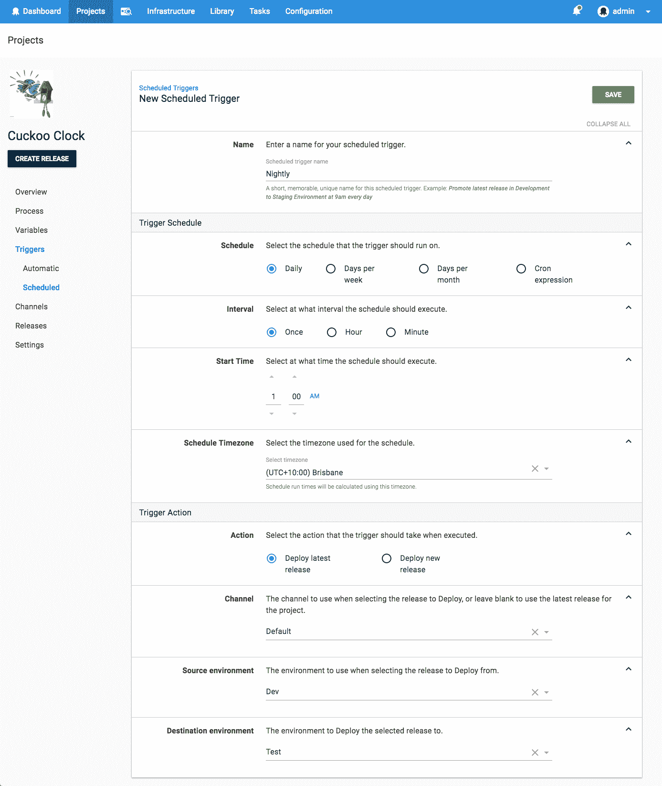
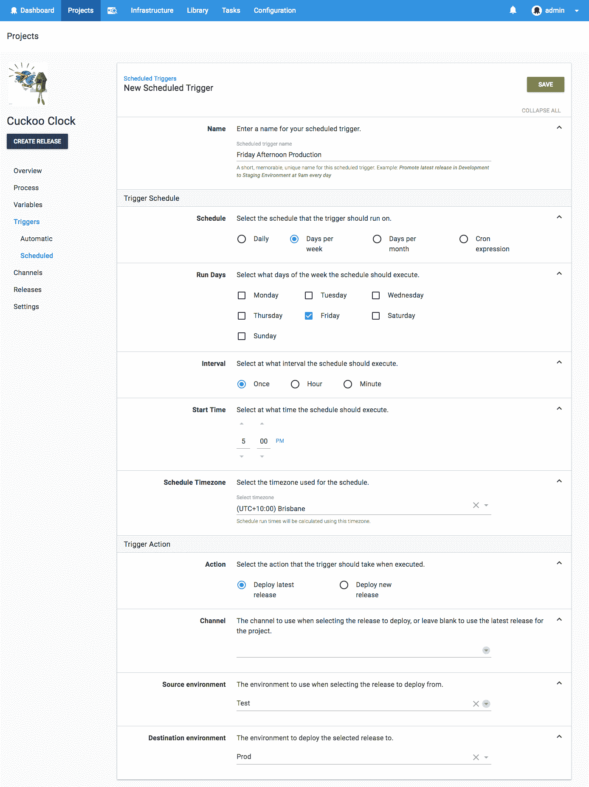

# 定期调度部署- Octopus 部署

> 原文：<https://octopus.com/blog/recurring-deployments>

Octopus 早就有能力在未来的特定时间安排部署。缺少的是将部署安排在*重复*的能力。这个特性在内部被称为 *DTGAAA:一次又一次的部署*。

这是一个非常受欢迎的[用户声音项目](https://octopusdeploy.uservoice.com/forums/170787-general/suggestions/6599104-recurring-scheduled-deployments),在我们的列表中排名第四，有 460 多张选票。理由很充分:没有人喜欢一遍又一遍地做同样的事情。这就是章鱼这样的工具存在的原因！

## 为什么？

想象你有三个典型的环境:`Dev`、`Test`和`Prod`。

开发团队配置了他们的持续集成管道，这样每次他们推送新的提交时，构建服务器都会构建包并将其推送到 Octopus，在 Octopus 中自动部署到`Dev`环境。这既是自动化系统测试的目标，也是开发人员执行任何所需的手动检查的机会。

QA 团队希望每天都有最新的版本可用，但是他们也希望它相对稳定，而不是不断变化。因此他们安排了一个每天晚上运行的部署，并将最新版本从`Dev`升级到`Test`环境。当 QA 团队早上到达时，他们可以查看 Octopus 中的发布说明，并查看那些辛勤工作的开发人员在前一天交付了哪些新的闪亮的功能。

如果 QA 团队满意，他们可以手动触发从`Test`到`Prod`的发布升级。

当然，对于这个特性，你可能有一个完全不同的用例。我们很想听听。

## 瞧啊。

你可以随心所欲地创建日程表:

*   每天地；天天地
*   一周中的几天
*   每月的几天
*   Cron 表达式

时区很重要，所以我们允许您显式地选择它。例如，如果您所在的时区采用夏令时，那么您可能希望您的 7am 部署考虑这一点。

您可以选择:

1.  升级现有的最新版本，在这种情况下，您需要选择要升级的源环境，并且可以选择限制从给定的渠道中选择版本。

2.  每次创建一个新的版本，在这种情况下，您为创建的版本选择目标环境和通道。

选项 1 在如上所述的场景中是有意义的，在这些场景中，您正在提升一个已经被部署到生命周期中的先前环境中的版本。

选项 2 适用于当您希望部署到生命周期中的第一个环境，并且希望获得最新的包时。

任何设定以下时间表的人都可获得额外的八达通积分😉

## 什么时候？

Octopus 版本 2018.4.0 将在 4 月初发布，届时将提供重复部署。

愉快的*重复*部署！