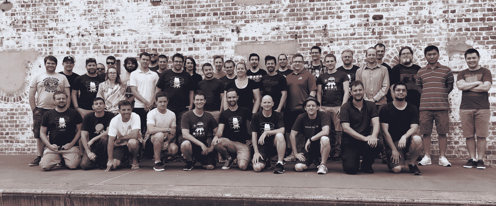
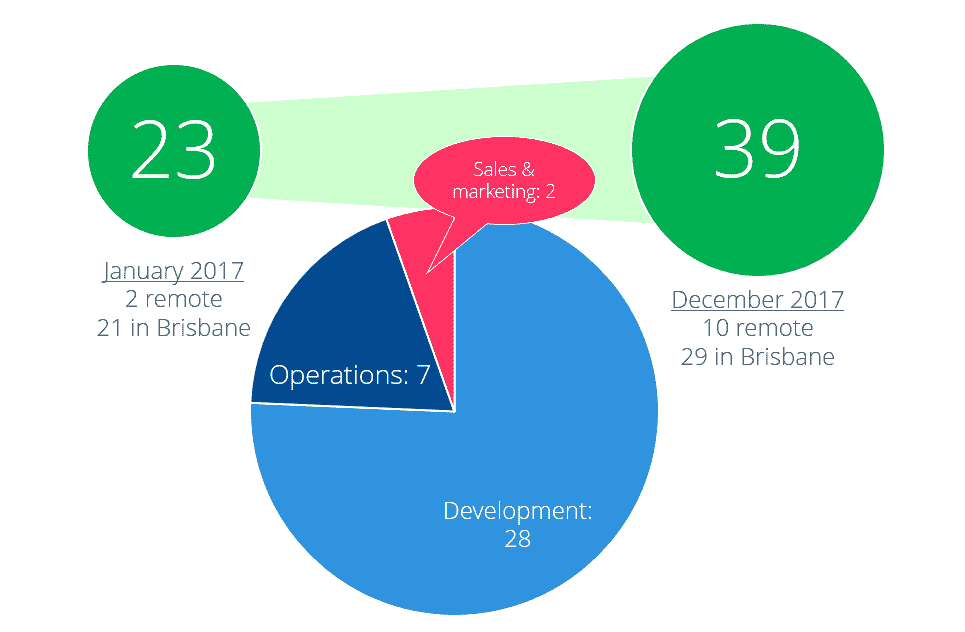
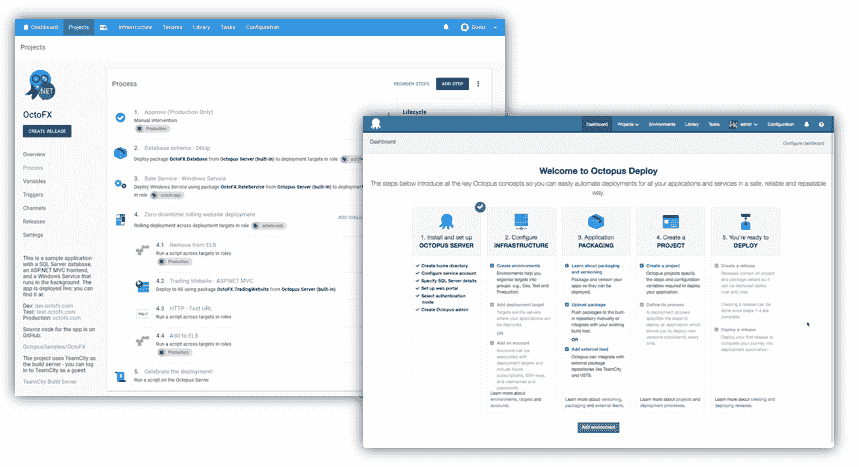
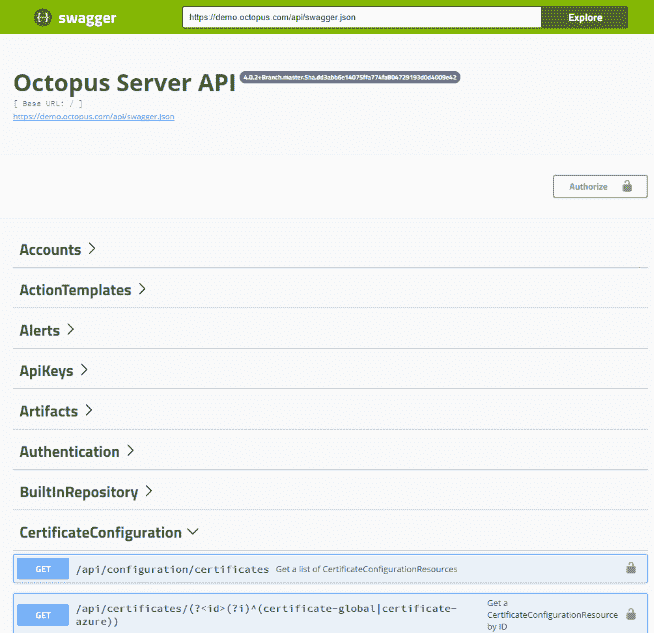

# 反思 2017 -八达通部署

> 原文：<https://octopus.com/blog/reflections-2017>

2017 年 1 月，我概述了我们 2017 年的[产品路线图。随着 2017 年的到来，我想花些时间反思一下我们这一年的进展。这篇文章不仅仅是关于路线图，我还想给你一些关于 Octopus 公司的见解，以及我们在过去的一年里是如何成长的，并分享我们所面临的一些挑战。](https://octopus.com/blog/roadmap-2017)

## 开始

我们每年都以“启动”活动开始，2017 年在我们位于布里斯班的办公室举行。当时我们有 23 个人(布里斯班 21 人，阿根廷的达尔米罗和墨尔本的马特·理查森)。我们利用启动活动，试图让今年的每个人都站在同一立场上。今年我们开始了一些新的尝试:

*   一年的路线图(以前，我们是边走边制定的)
*   今年的一些目标和 KPI
*   我们将公司分成团队，给每个团队一个产品领域

## 壮大团队

我们在年中做出的一个决定是从澳大利亚的其他城市招聘员工。Octopus 的大多数人在家工作，但我们在布里斯班有一个办公室，每周使用一两天。许多对话发生在办公室，我们担心远程人员会感到被冷落。我们进行了一项实验，将办公室锁了几个星期，实验进行得很顺利。

结果是，在整个 2017 年，我们能够雇用大量非常聪明和专业的人，其中许多人不在布里斯班。这是我们 2018 年启动活动的照片，大家都在一起。能和如此出色的一群人一起工作，我感到非常自豪。

如果你很好奇，以下是这些角色的划分。

正如你所看到的，Octopus 是一家非常注重工程的公司——39 人中只有两人不在产品开发、设计、运营或支持领域工作。那是一个深思熟虑的选择；我们相信，通过专注于打造一款优秀的产品并为其提供良好的支持，我们可以打造并销售一款世界级的产品。我们能否在 2018 年保持这种状态还不清楚。

## 每月功能发布

2017 年 4 月，我们推出了另一项变革——我们开始发布月度功能发布。以前，我们会在新特性和错误修复准备好的时候发布，没有真正的计划。从四月份开始，我们改变了计划发布的方式:

*   一个月一次的功能发布(主要/次要-例如，4.1)。其中包含新的功能和改进。我们在博客、时事通讯等等上制造一些噪音。
*   错误修复和微小改进(例如 4.1.1、4.1.2)。我们这个月会发布多个版本。

对于客户来说，这似乎通常非常有效。你知道每个月都会发布一个版本，并且可以围绕这个版本计划 Octopus 服务器的升级。您知道您可以忽略大多数 bug 修复版本，除非某个特定的 bug 影响到您，或者您使用的是主/次版本。对我们来说，它使得计划、记录和测试发布变得更加容易。

## 路线图进展

在 [2017 年路线图](https://octopus.com/blog/roadmap-2017)中，我列出了我们计划要做的许多事情。正如你所料，我们对什么是重要的想法在一年中不断变化，不幸的是，我们没有完成清单上的所有事情。下面是我们所取得的一些进展。

### 用户之声

我说过我们会努力解决超过 200 票的所有用户意见建议。以下是我写这篇文章时的列表，以及我们是否实现了它。

总的来说，13 个中有 7 个完成了。那些没有完成的项目，通常要么不完全清楚，要么是我们认为在未来会被另一个更大的变化淘汰的东西。

### 章鱼行动

在 2017 年的路线图中，我说过我们将在 Octopus 中构建一流的运营功能。

> Octopus 仪表板显示您的最后一次生产部署是否成功。如果它还向您显示您部署的内容是否仍在运行，那会怎么样？...不过，它不仅仅局限于监视状态:您还可以启动/停止这些服务。您昨天部署到 30 台机器上的 Windows 服务在其中 7 台机器上突然崩溃了吗？没问题，只需点击按钮，选择你想重启的 7，点击执行按钮。肯定胜过使用远程桌面！另外，会有很好的审计记录。

遗憾的是，2017 年我们在这方面没有取得任何进展。当我们为 2017 年划分团队时，这支团队落在中间，没有团队真正拥有它，也没有人支持它。

2018 年，我们将重点关注这一点，但这是另一篇文章的主题。

### 章鱼 Slack 应用

在 2017 年的路线图中，我们计划通过 Slack 为 Octopus 打造一流的“ChatOps”体验。机器人在 2017 年风靡一时，我们在内部使用一个机器人来部署 Octopus。不幸的是，它又没有主人，所以就被搁置了。

### 新的步骤生成器和更多的 IIS 选项

在 2017 年路线图中，我们计划对我们呈现部署步骤的方式进行一些更改:

> 对于配置 Windows 服务之类的东西的部署步骤，无论如何只有少数几个选项。但是有些步骤，比如配置 IIS 的步骤，可能有数百种不同的设置需要设置。目前，这意味着我们只公开最常见的设置，您必须编写 PowerShell 来完成其余的工作。

我认为我们基本上做到了这一点。我们在 4.0 中彻底检查了用户界面并压缩了设置——这允许我们为步骤提供更多的选项。我们在这一年中确实增加了 IIS 的选项数量，包括支持证书和许多其他设置，但您仍然需要 PowerShell 来进行更高级的设置。

### 降低学习曲线

我们在这方面取得了坚实的进展，部分是因为我们在今年早些时候添加了新的入职指南，然后是 4.0 版的 UI 改进。

现有客户可能不会直接从中受益，但它通过使这些组织中的新团队更容易开始工作，间接帮助了许多更大的客户。

### 单一自由 Linux (SSH)部署

我们在这里也取得了良好的进展。八月份，我们在 SSH 目标中增加了不需要 Mono 的选项。只要我们知道您运行的是什么平台，我们就将一个. NET 核心版本的 Calamari(我们的部署运行程序)推送到机器上，并在不依赖 Mono 的情况下运行部署。我们的目标是淘汰单一方法，支持。网芯模型。

不幸的是，除了计划之外，到目前为止我们还没有在这方面取得任何进展。

### “炫耀”我们的 API

Swagger 是在 9 月份加入章鱼的。请转到

### 更紧密的 AWS 集成

我们在 2017 年很晚才开始这项工作，预计很快就会提供一些初步支持。看好这个空间！

### PaaS 章鱼

这是一个大项目，我们发现自己推迟了这个项目，等待其他事情，并且基本上说服自己在 2017 年的大部分时间里不要开始。我说服自己，我们不能开始这个项目，直到这个项目完成，或者其他项目，或者一些大的架构变化，等等。本质上，我们不得不吃掉一头大象，但却迟迟不咬第一口。

几个月前，我们意识到我们在这个问题上的拖延让一些潜在客户转向了 VSTS(稍后会有更多相关内容)。我们没有过度考虑它，也没有在这个过程中重新设计 Octopus，而是专注于构建尽可能接近本地 Octopus 的东西，价格合理，并且我们可以可靠地托管。一旦交付，我们就可以找到以后对其进行云优化的方法。

## 非路线图进展

我们还在一些与路线图没有直接关系的领域取得了进展。

### 前端重构-角度反应

Octopus 4.0 是一次彻底的 UI 革新，因为我们将其从老化的 AngularJS (1.0) UI 转换为 React。我们在 4 月/5 月份和一个较小的团队一起认真地开始了它，直到 11 月初才发布——那时公司一半的开发人员都参与了它。

这是一个受霍夫斯塔德定律支配的项目:

> 霍夫施塔特定律:它总是比你预期的要长，即使你考虑到霍夫施塔特定律。

经营一家软件公司，我最喜欢的事情之一就是“说到做到”。作为一名顾问，我经常建议是时候重写这个或那个了。除了简单的“我们认为从长远来看，这将使产品变得更好”之外，很难指出一个特殊的“商业原因”来让我们在大约半年的时间里投入一半的开发时间，或者证明这个决定是正确的。

在 Octopus，我们过去已经这样做了几次:

*   Octopus 1.0:从 SQL Server (EF)切换到 RavenDB。
*   Octopus 2.0:重写了 UI(ASP.NET MVC 到 AngularJS 1.0)，重写了服务器/触手通信栈
*   Octopus 3.0:从 RavenDB 回到 SQL Server，再次重写了通信栈

每一个都被证明是很好的投资，极大地改进了产品，即使 6 个月后你开始担心这是一个巨大的时间和金钱的浪费，并且有很高的机会成本。祈祷它会再次为我们工作！

### Java 语言(一种计算机语言，尤用于创建网站)

在 2017 年初，我并没有计划让 Octopus 在 Java(或者非 Java)方面做太多。NET 支持)，但这种情况在大约 6 个月前发生了变化。2017 年，我们:

*   为 Atlassian Bamboo 构建了一个插件
*   向 Octopus 添加了许多 Java 部署步骤
*   (4.1)增加了对 Java 部署的 Maven 提要和证书支持

### 稳定性

这不像其他主题那样令人兴奋，但我们在 2017 年初的大部分注意力都放在了稳定性上。我们修复了大量小错误和问题，并做了一些大的性能改进和安全增强。

## 业务进展

暂时离开产品，我想反思一下 Octopus Deploy 在 2017 年作为一项业务取得的进展，以及我们面临的一些挑战。如果你主要关注这个博客的技术/产品内容，这可能不是很有趣，但它可能会给你一些背景，帮助你理解我们迄今为止的决定。

八达通是私有的，盈利的，自从我在 2012 年开始运营以来，它已经有了显著的增长。我们已经从一个在业余时间开发的简单部署工具发展成为一个拥有 39 人的公司。我不认为说 Octopus 是最流行的部署自动化工具是误导。我们知道，今天大约有 20，000 家公司在线安装了 Octopus 服务器，这些 Octopus 服务器每年要向数十万个部署目标进行数百万次部署。

今年我们庆祝了许多成功。根据 BRW 快速 100 强排名(t 1)，八达通是过去三年中增长最快的第三大公司。在报纸上看到章鱼真是太棒了——我们把复印件寄给了亲戚，他们中的大多数人仍然不确定章鱼到底是什么。

我们今年的挑战分为两大类:内部和外部。

就内部挑战而言，这些主要与我们在成长过程中如何组织和规划有关。随着公司的发展，我们的雄心也在增长。今年我们有四个非常大的项目:

其中大多数是如此之大，以至于我们让他们自己相信他们是相互依赖的。在我们做出大的架构改变之前，我们不应该启动云托管的 Octopus。在我们完成 UI 重构之前，我们不应该开始远程发布促销。架构的改变也应该等待 UI 重构。

我学到的一点是，当我们专注于较小的项目，以敏捷、迭代的方式一点一点地改进产品时，我们在 Octopus 处于最佳状态。这就是我们如何做入职工作，这就是我们如何添加 Java 支持。当涉及到像这样的大项目时，我们往往会随波逐流，迷失方向，结果浪费了很多时间。在前几年，我们甚至可能没有尝试过这样的项目；在 2017 年，我们相信我们可以做到，但似乎我们还没有完全做到。

我们在 2017 年面临的最大外部挑战来自微软和 VSTS 发布管理产品。虽然我认为 Octopus 在复杂部署方面仍然远远领先于 RM，但 RM 在更简单的 Azure 密集型部署方面显然正在赶上我们。就产品创新而言，我们已经享受到了竞争，VSTS 已经提供了一个可靠的云产品，但我们在这方面的发展太慢了。

今年更困难的是，微软已经开始利用其生态系统的其他部分来支持 RM。RM 现在基本上是免费的，他们在 Visual Studio 中捆绑了一个右键单击的“配置连续交付”选项。在这样一个以微软为中心的生态系统中，内置于 TFS、免费和内部推广的组合让 Octopus 处于明显的劣势。一个 800 磅的人。大猩猩坐？俗话说，“随心所欲”。

我们将在 2018 年继续与微软竞争，我们将共同推动整个行业向前发展，但如果你看到我们像在一样关注 Java/AWS，请不要感到惊讶。NET/Azure。

## 包裹

2017 年，章鱼大幅增长。我们改进并成熟了我们内部的工作方式，并且沿着我们的路线图取得了相当不错的进展。我们花了很多时间来重写 UI，这在下半年减慢了我们的速度，我们看到来自微软的竞争加剧，这对底线产生了真正的影响。

如果你对 Octopus 更多幕后的东西感兴趣，尤其是技术内容，请订阅我们的 YouTube 频道。每周我们都会发布内部全体会议的视频，展示我们一直在做的工作。

在我的下一篇文章中，我将分享我们的 2018 年路线图。愉快的部署！