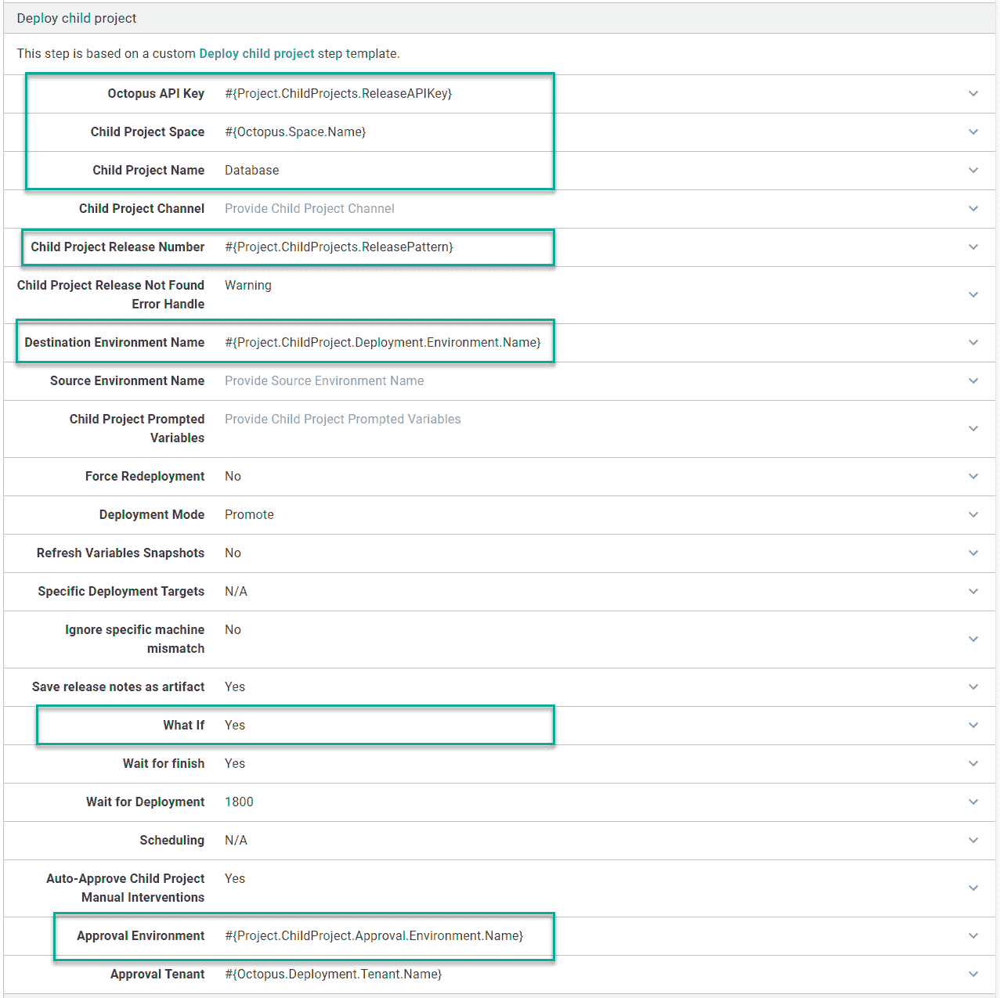
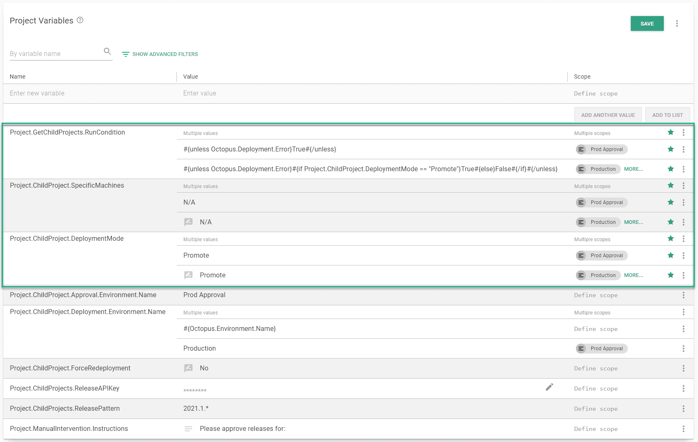
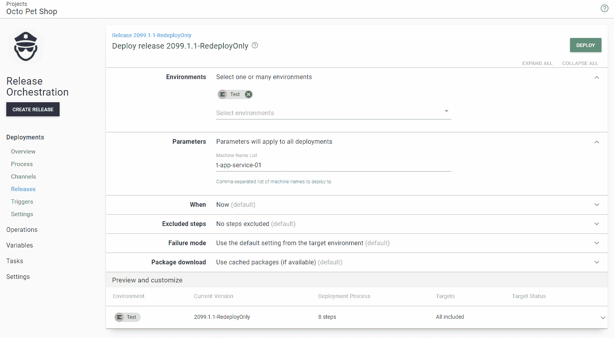

# 动态基础设施发布管理- Octopus Deploy

> 原文：<https://octopus.com/blog/release-management-with-dynamic-infrastructure>

[](#)

在这篇文章中，我将讨论动态基础设施的发布管理，并演示如何使用 [Deploy 子 Octopus Deploy Project](https://library.octopus.com/step-templates/0dac2fe6-91d5-4c05-bdfb-1b97adf1e12e/actiontemplate-deploy-child-octopus-deploy-project) 步骤模板。

这是关于发布管理系列的第三篇文章。之前的帖子有:

## 发布管理和动态基础设施

在阅读了我的第一篇文章后，一位客户问我如何使用我的步骤来重新部署一套应用程序组件，而不是从一个环境向另一个环境进行 T2 升级。在编写步骤模板时，我没有考虑到这一点，但我应该考虑到了。

客户定期重建他们的测试服务器，经过一番讨论后，我们确定了这些需求:

*   重新部署在目标环境中找到的最后一个成功版本。
*   重建的服务器不应该托管所有组件，只运行适用的子项目。
*   同一个项目应该同时进行重新部署和升级。
*   刚开始手动输入目标名称还行；稍后，部署目标触发器应该会自动重新部署。

## 子项目目标筛选器

并非所有应用程序都托管在一个部署目标上。考虑这个用于暂存的示例:

*   **数据库**:没有目标，只有工人
*   **调度服务** : `s-app-service-01`
*   **Web API** : `s-web-api-01`和`s-web-api-02`
*   **网页界面** : `s-web-ui-01`和`s-web-ui-02`

为了重新构建`s-web-api-01`和`s-app-service-01`，我只想重新部署**调度服务**和 **Web API** 项目。但是只针对相关的项目/服务器组合。我不想部署**调度服务**到`s-web-api-01`或者 **Web API** 到`s-app-service-01`。

使用[部署子 Octopus 部署项目步骤模板](https://library.octopus.com/step-templates/0dac2fe6-91d5-4c05-bdfb-1b97adf1e12e/actiontemplate-deploy-child-octopus-deploy-project)的一个目的是*能够正常工作*。在推广/部署应用程序套件时，我希望尽可能消除心理压力。

这个目标适用于这种情况。当父/发布编排项目被给予一组特定的要部署的机器时，它会将该列表与子项目可以部署到的机器进行比较。使用相同的场景:

*   **数据库**:无目标；项目被跳过。
*   **调度服务**:仅部署到`s-app-service-01`。在重新部署子项目之前，它将从目标列表中删除`s-web-api-01`。
*   **Web API** :仅部署到`s-web-api-01`和`s-web-api-02`。它会将`s-app-service-01`从目标列表中移除，只在重新部署时部署到`s-web-api-01`。
*   **Web UI** :两个重建的服务器与此项目部署到的任何服务器都不匹配。将跳过 Web UI 项目。

该功能支持多租户。在为多租户子项目筛选部署目标时，它会为该租户筛选出所有不相关的目标。

## 部署模式

步骤模板已更新，支持两种部署模式:

*   **Promote** :默认行为将最新的成功发布从源环境提升到目标环境。
*   **重新部署**:获取在目标环境中找到的最新成功发布，并重新部署它。

虽然我不想再增加一个参数，但是我找不到其他的解决方法。边缘案例太多了。让你选择模式更有意义。

该功能也是多租户感知的；如果您正在重新部署一个多租户项目，它会在目标环境中找到该租户的最新成功版本。

我建议将其设置为一个[提示变量](https://octopus.com/docs/projects/variables/prompted-variables)，默认设置为**提升**。这允许您动态地更改父/发布编排项目的行为。

## 例子

对于这篇文章，我将转换我在这个系列的第一篇文章中创建的项目。项目完成后，将:

*   在**开发**、**测试**、**试运行**和**生产**中重新部署最新版本。
*   重新部署到特定目标或所有目标。
*   配置一个部署目标触发器来处理自动伸缩。
*   允许发布到**暂存**和**生产**以进行重新部署或升级。

当我们完成第一篇文章时，我们有一个发布协调项目，部署到**筹备**、**产品批准**和**生产**。

[](#)

部署流程将:

1.  确定要推广的版本，并收集每个子项目的所有发行说明。
2.  批准要升级的版本(仅限于**产品批准**环境)。
3.  将子项目发布从**测试**提升到**试运行**，或者从**试运行**提升到**生产**。

[](#)

[部署子 Octopus 部署项目步骤模板](https://library.octopus.com/step-templates/0dac2fe6-91d5-4c05-bdfb-1b97adf1e12e/actiontemplate-deploy-child-octopus-deploy-project)设置了以下参数:

[](#)

每个步骤之间的唯一区别是:

*   在所有**获取【子项目名称】释放**步骤中，`What if`参数被设置为`Yes`。
*   每个步骤的子项目名称都不同。

如您所见，这个过程大量使用了变量。这些变量定义是:

[T32](#)

## 场景#1:手动重新部署

一个发布通常会从**测试**升级到**试运行**，或者从**试运行**升级到**生产**。不过在某些场景中，重新部署**准备**或**生产**中的内容也是有意义的。

例如:

*   在**暂存**环境刷新期间，当数据从**生产**复制并清理到**暂存**时。完成后，进行重新部署以确保最新的数据库和代码更改在**暂存**中。
*   在**生产**中添加了一台新的服务器来处理流量的增加。
*   一个服务器没有像预期的那样响应，需要被淘汰。

### 变量

我将更新我的变量，以便流程:

*   仅允许在**产品批准**中促销。
*   允许通过**暂存**和**生产**中的提示变量进行重新部署和升级。
*   允许用户通过**准备**和**生产**的提示变量选择他们想要重新部署的机器。**产品批准**不允许该功能。
*   创建一个变量，用作**获取[组件]释放**步骤的运行条件。当处于提升模式时，它将返回`True`(该步骤将运行)。在重新部署模式下，它将返回`False`(该步骤将被跳过)。

[](#)

特定的机器变量被设置为`N/A`，因为这是步骤模板的默认值。步骤模板会看到这一点，并忽略特定的机器功能。值`N/A`应该使提示变量更容易。

### 部署流程

在所有的 **Get [component]发布步骤**中，我更新了部署模式、特定的机器和运行条件，以使用新创建的变量。

[](#)

对于部署步骤，仅更新部署模式和特定机器参数。

[](#)

### 创建发布

创建发布到**准备**、**生产审批**和**生产**与之前相同。

[](#)

大多数情况下，用户会保持提示变量不变，然后进行推广。

[](#)

它将一如既往地继续发挥作用。

[](#)

### 触发重新部署

您也可以选择通过将提示变量更改为 redeploy 来进行重新部署。

[](#)

这触发了在**试生产**或**生产**中发布的重新部署。

[](#)

如果该版本已经部署到特定的环境中，您可以单击右上角菜单中的溢出菜单(三个垂直省略号点),并选择**重新部署...**。

[](#)

### 重新部署到特定计算机

您也可以选择重新部署到特定的计算机。

[](#)

当部署运行时，步骤模板将跳过与所选机器不关联的任何项目。

[](#)

## 场景#2:向外扩展时自动重新部署

第一个场景包括手动选择部署目标。您还可以利用部署目标触发器来利用这一功能。

创建新的部署目标时，您可以自动部署与该目标关联的所有内容。要做到这一点，我们需要对变量和部署过程做一个小的修改。

### 可变变化

在我的场景中，我希望支持手动和自动重新部署。支持这两种模式仍然需要一个提示变量，但是默认值将更改为:

```
#{unless Octopus.Deployment.Trigger.Name}Promote#{else}Redeploy#{/unless} 
```

这表明当除部署目标触发器之外的任何东西触发部署时，则运行促销。如果触发部署的是部署目标触发器，则运行重新部署。提示变量最终看起来像这样:

[](#)

### 创建触发器

为所有不同的组件项目、`App-Service`、`App-WebApi`和`App-WebUI`的角色创建一个触发器。可以在每个组件项目中添加一个触发器，但是这是额外的开销和维护。对于发布协调项目，最好有一个触发器。

[](#)

### 部署流程修改

触发器和现有的部署过程有一个问题，我将对此进行解释。我还演示了如何避免这个问题。

首先，我为 **Staging** 中的一个角色添加了一个新目标。

[](#)

触发器永远不会触发，因为发布编排项目没有任何专门针对这些角色的步骤。您可以在部署屏幕上看到它。没有目标。

[](#)

解决方案是添加一个针对所有这些角色的简单脚本步骤。

[](#)

### 测试触发器

现在，当我们准备好部署一个版本时，我们可以看到脚本将在其上运行的所有部署目标。

[](#)

当我将新机器添加到暂存时，触发器将被触发。它将跳过新机器不会部署到的项目，就像我们手动选择部署目标时一样。

[](#)

它也只会将特定机器发送到组件项目。

[](#)

## 场景#3:使用构建服务器进行重新部署

最后一个场景是当外部工具(比如构建服务器)触发所有组件项目的部署时。

在这个例子中，构建服务器自动触发部署到**开发**和**测试**。虽然这适用于代码更改，但当新服务器上线时，它有一些限制:

*   对于每个组件一个 Octopus 项目，构建服务器一次只更新一个组件。您需要一种一次性部署所有项目的方法。
*   当前没有工作的项目永远不会触发部署。当新服务器上线时，需要一种机制来重新部署一切。

我们不想改变构建服务器集成。取而代之的是，我们更新了现有的流程，只允许为**开发**和**测试**重新部署发布。

### 创建新的生命周期

项目的当前生命周期仅允许部署到**准备**、**生产审批**和**生产**。在这种情况下，我希望保留那个生命周期并创建一个新的生命周期。

发布协调项目将在大部分时间用于从**测试**到**试运行**和**试运行**到**生产**的推广。重新部署到**开发**和**测试**是例外，而不是常态。

您可能会发现将**开发**和**测试**添加到您的生命周期并将其标记为可选更容易。

现在创建新的生命周期，并将其配置为部署到**开发**和**测试**:

[](#)

创建生命周期后，我们可以向项目添加一个通道:

[](#)

最后，将**离散通道发布**项目设置更新为**独立于其他通道**处理。

[T31](#)

### 更新变量

我将变量更新为:

*   仅允许在**开发**和**测试**中重新部署。
*   允许用户通过**开发**和**测试**的提示变量选择他们想要重新部署到的机器，就像他们在**准备**和**生产**中一样。**产品批准**保持不变，不允许该功能。

[](#)

特定机器变量被设置为 **N/A** ，因为它是步骤模板的默认值。步骤模板会看到这一点，并忽略特定的机器功能。它被设置为一个值，以便于提示变量。

### 仅发布用于重新部署

对于**开发**和**测试**环境，我创建了一个只重新部署的版本。步骤模板忽略版本过滤器，并重新部署最新版本。这意味着我可以输入任何我想要的版本号。

[](#)

### 部署仅重新部署版本

当我在提示变量中指定一个机器名时，按照下面的截图，step 模板将其转换成适当的 Octopus ID，然后确保子项目可以部署到任何指定的机器上。

[](#)

如果是这样，将会触发部署，但只是针对该计算机。如果没有，将跳过部署。

[](#)

如果我没有指定一台机器，那么重新部署将部署到该环境中子项目的所有机器上。

[](#)

## 结论

当我开始编写步骤模板[Deploy Child Octopus Deploy Project](https://library.octopus.com/step-templates/0dac2fe6-91d5-4c05-bdfb-1b97adf1e12e/actiontemplate-deploy-child-octopus-deploy-project)时，我的目标是帮助从一个环境升级到另一个环境。在收到反馈后，我意识到支持一套应用程序组件的重新部署也是有用的。

我希望通过对您的部署过程进行一些修改，您可以利用这种重新部署功能。

愉快的部署！