# 通过 Octopus Deploy 实现更好的发布管理

> 原文：<https://octopus.com/blog/release-management-with-octopus>

[](#)

客户经常问我们，他们是应该为每个应用程序准备一个 Octopus 部署项目，还是为每个组件(如 WebUI、API、数据库等)准备一个 Octopus 部署项目。).对于一些项目来说，部署一两个部分是有意义的，也许是为了修复一个小的 bug，而不是一次部署所有的东西。

让 Octopus 为每个组件部署项目解决了许多问题；代价是，部署整个应用程序堆栈更加复杂。

在这篇文章中，我将介绍如何使用一个新的步骤模板 [Deploy 子 Octopus Deploy 项目](https://library.octopus.com/step-templates/0dac2fe6-91d5-4c05-bdfb-1b97adf1e12e/actiontemplate-deploy-child-octopus-deploy-project)来简化 Octopus Deploy 中的发布管理。

## 为什么每个组件一个项目

每个组件使用一个项目的常见原因是:

*   通过仅部署已更改的内容，最大限度地减少停机时间。
*   通过只构建已更改的内容来最小化构建时间。
*   尽量减少一个人必须做出的决定。
*   单一责任原则，每个项目尽其所能部署一件事。

简而言之，每个组件一个项目减少了部署软件的时间。然而，缺点是更难协调发布。

## 示例应用程序

对于本文，我使用一个包含四个组件的示例应用程序:

*   数据库ˌ资料库
*   调度服务
*   Web API
*   Web 用户界面

您可以在我们的 [samples 实例](https://samples.octopus.app/app#/Spaces-603)上找到它(作为来宾登录)。

[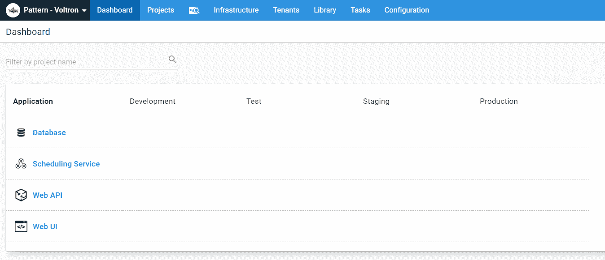](#)

每个项目的设计都允许它独立于其他项目进行部署；以至于每个项目都有自己的人工干预。

[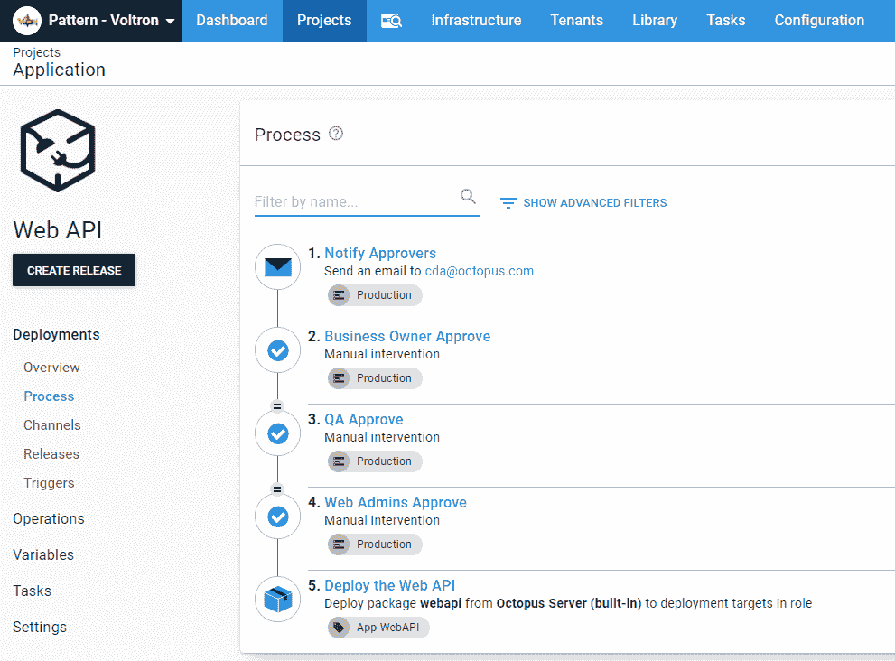](#)

本例对组件`Year.Minor.Patch.Build`或`2021.1.0.1`使用了 [SemVer](https://semver.org/) 的修改版本。编排项目将更接近标准[永远](https://semver.org)、`Year.Minor.Patch`或`2021.1.0`。

我不会花太多时间讨论源代码控制库和构建配置。这个例子应该足够灵活，可以考虑各种配置，无论是单个 git 回购/单个构建，每个组件一个 git 回购/构建，还是每个组件一个 git 回购/构建。每种方法都有优点和缺点，但是讨论它们超出了本文的范围。

对于这个例子，我们假设构建服务器将:

*   构建每个组件。
*   为该组件的项目创建一个版本。
*   自动将其部署到**开发**环境中。

当部署完成时，它将运行一批集成测试。如果测试通过，它将推动发布到**测试**。

2021 年的第一批工作将是这样的:

[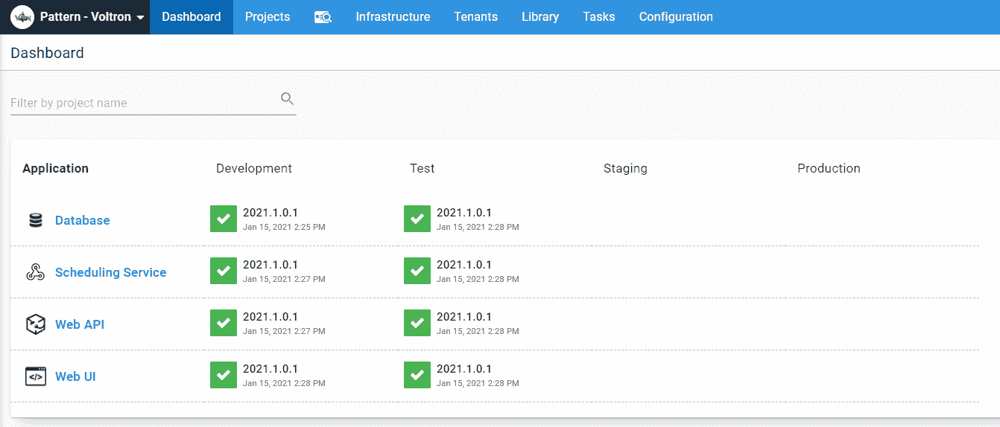](#)

## 路障

通常，在 QA 流程中，变更会在**测试**环境中停留 1 到 N 天。bug 被发现并解决，每个组件可能会有不同的内部版本号。

[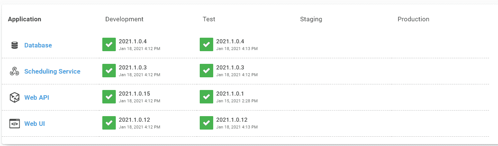](#)

在 QA 完成对`2021.1.0.x`发布的组件项目的测试后，可以开始升级到**阶段**。

对于当前的配置，这意味着一个接一个地提升每个项目的每个版本。我已经做了上百次这样的推广，虽然还可以忍受，但是很乏味。

当这种模式开始遇到问题时，将所有组件项目提升到生产阶段。其中包括:

*   如果一个组件有多个补丁被推送到**测试**，那么它可能需要至少一个补丁被推送到**测试**。通常要批准的组件项目的发布号直到批准的那天才知道。
*   所有的项目都需要质量保证部的批准。
*   多个项目需要得到网站管理员和企业所有者的批准。
*   通常，应用程序需要按照特定的顺序进行部署。首先部署数据库，然后是 API，然后是调度服务，最后是 UI。部署期间的任何问题都应该停止一切。
*   如何以及何时批准变更因公司而异。对于周四晚上的部署来说，周二发布的批准并不少见。

为了解决这些问题，我们需要一个*父项目*来协调所有这些*子项目*。与子项目不同，父项目只需要部署到**暂存**和**生产**。

## 介绍部署子 Octopus 部署项目步骤模板

父项目需要一种方法来调用子项目的部署。这由新的[部署子 Octopus 部署项目](https://library.octopus.com/step-templates/0dac2fe6-91d5-4c05-bdfb-1b97adf1e12e/actiontemplate-deploy-child-octopus-deploy-project)步骤模板处理。

在这个例子中，父项目被称为“Release Orchestration ”,并多次使用该步骤模板。

您可以为父项目选择任何您喜欢的名称，例如，“交通警察”，应用程序的名称，甚至 Voltron。

[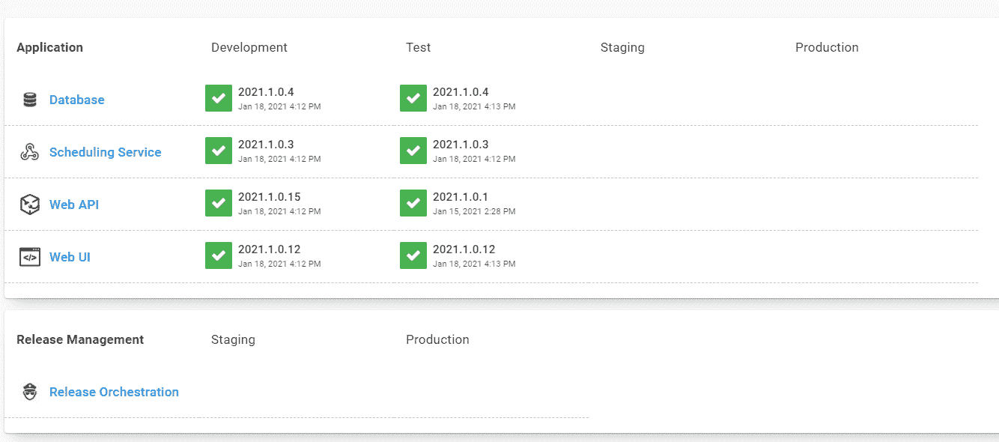](#)

在提供步骤模板的使用示例之前，我想演示一下步骤模板是如何工作的。

### 如何选择版本

父项目部署子项目还有另外两种选择:

1.  [部署发布步骤](https://octopus.com/docs/projects/coordinating-multiple-projects/deploy-release-step):Octopus Deploy 中内置的一个步骤，旨在解决特定的用例。
2.  [链部署步骤模板](https://library.octopus.com/step-templates/18392835-d50e-4ce9-9065-8e15a3c30954/actiontemplate-chain-deployment):社区步骤模板，是部署发布步骤的前身。

这两个步骤通过使用最近为通道创建的版本来选择要部署的版本。**部署子 Octopus 部署项目步骤模板**选择了不同的发布方式。

您提供:

*   频道名称。如果没有提供通道，则选择默认通道。
*   版本号模式(`2021.1.0.*`)或特定版本号(`2021.1.0.15`)。如果没有提供版本号，它将使用所能找到的该通道的最新版本。
*   目的地环境。

有了这三段数据，步骤模板将:

*   基于信道和目的地环境计算先前的环境。例如，如果您输入 **Staging** 作为目标环境，它将选择 **Test** ，因为它是渠道生命周期中 **Staging** 的优先环境。
*   查找所有与该渠道提供的模式相匹配的版本。
*   查找上次成功部署到先前环境的版本；不是部署到先前环境的最近创建的版本，而是最后一个*成功*部署的版本。例如，如果您将`2021.1.0.15`部署到**测试**，然后意识到不应该推送发布，并将`2021.1.0.14`重新部署到**测试**，那么当它升级到**登台**时，步骤模板将选择`2021.1.0.14`，因为那是部署到**测试**的最后一个发布。

如果没有找到发布，它将退出该步骤，并进入部署流程的下一步。

例如，在将`2021.1.0`升级到**生产**后不久，报告了一个错误，需要修复 Web API 和 Web UI 项目。您为子项目创建带有`2021.1.1.*`模式的`2021.1.1`版本。数据库和调度服务项目没有匹配的版本，因为它们没有更新，所以被跳过。

[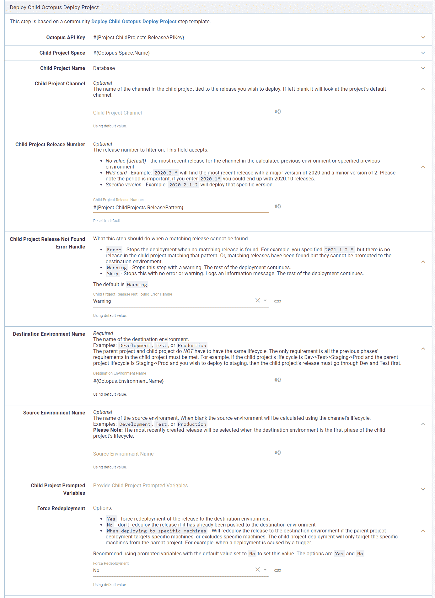](#)

这个步骤模板的基本设计规则之一是定制。例如，您可以将该步骤配置为在没有找到发布时抛出错误，而不是退出该步骤并继续。

步骤模板还检查所选版本是否已经部署到目标环境，如果已经部署，则跳过部署。但是，您可以将其配置为始终重新部署。

### 更轻松的审批

当涉及到父/子项目关系时，批准似乎是最有问题的。

在 Octopus Deploy 中，[手动干预步骤](https://octopus.com/docs/deployment-process/steps/manual-intervention-and-approvals)负责批准。您应该注意到，在这个步骤中，部署必须开始才能获得批准。但通常情况下，批准过程发生在发布前几个小时或几天。

此外，子项目有自己的批准来处理只部署一个子项目的用例。一般来说，批准者喜欢一次批准一个发布，而不是针对每个子项目。当他们批准一个版本时，将所有相关的发布信息放在一个地方进行批准是非常有用的。

步骤模板通过提供假设标志来帮助批准过程，假设标志在开始部署之前退出步骤。当使用该标志时，步骤模板将填充手动干预步骤指令的输出变量`ReleaseToPromote`。

step 模板还将收集每个子项目的发布说明，并填充输出变量`ReleaseNotes`。如果您使用的是 Octopus 中的构建信息和发布跟踪特性，step 模板将收集发布的提交和发布信息，其中包括汇总的发布说明。您可以将发行说明保存为工件，以便于批准者和后来的审计者在一个地方审查部署。

[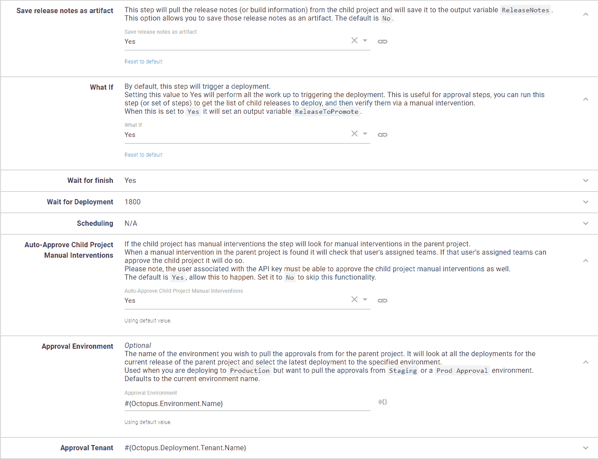](#)

工作原理:

*   步骤模板将获取父项目发布的所有部署。然后，它将根据所需的环境过滤该列表。默认情况下，它将使用当前部署的环境，但是您可以提供不同的环境，例如， **Staging** 或 **Prod Approval** 来获取批准信息。
*   步骤模板从选定的部署中提取所有批准者。
*   步骤模板存储批准者及其团队成员。
*   当步骤模板等待部署完成时，它将寻找手动干预。
*   当在子项目的部署过程中发生手动干预时，它将查看哪个(哪些)团队有批准它的权限。
*   它会将手动干预团队列表与其之前为用户创建的列表进行比较。如果找到匹配，步骤模板将提交批准。

这个步骤模板使用 Octopus Deploy API，并且需要一个 API 密钥。这个特定的功能基于附加到 API 密钥的用户提交批准。

当此步骤模板批准子项目的手动干预时，您将看到类似以下内容的消息:

[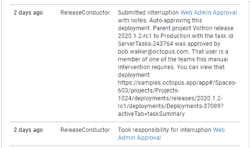](#)

### 发布计划

在实际部署前几小时或几天获得**生产**部署的批准是很常见的。审批流程的一部分是安排停机时间。根据您的应用程序，子项目的部署顺序可能是不必要的，只要它们在几分钟内部署完毕。

步骤模板支持这种用例，允许您将未来的时间和/或日期作为参数发送。它使用。NET 的[日期时间。TryParse](https://docs.microsoft.com/en-us/dotnet/api/system.datetime.tryparse) 解析日期。支持的格式包括:

*   `7:00 PM`将于今天晚上 7 点部署
*   `21:00`将于今天 21:00 或晚上 9 点部署
*   `YYYY-MM-DD HH:mm:ss`或`2021-01-14 21:00:00`将于 2021 年 1 月 14 日晚 9 点部署
*   `YYYY/MM/DD HH:mm:ss`或`2021/03/20 22:00:00`将于 2021 年 3 月 20 日晚上 10 点部署
*   `MM/DD/YYYY HH:mm:ss`或`06/25/2021 19:00:00`将于 2021 年 6 月 25 日晚 7 点部署
*   `DD MMM YYYY HH:mm:ss`或`01 Jan 2021 18:00:00`将于 2021 年 1 月 1 日下午 6 点部署

您可以利用[提示变量](https://octopus.com/docs/projects/variables/prompted-variables)让用户在部署到**生产**时发送一个日期/时间。

[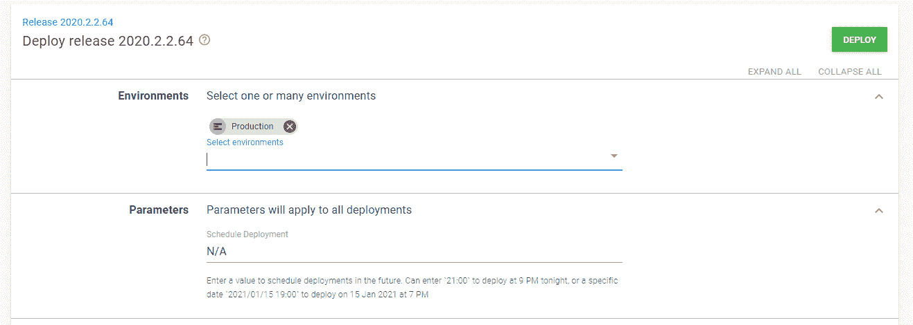](#)

在其他情况下，您可以批准一个版本，然后安排它在以后进行部署。请参阅本文后面的[场景:今天批准明天部署](#approve-today-deploy-tomorrow)一节，了解如何利用**产品批准**环境。

### 因素

在设计这个步骤模板时，我试图让用户容易地调整它来匹配他们的用例。一些用户会发现自动批准功能很有用，并立即实施，而其他用户的业务规则不允许该功能。这是可以理解的。

我已经尝试添加尽可能多的参数来调整步骤模板，以匹配您的用例。可以想象，这个步骤模板中有很多参数:

*   **Octopus API Key** :使用自动批准功能时，有权部署和批准人工干预的用户的 API Key。
*   **Octopus 子空间**:子项目所在空间的名称。默认为当前空间。除非有令人信服的理由，否则不要更改这一点。
*   **子项目名称**:子项目的名称。
*   **子项目通道**:特定通道的名称。如果留空，它将选择子项目的默认通道。
*   **子项目发布号**:要部署的发布号。默认值为空；它将在源环境中获取最新版本。您可以提供一个特定的数字，例如`2021.1.0.14`或一个模式，例如`2021.1.1.*`。`.*`很重要。如果没有提供周期`.`，你可能会以从`2021.1.10.x`或`2021.1.15.x`发布结束。
*   **未找到子项目发布错误句柄**:如果子项目没有匹配的发布号，该步骤应该做什么。默认情况下，它会跳过这一步并记录一个警告。您可以将其更改为停止出现错误的部署，或者不记录警告。我建议把它作为一个警告。
*   **目标环境名**:部署到的环境名，默认设置为当前环境名。我建议让它保持原样，除非你在**试运行**和**生产**之间实现一个“仅批准”的环境(稍后会有更多介绍)。
*   **源环境名称**:源环境的名称。如果留空，步骤模板将查看渠道的生命周期，确定目标环境处于哪个阶段，然后查找之前的环境。Octopus Deploy [生命周期](https://octopus.com/docs/releases/lifecycles)在一个阶段可以有 1 到 N 个环境。如果发布必须来自特定的源环境，请输入特定的环境。我建议您将此留空。
*   **子项目提示变量**:为子项目提供提示变量值。
*   **强制重新部署**:这告诉步骤模板要么重新部署一个发布，要么跳过它(如果它已经被部署的话)。如果您为父项目配置了一个部署目标触发器，那么您会希望将值更改为`When deploying to specific machines`。否则就让它保持原样。
*   **忽略特定机器不匹配**:这仅在您部署到特定机器时才会考虑，这种情况会在部署目标触发时发生。这一步将确定子项目是否与这些机器中的任何一个相关联，并在找不到匹配时退出。我建议保持现状，除非有特殊的原因需要改变。
*   **将发布说明保存为工件**:step 模板将从子项目中提取所有的发布说明和构建信息，并将其保存在输出变量`ReleaseNotes`中。部署后不容易访问输出变量。如果您想要在父项目中持久化收集的发行说明，将它设置为`Yes`。
*   **What If** :告诉步骤模板做除部署之外的所有事情。设置为`Yes`以在实际部署前批准发布。
*   **等待完成**:等待展开完成后再继续。将假设参数设置为`Yes`将导致该参数被忽略。
*   **等待部署**:步骤模板等待部署完成的最长时间。超过超时时间后，子项目的部署将被取消。如果部署在限制之前完成，它将停止等待。将该参数保持在 1800 秒(30 分钟)，除非有令人信服的理由改变它。
*   **计划**:允许您计划将来的部署。使用[日期时间。TryParse](https://docs.microsoft.com/en-us/dotnet/api/system.datetime.tryparse) 解析日期。我建议将它与一个提示变量一起使用。
*   **自动批准子项目手动干预**:这使用父项目的手动干预批准来进行子项目的手动干预。
*   **审批环境**:父项目人工干预所在环境的名称。默认为当前环境。如果您正在实施“生产批准”环境，请更改此设置。
*   **审批租户**:父项目人工干预所在租户的名称。默认为当前租户。如果您正在为单个租户实施“生产审批”环境，请更改。

## 使用部署子 Octopus 部署项目步骤模板

本节将介绍如何为不同的场景配置步骤模板。这些场景从简单开始，然后慢慢增加更多的功能。

### 脚手架

首先，需要配置一些脚手架。

#### 创建服务帐户

我们必须创建一个[服务帐户](https://octopus.com/docs/security/users-and-teams/service-accounts)，并将该帐户分配给一个团队。这是因为步骤模板使用了 Octopus Deploy API。

我建议将服务帐户命名为`Release Conductor`。

为用户创建一个 API 密钥，并将其保存在安全的位置。

[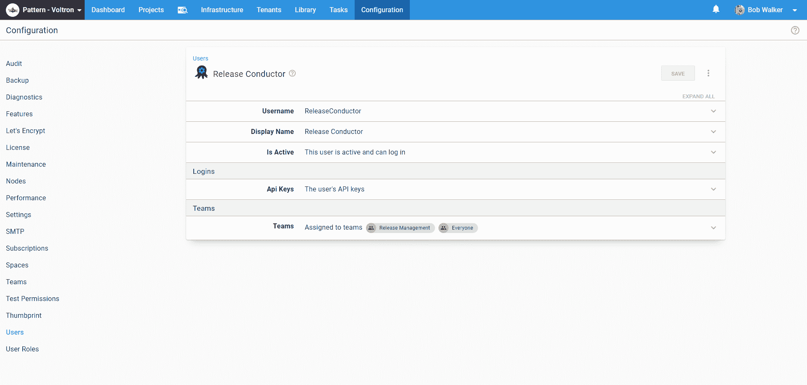](#)

创建一个名为`Release Management`的新团队，并将该用户分配给它。

[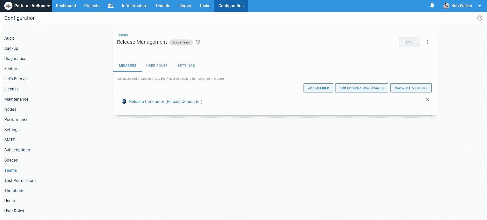](#)

给团队分配角色`Deployment Creator`、`Project Viewer`和`Environment Viewer`。分配这些角色将允许服务帐户创建部署并查看项目和环境，但不能编辑它们。

[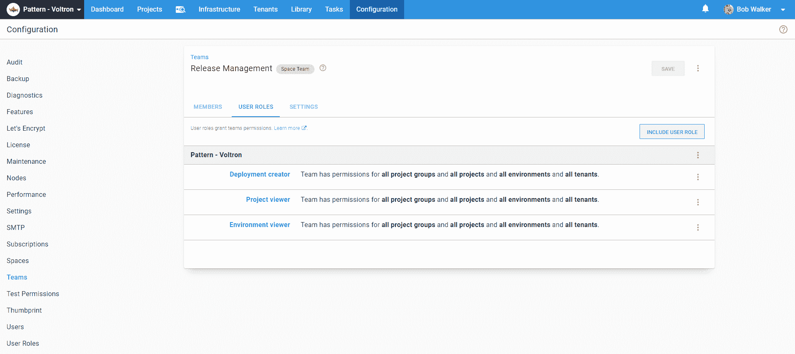](#)

如果您想要利用自动批准功能，那么在子项目中进行每个手动干预，并添加发布管理团队。

[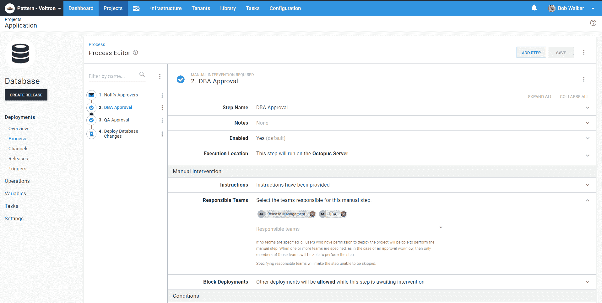](#)

#### 创造独特的生命周期

父项目只需要部署到**暂存**和**生产**。不要使用包含所有四种环境的默认生命周期。创建一个新的生命周期，只包括**准备**和**生产**。

父项目和子项目的生命周期和渠道*不需要*匹配。步骤模板将决定从子项目中选择的发布是否可以升级到目标环境。

【T2 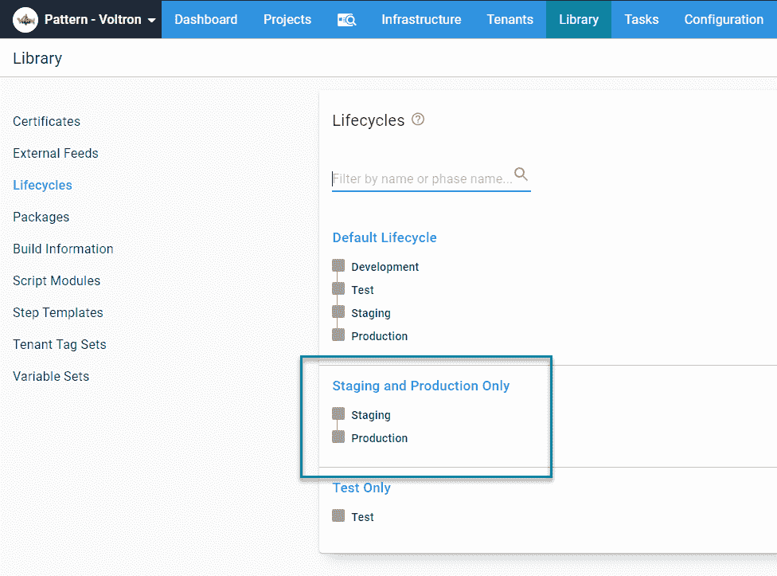

#### 创建项目

接下来，我们创建项目。创建项目时，请记住选择您在上面创建的新生命周期。

[](#)

创建项目后，导航到 variables 屏幕，添加 API 键和发布模式。

[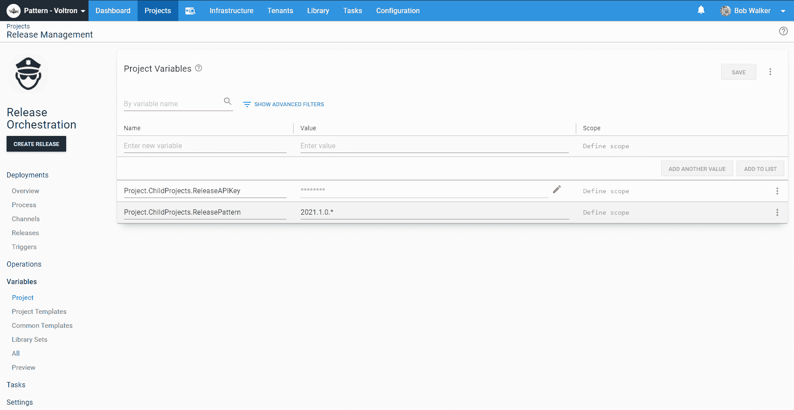](#)

### 场景:将最新版本从测试部署到试运行

在这个场景中，我们将回到示例应用程序。如果您还记得，发布`2021.1.0`已经准备好从**测试**部署到**准备**。

[](#)

转到新创建的**发布编排**项目中的部署流程，并为每个子项目添加一个`Deploy Child Octopus Deploy Project`步骤。

[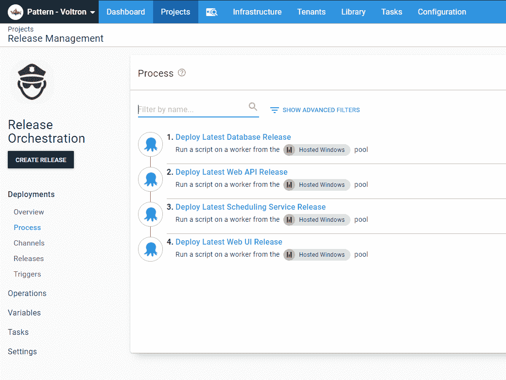](#)

您可以将参数的大部分值保留为默认值。现在只更改以下内容:

*   **Octopus API Key**:API Key 变量，`#{Project.ChildProjects.ReleaseAPIKey}`
*   **子项目名称**:子项目的名称。
*   **子项目发布号**:发布模式变量，`#{Project.ChildProjects.ReleasePattern}`

在添加和配置这些步骤之后，是时候创建一个发布了。

在本文中，我将对父项目进行许多修改；你可能会看到`2021.1.0-RCx`的版本号。

[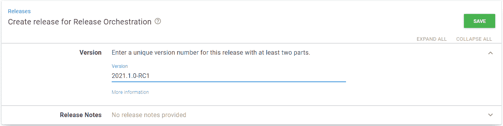](#)

等待部署完成所有子项目的部署。

[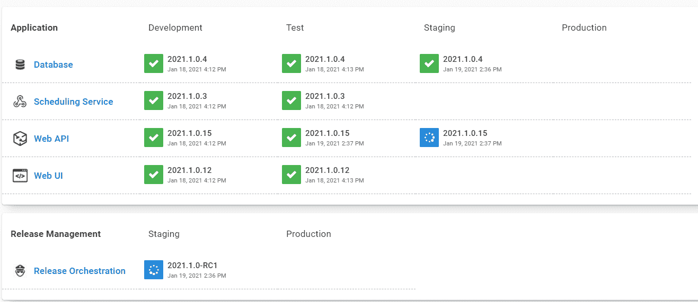](#)

### 场景:仅父项目中的审批

部署到**暂存区**非常简单，因为不需要批准。

部署到**生产**更加复杂。这个新步骤模板的一个关键特性是使用父项目的批准来自动批准子项目。

要对此进行配置，您需要克隆这四个步骤。点击每个步骤旁边的溢出菜单(三个垂直省略号)并点击**克隆**按钮，即可完成克隆。

[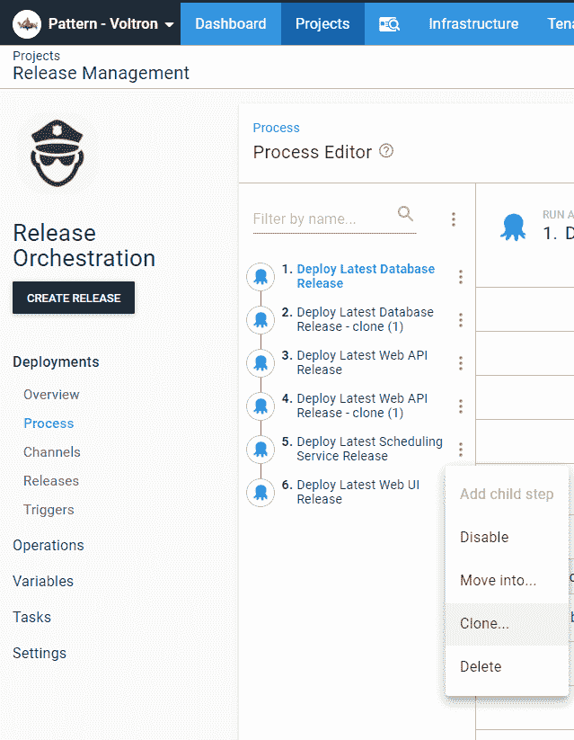](#)

重命名每个克隆的步骤。克隆步骤中的参数是:

*   **将发行说明保存为工件**:设置为`Yes`。
*   **如果**怎么办:设置为`Yes`。

最后，点击**按名称过滤**文本框旁边的溢出菜单(三个垂直省略号)重新排序步骤，并点击**重新排序**。

将所有设置为“假设”的步骤移到“非假设”步骤之上。

[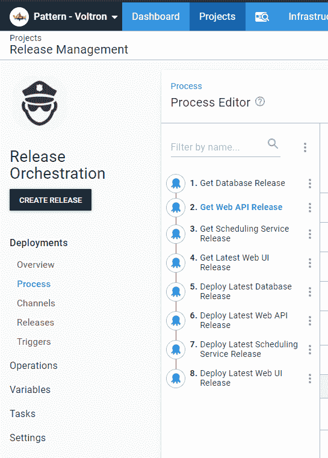](#)

接下来，添加手动干预步骤。手动干预步骤的特征之一是指令。新的步骤模板将设置我们可以访问的输出变量。例如:

```
Please approve releases for:

**Database: #{Octopus.Action[Get Database Release].Output.ReleaseToPromote}**
#{Octopus.Action[Get Database Release].Output.ReleaseNotes}

**Web API: #{Octopus.Action[Get Web API Release].Output.ReleaseToPromote}**
#{Octopus.Action[Get Web API Release].Output.ReleaseNotes}

**Scheduling Service: #{Octopus.Action[Get Scheduling Service Release].Output.ReleaseToPromote}**
#{Octopus.Action[Get Scheduling Service Release].Output.ReleaseNotes}

**Web UI: #{Octopus.Action[Get Web UI Release].Output.ReleaseToPromote}**
#{Octopus.Action[Get Web UI Release].Output.ReleaseNotes} 
```

我喜欢避免重复劳动。让我们把它作为一个变量。

[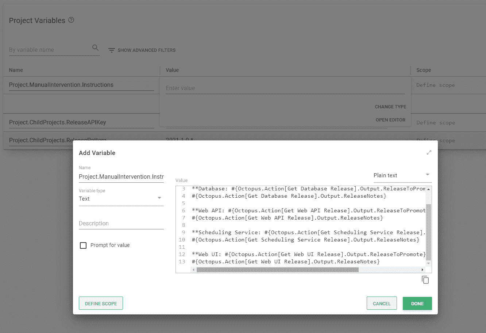](#)

现在为每个审批者组添加一个手动干预。

[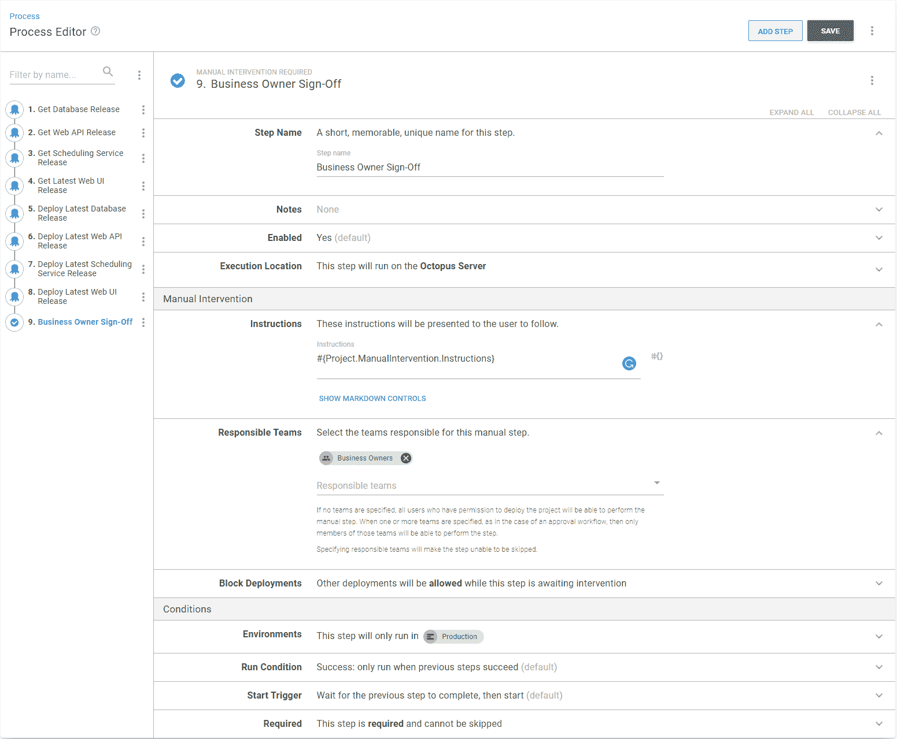](#)

再次对部署流程进行重新排序，使新步骤介于“假设”步骤和“非假设”步骤之间。

[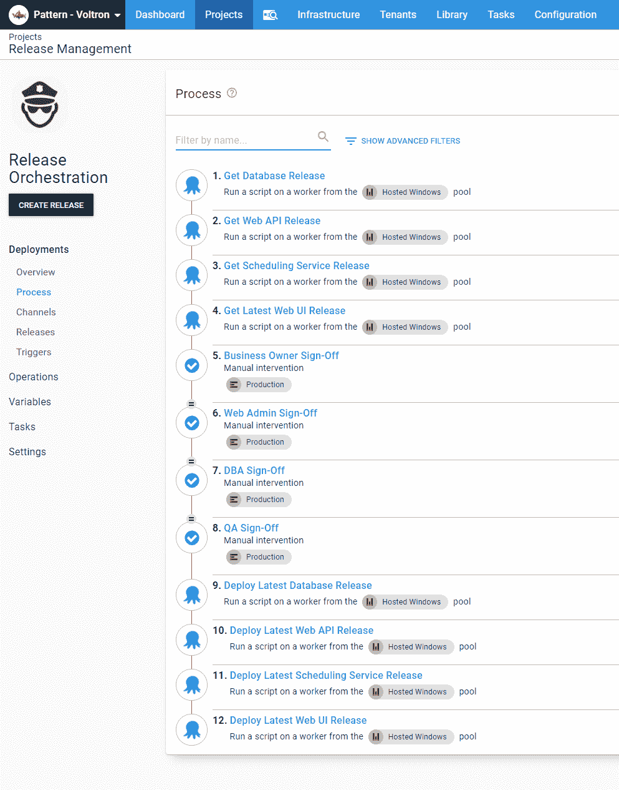](#)

接下来，创建一个新的版本，并将其部署到 **Staging** 。

[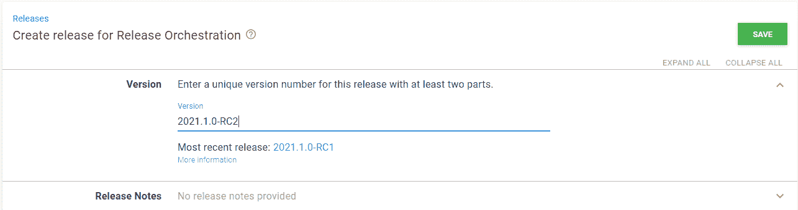](#)

当您部署到 **Staging** 时，您将看到此消息。这是意料之中的，尤其是对于这个示例项目。重新部署参数被设置为`No`，我们还没有创建任何新的版本。

[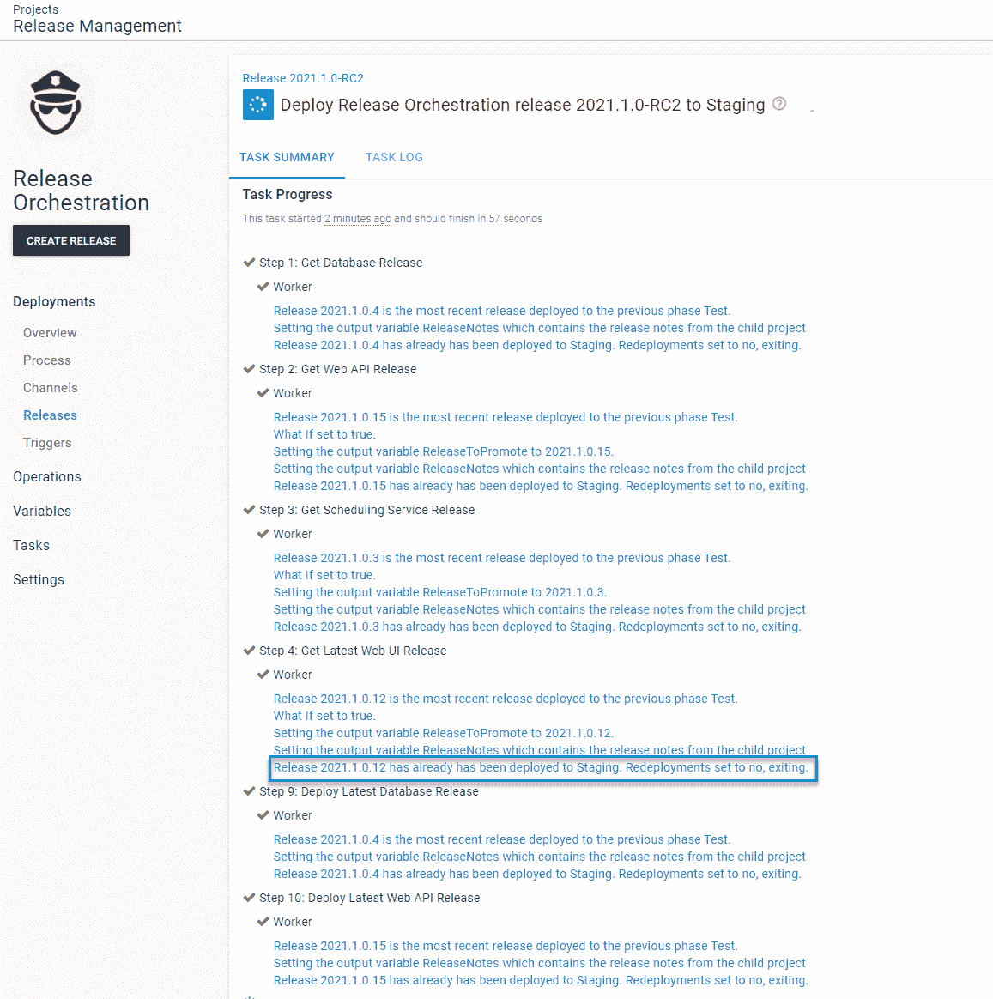](#)

促进发布到**生产**。在此部署过程中，您将看到手动干预和自动批准在起作用。

首先，手动干预应该有随发行说明一起部署的版本。

[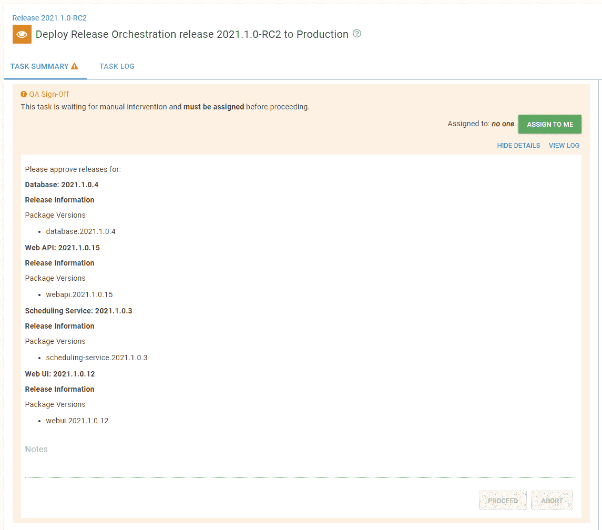](#)

在每个组都批准发布之后，部署将开始。如果与 API 相关联的用户没有获得手动干预所有权的权限，您将会看到这样的警告。

> 您将有 30 分钟的时间来解决此问题，否则部署将被取消。

[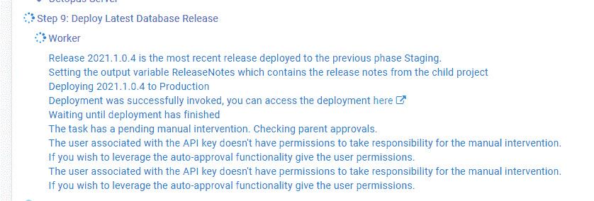](#)

修复之后，您应该会在子项目中看到类似如下的消息:

[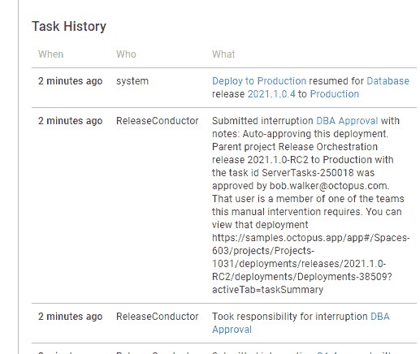](#)

至此，**生产**发布完成。

[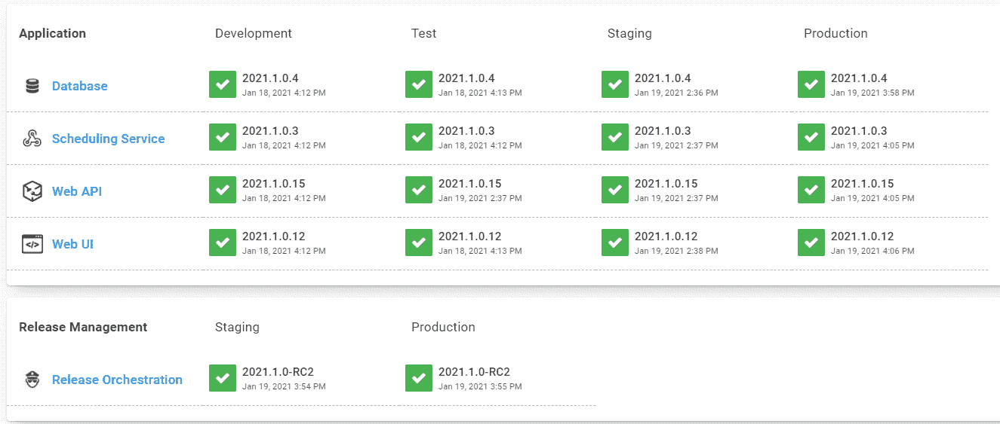](#)

### 场景:今天批准，明天部署

对于我们的许多用户来说，部署是在非工作时间进行的。如果批准者的唯一任务是批准部署，则他们在部署期间不必在线。理想情况下，部署应该在非工作时间自动运行，无需用户干预，并在出现问题时提醒相关人员。我们可以通过添加一个**产品批准**环境来完成该功能，该环境位于**准备**和**生产**之间。这个环境将*只*用于父项目。

首先，添加**产品批准**环境。您会注意到这个环境位于本页上的**暂存**和**生产**之间。我单击溢出菜单来重新排序该页面上的环境。

[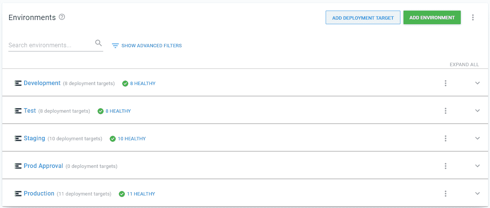](#)

添加新环境后，更新此父项目使用的生命周期。

[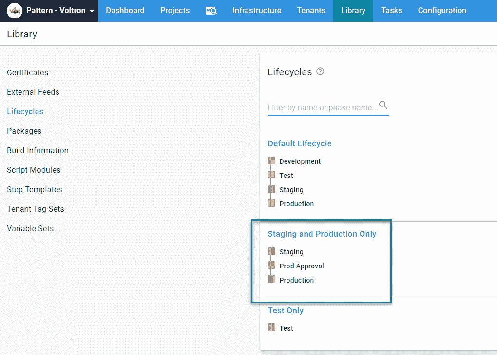](#)

关注**默认生命周期。**默认情况下，生命周期没有明确定义的阶段。相反，它使用整个环境列表自动生成阶段。要从**默认生命周期**中删除**产品批准**，您需要添加显式阶段。

接下来，更新批准步骤，使其仅在**产品批准**环境中运行。同时，配置非假设步骤以跳过**生产审批**环境。

[T31](#)

接下来，导航到变量屏幕并添加两个新变量:

*   **项目。child project . Approval . environment . name**:存储 **Prod Approval** 环境名。
*   **项目。child project . deployment . environment . name**:存储子项目应该部署到的环境的名称。对于除**产品批准**之外的所有环境，该名称将与当前环境相匹配。当它在**产品批准**环境中运行时，部署环境名为**生产**。

[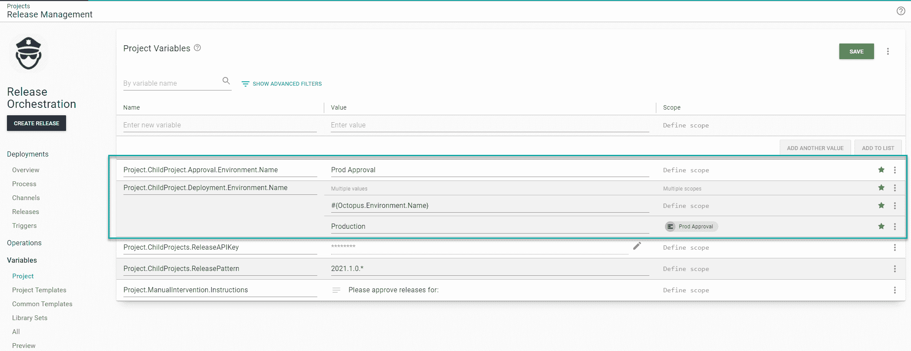](#)

进入执行`Deploy Child Octopus Deploy Project`的每个步骤，并更新以下参数:

*   **目的地环境名称**:更新为`#{Project.ChildProject.Deployment.Environment.Name}`
*   **审批环境**:更新至`#{Project.ChildProject.Approval.Environment.Name}`

[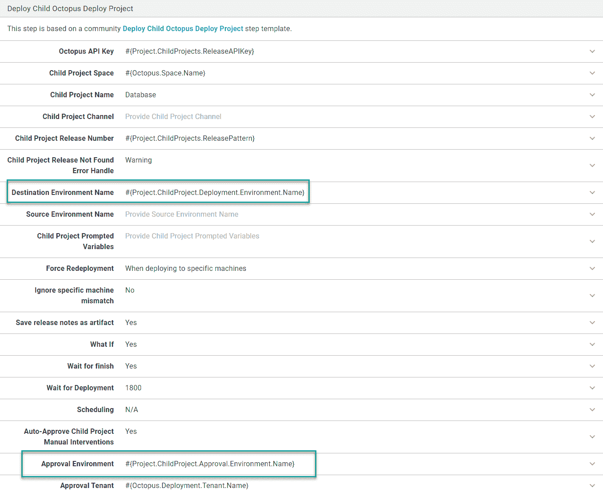](#)

这告诉步骤模板在**生产**部署期间从**生产审批**环境而不是**生产**环境中获取审批。这意味着我们可以在上午 11 点批准，并安排在下午 7 点部署。

现在，让我们来看看实际情况。对于示例应用程序，让我们假设在 API 和数据库中发现了一个 bug。创建一个补丁`2021.1.1.1`来修复这个错误，并部署到**开发**和**测试**。

[T35【](#)

让我们假设一切都成功通过了 QA，是时候将这两个组件提升到 **Staging** 了。

首先，我们希望将发布模式更新为`2021.1.*`。你会注意到它不是`2021.1.1.*`。仔细想想，只有在创建新的次要版本时才进行更新才有意义，而不是对每个补丁版本都进行更新。它不会重新部署现有的代码，因为步骤模板将跳过已经部署的版本。

[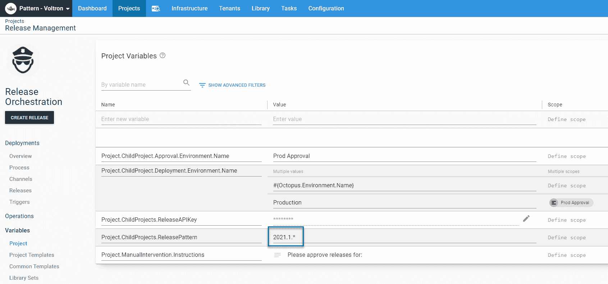](#)

接下来，为**发布编排**项目创建一个新的发布，并将其部署到 **Staging** 。

[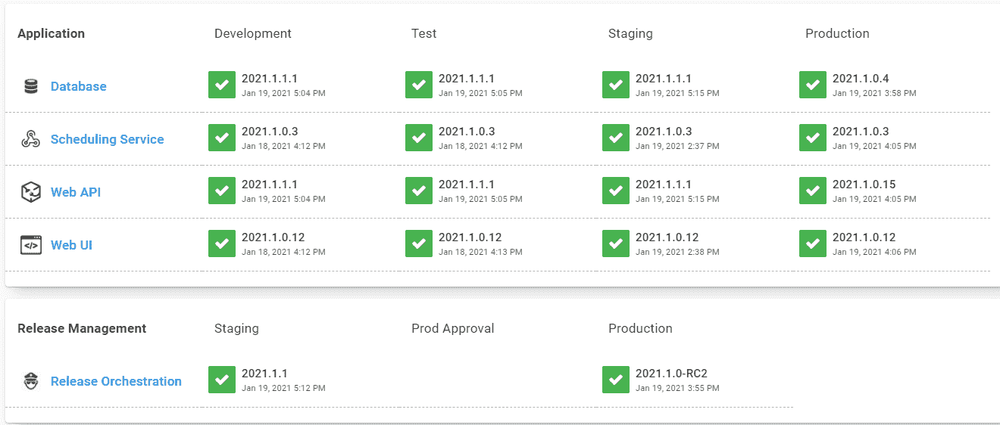](#)

将发布提交给 **Prod Approval** 并完成每个批准步骤。您会注意到，对于已经部署的版本，批准消息略有不同。

[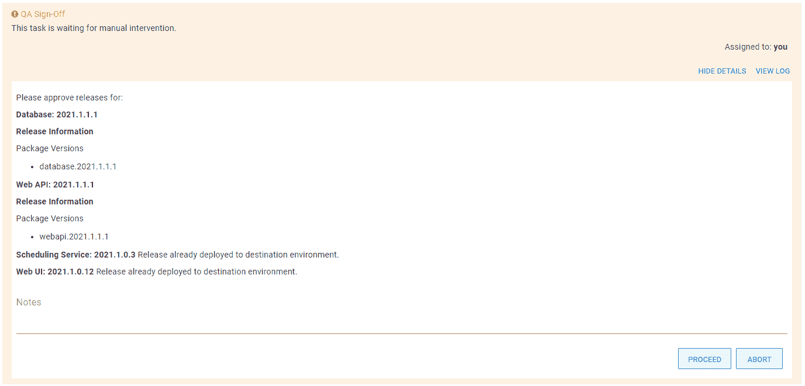](#)

现在是时候安排发布部署到**生产**了。使用内置工具，我们可以安排它在今晚 7 点运行。

[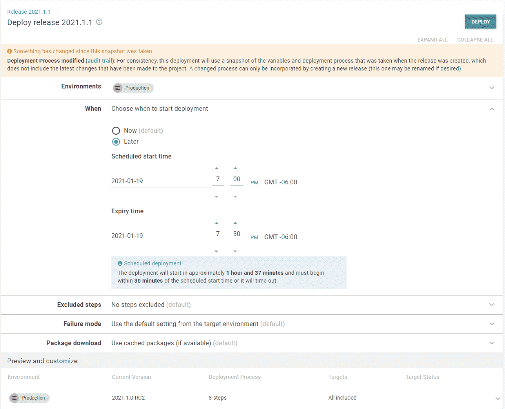](#)

当发布被部署时，它将从**产品批准**环境中获取批准。

[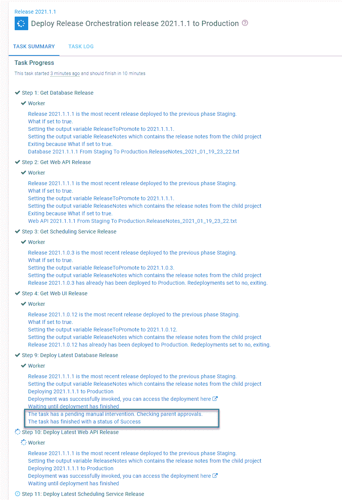](#)

### 场景:按需重新部署

默认情况下，步骤模板将跳过任何已经部署到目标环境中的版本。对于许多用例来说，这是首选行为。但是，有几个需要重新部署的用例。其中包括:

*   环境刷新:当从**生产**中刷新**登台**环境时，将最新的代码重新部署到**登台**以获取最新的位进行测试是有意义的。
*   服务器重置:如果其中一个服务器遇到问题，解决方案是重新部署，以确保所有代码和配置值都是最新的。
*   新服务器:如果一个新的服务器被添加到网络场中，重新部署一切以确保网络场在所有节点上具有相同的代码和配置。

为此，我们将使用 [Octopus Deploy 的提示变量功能](https://octopus.com/docs/projects/variables/prompted-variables)。

首先，我们将向项目添加一个新变量:

*   名称:`Project.ChildProject.ForceRedeployment`
*   默认值:`No`
*   标签:`Force Redeployment`
*   控制类型:下拉列表
*   选项:`Yes`和`No`

[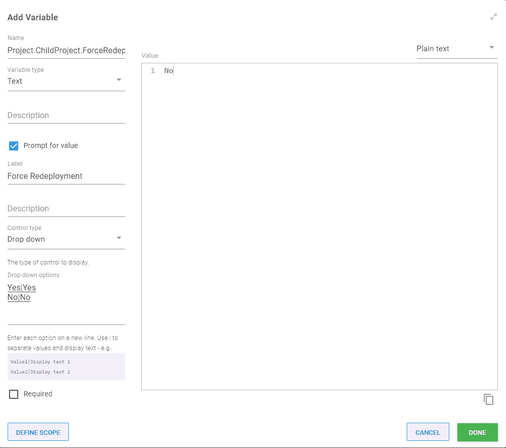](#)

接下来，更新**强制重新部署**参数以使用这个新变量。

[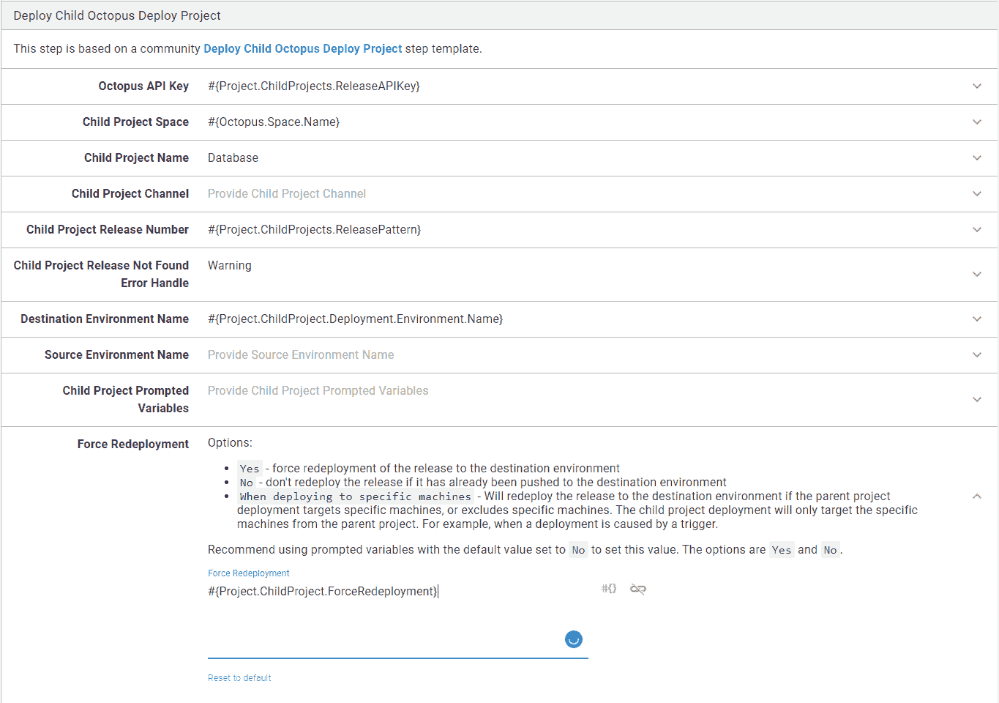](#)

现在，当您进行部署时，系统会提示您强制重新部署。默认为`No`，如果用户不做任何更改，将使用默认功能。

[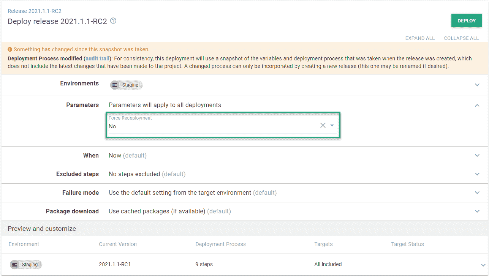](#)

当它被设置为`Yes`时，您将看到所有的子项目都被重新部署。

[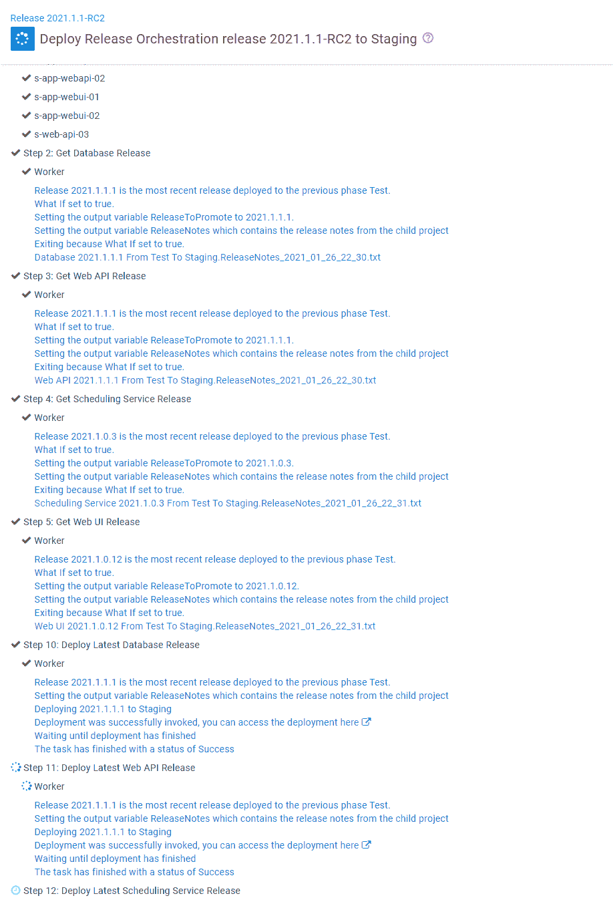](#)

目前，提示变量使重新部署全部或没有。您可能希望每个组件项目都有一个唯一的变量，或者将它们逻辑地组合在一起。

## 可供选择的事物

你可能认为这很复杂，但我相信这是有益的。让我们重新检查一下为什么您可能希望每个组件都有一个项目:

*   通过仅部署已更改的内容，最大限度地减少停机时间。
*   通过只构建已更改的内容来最小化构建时间。
*   尽量减少一个人必须做出的决定。
*   单一责任原则；每个项目都尽其所能部署一件事情。

此时，每个组件一个 Octopus 项目是满足这些要求的最佳解决方案。

每个组件都有项目的替代方案。本节将介绍这些备选方案，以便更好地理解为什么每个组件一个 Octopus 项目最有效地解决了这个问题。

### 具有多个频道的单个项目

可以有一个单独的项目，并使用 [Octopus Deploy channels](https://octopus.com/docs/releases/channels) 特性和范围步骤在特定的通道上运行。创建发行版时会选择频道。通常，版本由构建服务器创建，并自动部署到**开发**环境中。

第一个问题是所有可能的组件组合。对于四个分量，将有 15 个通道:

*   WebUI
*   WebAPI
*   数据库ˌ资料库
*   服务
*   WebUI WebAPI
*   WebUI 数据库
*   WebUI 服务
*   WebAPI 数据库
*   WebAPI 服务
*   服务数据库
*   WebUI WebAPI 数据库
*   WebUI WebAPI 服务
*   WebAPI 服务数据库
*   WebUI 服务数据库
*   WebUI WebAPI 数据库服务

增加第五个组件将意味着 36 个通道。第六个分量意味着 63 个通道。如此所示，每个组件组合的通道不可扩展。

第二个问题是当一个版本被创建时，某些人或某些事必须决定使用哪个通道。做出错误的决策会导致部署错误的组件，从而导致人为错误。

### 部署时带有禁用步骤的单个项目

另一种方法是使用单个项目，但是不使用通道，而是禁用部署屏幕上的步骤。

[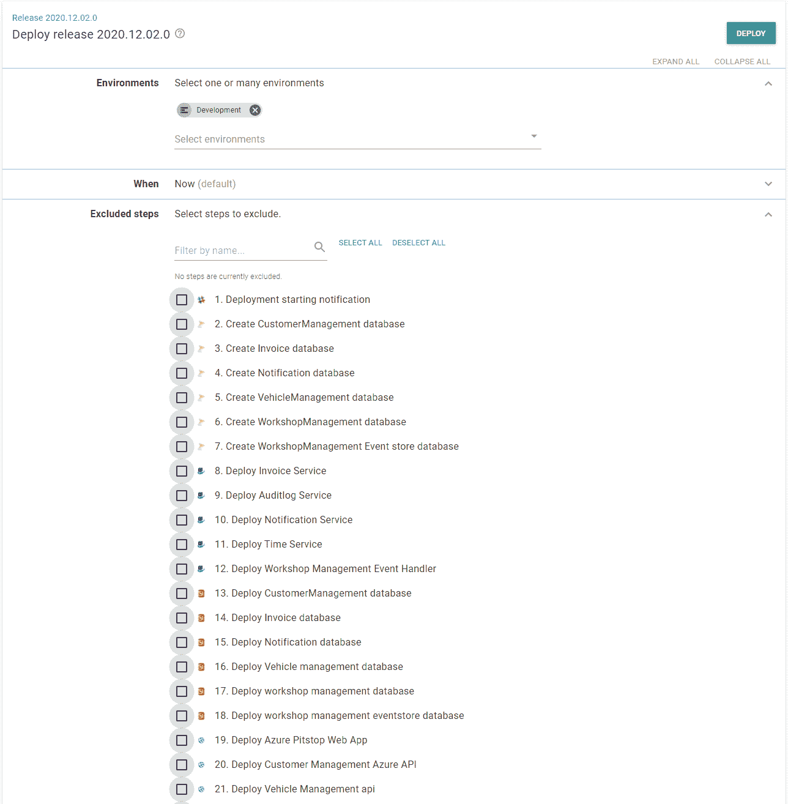](#)

此选项的主要问题是涉及到手动过程。必须有人选择禁用哪些步骤。步骤越多，出错的机会就越大，并且在每次部署期间必须禁用这些步骤，这进一步增加了出错的机会。

### 项目包重新部署设置

在项目设置页面中有一个[包重新部署选项](https://octopus.com/docs/projects#deployment-settings)。你可以把它设置为`Skip any package that is already installed`。

这种设置有几个障碍:

*   通常，部署不仅仅是推出一个包。还有其他步骤来配置数据库或网络服务器。也许有一些步骤可以在部署之后运行健全性检查测试。该设置仅适用于部署包步骤，不适用于任何脚本步骤。
*   该设置适用于部署过程中的所有包。您不能选择应用该设置的包。
*   该设置不适用于回滚或重新部署。它会导致包在错误的时间被跳过。

## 结论

虽然这个过程感觉很复杂，但我相信这是值得努力的。

部署需要时间，即使使用最好的机器和最快的连接。部署时间也因应用程序而异。一些应用程序部署可能需要超过 12 个小时，其中大部分时间由一两个组件负责。有些部署必须在半夜进行，因为那是唯一允许停机的时间。除非我们能够通过跳过没有变化的组件来找到最大限度减少停机时间的方法，否则进行更频繁部署的机会就会减少。

我希望这个新的步骤模板能够解决您遇到的一些发布管理问题，并使未来的部署更加可靠。

愉快的部署！

本系列还有两个指南: