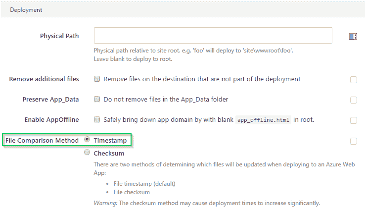
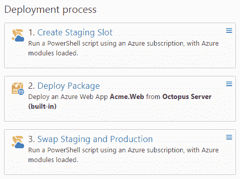

# 可靠地部署大型 Azure Web 应用——Octopus Deploy

> 原文：<https://octopus.com/blog/reliably-deploying-large-azure-web-apps>

在 Octopus Deploy 3.0 中，我们发布了对部署 Azure Web 应用的一流支持。与直接从 Visual Studio 发布不同，您可以管理特定于环境的配置，并以受控的方式通过环境提升您的应用程序版本。

我们一直在与一些客户合作，他们部署 Azure Web 应用变得不可靠。当向 Azure 部署大型 web 应用程序时，或者当通过缓慢或有损耗的网络连接进行部署时，尤其如此。在这些情况下，部署到现有的 Azure Web 应用程序可能会变得不可靠，在某些情况下会挂起，通常需要多次尝试才能成功部署。我希望不言而喻- *这不是我们想要的那种体验**任何人**使用 Octopus Deploy* -我们都是为了**愉快的部署！**

如果你对 Azure Web 应用的不可靠、缓慢或挂起的部署有困难，这篇文章是为你准备的。总而言之:

## 在被窝里探索一下...

当你用 Octopus 部署 Azure Web 应用时，我们将通常的 Octopus 优点应用到你的[配置文件](http://docs.octopusdeploy.com/display/OD/Configuration+files)，运行你的[定制脚本](http://docs.octopusdeploy.com/display/OD/Custom+scripts)，然后依靠 [WebDeploy](http://www.iis.net/learn/publish/using-web-deploy/introduction-to-web-deploy) 将结果文件同步到 Azure。我们使用微软的[。Web.Deployment](https://www.nuget.org/packages/Microsoft.Web.Deployment/) 直接在代码中获取包，而不是分发给`MsDeploy.exe`。

## 时间戳而不是校验和

在 Octopus 3.0 中，我们决定将**校验和**作为与 WebDeploy 同步文件的默认(也是唯一的选择)。使用校验和，我们将只部署**实际上改变了**的文件，而不需要任何特殊的配置。这减少了后续部署到同一个 web 应用程序所需的时间和带宽。这对于中等规模的应用程序来说确实很好，但是，正如我们发现的，对于大型应用程序来说，这变得极其缓慢和不可靠。

如果你发现自己处于这种情况，你可以使用 [Octopus Deploy 3.3.3](https://octopus.com/downloads/3.3.3) 或更新版本，切换到使用**时间戳**进行文件比较，而不是使用**校验和**。

如果你有任何现有的 Azure Web 应用程序步骤，你将需要**更新它们以使用时间戳并创建一个新版本**。默认情况下，你创建的任何新 Azure Web 应用步骤都将使用**时间戳**，但是如果更适合你的需要，你可以随时切换到**校验和**。

如果你更喜欢校验和，我们计划将[升级到`Microsoft.Web.Deployment.3.6.0`，它有几个针对校验和比较的错误修复。](#future)

### 保留时间戳

使用时间戳进行文件比较的缺点是可靠性——你很容易得到误报——这就是校验和如此吸引人的原因。**如果您使用的是 NuGet 包**，文件的时间戳将在解压缩时丢失，这意味着每个文件看起来都比*更新*，并且无论是否更改，都会上传- [更多详细信息](https://github.com/OctopusDeploy/Issues/issues/829)。要解决这个问题，可以考虑使用 [zip 包](http://docs.octopusdeploy.com/display/OD/Supported+Packages)——我们已经进行了自动测试，证明时间戳在您的部署中端到端地保留。

## 尝试部署到新的插槽并切换

我们通常将这些称为[蓝绿色部署](http://docs.octopusdeploy.com/display/OD/Blue-green+deployments)，在这里，您部署 web 应用程序的新副本，运行冒烟测试，切换插槽，最后删除旧插槽。在现有插槽上进行部署很方便，但无法提供与蓝绿色部署相同的停机时间。

我们已经为[写了一个简短的指南，使用 Azure Web Apps](http://docs.octopusdeploy.com/display/OD/Using+Deployment+Slots+with+Azure+Web+Apps) 的部署槽。对于在部署过程中实现一个额外步骤的成本来说，这是在部署期间保持 web 应用程序正常运行的一个非常好的模式。

当您部署到一个全新的插槽时，WebDeploy 将只上传所有内容，实际上不需要进行文件比较，从而使大型 Web 应用部署更加可靠。

## Azure Web 应用部署的未来

我们希望确保您可以在最终版本发布后立即将您的 ASP.NET 核心 1 应用部署到 Azure 应用服务中。我们已经支持 [JSON 配置文件](http://docs.octopusdeploy.com/display/OD/JSON+Configuration+Variables+Feature)，以及使用 [zip 包](http://docs.octopusdeploy.com/display/OD/Supported+Packages)的[构建和部署管道](https://octopus.com/blog/aspnet-core-build-and-deploy)。

接下来:

*   我们正计划升级到`Microsoft.Web.Deployment.3.6.0` ( [测试版发布说明](https://azure.microsoft.com/en-us/blog/web-deploy-3-6-beta-released/))——关注这个 [GitHub 问题](https://github.com/OctopusDeploy/Issues/issues/2422)如果你有兴趣:
    *   部署到`wwwroot`以上的文件夹
    *   代理支持
    *   使用校验和同步的错误修复
*   我们将对 JSON 配置文件实现更深层次的支持

## 还有问题吗？

如果您仍然遇到 Azure 应用服务部署不可靠的问题，请联系我们的[支持团队](https://octopus.com/support)，我们将与您一起解决您遇到的具体问题。