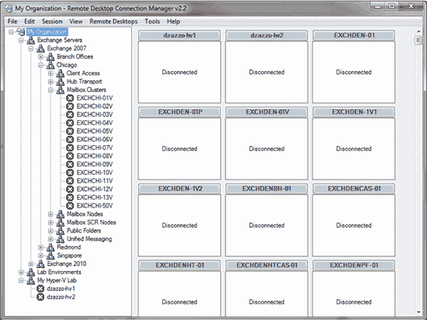
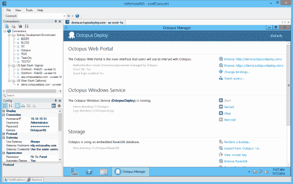
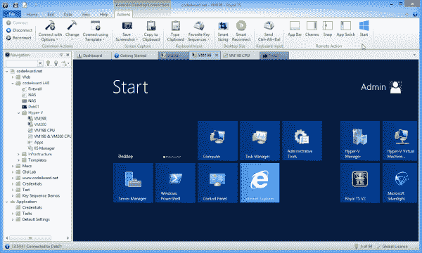
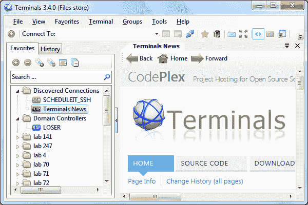
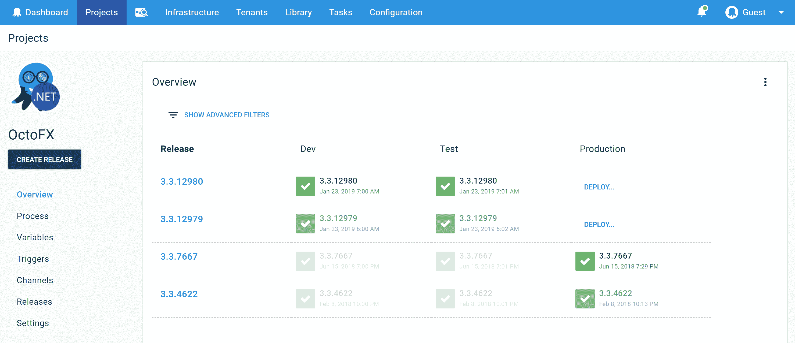
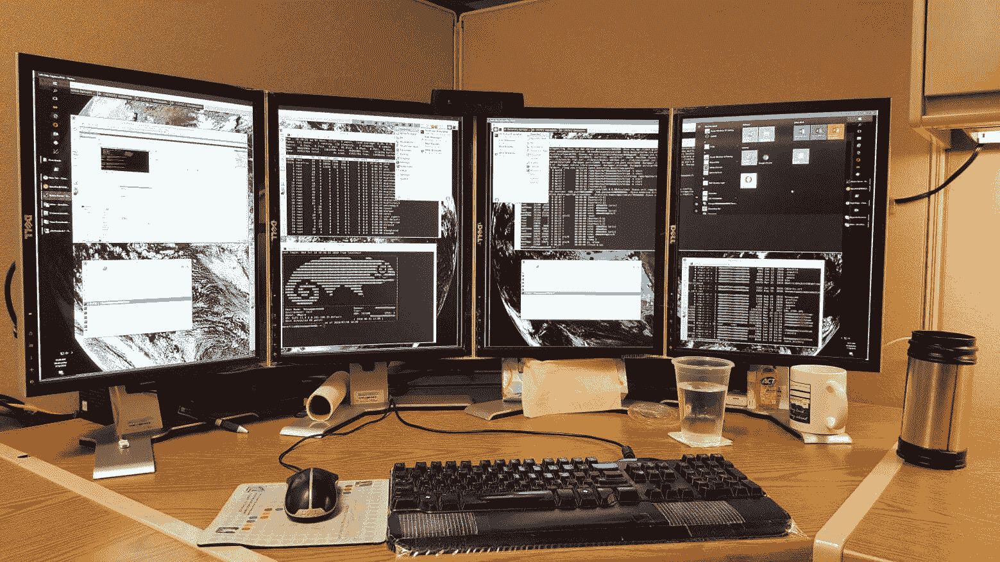
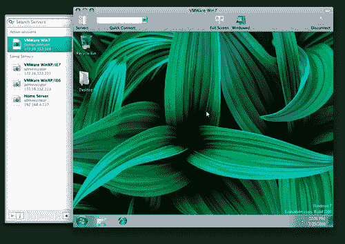
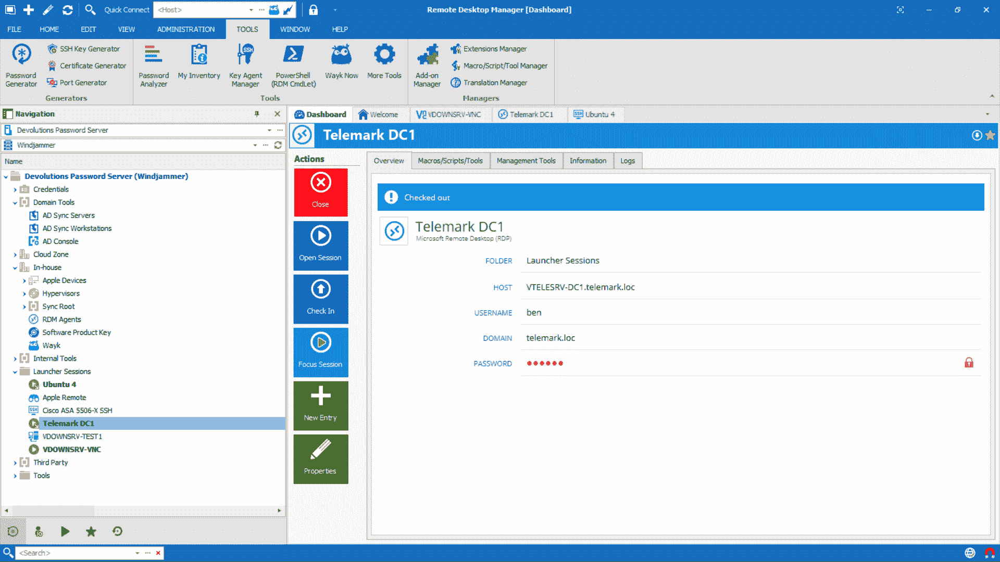

# 5 种远程桌面替代方案- Octopus 部署

> 原文：<https://octopus.com/blog/remote-desktop-alternatives>

如果您构建在 Windows 服务器上运行的应用程序，并且您参与了部署，那么您很可能会花时间在远程桌面上。

在过去，当船是木头做的，人是钢铁做的，我们会有几个服务器，在上面运行尽可能多的应用程序。拥有十几个站点或应用程序的 IIS 服务器不仅仅是常见的，而是标准的。

如今，虚拟化和云计算意味着不再是一台服务器运行许多应用程序，而是一台服务器运行许多虚拟服务器，每台服务器运行一个应用程序。这意味着我们很少同时处于单个远程桌面会话中。

以下工具列表帮助您一次管理多个远程桌面会话。

微软已经更新了他们的远程桌面客户端，现在它支持 Windows，Android，iOS 和 macOS。这是一个伟大的选择，支持多种平台，能够保存密码等。这是免费的，而且是微软提供的。有什么不喜欢的？

如果你愿意，它可以保存凭证，并且非常适合在队友之间共享连接。它唯一缺乏的功能是不能保存远程桌面网关的凭证。这就是为什么我们换成了…

mRemote 的一个开源分叉，这是我们目前使用的工具。Octopus 团队是分布式的，因此我们将 mRemoteNG 设置文件保存在 Dropbox 中，以便团队中的每个人都可以使用它们轻松连接到我们的任何虚拟机。

RoyalTS 是一个非常好看的商业替代品，有一个杀手级的功能:一个可以让你远程点击“开始”的按钮。我不知道是谁忘记告诉 UX Windows 团队，人们通常不会在平板电脑上运行 Windows Server 2012，但我肯定他们有理由让通过远程桌面启动程序变得几乎不可能。别害怕，皇家队来了。

另一个开源的选项卡式会话管理器，但它看起来正在积极开发，源代码是 C#！

好吧，是不要脸的塞 **:-)**

Octopus Deploy 是一种远程桌面替代方案，就像 TeamCity/Team Build 是 Visual Studio 替代方案一样。

远程桌面工具对于诊断和一些配置任务是必不可少的；不可否认。也就是说，我们在 Octopus Deploy 的全部存在理由是使典型的部署不涉及任何远程桌面。通过更好的可见性、责任性和可靠性，我们的目标是减少您花费在远程桌面会话上的时间。

你对上面的工具有什么体验，我错过了什么？

### 其他一些值得一看

[雷米纳](https://remmina.org/)

如果你正在寻找一个有用的 Linux 开源工具，你应该考虑 Remmina。更何况 Ubuntu 是预装的。

[软线](http://cord.sourceforge.net/)

切换到 Mac OS X，另一个很好的检查是线。像 Remmina 一样，它是免费和开源的，但也很好地让您在自己的窗口中查看每个会话。或者，您可以在一个窗口中查看所有会话，节省空间并允许您根据需要进行缩放。

远程桌面管理器 10

远程桌面管理器被设计成集中所有的连接和凭证。它比香草 RDP 或 mRemoteNG 更好地处理高 DPI，并有两种口味，免费和企业。Free 限制用户之间可以共享的信息量，而 Enterprise 解锁用户权限、角色、高级日志记录等功能。

### 了解更多信息: