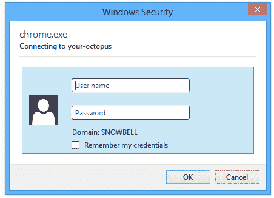
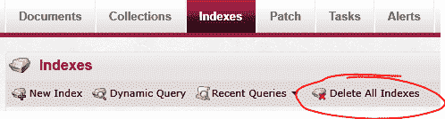

# 重置 RavenDB 索引- Octopus 部署

> 原文：<https://octopus.com/blog/resetting-raven-indexes>

如果您运气不好，在升级您的 Octopus Deploy 服务器之后，或者在数据库恢复之后，您可能会注意到一些奇怪的行为:

*   用户、项目或环境可能已经完全从 UI 中消失了
*   尝试导航可能会导致不断的错误，如“等待 15，103 毫秒，查询返回非过时的结果。”

为什么会出现这些情况？Octopus 建立在文档数据库 RavenDB 之上。Raven 中的数据被保存到 [ESENT](http://en.wikipedia.org/wiki/Extensible_Storage_Engine) 中，这是支持微软 Exchange 和 Active Directory 的相同数据库技术。但是 Raven 也在 [Lucene](http://en.wikipedia.org/wiki/Lucene) 中保存数据的索引，它在执行查询时会用到这些索引。

当这些 Lucene 索引出现问题时，通常会出现上述错误。我注意到客户升级 Octopus 或恢复备份，却发现数据丢失。但是如果你进入 RavenDB 管理工作室，你经常可以看到这些数据。它就在那里，只是没有索引。

## 在 Octopus 中连接到 RavenDB 管理工作室

一个可行的快速解决方案是重置索引，然后重启 Octopus，以便重建所有索引。为此，首先需要连接到 RavenDB management studio。

studio 是在 Silverlight 中构建的，所以您需要确保无论您从哪台机器上安装了 Silverlight 浏览器插件(或者您可以安装它)。

RavenDB Management Studio 通常位于 Octopus 服务器的 10930 端口上，因此浏览到`http://_your-octopus_:10930`通常是有效的。如果没有，并且您可以访问 Octopus 门户网站，请尝试:

1.  前往八达通门户网站
2.  进入**配置**菜单，然后进入**存储**选项卡
3.  按照页面上的链接访问 Raven

如果这不起作用，你需要确保防火墙规则不会阻止你在那个端口浏览 Octopus。或者，您需要 RDP 到 Octopus 服务器并在本地浏览到它(即`http://localhost:10930`)。

最后，当您连接时，会要求您进行鉴定:

您需要在这里提供的凭证**不是您的八达通凭证**。您需要作为分配给 Octopus 服务器上本地管理员组的 Windows 用户进行身份验证(例如，机器上的管理员帐户)。

## 重置索引

现在您已经在 Raven 中了，您可以转到**索引**选项卡并单击“删除所有索引”:

注意，这并没有删除任何*数据*；它只是删除了索引，这些索引将在下一步自动重建。

## 重启章鱼

要让 Octopus 重建索引，您需要重启它。

1.  RDP 到你的八达通服务器
2.  打开服务管理控制台， **services.msc**
3.  选择“八达通”服务
4.  点击**停止**，等待停止
5.  点击**启动**，并等待其启动

您还需要重启 Octopus web 门户，这是一个 IIS 应用程序。

1.  打开 IIS 管理器，**inetmgr.exe**
2.  在树中，展开您的服务器，并转到**应用程序池**
3.  选择**八达通门户**应用池
4.  执行**停止**和**启动**

给它一分钟左右的预热时间，然后通过你的浏览器进入 Octopus 门户网站，希望一切都正常。[如果您仍有问题，请联系我们的支持表单](http://help.octopusdeploy.com/discussions)。