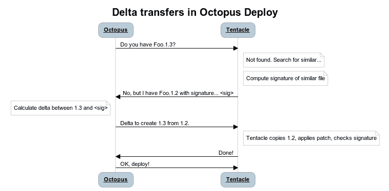

# RFC:Octopus-Octopus 部署中的远程增量压缩

> 原文：<https://octopus.com/blog/rfc-delta-compression>

许多自主开发的部署解决方案利用了 Robocopy 等工具，这些工具可以在执行部署时执行“同步”。这节省了时间和带宽，因为这意味着只需要在网络上推送已更改的文件。另一方面，Octopus Deploy 使用 NuGet 包，总的来说，我们认为将单个文件——包——作为部署单元比同步松散的文件目录有很多优势。

这个决定是有代价的——我们今天可能上传一个 100 MB 的包到一个服务器上，只是对包中的几个文件做了一个小的改变，却不得不再次重新上传整个包。将此乘以许多服务器，很明显会有潜在的带宽节省。

如果我们能两全其美，那不是很好吗？

上周，我花了一些时间阅读了两篇关于 delta 压缩的优秀论文:

这个概念在应用于章鱼和触手时非常简单:

关键的好处是，当部署一个 100 MB 的文件，其中只有 1 MB 的数据实际发生了变化时，我们会将大约 1.3%的文件作为签名(1.3 MB)进行传输，加上增量，再加上由于填充而产生的少量额外数据，但总共不超过大约 3 MB。

一旦我理解了这些概念，我就开始寻找我们可以使用的实现。我真的很喜欢 rdiff 的外观，作为一个命令行工具，它有我们需要的那种语义，但是对在 Windows 上运行的支持似乎不是很好。此外，如果我们要这样做，我想这是我们想要维护自己的那种代码，我已经有一段时间没有坐下来编写这样的代码了。

# Octodiff 简介

> Octodiff.exe 是远程增量压缩的 100%托管实施。用法受 rdiff 启发，与 rdiff 一样，算法也基于 rsync。Octodiff 可以通过比较远程文件和本地文件来制作文件的增量，而不需要两个文件都存在于同一台机器上。

Octodiff 在 GitHub 上，并获得 Apache 许可。它有三个不同的命令——创建一个**签名**，创建一个**增量**，应用一个增量(**补丁**)。

# 我需要你的帮助

NuGet 包是 ZIP 文件，我认为 ZIP 文件不太适合 delta 压缩——我认为改变 ZIP 中的单个文件会导致整个 ZIP 变得不同。然而，事实证明并非如此——zip 文件(或者至少是使用`System.IO.Packaging`创建的文件)使用块级压缩，因此对包中单个文件的更改往往被限制在包文件中的单个区域。在我所有的测试中，Octodiff 运行得非常好。

然而，将 Octodiff 添加到 Octopus 和 touchs 会带来一些风险，所以在我们开始实现它之前，如果发现在现实世界中它实际上并不能改善任何事情，我会非常感激您能帮助我:

1.  [下载 Octodiff](https://github.com/OctopusDeploy/Octodiff/releases)
2.  试着用 Octopus 部署的一些包，尤其是较大的包，但也有较小的包
3.  告诉我结果——增量有多大，你会节省多少带宽
4.  如果你认为这个功能对你有帮助，请告诉我

一旦我们有了一些真实世界的数据，我们将更容易把它集成到 Octopus 中。

*此外，目前在较大的文件上创建增量确实需要几秒钟的时间——很遗憾没有人阅读这篇博文来优化它并发送拉取请求**；——)***