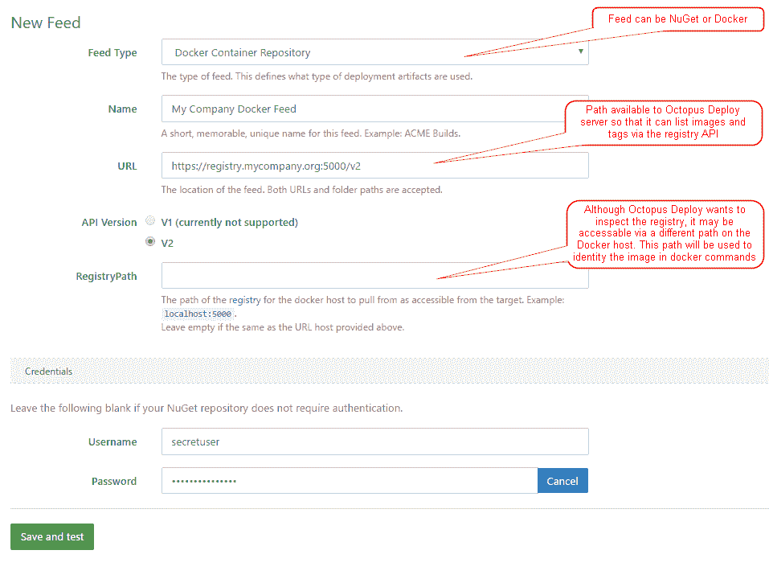
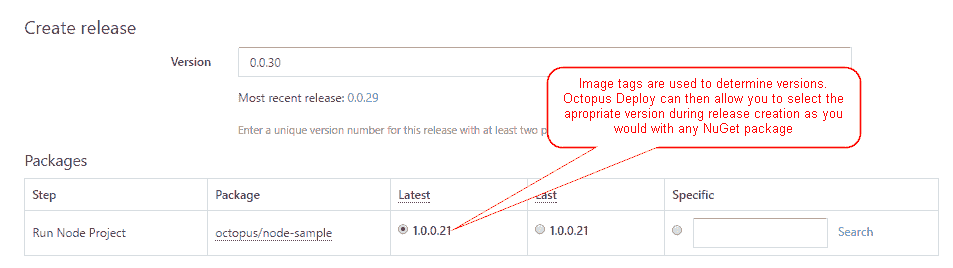
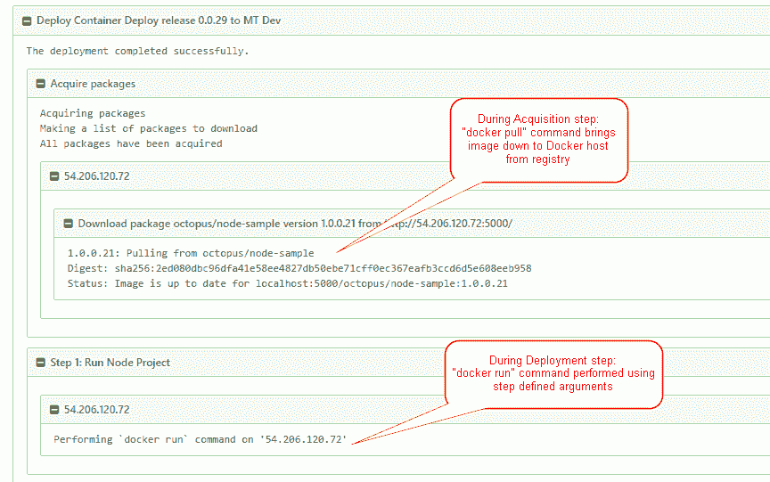
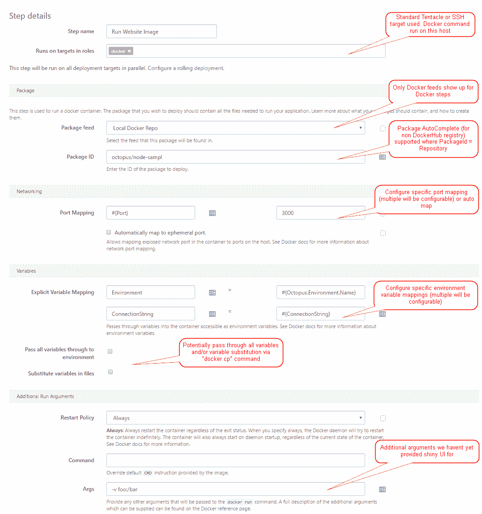

# RFC: Docker 集成- Octopus 部署

> 原文：<https://octopus.com/blog/rfc-docker-integration>

早在 2014 年 10 月，[微软宣布](http://weblogs.asp.net/scottgu/docker-and-microsoft-integrating-docker-with-windows-server-and-microsoft-azure?__r=8d1b6a232c813b9)将在 Windows Server 2016 上支持 [Docker](https://www.docker.com/) ，自那以来，已经做了大量工作来让 Docker 在服务器和 Windows 10 上运行。由于预计 Windows Server 2016 将于本月发布 RTM，我们认为这是确保我们的 Docker 故事符合标准的绝佳时机。

当时 Paul Stovell 写了一些关于这种集成的初步想法，从那以后，这个领域发生了很多变化，尤其是在跨平台方面。NET 核心和 Windows 纳米服务器。

我们已经完成了一系列内部测试，并围绕我们认为 Docker 和 Octopus 如何最好地合作进行了大量讨论，为了确保我们继续尽可能地提供最好的 Octopus，我们认为这是一个向社区提出我们的想法并确保我们走上正轨的合适时机。

## 章鱼还有意义吗？

尽管我们可能有点偏见，但我们绝对相信章鱼在 Docker 世界有一席之地。虽然还有其他原因，但我们的主要想法是:

*   环境进展(Environment progression):Octopus 提供了您的环境和您的应用程序经历的生命周期的一个很好的视图。这使得查看每个环境中运行的容器版本变得容易。
*   **编排**:当你部署一个新版本的容器化应用程序时，运行一个容器是主要的事情，通常你会有数据库迁移、电子邮件、空闲通知、手动干预等等。
*   **配置**:一个 app 在不同环境下配置完全相同的情况很少见。Octopus 让您轻松组织配置，并确定每个值的范围，以获得想要的结果。
*   **集中审计** : Octopus 为您的部署集中安全、审计和日志。
*   **非容器化应用**:最后，虽然有些人可能会迁移到 Docker，但其他系统仍然会出现长尾现象，至少其中一些系统没有有效的迁移案例。

## 但这不就是给*nix 的人看的吗？

作为一个主要针对。NET 开发人员(尽管它在其他语言中也能很好地工作！)我们知道传统的码头工人观众没有太大的交集。因此，我们想让你的脚浸入水中变得超级容易，并鼓励你以“Docker 方式”做事，但我们也知道很多应用程序并不是以这种心态编写的。我们很可能会实现一些违背 Docker 原则的特性(比如不可变容器)，以允许您在启动新的容器实例时修改应用程序配置(`web.config`或`app.config`)。

而且，随着越来越多的人瞄准跨平台。NET Core，使其易于在多个平台上部署和测试变得更加重要。

## 部署 Docker 容器

为了尽可能地符合 Docker 原则，我们正在寻求将容器作为一个包来支持(方法 3 来自[最初的博客文章](https://octopus.com/blog/docker-windows-octopus))。容器映像将由您的构建工具构建，并被推送到 DockerHub 之类的容器注册中心。这有助于确保我们在环境之间推送完全相同的位。

这意味着一个新的包源类型叫做`Docker Container Repository`，允许访问经过认证和未经认证的注册中心。

我们计划使用标签作为包版本。这将约束您可以用于标签的值，只使用 [SemVer2](http://semver.org/) 有效的版本号(Docker 允许自由格式的文本)。然而，由于这个版本号已经被用于 NuGet 包，我们不认为这是一个有争议的点。

在这一点上，我们期望为 Linux 使用现有的 SSH 目标，为 Windows Server 使用普通的触手。使用这种方法，Octopus 将在本地实例上执行 Docker 命令，使用 Unix 套接字或 windows 命名管道与本地 Docker 守护进程通信。

在部署期间，包将在包获取步骤期间通过`docker pull`直接从注册表下载到目标机器。Docker 内置的 delta 功能意味着我们在 Octopus 服务器上下载并将 diff 发送到触手可能不会有太大的收益。

最初，我们看到将添加两个新的步骤类型——一个运行容器，一个停止容器。`Docker Run`步骤将允许您从注册表中指定一个映像，传入哪些环境变量，映射哪些端口(或者使用临时端口)。`Docker Stop`步骤将允许您停止一个正在运行的容器并(可选地)删除它。

此时，它将要求您显式地定义您想要传入的环境变量，尽管我们正在考虑将所有可用变量作为环境变量传入的想法。

`Docker Run`步骤公开了容器 id、端口(如果使用临时端口)和`docker inspect`输出的输出变量，这些变量可以在后面的步骤中解析。

## 开放式问题

关于如何处理敏感变量，我们仍然有一些悬而未决的问题——将它们作为环境变量传递有点安全问题，因为这会使它们暴露在不同的地方。不幸的是，关于将秘密传递到容器中的最佳实践仍然被 Docker 社区认为是一个公开的问题。

输出变量也需要一点润色——哪些变量对你来说很重要？另外，我们已经考虑过是否应该支持变量作为对象，所以将整个`docker inspect`结果作为 PowerShell 对象公开可能会有用？

Docker 支持容器健康检查的想法，以了解您的应用程序何时启动并运行。章鱼是否应该与此融合？这里什么是有用的行为？

如前所述，我们知道很多使用 Octopus 部署的应用程序。NET 应用程序，并且依赖于`web.config`或`app.config`中的配置，因此需要在环境之间进行修改。大多数时候，这是通过配置转换来完成的。然而，这违背了“容器应该是不可变的”原则。虽然我们建议坚持这一原则，但我们正在讨论是否支持容器启动时的配置转换。这可能会在应用程序加载期间导致应用程序回收。这是我们希望得到您反馈的最大方面之一。

我们最初的实现旨在使用 SSH 和传统的触须与 Docker 守护进程进行本地交互。潜在地，这可以被转换成一个 Docker 目标，并使用 HTTPS API。这将给我们带来一系列好处，如允许我们进行健康检查，消除 Docker 主机上的触手需求，并使支持云容器主机变得更容易，如 Azure 容器服务和亚马逊的弹性容器服务。然而不利的一面是，这意味着您必须在 HTTPS 上公开 Docker 守护进程，并在两端配置证书。可能是为了支持 ACS 和 ECS，我们无论如何都需要这样做。

## 房间里的那头大象呢？

我们熟知许多先进的容器编排工具，如 [Docker Swarm](https://docs.docker.com/swarm/) 和 [Kubernetes](http://kubernetes.io/) 。试图复制这些工具的功能是疯狂的，这不是我们的意图。相反，我们认为 Octopus 最能让人们快速启动并运行 Docker 部署。随后可以使用 Step 模板实现与这些高级工具的集成。但是，由于我们不是这里的专家，请随意提出我们可以很好地集成的方法。

## 留下评论

我们的方法符合您希望看到的吗？哪些部分听起来很棒，哪些部分需要更多关注？我们遗漏了什么？请在下面的评论中告诉我们。

如果你已经在使用 Docker(如果你已经在使用 Octopus 的话就更是如此了),我们特别希望听到你的意见，因为我们希望确保我们尽可能构建最有用的东西。