# RFC:多租户- Octopus 部署

> 原文：<https://octopus.com/blog/rfc-multitenancy>

更新:多租户部署将作为 Octopus Deploy 3.4 的一部分推出，Beta 2 已经发布！参见 [3.4 Beta 2 博客文章](https://octopus.com/blog/octopus-deploy-3.4-eap-beta2)了解最新信息。

**更新:根据一些令人信服的客户反馈，我们重新审视了这份 RFC！阅读[更新的 RFC，提议将租户作为一级概念](/blog/rfc-multitenancy-take-two)...**

Octopus Deploy 旨在部署软件版本，并通过一系列具有可重复结果的环境来推广它们。Octopus 很好地模拟了这种典型的场景，但是它不适合多租户应用程序。让我们考虑一下在使用 Octopus Deploy 的多租户部署指南中讨论的例子...

> 为大公司客户制作人力资源软件。他们将软件作为 SaaS 产品提供给客户，并为客户托管网站和相关服务。由于应用程序的架构，对于每个客户，他们部署不同的 SQL 数据库、ASP.NET 网站的副本和 Windows 服务的副本。

这个场景中的关键问题是相同的组件需要部署多次，每个最终客户一个，这与 Octopus 通常设计处理的场景不同。

为了管理今天的这种情况，我们提出三条建议:

遗憾的是，Octopus 中的*单位租户环境*和*单位租户项目*的可扩展性都很差，这就是我们想要解决的问题，从这个 RFC 开始！

**在本 RFC 中，我们将主要关注*每租户环境*，因为这是目前最流行的方法**

## 概述

这是一个很大的 RFC，但也是一个很大的特性集！我们鼓励您花时间了解我们的提议，以及它将如何影响您的情况，并帮助我们把握方向！

## 多租户很痛苦

在帮助我们的许多客户处理 Octopus 中的多租户部署后，我们看到了以下主题:

我们错过了什么重要的东西吗？[留言评论！](#leave-a-comment)

### 管理大量环境

Octopus 部署引擎和 API 可以处理数千种环境。我们客户的主要抱怨是，管理多个环境的用户体验很差。

*   环境页面本身的伸缩性不好。*加载速度慢，没有过滤/搜索功能，需要大量的垂直滚动，并且当许多租户托管在共享基础架构上时，可能会有大量重复的信息。*
*   仪表板和项目概述页面的伸缩性不好。*加载时间慢，没有过滤/搜索，没有办法聚合状态，它们水平溢出，水平滚动很难。*
*   每次添加新环境时，您都需要更新大量断开连接的资源:
    *   应该包括新环境的生命周期阶段
    *   为新环境托管软件的部署目标/机器
    *   支持部署到新环境的帐户
    *   应该适用于新环境的步骤
    *   应该限定新环境范围的变量

### 添加新租户

根据我们对*每租户环境*的建议，您需要:

*   为名为`Production-CustomerA`的租户创建新环境
    *   将`Production-CustomerA`环境添加到所有必需的生命周期中
    *   将`Production-CustomerA`环境添加到所有必需的帐户中
    *   将`Production-CustomerA`环境添加到所有必需的部署目标中
*   创建一个名为`Production-CustomerA`的新库变量集，以包含特定于新租户的变量
    *   您需要了解新租户所需的全套变量
    *   手动输入每个变量名和值，注意不要出错！
    *   将所有这些变量单独纳入`Production-CustomerA`环境
*   对于每个必需的项目:
    *   将`Production-CustomerA`变量集添加到所有必需的项目中
    *   可选地将部署步骤限定在`Production-CustomerA`环境中
    *   将最新版本部署到`Production-CustomerA`环境中
*   利润！

如果最终客户需要一个测试和批准发布到他们的生产环境的临时环境，那么您必须为`Staging-CustomerA`重复所有这些。

*我们的许多客户通过 Octopus API 自动完成了创建新租户的过程，但这并没有减轻租户长期持续管理带来的痛苦。*

### 没有管理客户的单一场所

当您管理一个具有一个或多个环境的客户时，您经常需要在 Octopus 用户界面中来回切换，而在与同一客户相关的信息片段之间导航很少或没有帮助。为环境、变量集、帐户和专用机器使用命名约定确实是一个好主意，但是它只能帮到你这么多。

### 库变量集是全局的

考虑这样一种情况，某些重要的客户应该只由经过挑选的少数人来管理。这可以通过为环境设置权限并确保库变量集中的每个变量都正确地作用于环境来实现。然而，库变量集本身并不连接到环境——它被认为是一个全局资源。

## 我们建议对 Octopus 部署中的多租户做些什么

我们建议在 Octopus 部署中引入一系列新功能。我们相信，除了管理多租户部署的客户之外，这些功能还将惠及我们的绝大多数客户。

**有话要说？[留下评论！](#leave-a-comment)**

### 使用标签分组管理环境

到目前为止，我们讨论的最常见的问题之一是处理大量的环境，尤其是您不能在仪表板上聚合环境，也不能将环境作为组来处理。我们建议引入**标签**来支持这些类型的场景。

首先，您将通过在库中创建**标签集**来确定您想要使哪些标签可用，其中包含每个标签集的有效标签列表。创建哪个标签集和标签完全由您决定。在本例中，我们创建了几个标记集，每个标记集代表我们希望在整个 Octopus 部署中利用的不同属性。

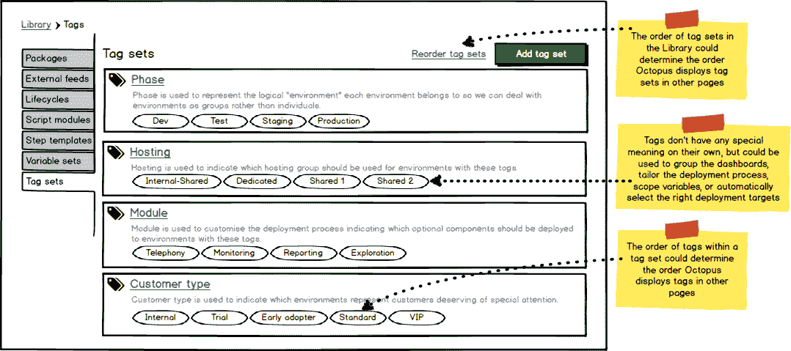

*请注意，这些标签目前意义不大——请继续阅读，了解如何利用这些不同的属性来实现一些引人注目的场景。*

Octopus Deploy 现在可以在配置您的环境时提供这些标记集，并且您可以配置您想要应用于每个环境的实际标记。看看下面，你会注意到标签集已经按照库中的顺序进行了排序。在本例中，我们将`Production-Tenant-Mobil`环境标记为属于`Production`阶段，托管在`Shared 2`托管组中，具有选定的模块，并作为`VIP`客户。

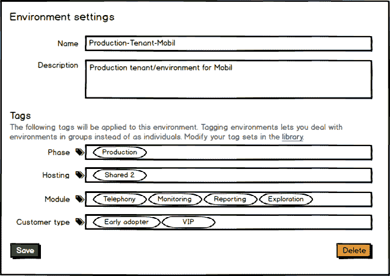

如果您有许多环境，那么如果您能够管理哪些标签被批量应用到环境中，事情会容易得多。这将使您能够添加新的标记集，并快速标记您的所有环境。

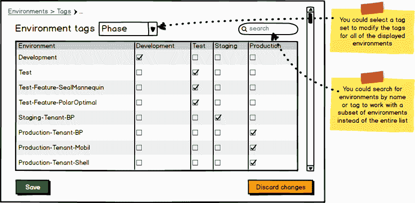

### 改善环境页面

一旦你配置了一些标签集并标记了一些环境，Octopus 就可以通过标签集聚集环境页面。您可以直接钻取其中一个标记，并显示匹配的环境。

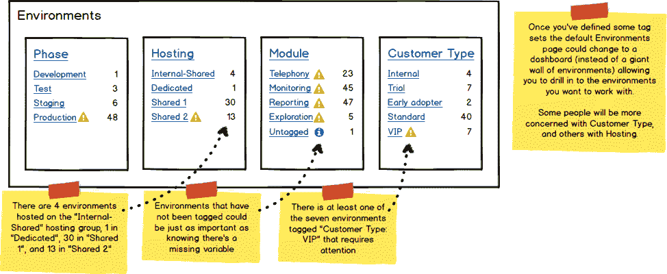

### 改进仪表板

在配置您的标记和环境之后，您可以将仪表板配置为按其中一个标记进行分组。Octopus 可以聚集关于该组的最重要的信息，包括环境的数量、该组的整体状态(如果必要的话，用指示器来引起您的注意)、已经部署到所包含的环境中的版本的范围、以及向所包含的环境推出最新版本的进度。

在这个例子中，我们通过**阶段**标签对环境进行分组。

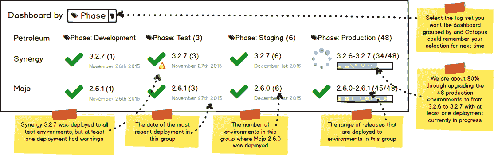

有些人可能对**客户类型**或其他聚合更感兴趣。

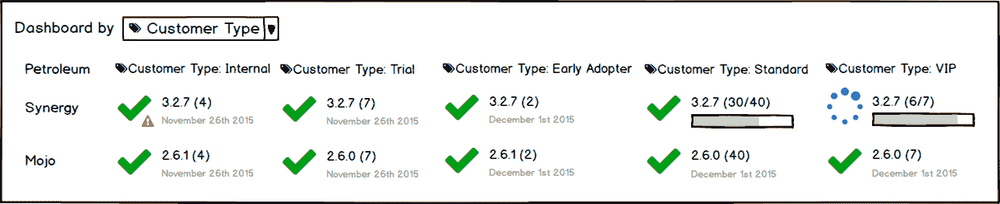

类似地，项目概述可以按标签分组，显示今天的发布历史。

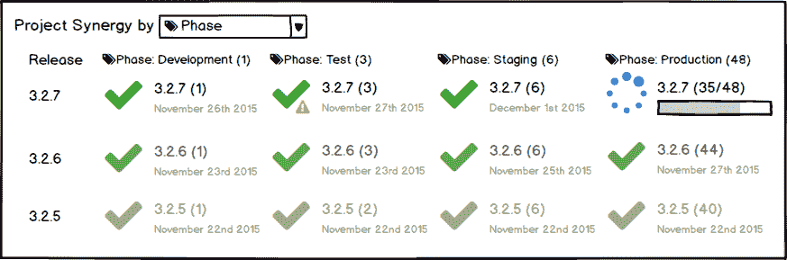

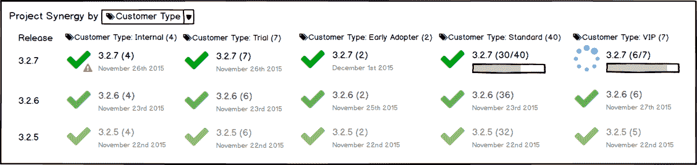

单击其中一个组可以深入到该组，并显示该组中环境的更多详细信息。在本例中，我们点击了 **3.2.6-3.2.7** 以查看该组的详细信息。请注意，我们现在可以垂直排列环境(不再水平滚动),并可能通过名称或其他标签过滤环境。我们还可以显示每个环境的发布历史，以及`Deploy`按钮，这样您就可以从同一个屏幕升级所有的*生产租户*。

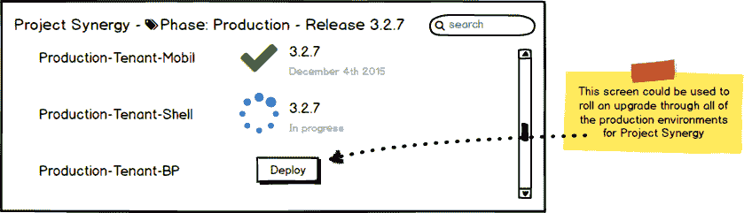

### 通过标签引用环境

当您现在想在 Octopus Deploy 中引用一个环境时，您需要通过环境名显式地引用它。在您创建了一些标签集之后，您可以开始通过标签引用环境。考虑在标记集之前将部署目标配置为多个环境的共享主机**的例子。**

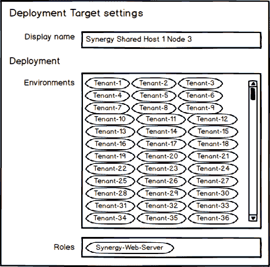

有了标记，您可以简化这个部署目标，只需配置一次，并允许 Octopus 在运行时动态解析应用哪些环境。

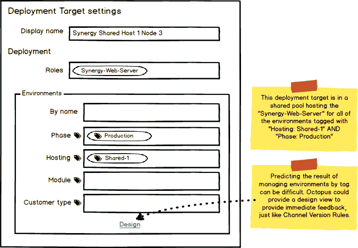

虽然通过标签引用环境在很多方面会更方便，但根据每种情况的复杂性，它可能会变得更混乱。为了帮助驯服额外的复杂性，我们可以提供一个设计视图，类似于我们为设计通道的版本规则所做的。

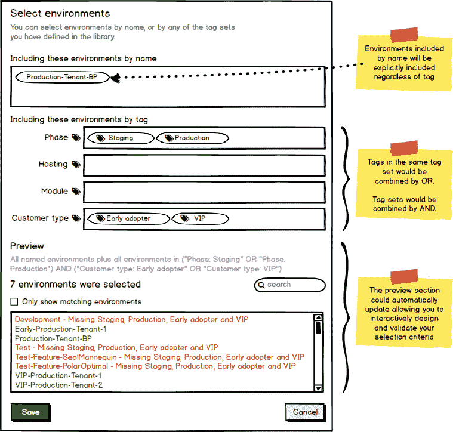

### 管理生命周期、部署目标和账户

如果您可以通过标签引用环境，那么在生命周期、部署目标和帐户中管理环境将变得更加简洁和强大。例如，每当您添加一个新的环境时，Octopus 可以**根据其标签**自动将该环境包含在正确的部署目标、生命周期阶段和帐户中。我们刚刚看到了一个部署目标的示例。在这个例子中，我们定义了一个简单的生命周期，其中每个阶段的环境都由`Phase: *`标签驱动。

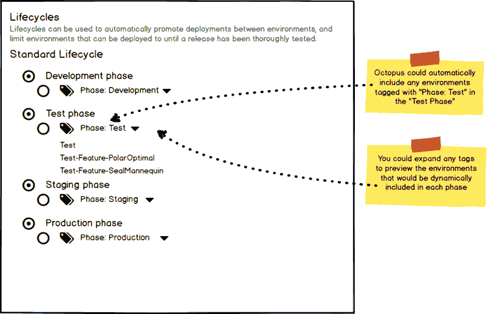

在本例中，所有标有`Phase: Production`的环境都将被授权使用`Synergy Production Subscription`账户。

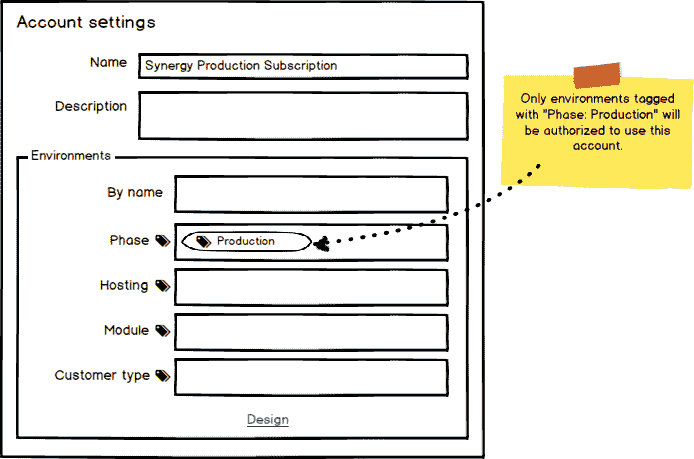

### 范围变量和步骤

如果可以基于标记来确定范围，那么确定变量值的范围会更方便。在本例中，当我们部署到由`Phase: Production`标记定义的任何*生产租户*时，将使用变量值。

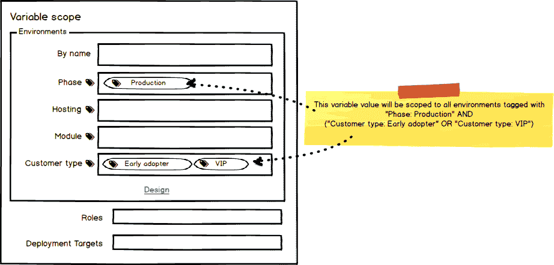

类似地，确定部署步骤的范围会变得更加简单。在这个例子中，我们已经基于几个不同的标签定制了我们的部署过程。首先，我们将把*探索模块*部署给标记为`Module: Exploration`的租户。当标记为`Customer type: VIP`的 VIP 客户升级后，我们还会通知优先支持团队。一旦我们的*生产租户*成功完成部署，我们还将向他们发送定制的电子邮件通知，标签为`Phase: Production`。

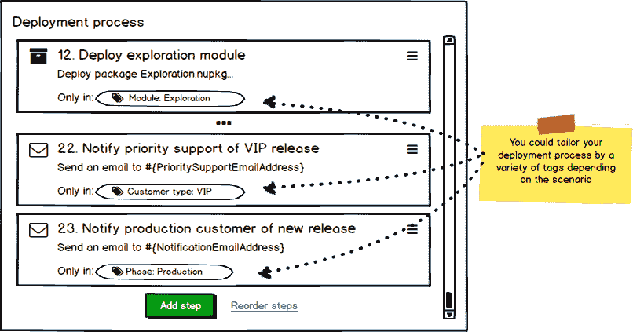

### 管理特定于租户的变量

下一个难题是管理特定于每个租户的变量。为了解决这个问题，我们计划让您直接将变量添加到环境中，但是在我们开始之前，您如何知道哪些变量需要添加到这些环境中呢？想象一下，如果项目可以定义每个不同环境所需的变量，然后每个环境可以提示您它所需的变量。我们提议引入**变量模板**的概念。

### 可变模板

变量模板可以允许项目定义成功部署所需的变量。我们认为变量模板作为复合部分将更易于管理，就像今天的项目变量和库变量集一样。每个项目都可以定义一组在不同环境之间变化的变量，可选地包括库中的公共变量模板。在本例中，项目定义了两个特定的变量模板，并包含了库中的两个变量集模板。

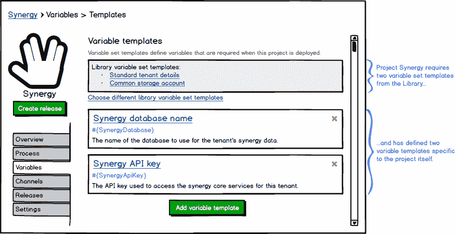

这些变量模板中的每一个都可以以类似于为步骤模板定义参数[的方式进行定义，其中您可以提供变量名、标签、帮助文本、默认值和输入控制类型，如单行/多行文本框、敏感/密码框、复选框或下拉菜单。](http://docs.octopusdeploy.com/display/OD/Step+Templates)

### 环境变量集

如今，许多使用 Octopus 进行多租户部署的客户将为每个租户创建一个库变量集。我们建议将变量作为环境设置的一部分。这样，您可以将所有特定于环境的变量指定为环境本身的一部分，而 Octopus 会自动地、隐式地将这些变量限定在该环境中。当您将一个版本部署到一个特定的环境中时，Octopus 会自动合并该环境中的变量集。

项目已经通过生命周期的方式映射到环境中，因此很自然地假设环境将使用通过生命周期链接到的任何项目中的可变模板。

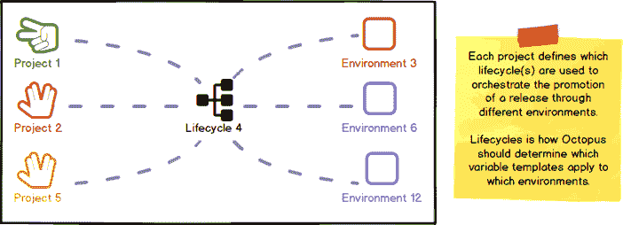

在这个例子中，Synergy 项目将被部署到这个环境中，基于 Synergy 中定义的可变模板，我们需要:

*   `CustomerName`和`TenantAlias`来自`Standard tenant details`库变量集模板
*   `StorageAccountUri`来自`Common storage account`库变量集模板
*   `Synergy`项目中的`SynergyDatabase`和`SynergyApiKey`
*   `MojoDatabase`来自`Mojo`项目

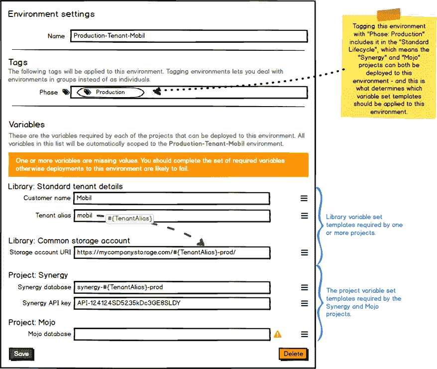

在这种情况下，我们没有为`MojoDatabase`变量定义一个值，而是被提示设置该值。

### 变量检查器

如今，Octopus Deploy 中的变量一般来自项目、库变量集或 step 模板。添加环境作为变量的来源将简化管理变量的某些方面，但是诊断变量的问题可能会变得更加困难。我们建议添加一个变量检查器，这将使它更容易获得一个项目中所有变量的概览，它们的来源，以及是否有任何问题。

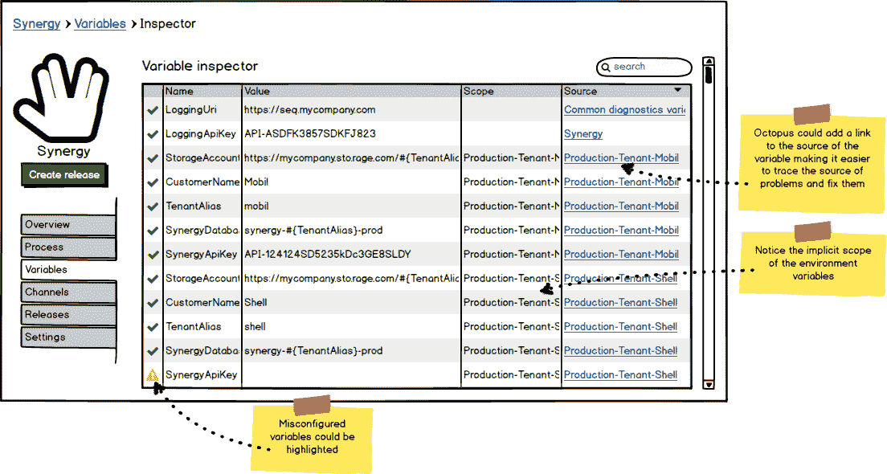

## 不仅仅是多租户

如今，在 Octopus Deploy 中管理大规模多租户部署显然是一件痛苦的事情。我们相信 RFC 中提出的功能将使我们的大多数客户受益。考虑这些场景:

*   类似于多租户的其他使用案例:
    *   管理公共云中的多区域部署，您将部署到几个地理区域，但将它们都视为*生产*。
    *   有多个测试工程师的团队，每个人都有自己的测试环境。
    *   动态试运行/退役特性分支环境，用于在正常的开发/测试/生产生命周期之前测试新特性。
*   开始一个新项目，您配置开发和测试环境。几周后，您希望添加试运行和生产环境，但是忘记了需要为这些新环境添加哪些新变量。
*   出于各种原因，简单地管理大量的环境和变量。
*   出于内聚/权威/安全的原因，希望将特定于环境的变量直接保存在环境中。
*   想给你的项目变量添加更多的结构。

## 收尾

有了这些功能，我们希望与管理大规模多租户部署相关的痛苦将得到显著缓解。考虑创建新租户会涉及哪些内容:

*   为名为`Production-CustomerA`的租户创建新环境
    *   根据需要添加标签
    *   输入提示变量
*   将最新版本部署到`Production-CustomerA`环境中
*   利润！

## 留下评论

你怎么想呢?这是您畅所欲言并帮助我们为您的环境构建合适功能的机会。