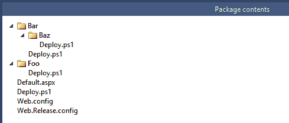
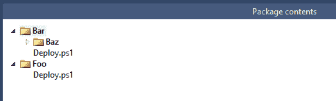

# RFC:只在根目录调用 PowerShell 脚本——Octopus Deploy

> 原文：<https://octopus.com/blog/rfc-root-most-scripts>

想象一个像这样的包:

在部署期间，Octopus Deploy 将在部署期间调用所有四个`Deploy.ps1`脚本。对于首先调用哪个脚本，没有确定的顺序。对于一些人来说，这导致了一些问题——他们的包中可能有一个有不同含义的`Deploy.ps1`脚本(它不是为 Octopus 准备的)。

我们正在考虑做出一些改变，但我不清楚最好的前进方式是什么。我需要你的帮助来决定！请记住，我们的目标之一是让东西开箱即用。答案是**不是**加一堆复选框让它可选【T2:-)

## 选项 1:不要改变它

这是一个简单的选择——调用我们找到的任何文件。我们可以根据深度(脚本有多“根”)排序，然后按字母顺序排序，使其更具确定性。

## 选项 2:只调用根脚本

**更新:我们决定从 Octopus 2.4 开始这样做**

如果根 Deploy.ps1 脚本存在，我们将调用它，否则不调用任何东西。这意味着你*必须*将你的脚本放在包的根目录下(而不是子文件夹中),以便 Octopus 调用它们。

## 选项 3:调用最根的脚本

调用离根最近的脚本。如果根目录下没有脚本，那么我们将遍历子目录并调用找到的第一个脚本。

包装长这样怎么办？

在这种情况下，我们应该 a)两个都调用，b)都不调用，还是 c)调用我们找到的第一个？