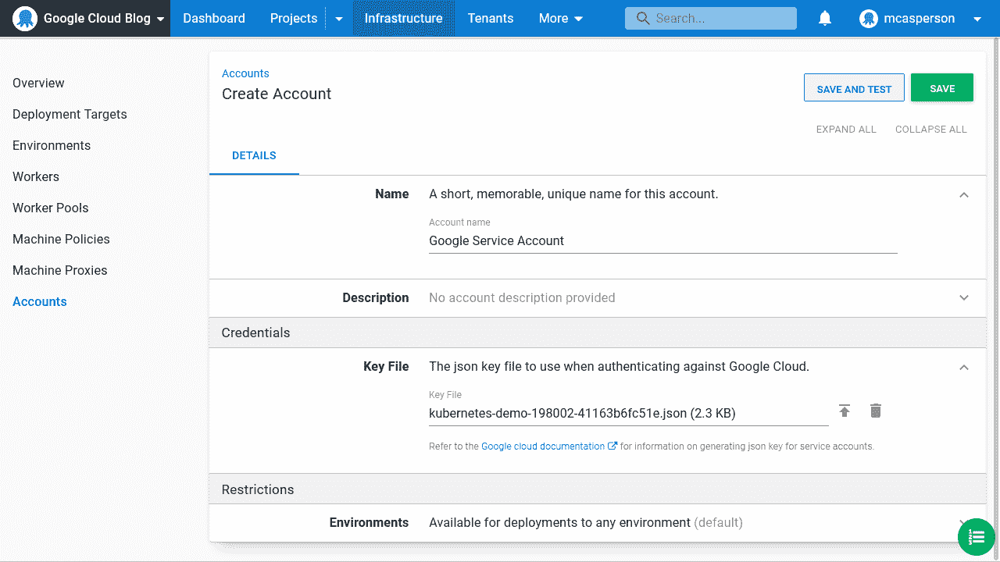
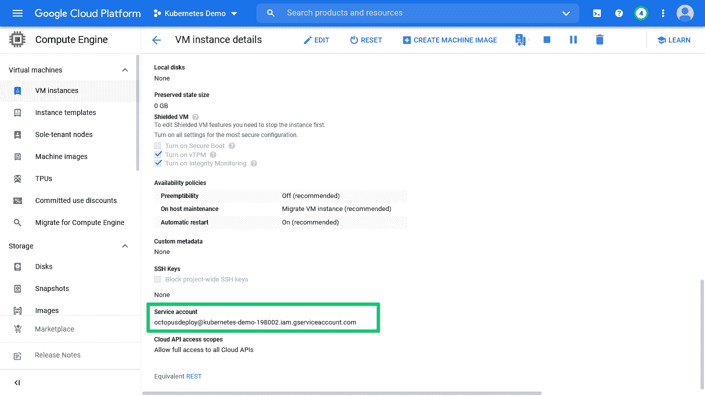
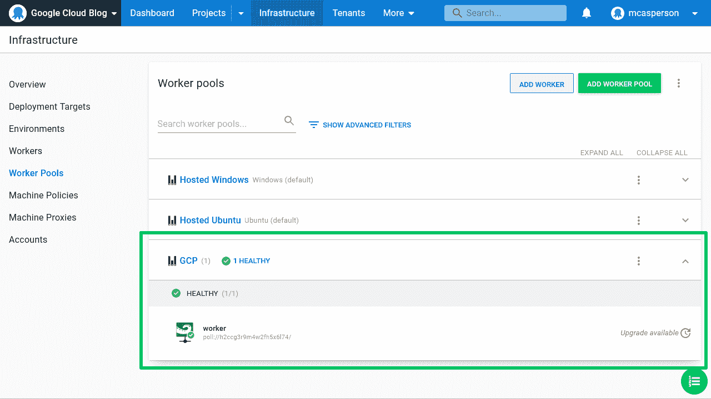
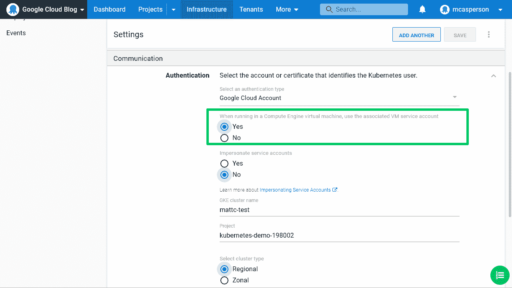
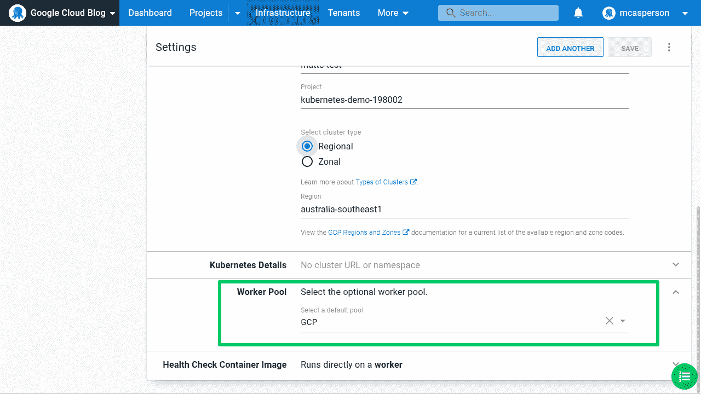
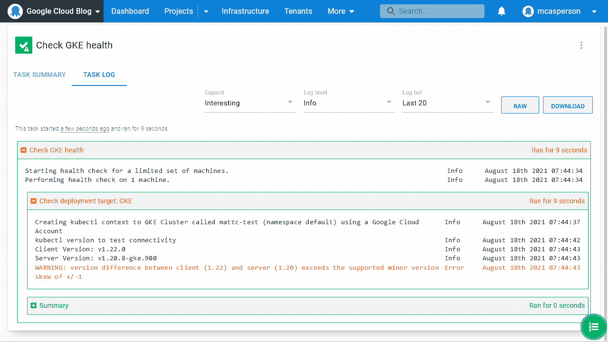
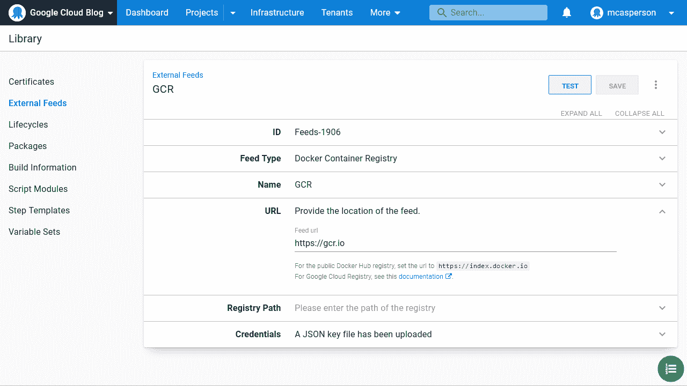
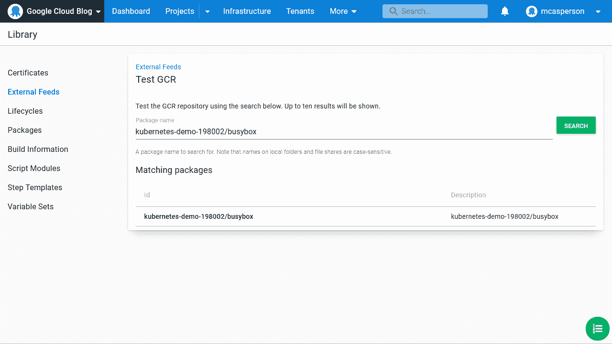
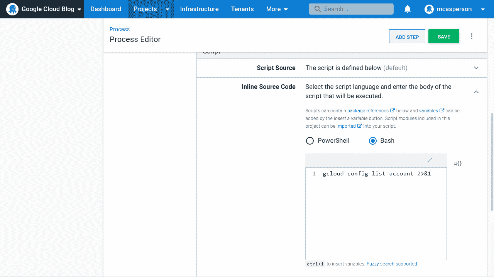
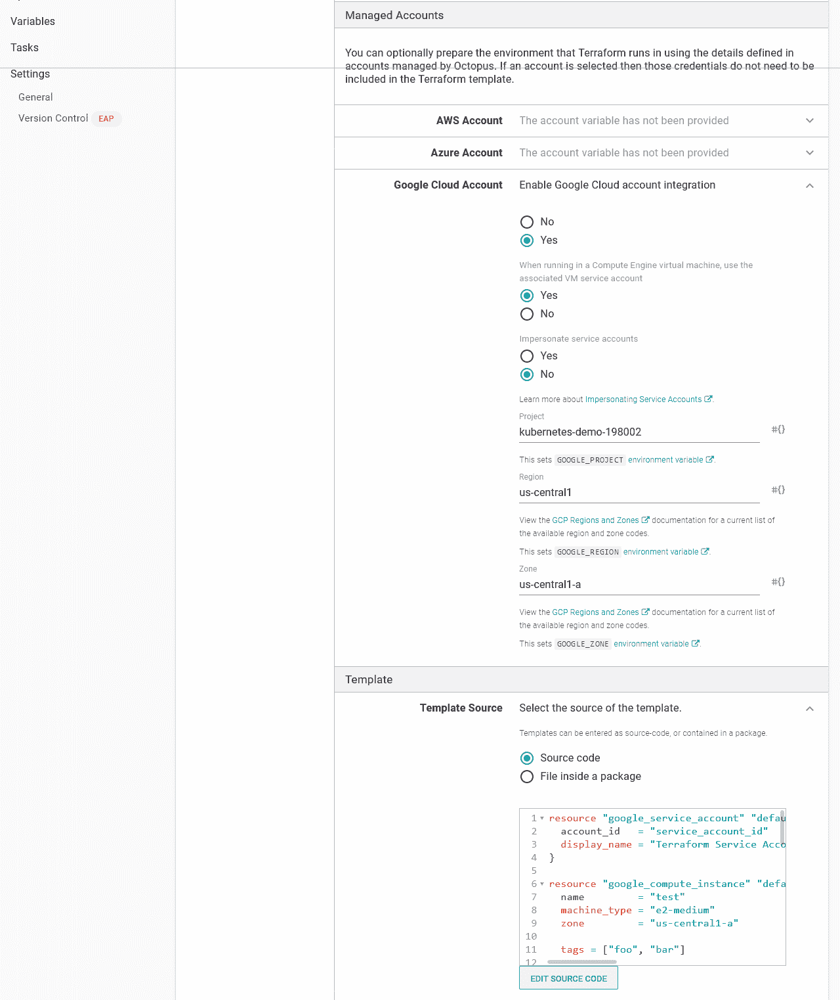

# 请求反馈-使用 Octopus - Octopus Deploy 部署到 Google 云平台

> 原文：<https://octopus.com/blog/rff-deploying-to-google-cloud-platform-with-octopus>

Octopus 2021.2 带来了许多功能来支持团队部署到谷歌云平台(GCP)。在 2021.2 中，Octopus 拥有对 AWS、Azure 和 Google 云平台的核心支持。

这篇文章介绍了 Octopus 支持 GCP 部署的新特性，并提供了如何在您自己的部署过程中使用它们的技巧。

在文章的最后，你可以提供你的反馈，告诉我们这些新功能对你来说是有效的还是无效的，并对 GCP 未来的功能提出建议。

## 服务客户支持

Octopus 包括一个名为**谷歌云账户**的新账户类型。该帐户安全地存储为服务帐户生成的 JSON 密钥:

[](#)

## 继承 VM 服务帐户

对于喜欢在 Octopus 之外管理凭证的团队，每次与 GCP 的集成都允许从工作人员那里继承一个服务帐户。

这是一个带有相关服务帐户的 Google 计算引擎(GCE)虚拟机:

[](#)

该虚拟机上安装了一个工作线程，并链接到 **GCP** 工作线程池:

[](#)

然后，我们可以使用与该虚拟机相关联的服务帐户。下面是一个 Kubernetes 目标的例子，它被配置为继承运行它的工作者的凭证:

[](#)

请注意，目标必须配置有包含 GCE 工作线程的工作线程池:

[](#)

运行状况检查和部署等操作使用分配给工作虚拟机的凭据执行，无需将这些详细信息存储在 Octopus 中:

[](#)

## Google 容器注册支持

Google Container Registry (GCR)支持已经包含在现有的 Docker 提要类型中。将提要 URL 定义为[区域 GCR URL](https://cloud.google.com/container-registry/docs/pushing-and-pulling#add-registry)之一，并提供一个用于认证的服务帐户 JSON 密钥。

[](#)

然后，可以从 GCR 源获得图像:

[](#)

## 支持 gcloud 脚本

名为**在脚本中运行 g cloud**的新步骤可用于在 GCP 帐户的上下文中运行脚本。

作为这一步骤的一部分运行的任何脚本都可以利用 Octopus 管理的登录过程。这使得脚本可以专注于它需要执行的操作，而不是登录的样板过程:

【T2 

## 地形支撑

Terraform 步骤包括使用选定的 Google 凭据建立上下文的能力，将这种担心从 Terraform 模板转移到步骤中。

部署 Terraform 需要持久化状态的能力。对谷歌用户来说，一个方便的解决方案是[将 Terraform 状态保存在谷歌云存储(GCS)桶中](https://www.terraform.io/docs/language/settings/backends/gcs.html):

```
terraform {
  backend "gcs" {
    bucket  = "octopus-tf-state" # change this to match the name of your GCS bucket
    prefix  = "terraform/state"
  }
} 
```

[](#)

## 结论

Octopus 2021.2 支持 GCP 服务帐户、GCR feeds、GKE 身份验证选项、专用的 GCP 脚本步骤以及 Terraform 中的谷歌身份验证支持，可以轻松部署和管理您的 GCP 基础设施。

## 我们需要您的反馈

我们希望听到您的反馈！我们有一个 [GitHub 问题，你可以发表评论](https://github.com/OctopusDeploy/StepsFeedback/issues/7)关于这些新功能对你来说如何工作，或者不工作，以及对未来 GCP 功能的任何建议。欢迎所有反馈，我们很想知道:

*   您目前在 GCP 执行哪些部署或运营任务？
*   部署或管理 GCP 时的难点是什么？
*   你使用谷歌 Kubernetes 引擎、谷歌应用引擎、谷歌云功能、谷歌云运行或其他平台吗？
*   新功能对你有用吗？如果没有，你有什么建议可以改进它们？

[提供反馈](https://github.com/OctopusDeploy/StepsFeedback/issues/7)

愉快的部署！