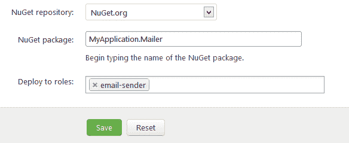

# 角色和升级-征求意见- Octopus 部署

> 原文：<https://octopus.com/blog/roles-and-upgrades>

在之前的一篇文章中，我写了当在 Octopus 中创建一个发布时，[步骤和变量是如何成为“快照”的一部分的。我提到我正在做的一个改变是在 Octopus 中引入“角色”的概念。](http://octopusdeploy.com/blog/releases-and-snapshots)

## 它过去是如何工作的

概括地说，在 Octopus Deploy 的 1.0 版本中，环境有机器，项目中的步骤引用这些机器:

在上面的例子中，我正在为 NuGet 包创建一个步骤，并且我已经从生产环境中选择了两台机器。

这种设计有缺点:

*   如果您添加或删除一台机器，您将不得不更新每个项目，并创建新的版本
*   旧版本不会被部署到新机器上，或者如果它们引用了不存在的机器，则不允许部署

在云计算和横向扩展的世界里，这是一个很大的问题，所以我一直在努力解决这个问题。

## 它将如何工作

在 Octopus Deploy 1.1 中，您可以将机器标记为服务于一个或多个“角色”，您可以自己定义这些角色。

当您创建一个步骤或变量时，不需要专门选择机器，您只需选择一个目标角色:

这同样适用于变量——变量现在可以作用于“角色”,而不是机器。

## 升级

对于 Octopus Deploy 中已有数据的客户来说，这就产生了一个问题。以前，步骤引用机器。在新模型中，步骤引用角色，机器处于角色中。这两种数据模型是不兼容的，我正在尝试决定迁移体验将如何工作。

似乎有几个选择。一个是打破向后兼容性——旧的版本/项目可能变成只读的，在定义角色和更新步骤/变量之后，用户将不得不访问每个项目来创建新的版本。只有这样，您才能再次部署发布。显然这有很多缺点。

选项 2 是通过支持两种模型来无限期地保持向后兼容性。虽然这可能是一个更好的短期体验，但从长远来看，我认为这只会造成混乱，因为有两种方法可以做同样的事情。与旧模型相比，基于角色的模型没有真正的缺点，因此无限期地支持旧模型是没有意义的。

最后，选项 3 是通过自动给每个机器一个唯一的角色(例如，“机器-123”)，然后转换引用该机器的旧步骤/变量以引用其唯一的角色来“适应”数据。通过这种方式，我们将一切都转移到基于角色的模型，旧版本可以继续部署，用户可以在升级后根据需要整理/重构角色。一开始可能会令人困惑，但 Octopus Deploy 用户都非常聪明，所以我认为他们可以处理好:)

## 摘要

处理模式版本中的这种语义差异是一个有趣的问题，目前我倾向于选择 3。

如果你现在正在使用 Octopus Deploy，你希望升级如何进行？请在下面的框中留下您的评论:)