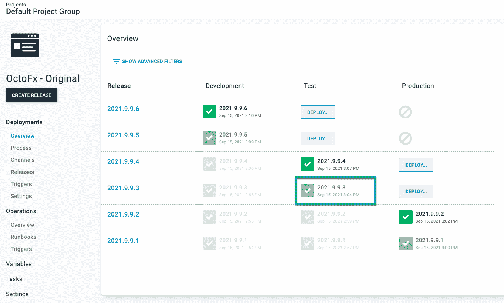
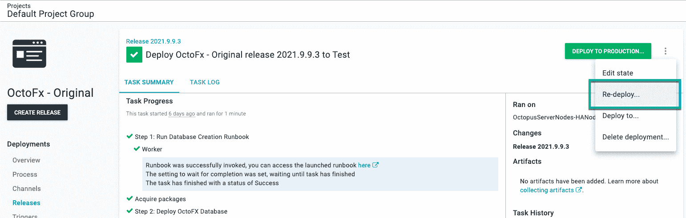
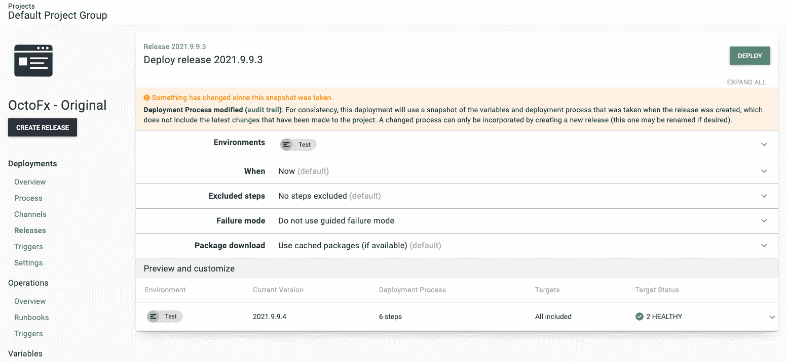
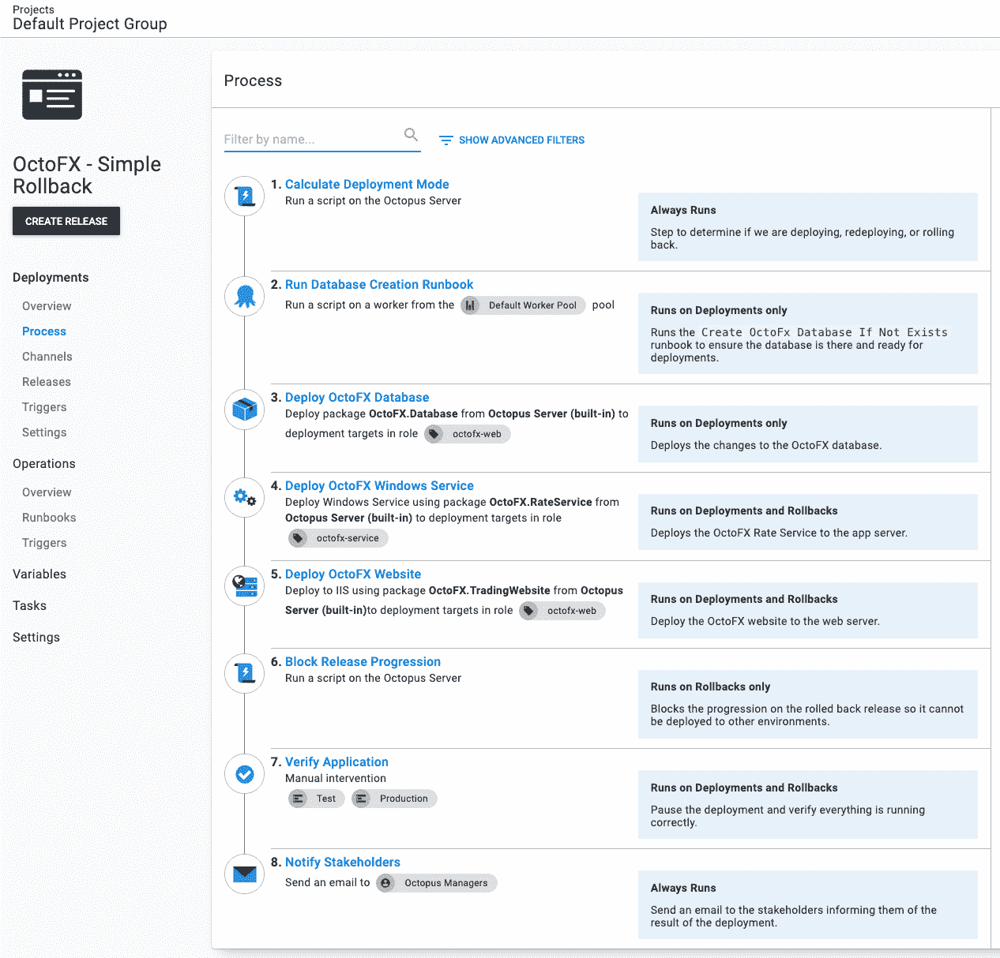
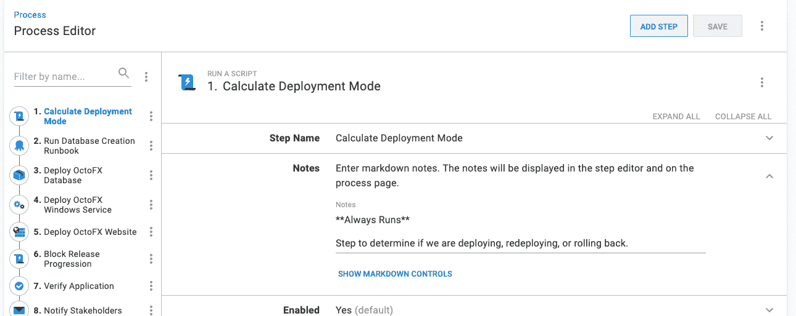
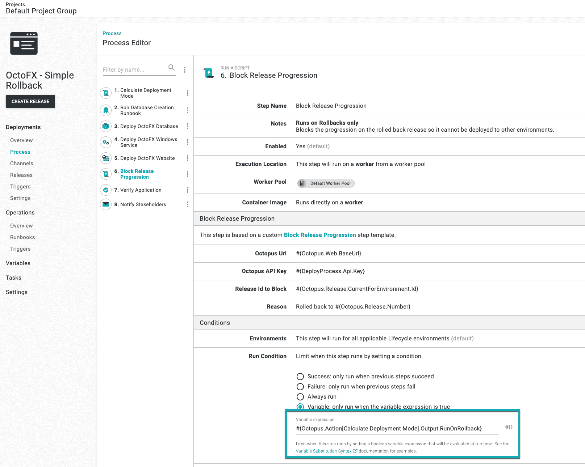
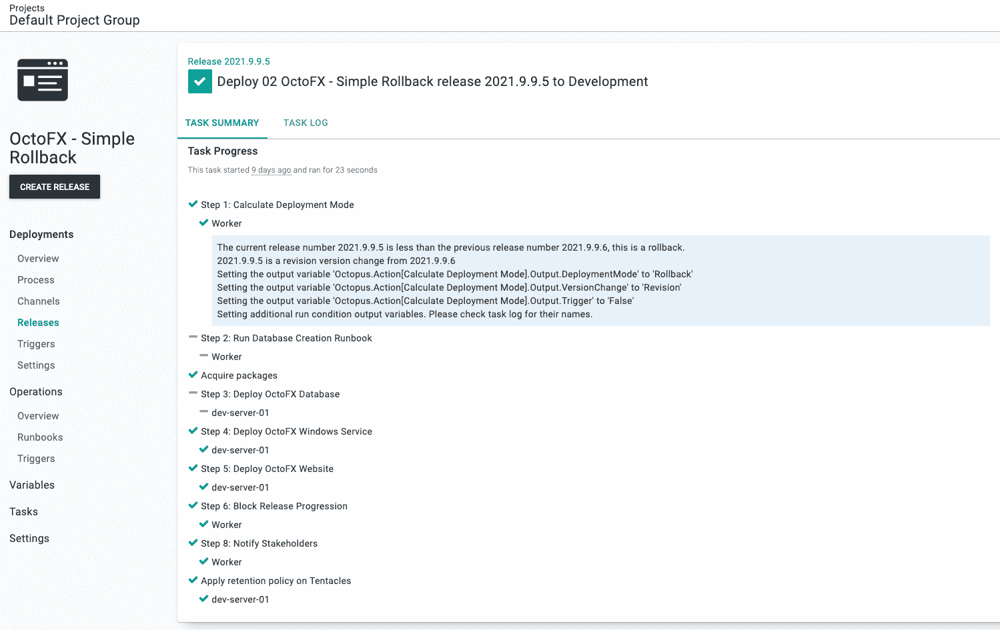
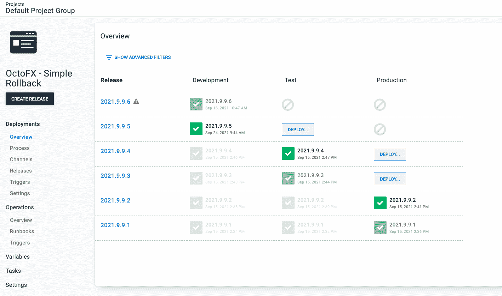

# Octopus Deploy 的回滚策略- Octopus Deploy

> 原文：<https://octopus.com/blog/rollback-strategies>

当讨论回滚时，话题不可避免地转向蓝/绿、红/黑或金丝雀部署模式。这些模式使回滚变得更容易，但是，它们的实现非常耗时，有时它们并不是必需的。也许您推出了一个要测试的 API 变更，并且您想要回到一个已知的良好状态。这不是你第一次尝试实现这些模式的时候。

在这篇文章中，我将介绍一个您现在可以执行的回滚策略，而无需实现高级部署模式。

**超出范围**
回滚数据库更改超出了本文的范围，因为成功回滚数据库更改[是一个复杂的话题，有很多陷阱](https://octopus.com/blog/database-rollbacks-pitfalls)。这篇文章主要关注代码回滚。它演示了如何在回滚期间跳过数据库部署步骤。实际上，代码和 UI 的变化比数据库的变化要频繁得多，尤其是在测试环境中。大多数模式变化发生在新特性的开始，在测试过程中会有一些小的调整。

## 什么是回滚？

这篇文章将帮助您修改现有的(工作的和经过测试的)部署过程，以支持回滚。

首先，让我们看看回滚完成了什么。

考虑这些场景:

*   QA 团队因为在最近的部署测试中引入的一个 bug 而受阻，而该修复离签入还有几个小时。
*   在生产部署验证过程中，发现了一个令人瞠目结舌的错误，需要花一天时间来修复和测试。

在这两种情况下，回滚的目标是相同的；将应用程序快速恢复到已知的良好状态。

许多客户关注生产场景，但是测试场景出现得更频繁，影响也更大。如果你遵循 Octopus Deploy 的核心规则，即[构建一次，在任何地方部署](https://octopus.com/blog/build-your-binaries-once)，那么一个引人注目的 bug 进入生产的机会是很少的。然而，测试是不同的；有一种心态认为只有少数人受到影响，但这是不真实的，因为如果 QA 一次被封锁几个小时，最后期限就会溜走。

目标是回到已知的良好状态，但这不同于部署。跳过特定步骤可以加快回滚速度。许多部署流程都是在假定没有配置任何相关软件或基础架构的情况下创建的。例如，一个部署过程可以触发一个 runbook 来创建一个数据库(如果它还不存在的话);或者安装 Node.js 的最新版本。在回滚期间，不需要这些额外的步骤。如果您在部署应用程序的`2021.2.3`时检查数据库是否存在，那么在回滚到`2021.2.1`时就不需要再次检查了。

For this post:

> 回滚是通过运行原始部署过程的修改版本来返回到已知的良好状态。

## 向前滚动或向后滚动

不是所有的版本都可以也应该回滚。上述场景提到修复需要几个小时或几天的时间。通常，前滚风险更小，耗时更少。一个小的补丁比回滚一个主要版本更容易测试和部署。

以下是我们建议前滚的一些典型原因:

*   您不能选择在二进制文件中回滚哪些代码。要么全部回滚，要么什么都不回滚。一个团队在一个月或一个季度的发布时间表中有几十或几百个变更。这就是为什么我们也建议更定期地发布较小的变更集。
*   通常，数据库和代码更改是紧密结合在一起的。安全地回滚数据库而不丢失数据是极其困难的。
*   用户会注意到什么时候发生了变化，然后又变了回来，尤其是由同一批人整天使用的定制业务应用程序。
*   随着[面向服务架构](https://en.wikipedia.org/wiki/Service-oriented_architecture) (SOA)和它的表亲[微服务](https://en.wikipedia.org/wiki/Microservices)的激增，代码变更很少是孤立进行的。“适当的”SOA 和微服务架构彼此之间以及与它们的客户端之间是松散耦合的。然而，在现实世界中，耦合是存在的。回滚到后端服务可能会产生下游影响。

不过，在几种情况下，回滚可能是正确的解决方案。具有大型数据库的遗留 monolith 应用程序可以在特定情况下成功回滚。这些场景包括:

*   仅更改样式或标记
*   后端代码更改，没有公共接口或模型更改
*   与外部服务或应用程序的耦合为零或最小
*   零到最小的数据库更改(新索引、更改存储过程以提高性能、调整视图以包括已连接表上的附加列)
*   自上一版本以来的少量变化

虽然我们建议进行前滚，但是在您的 CI/CD 渠道中实施回滚过程是一个很有价值的选择，即使回滚每月发生一次。

## 测试您的回滚过程

许多年前，在一次生产部署后的几个小时，我被告知有一个停止显示的 bug。我很惊讶，因为这个版本已经通过了 QA 几周的验证。我们无法确定原因，并得出结论需要回滚-多年来的第一次。

部署文档中的回滚计划是:“回滚到以前版本的代码”。不幸的是，这不是一个详细的计划。我们上报了这个问题，并通知了参与发布的所有人(从 QA 到企业所有者和经理)。

我们从头开始创建了一个新的回滚计划。尽管有新的计划，我们估计成功回滚的几率为 10%。这是一个没有胜算的局面。我们有一个无法重现(因此无法修复)的错误，或者我们可以回滚并抓住机会。

虽然回滚提供了一些机会，但也不是没有机会。每个人都被分配了一项任务。我逐项检查了变更日志，并记录了回滚的影响。

在我们需要做出最终回滚决定的 15 分钟前，我发现了一个看起来可疑的代码块。我测试了那个代码块，确定它是罪魁祸首。

我们中止了回滚计划，实现了一个修复，并在当天晚些时候推出了这个修复。我们不用测试未经证实的回滚过程，这让我们松了一口气。

这个故事强调了多次测试回滚过程的重要性。理想情况下，应该每周对其进行测试和验证。在生产中断期间，您最不想做的事情就是开发一个新的回滚流程或运行一个未经测试的流程。

## 示例部署流程

现在我解释如何更新现有的部署过程来支持回滚。

我选择 [OctoFX 示例应用程序](https://github.com/OctopusSamples/OctoFX)作为这个例子，因为它与我看到和使用的许多应用程序相似。它有以下组件:

*   SQL Server 数据库
*   Windows 服务
*   ASP。NET MVC 网站

该应用程序的部署过程是:

1.  当数据库不存在时，运行操作手册来创建数据库
2.  部署数据库更改
3.  部署 Windows 服务
4.  部署网站
5.  暂停部署并验证应用程序
6.  通知风险承担者部署已完成

[](#)

您的数据库平台、后端服务和前端可能使用不同的技术。在这篇文章中，我更新了这个过程，在回滚过程中跳过特定步骤并运行额外的步骤。

## 重新部署以前的版本

我的回滚过程的核心概念是重新部署以前的版本。您可以通过以下方式做到这一点:

选择您想要重新部署到目标环境的版本。在我的例子中，我将`2021.9.9.3`重新部署到**测试**。

[](#)

点击溢出菜单，选择**重新部署...**。

【T2 

您将被发送到部署屏幕。点击**部署**开始重新部署。

[](#)

## 部署模式

按原样重新部署以前的版本意味着*以前部署的所有*步骤都将重新运行。如前所述，回滚的目标是通过运行稍微修改的部署流程回到已知状态。

您的回滚过程将与示例不同；我使用数据库步骤作为例子。目标是向您展示*如何*禁用步骤，而不是*禁用什么*。

要禁用回滚的特定步骤，我们需要知道回滚正在发生。但是我们将重新部署现有的版本。不过，将同一个版本重新部署到当前环境是一个有效的用例。我们需要知道的是“部署模式”。

*   **部署**:第一次将一个版本部署到一个特定的环境中，为应用程序添加新的特性、修复错误等等。
*   **回滚**:在特定环境下重新部署以前的版本，返回到已知的良好状态。
*   **重新部署**:当一个新的服务器上线，或者您需要“启动”应用程序时，在一个特定的环境中重新部署同一个版本。

我们需要知道这一点，因为它改变了部署过程。部署过程中的部署流程运行所有步骤:

1.  当数据库不存在时，运行操作手册来创建数据库
2.  部署数据库更改
3.  部署 Windows 服务
4.  部署网站
5.  暂停部署并验证应用程序
6.  通知风险承担者部署已完成

回滚将跳过前两步。

1.  ~~当数据库不存在时，运行运行手册创建数据库~~
2.  ~~部署数据库变更~~
3.  部署 Windows 服务
4.  部署网站
5.  暂停部署并验证应用程序
6.  通知风险承担者部署已完成

对于我的应用程序，我只在 web 场向外扩展时进行重新部署。我从不横向扩展应用服务器或数据库。我只想部署网站并通知利益相关者。

1.  ~~当数据库不存在时，运行运行手册创建数据库~~
2.  ~~部署数据库变更~~
3.  ~~部署 Windows 服务。~~
4.  部署网站
5.  ~~暂停部署并验证应用~~
6.  通知风险承担者部署已完成

我们需要计算“部署模式”的能力。Octopus 提供了系统变量:

*   `Octopus.Release.Number`:当前版本号(`1.2.2`)。
*   `Octopus.Release.CurrentForEnvironment.Number`:上次*成功*发布的 ID ( `1.1.1`，部署到当前环境。

比较`Octopus.Release.Number`和`Octopus.Release.CurrentForEnvironment.Number`来计算部署模式:

*   如果更大，那就是部署
*   如果少了，就是回滚
*   如果它们是相同的，那就是重新部署

## 计算部署模式步骤模板

我创建了步骤模板， **[计算部署模式](https://library.octopus.com/step-templates/d166457a-1421-4731-b143-dd6766fb95d5/actiontemplate-calculate-deployment-mode)** ，为您执行计算。使用该结果，它将设置几个输出变量。

*   **部署模式**:将是`Deploy`、`Rollback`或`Redeploy`
*   **触发**:指示部署是由部署目标触发还是调度触发引起的——将是`True`或`False`
*   **版本变更**:将会是`Identical`、`Major`、`Minor`、`Build`或`Revision`

在使用步骤模板时，我意识到大多数人会在[变量运行条件](https://octopus.com/docs/projects/steps/conditions#variable-expressions)中使用 **DeploymentMode** 输出变量。由于错误处理，运行条件的语法可能很难正确。Octopus 总是评估变量运行条件，以确定该步骤是否应该运行，即使前一步骤中出现错误。如果我们在运行条件中不包括错误处理，它可以评估为`True`并运行该步骤。我们不想那样。

当部署模式为`Rollback`并进行所有必要的错误处理时，变量运行条件为:

```
#{unless Octopus.Deployment.Error}#{if Octopus.Action[Calculate Deployment Mode].Output.DeploymentMode == "Rollback"}True#{else}False#{/if}#{/unless} 
```

我添加了以下输出变量，并添加了必要的错误处理和比较逻辑，使之更容易。

*   `RunOnDeploy`:仅当 DeploymentMode 为`Deploy`时运行该步骤
*   `RunOnRollback`:仅当部署模式为`Rollback`时运行该步骤
*   `RunOnRedeploy`:仅当 DeploymentMode 为`Redeploy`时运行该步骤
*   `RunOnDeployOrRollback`:仅当 DeploymentMode 为`Deploy`或`Rollback` - `RunOnDeployOrRedeploy`时运行该步骤:仅当 DeploymentMode 为`Deploy`或`Re-deploy`时运行该步骤
*   `RunOnRedeployOrRollback`:仅当 DeploymentMode 为`Redeploy`或`Rollback`时运行该步骤
*   `RunOnMajorVersionChange`:仅在版本变更为`Major`时运行该步骤
*   `RunOnMinorVersionChange`:仅在版本变更为`Minor`时运行该步骤
*   `RunOnMajorOrMinorVersionChange`:仅在版本变更为`Major`或`Minor`时运行该步骤
*   `RunOnBuildVersionChange`:仅在版本变更为`Build`时运行该步骤
*   `RunOnRevisionVersionChange`:仅在版本变更为`Revision`时运行该步骤

对于这些输出变量，相同的**回滚**运行条件的语法是:

```
#{Octopus.Action[Calculate Deployment Mode].Output.RunOnRollback} 
```

## 阻止发布进展步骤模板

我提到了我想在回滚期间运行的一个附加步骤。一个例子是阻止发布进程。即使在测试环境中，回滚也是一个重大事件。如果一个版本有多个 bug，您不希望它转移到生命周期中的下一个环境。

Octopus 让你[阻止释放进程](https://octopus.com/docs/releases/prevent-release-progression)，然而，那是一个手动步骤。我避免手工步骤，所以我制作了一个新的步骤模板，[Block Release Progression](https://library.octopus.com/step-templates/78a182b3-5369-4e13-9292-b7f991295ad1/actiontemplate-block-release-progression)，以防止发布进程成为部署过程的一部分。

## 具有回滚步骤的部署流程

使用[计算部署模式](https://library.octopus.com/step-templates/d166457a-1421-4731-b143-dd6766fb95d5/actiontemplate-calculate-deployment-mode)、[可变运行条件](https://octopus.com/docs/projects/steps/conditions#variable-expressions)和[块释放进度](https://library.octopus.com/step-templates/78a182b3-5369-4e13-9292-b7f991295ad1/actiontemplate-block-release-progression)，更新后的部署流程为:

1.  计算部署模式
2.  当数据库不存在时，运行运行手册以创建数据库(仅当部署模式为**部署**时运行)
3.  部署数据库更改(仅在部署模式为**部署**时运行)
4.  部署 Windows 服务
5.  部署网站
6.  阻止发布进程(仅在部署模式为**回滚**时运行)
7.  暂停部署并验证应用程序(仅在部署模式为**部署**或**回滚**时运行)
8.  通知风险承担者部署已完成

[](#)

使用步骤**注释**功能来指示在部署、回滚或始终运行哪个步骤。

[](#)

### 设置运行条件

标记为“仅在部署模式为**回滚**时运行”或“仅在部署模式为**部署**或**回滚**时运行”的步骤需要将**运行条件**更新为变量。该变量将是 **[计算部署模式](https://library.octopus.com/step-templates/d166457a-1421-4731-b143-dd6766fb95d5/actiontemplate-calculate-deployment-mode)** 步骤的输出变量之一。

[](#)

### 测试回滚

对于我的测试，我有两个版本:

*   `2021.9.9.5`:目前在**开发**环境中。
*   `2021.9.9.6`:这是我想部署到**开发**的新版本。

将`2021.9.9.6`部署到**开发**正如预期的那样。步骤 6 被跳过，因为它被设置为仅在部署模式为**回滚**时运行。

[T39](#)

在我的测试场景中，在部署后发现了`2021.9.9.6`中的一个停止显示的 bug。我们希望:

*   回滚到`2021.9.9.5`。
*   阻止`2021.9.9.6`上的进程，以防止其被部署到**测试**或**生产**。

重新部署`2021.9.9.5`按预期进行。运行步骤 6 时，跳过步骤 2 和 3。

[](#)

此外，`2021.9.9.6`已经阻止了发布进程。用户将在项目仪表板上看到一个可视指示器。

[](#)

## 自动回滚

接下来，您需要考虑触发回滚。我建议手动触发回滚并记录一个解释。当您看到一个模式时，您应该添加自动化测试来检测是否满足特定的条件。我担心的是收到一个“误报”，导致一个发布在不应该的时候回滚到生产中。

在这个场景中，我不会自动触发回滚，直到我自动执行了所有步骤来做出回滚决定。

例如，如果您的一个条件没有数据库更改，您应该让脚本检查 SQL 脚本的模式更改(例如:添加表，添加列)。如果发现模式改变，那么回滚是不可能的。

接下来，自动触发所有非生产环境的回滚。在做出几次成功的回滚决策后，将其用于生产。

## 结论

我认为采用蓝/绿、红/黑或金丝雀等高级部署模式是回滚的唯一方法。我曾经认为，只有在无法采用这些模式的情况下，才应该进行前滚，以节省现有应用程序的时间和金钱。采用高级部署模式有其合理的商业原因，例如，Google 永远不会宕机，因此金丝雀式的部署是有意义的。

但是，一个由几十个人在美国东部时间早上 6 点到太平洋时间晚上 10 点使用的内部业务应用程序不会获得同样的成本收益。

您可以使用[可变运行条件](https://octopus.com/docs/projects/steps/conditions#variable-expressions)和新的步骤模板、 **[计算部署模式](https://library.octopus.com/step-templates/d166457a-1421-4731-b143-dd6766fb95d5/actiontemplate-calculate-deployment-mode)** 和 **[块发布进度](https://library.octopus.com/step-templates/78a182b3-5369-4e13-9292-b7f991295ad1/actiontemplate-block-release-progression)** ，对您现有的部署流程进行一些调整来创建回滚流程。虽然它们不会支持所有可能的回滚场景，但是如果您发现一个 bug，它们会为您提供其他选项。

## 观看网络研讨会:Octopus Deploy 的回滚策略

[https://www.youtube.com/embed/F_V7r80aDbo](https://www.youtube.com/embed/F_V7r80aDbo)

VIDEO

我们定期举办网络研讨会。请参见[网络研讨会第](https://octopus.com/events)页，了解有关即将举办的活动和实时流录制的详细信息。

愉快的部署！