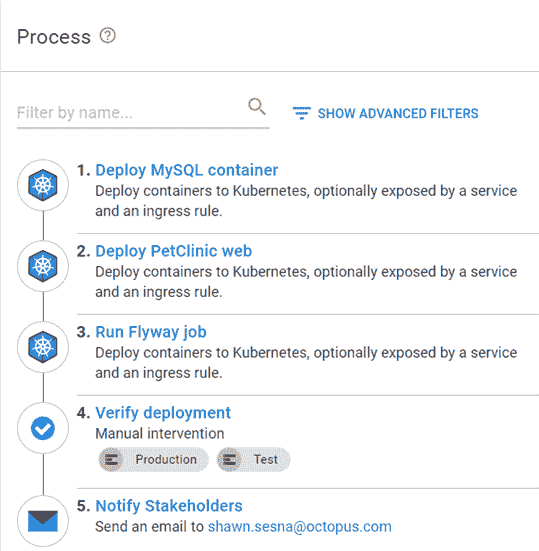
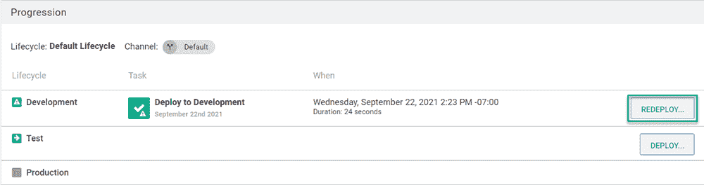
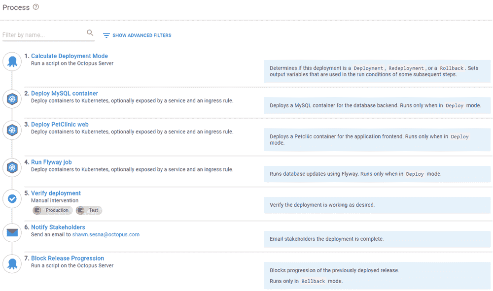
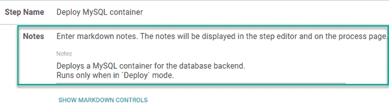
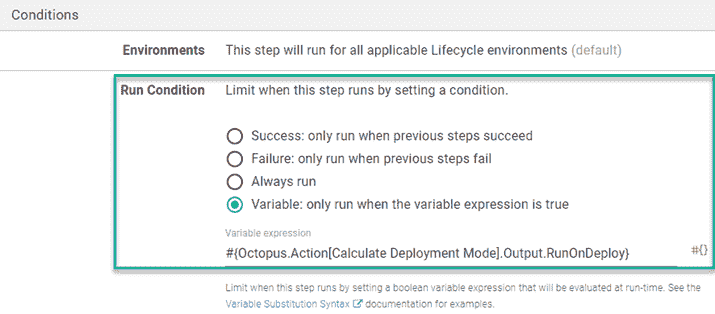
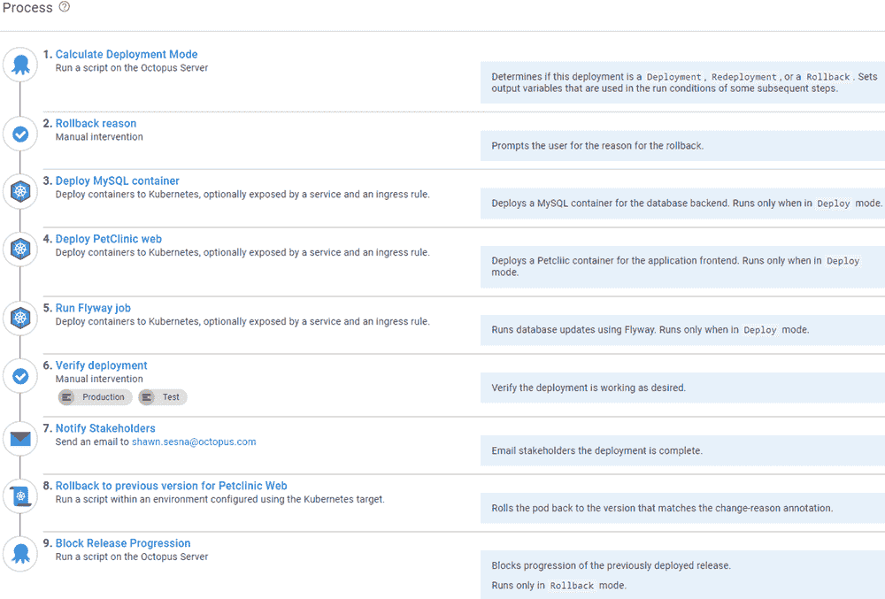
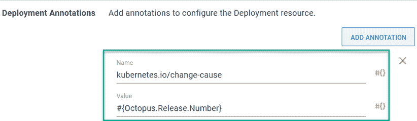

# 回滚 Kubernetes 部署- Octopus 部署

> 原文：<https://octopus.com/blog/rolling-back-kubernetes-deployment>

在部署到 Kubernetes 时，并不是每个部署都像我们希望的那样顺利。bug、容器环境变量和硬件限制可以决定应用程序在部署到 Kubernetes 集群后是否能够运行。当修复不容易或者应用程序没有响应时，您需要回到以前的版本。这个过程称为回滚。

在这篇文章中，我使用 Octopus Deploy 描述了一些通用的和特定于 Kubernetes 的回滚策略。

## 示例部署流程

本文使用内置的**Deploy Kubernetes Containers**来部署基于 Java 的 [PetClinic 应用程序](https://bitbucket.org/octopussamples/petclinic/src/master/)的容器化版本。

这个应用程序由一个 web 前端和一个 MySQL 后端组成。MySQL 后端也被部署为一个容器，使用 Flyway 将数据库更新作为 Kubernetes 的一项工作来执行。示例流程如下所示:

1.  部署 MySQL 容器
2.  部署 PetClinic web
3.  运行飞行路线作业
4.  验证部署
5.  通知利益相关方

[](#)

本文假设您熟悉示例流程中的步骤。我只介绍实现这里讨论的策略的更新。

## 重新部署以前的版本

通过重新部署以前的版本，很容易从失败的部署中恢复。在 Octopus Deploy 中，您只需点击**发布**，选择发布，然后点击您想要重新部署到的环境旁边的**重新部署**。

[](#)

## 回滚期间有条件地执行步骤

redeploy 方法完全按照第一次部署的方式执行部署，执行流程中的所有步骤。但是，您可能希望在回滚过程中跳过一些步骤，例如数据库步骤。

要跳过这些步骤，您需要确定正在发生什么活动；部署、重新部署或回滚，然后有条件地控制执行哪些步骤。您可能还希望您正在回滚的版本被阻止进入其他环境。

更新后的流程如下所示:

1.  计算部署模式
2.  部署 MySQL 容器(仅在部署模式下)
3.  部署 PetClinic web
4.  运行 Flyway 作业(仅在部署模式下)
5.  验证部署
6.  通知利益相关方
7.  阻止释放进程(仅在回滚模式下)

[](#)

您会注意到该过程显示了该步骤将在哪些模式下运行。这不是添加条件语句的结果。该流程利用了某个步骤的**注释**字段，因此您知道在哪些场景中执行了哪些步骤。

[](#)

### 计算部署模式

为了确定部署处于哪种模式，我们的团队开发了 **[计算部署模式](https://library.octopus.com/step-templates/d166457a-1421-4731-b143-dd6766fb95d5/actiontemplate-calculate-deployment-mode)** 步骤模板。该模板将正在部署的版本号与之前部署到环境中的版本号进行比较，以确定正在发生什么活动。为了方便起见，它还设置了[输出变量](https://octopus.com/docs/projects/variables/output-variables)，这些变量可以用作步骤上的[条件](https://octopus.com/docs/projects/steps/conditions)。

### 回滚期间跳过数据库步骤

为了确保 MySQL 和 Flyway 步骤仅在部署期间执行，添加以下来自**计算部署模式**的输出变量作为变量运行条件:

```
#{Octopus.Action[Calculate Deployment Mode].Output.RunOnDeploy} 
```

[](#)

### 阻止发布进展步骤

在 Octopus Deploy 中，阻止发布进程并不新鲜，但是，它需要手动或通过 API 调用来完成。我们的团队开发了**[Block Release Progression](https://library.octopus.com/step-templates/78a182b3-5369-4e13-9292-b7f991295ad1/actiontemplate-block-release-progression)**步骤模板来阻止指定的发布在部署过程中进行。

为了确保此步骤不会在部署期间运行，请添加以下变量运行条件:

```
#{Octopus.Action[Calculate Deployment Mode].Output.RunOnRollback} 
```

## 使用 Kubernetes 修订历史回滚

Kubernetes 为 pods 保留了一个滚动修订历史，因此您可以回滚到任何存储的修订(修订的数量可以用默认值 10 进行配置)。命令`kubectl rollout history deployment.v1.apps/<deploymentname>`列出了 Kubernetes 部署的所有存储修订。

```
REVISION  CHANGE-CAUSE
1         <none>
2         <none>
3         <none> 
```

您需要修改您的部署过程，以便将一个修订绑定到一个特定的发布。更新后的流程如下所示:

1.  计算部署模式
2.  回滚原因(仅在回滚模式下)
3.  部署 MySQL 容器(仅在部署模式下)
4.  部署 PetClinic web
5.  运行 Flyway 作业(仅在部署模式下)
6.  验证部署
7.  通知利益相关方
8.  回滚到 PetClinic web 的先前版本(仅在回滚模式下)
9.  阻止释放进程(仅在回滚模式下)

[](#)

让我们来看一下新添加和更新的步骤。

### 回滚原因

**回滚原因**是一个 **[手动干预](https://octopus.com/docs/projects/built-in-step-templates/manual-intervention-and-approvals)** 步骤，提示您回滚的原因。指定的原因可用于**块释放进程**步骤中的**原因**字段。添加变量 run condition，以便它只在回滚期间执行。

### 部署 PetClinic web

在这一步中，您需要做两处修改

*   添加一个运行条件，使其仅在部署模式下运行
*   添加一个部署注释，将发布与修订联系起来

#### 添加运行条件

我们已经看到了如何设置一个可变的运行条件，以便该步骤只在部署期间执行。

#### 添加部署注释

在**部署 Kubernetes 容器**步骤中，转到**部署注释**并添加一个注释类型`kubernetes.io/change-cause`，其值为`#{Octopus.Release.Number}`

【T2 

运行`kubectl rollout history deployment.v1.apps/<deploymentname>`现在将显示:

```
REVISION  CHANGE-CAUSE
1         2021.09.23.0
2         2021.09.23.1
3         2021.09.23.2 
```

### 回滚到 PetClinic web 的先前版本

现在`CHANGE-CAUSE`列包含了修订版的发布版本，您可以使用 **Run a Kubectl CLI Script** 步骤来解析部署历史，以确定回滚到哪个版本。

```
# Init variables
$k8sRollbackVersion = 0
$rollbackVersion = $OctopusParameters['Octopus.Release.Number']
$namespace = $OctopusParameters['Project.Namespace.Name']
$deploymentName = $OctopusParameters['Project.Petclinic.Deployment.Name']

# Get revision history
Write-Host "Getting deployment $deploymentName revision history ..."
$revisionHistory = (kubectl rollout history deployment.v1.apps/$deploymentName -n $namespace)
$revisionHistory = $revisionHistory.Split("`n")

# Loop through history starting at index 2 (first couple of lines aren't versions)
Write-Host "Searching revision history for version $rollbackVersion ..."
for ($i = 2; $i -lt $revisionHistory.Count - 1; $i++)
{
    # Split it into two array elements
    $revisionSplit = $revisionHistory[$i].Split(" ", [System.StringSplitOptions]::RemoveEmptyEntries)

    # Check version
    if ($revisionSplit[1] -eq $rollbackVersion)
    {
        # Record version index
        Write-Host "Version $rollbackVersion found!"
        $k8sRollbackVersion = $revisionSplit[0]

        # Get out of for
        break
    }
}

# Check to see if something was found
if ($k8sRollbackVersion -gt 0)
{
    # Issue rollback
    Write-Host "Rolling Kubernetes deployment $deploymentName to revision $k8sRollbackVersion ..."
    kubectl rollout undo deployment.v1.apps/$deploymentName -n $namespace --to-revision=$k8sRollbackVersion
}
else
{
    Write-Error "Version $rollbackVersion not found in cluster revision history."
} 
```

除了集装箱启动时间，这一行动可以在几秒钟内完成。

## 结论

使用本文中讨论的策略，您可以在部署过程中直接配置回滚功能，包括部署到 Kubernetes 的应用程序。

## 观看网络研讨会:Octopus Deploy 的回滚策略

[https://www.youtube.com/embed/F_V7r80aDbo](https://www.youtube.com/embed/F_V7r80aDbo)

VIDEO

我们定期举办网络研讨会。请参见[网络研讨会第](https://octopus.com/events)页，了解即将举办的活动和实时视频录制的详细信息。

愉快的部署！