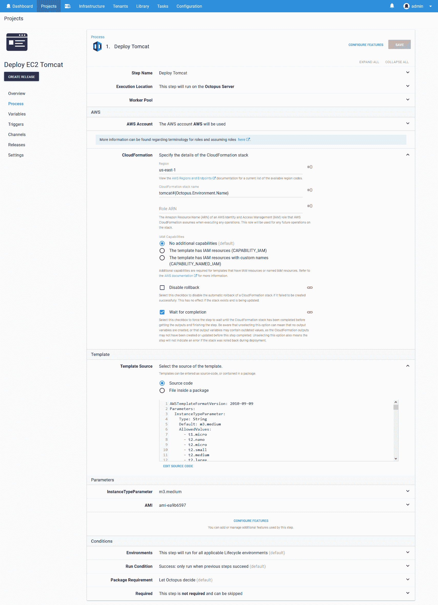
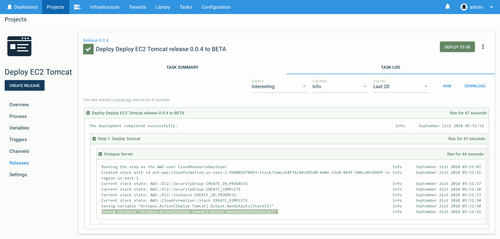
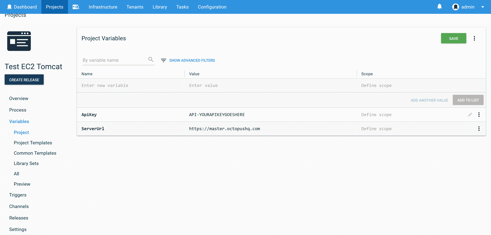
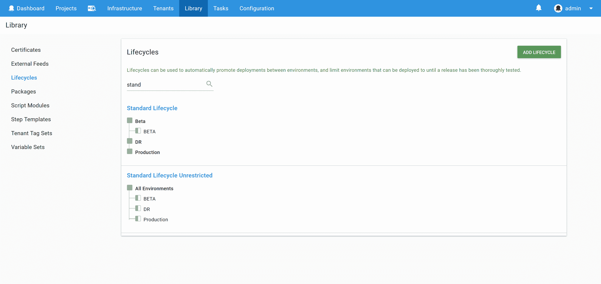
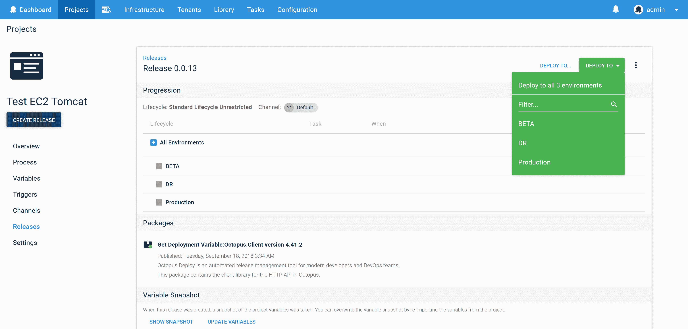
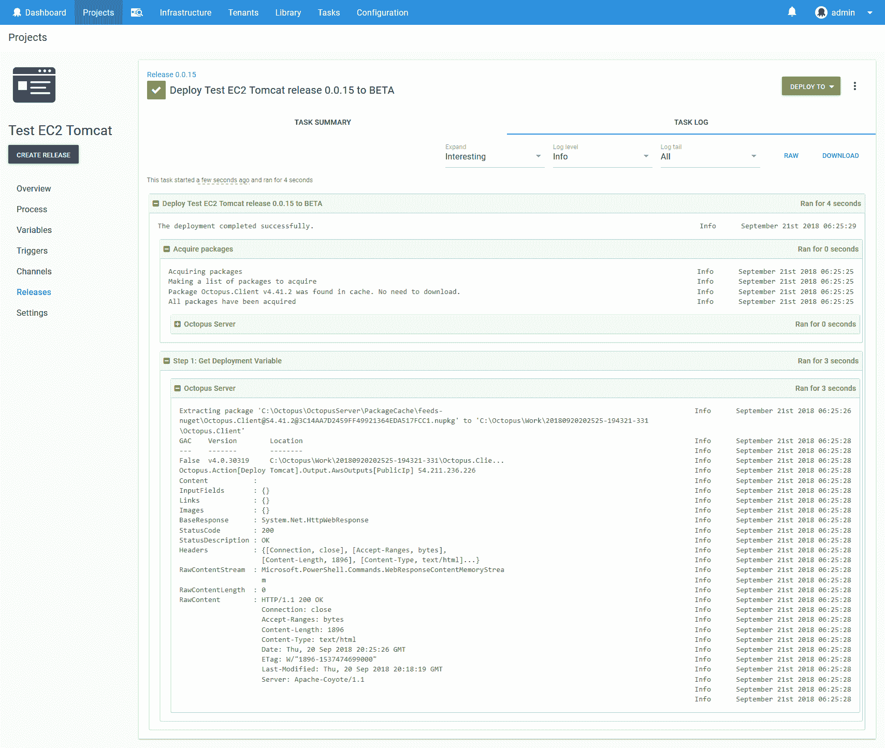

# 针对 Octopus - Octopus Deploy 部署的云基础架构运行手动测试

> 原文：<https://octopus.com/blog/running-tests>

[](#)

今年悉尼 NDC 会议期间出现的一个问题是，如何针对以前在各种环境中的部署运行 UI 测试。测试不一定是部署过程的一部分，但是可以手动运行或者按照单独的时间表运行。尽管不是这样的部署，但从 Octopus 运行测试将会很方便，因为 Octopus 拥有关于应用程序部署位置的所有信息。

所以从高层次来看，问题是这样的:

1.  将应用程序部署到环境中。
2.  部署会产生一个 URL。
3.  在部署完成后的某个时间点，开始对最后一次部署进行 UI 测试。

为了演示这个用例，我们将首先向 AWS 部署一个 CloudFormation 模板，它创建一个带有公共 IP 地址的 EC2 实例。EC2 实例将运行 Tomcat 来模拟可测试的 web 服务器。

下面的 YAML 文件可以和`Deploy an AWS CloudFormation template`步骤一起使用来启动一个安装了 Tomcat 8 的 Ubuntu 实例。

```
AWSTemplateFormatVersion: 2010-09-09
Parameters:
  InstanceTypeParameter:
    Type: String
    Default: m3.medium
    AllowedValues:
      - t1.micro
      - t2.nano
      - t2.micro
      - t2.small
      - t2.medium
      - t2.large
      - m1.small
      - m1.medium
      - m1.large
      - m1.xlarge
      - m2.xlarge
      - m2.2xlarge
      - m2.4xlarge
      - m3.medium
      - m3.large
      - m3.xlarge
      - m3.2xlarge
      - m4.large
      - m4.xlarge
      - m4.2xlarge
      - m4.4xlarge
      - m4.10xlarge
      - c1.medium
      - c1.xlarge
      - c3.large
      - c3.xlarge
      - c3.2xlarge
      - c3.4xlarge
      - c3.8xlarge
      - c4.large
      - c4.xlarge
      - c4.2xlarge
      - c4.4xlarge
      - c4.8xlarge
      - g2.2xlarge
      - g2.8xlarge
      - r3.large
      - r3.xlarge
      - r3.2xlarge
      - r3.4xlarge
      - r3.8xlarge
      - i2.xlarge
      - i2.2xlarge
      - i2.4xlarge
      - i2.8xlarge
      - d2.xlarge
      - d2.2xlarge
      - d2.4xlarge
      - d2.8xlarge
      - hi1.4xlarge
      - hs1.8xlarge
      - cr1.8xlarge
      - cc2.8xlarge
      - cg1.4xlarge
    Description: Enter instance size. Default is m3.medium.
  AMI:
    Type: String
    Default: ami-ea9b6597
    Description: AMI Image
Resources:
  InstanceSecurityGroup:
    Type: AWS::EC2::SecurityGroup
    Properties:
      GroupDescription: Enable SSH access via port 22, and open web port 8080
      SecurityGroupIngress:
      - IpProtocol: tcp
        FromPort: '22'
        ToPort: '22'
        CidrIp: '0.0.0.0/0'
      - IpProtocol: tcp
        FromPort: '8080'
        ToPort: '8080'
        CidrIp: '0.0.0.0/0'
  Ubuntu:
    Type: 'AWS::EC2::Instance'
    Properties:
      ImageId: !Ref AMI
      InstanceType:
        Ref: InstanceTypeParameter
      KeyName: DukeLegion
      SecurityGroups:
        - Ref: InstanceSecurityGroup
      Tags:
        -
          Key: Name
          Value: Ubuntu with Tomcat
      UserData:
        Fn::Base64: |
          #cloud-boothook
          #!/bin/bash
          sudo apt-get update
          sudo apt-get install -y tomcat8
          sudo service tomcat8 start
Outputs:
  PublicIp:
    Value:
      Fn::GetAtt:
      - Ubuntu
      - PublicIp
    Description: Server's PublicIp Address 
```

下面是章鱼里的步骤截图。

[](#)

运行这个步骤会导致新 EC2 实例的公共 IP 被保存为一个变量。在该步骤生成的日志输出中，您可以看到文本`Saving variable "Octopus.Action[Deploy Tomcat].Output.AwsOutputs[PublicIp]"`，它记录了如何访问该变量。

[](#)

这样的变量在后续步骤中很容易消耗。但是在这个用例中，我们希望在以后访问这些变量，而不是作为当前部署的一部分。

为了演示使用从以前的部署中生成的 URL 运行测试，我们将创建第二个 Octopus 项目。该项目将包含以下 Powershell 的单个脚本步骤。这个脚本利用 Octopus 客户端库来查询部署的细节。

虽然在这个例子中这段代码是在 Octopus 中运行的，但是如果需要的话，它也可以在外部运行。只是要确保提供`$ServerUrl`、`$ApiKey`和`$OctopusParameters["Octopus.Environment.Name"]`变量的替代变量，因为这些变量是由 Octopus 提供的。

```
[Reflection.Assembly]::LoadFrom("Octopus.Client\lib\net45\Octopus.Client.dll")

$endpoint = new-object Octopus.Client.OctopusServerEndpoint($ServerUrl, $ApiKey)
$repository = new-object Octopus.Client.OctopusRepository($endpoint)

$project = $repository.Projects.FindByName("Deploy EC2 Tomcat");
$env = $repository.Environments.FindByName($OctopusParameters["Octopus.Environment.Name"]);
$progression = $repository.Projects.GetProgression($project);
$item = $progression.Releases |
    % { $_.Deployments.Values } |
    % { $_ } |
    ? { $_.EnvironmentId -eq $env.Id } |
    Sort-Object -Property CompletedTime -Descending |
    Select-Object -first 1

$deployment = $repository.Deployments.Get($item.DeploymentId);
$variables = $repository.VariableSets.Get($deployment.ManifestVariableSetId);
$publicIp = $variables.Variables |
    ? {$_.Name.Contains("Octopus.Action[Deploy Tomcat].Output.AwsOutputs[PublicIp]")}  |
    Select-Object -first 1

Write-Host "$($publicIp.Name) $($publicIp.Value)"

invoke-webrequest "http://$($publicIp.Value):8080" -DisableKeepAlive -UseBasicParsing -Method head 
```

注意，我们已经加载了代码为`[Reflection.Assembly]::LoadFrom("Octopus.Client\lib\net45\Octopus.Client.dll")`的 Octopus 客户端库。这个 dll 文件已经被 Octopus 2018.8 中的一个新特性暴露了，这个特性就是[允许在一个脚本步骤](https://octopus.com/blog/script-step-packages)中包含额外的包。我们利用这一点来下载`Octopus.Client`包并将其解压缩，这样我们的 Powershell 代码就可以加载 dll 了。

[](#)

项目中定义了`$ServerUrl`和`$ApiKey`变量。您可以从[文档](https://octopus.com/docs/octopus-rest-api/how-to-create-an-api-key)中找到关于生成 API 密钥的更多信息。

[](#)

为了方便起见，您可能希望能够在任何时候针对任何环境运行该脚本。典型的 Octopus 生命周期包括在投入生产之前通过测试和内部环境进行部署。当运行一个测试时，你可能想直接在生产中运行它。

为了实现这一点，我们创建了一个包含所有环境的单一阶段的生命周期。这意味着部署过程可以以任何顺序针对任何环境。

在下面的截图中，我们有名为`Standard Lifecycle`的应用程序部署生命周期和名为`Standard Lifecycle Unrestricted`的测试生命周期。请注意，无限制的生命周期将所有环境都放在一个阶段中。

您可以在[文档](https://octopus.com/docs/deployment-process/lifecycles)中找到关于生命周期的更多信息。

[](#)

这种不受限制的生命周期的效果是，您会得到一个要部署到的环境的下拉列表。

[](#)

在这一点上，我们可以在任何时候针对任何环境部署测试脚本。Powershell 代码将询问最后一次部署，以找到 EC2 实例的 IP 地址，并将其用作测试的目标。

[](#)

这是一个简单的例子，展示了如何获取以前的部署细节来运行一个简单的网络测试。但是你还可以做更多的事情。一些例子可能是:

*   使用不同地区的[工人池](https://octopus.com/docs/infrastructure/workers/worker-pools)来模拟来自国际客户的连接测试。
*   使用[预定触发器](https://octopus.com/docs/deployment-process/project-triggers/scheduled-project-trigger)运行自动化测试。
*   使用[步骤条件](https://octopus.com/docs/deployment-process/conditions#run-condition)生成松弛时间或电子邮件通知，以报告测试中的任何错误。