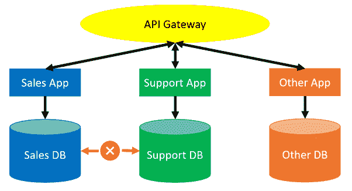
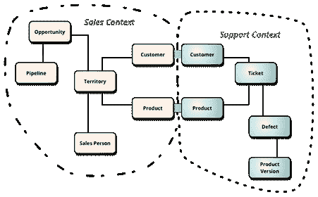

# 安全模式更新——松散耦合缓解技术问题——Octopus 部署

> 原文：<https://octopus.com/blog/safe-schema-updates-4-loose-coupling-mitigates-tech-problems>

这篇博文是我的安全模式更新系列的第 4 部分。

本系列其他文章的链接如下:

**批评现有系统:**

**想象更好的系统:**

**构建更好的系统:**

在本系列的第 2 部分中，我们讨论了弹性和健壮性的概念。我们谈到了设计这样一个系统的价值，在这个系统中，失败是可以被承认的，被遏制的，并且是可以快速解决的。

在第 3 部分中，我们探索了自动化构建之外的“持续集成”的真正含义。中心思想是减少进行中的工作量和复杂集成或合并的需要。

在这篇文章中，我们设想一个软件和数据库架构，它本质上支持弹性系统的开发和维护。这种架构也是持续集成的一个很好的使能器，因为它显著地减少了任何一个组件上的并发工作量。因此，这种架构自然会产生更安全的系统，更易于开发、测试、部署和维护。

这篇文章将关注技术细节。然而，可以说，采用这种架构的人类和文化后果具有同等或更大的意义。我将在这篇文章中略去人的方面，不是因为我认为它们不重要，而是因为我觉得它们是如此的基本，以至于它们值得拥有自己的专用文章。您可以在第 5 部分中期待这一点。

我也不会谈论与构建或重构现有系统相关的实际问题。现在我们只是想象一下 better 可能是什么样子，我们将在以后的文章中考虑如何实现它。

在本系列的第 1 部分中，我描述了一个典型的整体数据库的创建，它支持无数的关键服务。如果您已经使用数据库有一段时间了，那么您可能以前处理过其中的一个。我不会在这里重复它们引起的问题，所以如果你想回顾一下，这将是一个很好的点来重新阅读第 1 部分。可以说，定期可靠地向单一系统交付更新是很困难的。当这些系统失败时，它们经常失败，这通常是一场灾难。

## 松散耦合的数据库，实现更快、更安全的交付

如果每个服务管理自己的数据会怎么样？

例如，每当我们假想的“支持”服务需要从我们同样假想的“销售”服务访问数据时，服务可以使用一些 API 或其他通信层进行通信，而不是直接调用数据库。这将使负责每个服务的团队对他们自己的数据负责，只要他们的 API 仍然可用。

每个服务的数据库管理问题都是相互隔离的。大型数据集被分割成更小、更易于管理的数据集。任何一个服务发布的复杂性都大大降低了，因为依赖性管理变得简单多了。为每个子系统需要支持的任何 API 调用创建简单的测试是相对容易的，而不需要关心哪些依赖系统实际上在使用它们。

当然，API 喋喋不休可能会增加，这是一个需要管理的新问题。然而，通过代码基础设施、自动伸缩和混沌工程等模式，这些问题比与单一的单点故障数据库重构相关的挑战更容易管理，也更安全。

## 领域驱动的设计和有界上下文

一些读者会认为这种架构不切实际。例如，销售和支持系统都需要访问相似的客户数据。如果他们需要访问相同的数据，如何分割数据库？

对于这些人，我建议花一个晚上的时间阅读沃恩·弗农的[领域驱动设计精华](https://octopus.com/blog/devops-reading-list#ddd)，这是埃里克·埃文斯更彻底的[领域驱动设计](https://www.goodreads.com/book/show/179133.Domain_Driven_Design)的一个简短且更容易理解的版本。

Vernon 和 Evans 描述了一个数据建模过程，该过程将有界上下文的概念放在前面和中心。事实上，我上面的销售和支持示例，以及下面的图片，都摘自 [Martin Fowler 的优秀 BoundedContext 博客文章](https://martinfowler.com/bliki/BoundedContext.html):

*图片来源:【https://martinfowler.com/bliki/BoundedContext.html】T4*

在这个例子中，负责销售和支持应用程序的团队已经就产品和客户的无处不在的数据结构达成一致，并且他们已经通过 API 将他们的数据提供给其他服务。例如，销售和支持数据库可能都有相同的客户和产品表，其中一些唯一的字段用于标识匹配项。API 将有一套约定的方法来检索数据，这些方法将通过构建/部署管道进行例行测试。

## 较小的系统更容易供应、开发和测试

现在销售和支持数据库*不再直接交互，许多工程挑战变得更容易解决。*

当支持系统的开发人员希望提供一个开发环境来完成一项任务时，他们不需要提供整个全局系统和所有的依赖项——他们需要的只是支持系统。

如果他们需要来自销售系统的数据，在大多数情况下可能会被嘲笑，但是如果两个系统都需要，那就不成问题了。

这两个服务可能只是众多服务中的两个，所以与部署整个 monolith 相比，开发环境的总体规模仍然大大减小了。

这种较小的开发环境部署起来更快、更便宜。数据屏蔽、隐私和存储问题显著减少。系统的整体复杂性更容易管理，并且对其他系统的依赖性是明确的和可测试的。

## 松散耦合支持持续集成

正如第 3 部分中所讨论的，持续集成(CI)告诉我们，我们应该优先完成和集成/部署现有的在制品(WIP ),而不是创建新的 WIP。这适用于任何地方存在的、尚未成功合并、部署到生产和验证的任何和所有开发工作。如果不优先考虑合并而不是分离，我们最终会有越来越多的在制品，这有着巨大的隐性成本。

当我们有一个大型的、单一的系统，也许有 10 多个团队的 100 个开发人员，我们的 CI 问题是很严重的。在同一个代码库上并行执行如此多的任务，很难做到面面俱到。这是我们经常看到复杂的分支计划和混乱的开发环境的地方，包含了一大堆半成品或者已经废弃很久的开发和测试代码。

然而，如果这十个团队通常在独立的、松散耦合的服务上工作，每个团队都在他们自己的存储库中，那么与管理任何给定服务的变更相关联的复杂性就会大大降低。每个服务在任何时候都只会有少量正在开发的并发任务。

举例来说，这种复杂程度实际上可以在短期的日常团队活动中理解和管理。只要所有必需的 API 仍然可用，分支计划就会变得更简单，发布协调问题也会消失。

对于更松散耦合的系统，开发人员可以更容易地持续集成他们的工作。这大大减少了与 WIP、环境漂移、分支机构地狱、政治和项目管理开销相关的挑战。

此外，松散耦合的系统以可管理的方式扩展。如果十几个团队在同一个整体后端工作的想法让你害怕，想象一下与亚马逊或谷歌规模系统相关的挑战。

如果您预计您的系统可能会增长(只要公司还在经营，他们的关键系统就会增长)，那么从一开始就考虑松散耦合来设计您的系统是明智的。

## 松散耦合会产生防火间隙

给足够的时间，一切都会破碎。对于整体系统来说是这样，对于松散耦合的服务来说也是这样。失败仍然会发生，但是松散耦合的系统更有弹性:数据鸡蛋不再都放在同一个篮子里。

每个服务将独立托管其数据。如果流星击中托管销售服务的数据中心，支持服务可能不会受到影响。通过这种方式，可以更好地隔离故障，并且受影响的服务更小、更简单、更容易修复。所有这些都是在没有放慢发展速度的情况下实现的。其实现在开发更简单，更安全。

当然，我们需要遵循某些规则。

每项服务都需要设计为在相关服务不可用时正常失效/降级。例如，支持系统应该被设计为当销售服务不可用时，它仍然可以运行，可能具有降级的功能。也许支持团队可能会失去一些功能和销售数据的可见性，但是他们仍然能够进行核心支持操作。

作为开发人员，测试依赖关系变得至关重要。如果您依赖于对另一个服务的 API 调用，您应该确保有一个测试来验证这种依赖性，并且您应该将系统设计为在 API 调用失败时正常失败并记录一个错误。

对于 monolith 来说，这种调整不当的升级脚本可能会导致全局中断。通过松耦合，我们只关闭了销售系统，减少了失败的影响。此外，由于松散耦合的销售系统比旧的整体系统要小得多，因此很容易快速恢复在线。

## 下次

在这篇文章中，我们设想了一个更加松散耦合的架构。这种建筑更能抵御失败，因为它创造了自然的防火屏障。此外，较小的服务通常更易于开发和恢复。

此外，系统更精细的特性使得管理不同的工作流更加容易。任何给定服务的并发工作流的显著减少减少了项目管理/发布管理/分支开销。

单独来看，这些点将导致显著更安全的数据库版本。然而，这些好处是人为因素造成的。在下一篇文章(文章 5)中，我们将更详细地探讨这些人为因素。 

本系列其他文章的链接如下:

**批评现有系统:**

**想象更好的系统:**

**打造更好的系统:**

## 观看网络研讨会

我们的第一次网络研讨会讨论了松耦合架构如何带来可维护性、创新性和安全性。第二部分讨论了如何将一个成熟的系统从一种架构转换到另一种架构。

### 数据库开发:想象更好的系统

[https://www.youtube.com/embed/oJAbUMZ6bQY](https://www.youtube.com/embed/oJAbUMZ6bQY)

VIDEO

### 数据库开发:构建更好的系统

[https://www.youtube.com/embed/joogIAcqMYo](https://www.youtube.com/embed/joogIAcqMYo)

VIDEO

愉快的部署！