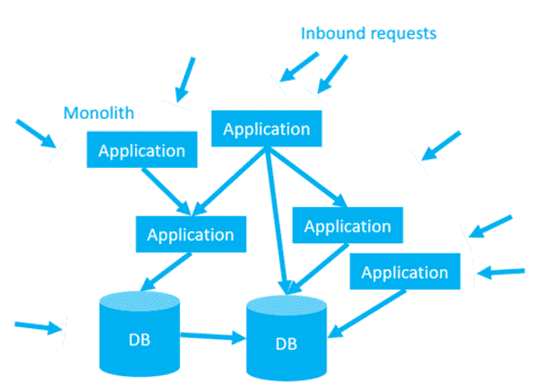
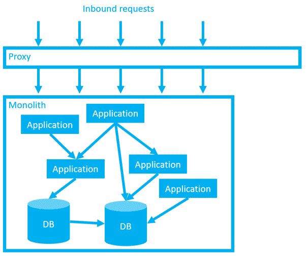
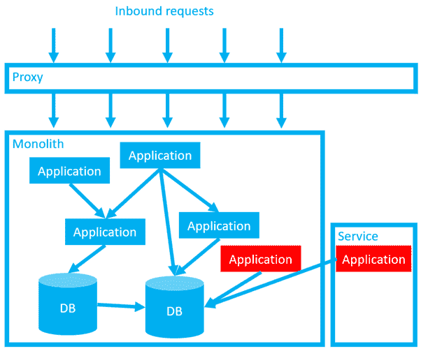
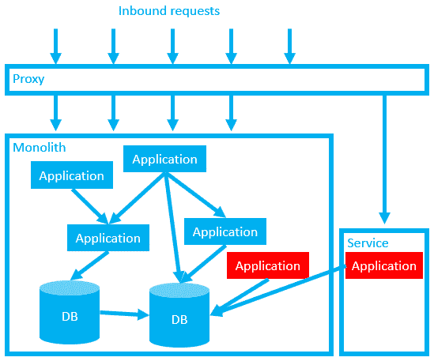
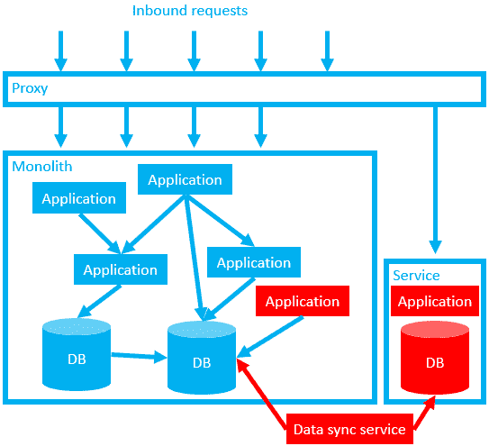
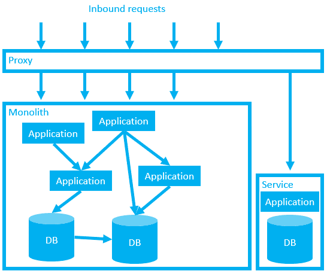
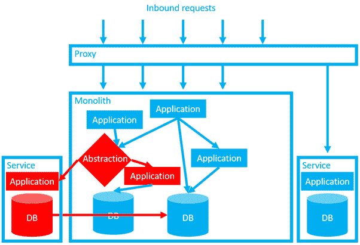
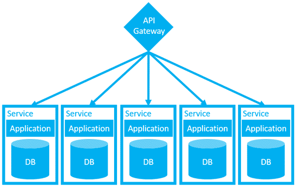

# 安全模式更新——扼杀 monolith——Octopus 部署

> 原文：<https://octopus.com/blog/safe-schema-updates-8-strangling-the-monolith>

这篇博文是我的安全模式更新系列的第 8 部分，也是最后一篇。

**批评现有系统:**

**想象更好的系统:**

**构建更好的系统:**

到目前为止，在本系列中，我们已经详细讨论了采用更松散耦合的架构的好处，在这种架构中，子系统管理它们自己的数据。通过隐藏每个子系统的数据库内部，并强制所有的通信通过一些消息总线或 API 网关，我们避免了在数据库交付地狱中讨论的依赖性噩梦。我们还允许独立管理和更新子系统，从而降低管理开销，并简化供应和交付挑战。

在上一篇文章[中，我们讨论了安全、接近零停机时间的发布模式](https://octopus.com/blog/safe-schema-updates-1-delivery-hell)，以及快速可靠的回滚选项。您已经有了动机和工具，但是我们还没有讨论任何从紧耦合到松耦合重构的指导性策略。

这篇文章旨在提供一个关于如何管理整个过程的概述。如题所示，我们将讨论[扼杀者模式](https://martinfowler.com/bliki/StranglerFigApplication.html)，但我们也将触及其他模式，包括:

在我们继续之前，让我们设定一些期望:这并不容易，也不是什么灵丹妙药。这将需要大量的时间/投资，这是你可能会分阶段进行的事情，并且需要考虑权衡。

天下没有免费的午餐。

## 扼杀者模式

让我们想象一个典型的依赖噩梦。

这种架构是多年来紧迫的期限、短期规划、[技术债务](https://martinfowler.com/bliki/TechnicalDebt.html)、知识积累和员工流动累积的结果。即使在最好的情况下，信息共享也是困难的，但是现有的团队在没有完善的知识、可靠的文档或成熟的测试套件的情况下也在关注这个问题。

这个系统是有价值的。在这个错综复杂的网络中，有公司的“摇钱树”产品和一堆关键的内部系统，但也有一条被遗忘的、半生不熟的“次要项目”、被放弃的业务项目和退役的功能。很难只见树木不见森林。

我们需要用扼杀者程序来包装这块巨石。就像启发了这个架构的澳大利亚无花果树一样，我们的扼杀者应用程序是一种寄生虫，它会扼杀它的宿主，最终在这个过程中杀死它。

我们将从一个简单的代理开始。

起初，这个代理只是捕获所有的入站呼叫，并将它们重定向回预定的目的地。在功能上，我们没有做任何改变，但我们正在增加您的网络负载。考虑到松散耦合的架构会给网络带来更大的压力，在我们开始做更令人兴奋的事情之前，尽早发现并解决任何网络挑战是一个好主意。

接下来，我们决定将一部分功能扩展到一个独立的服务中。理想情况下，我们使用领域驱动设计来告知我们的选择(参见本系列中的[第 4 篇](https://octopus.com/blog/safe-schema-updates-4-loose-coupling-mitigates-tech-problems)和[第 5 篇](https://octopus.com/blog/safe-schema-updates-5-loose-coupling-mitigates-human-problems)来回顾“DDD”)。也许我们正在构建的功能广泛地(或完全地)取代了一个或多个整体旧组件中的功能。无论哪种情况，这都是全新的代码，内部代码实现对其他系统是隐藏的。

注意，此时我们已经在生产中“部署”了服务，但是它还没有“发布”。(我使用了[第 7 部分](https://octopus.com/blog/safe-schema-updates-7-near-zero-downtime-deployments)中“部署”和“发布”的定义，其中部署与复制文件相关联，而发布则是让最终用户可以进行更改。)这允许我们在生产中测试我们的新代码，而不将其暴露给我们的用户，同时生产流量仍然由旧代码安全地处理。

当我们测试了新代码后，我们可以通过代理中的配置更改来“发布”我们的新服务。如果我们检测到任何问题，我们可以通过恢复代理配置来立即回滚我们的更改。

还要注意，目前我们仍在使用原始数据库。在我们打破这种依赖之前，我们的服务不会真正地分离。我们现在需要分解数据库，使用第 7 部分中讨论的[扩展契约模式。](https://octopus.com/blog/safe-schema-updates-7-near-zero-downtime-deployments)

作为临时措施，我们可能需要设置应用程序的旧版本和新版本，以更新旧数据库和新数据库。或者，我们可能需要创建一个额外的数据同步服务来确保两个数据库保持同步。

当我们确信不需要使用代理技巧执行快速回滚时，我们就可以开始仔细清理自己的工作了。如果我们可以很容易地确定哪些部分已经过时，我们可以试着移除它们。

我们只需要在旧的数据库(和任何数据同步应用程序)中保留我们新分离的服务的数据，直到我们确信新服务是健康的和完全分离的。例如，我们可以监视旧数据库中的读/写。假设一切都很平静，然后我们重命名我们的列或表，并等待电话铃响。如果一两个星期没有人打电话来，备份并删除旧的专栏以及任何数据同步服务可能是相当安全的。

现在，我们的新服务可以独立管理了。它更容易工作，因为开发人员没有对破坏依赖关系的持续恐惧，也没有与系统其余部分相关的认知开销。他们可以在他们喜欢的任何地方运行服务，并独立规划他们的部署时间表，不受任何与更广泛的整体相关的官僚主义的影响。

同样，整块巨石本身也变得简单了一点。

到目前为止一切顺利，但是如果我想提取的应用程序被深埋在巨石中呢？例如，如果它需要服务于来自 monolith 内部的请求呢？

## 抽象分支

在我们的第一个例子中，我们使用了一个代理来扼杀整个整体，但是对于一些内部组件，我们可以使用一些其他的应用程序、模块或类作为抽象点来捕获所有的内部请求。然后，与我们最初的代理一样，我们可以使用我们的抽象应用程序 it 来确定将流量转移到哪里。

在本例中，即使我们清理了旧的应用程序和数据库，我们仍然面临挑战。我们的数据库仍然相互依赖。希望我们可以重构系统，通过通信层处理这些依赖关系，数据处理由应用程序本身完成。由于本系列中讨论的所有原因，这将是有利的。但是，也不是没有取舍。

## 数据一致性与可用性

通过完全分离这些数据库，在许多方面我们的系统将变得更加安全和易于管理。更小的数据库，有更多的防火墙，可以独立更新。我们正在从但丁的数据库地狱中爬出来。

然而，除了与重构相关的开发成本之外，这种架构还有一系列不可忽视的缺点。

第一，性能。不管你喜欢还是讨厌关系数据库，都很难否认它们在数据处理方面做得非常好。编写良好的存储过程可以以可笑的速度处理数字。与发出网络请求、拉回大量数据并在应用程序层处理这些数据相关的延迟和网络负载相比，这是不争的事实。你的数据库依赖关系错综复杂，尽管有缺陷，但很可能为此做了很好的优化。你可能已经花了几十年来完善这种优化。

我们可以通过在我们的网络上投入一些(可能是非常需要的)投资和开发复杂的缓存系统来缓解一些性能问题，但我们需要诚实地说，即使有大量的投资，我们也不太可能达到同样的原始性能。

我们的下一个问题是一致性。外键是可爱的东西。当我们所有的数据都存在于单个关系数据库中时，我们可以使用外键来执行快速连接和强制引用完整性。在我们的数据被拆分到多个解耦的服务之后，我们(必然)牺牲了在这些服务之间使用传统外键的能力。

我们可以编写自己的外键来允许我们跨不同的服务执行连接，但是仍然没有可靠的东西来强制引用完整性。不管你喜欢还是讨厌关系数据库，它们在引用完整性方面都很棒。几十年来，RDBMS 一直是数据库领域的主导技术，对于我们大多数人来说，很难想象一个没有它的世界。

(对于某些用例，我们建议保留它。)

我们现有的整体可能是基于参照完整性的假设构建的。(因为为什么不是在 RDBMS 市场主导的时代？)但也有可能建立一个更有弹性的系统，而不是一个优先考虑稳健性的系统。([参见第 2 部分，了解弹性与稳健性的更多细节](https://octopus.com/blog/safe-schema-updates-2-resilience-vs-robustness)。)

如果我们的系统是为了优雅地处理破碎的依赖关系而构建的，我们能接受偶尔破碎的记录，以换取与松散耦合相关的更广泛的好处吗？我们如何处理那些破记录？也许我们可以做一些事情来发现、监控、修复或删除它们？

在我们走得太远之前，让我们先花点时间考虑一下我们可能如何在一开始就处于不一致的状态。好吧，我们在一个更加分布式的系统中面临的一个新的大问题是分区。

## 分割

让我们设想一个电子商务系统，它为购物车、库存和支付网关提供单独的服务。让我们想象一位顾客在他们的购物车里添加了一个可爱的章鱼玩具[。购物车服务正在运行，支付服务也正在运行，因此我们可以处理订单。但是，库存服务已关闭。我们不知道我们是否有存货。](https://www.amazon.co.uk/Octopus-Reversible-Plushie-Double-Sided-Expressing/dp/B08XK1WZHK/)

这是一个隔板。这不可能发生在一块巨石上。这是隐藏数据的松散耦合系统特有的问题。

*(来源:这个例子，以及这篇文章的许多灵感，来自于《构建微服务[的作者 Sam Newman 在 GoTo 2019 的一次演讲。)](https://www.goodreads.com/en/book/show/22512931-building-microservices)*

[https://www.youtube.com/embed/9I9GdSQ1bbM?start=2401](https://www.youtube.com/embed/9I9GdSQ1bbM?start=2401)

VIDEO

你卖玩具吗？一方面，如果你不处理订单，你会失去销售。另一方面，如果你以后需要回去退款/道歉，你可能会让你的顾客不高兴。您需要权衡一致性和可用性。

对许多人来说，性能和一致性问题将是难以下咽的苦果。老实说，这种架构可能不适合所有系统。这些都是需要解决的棘手问题。

然而，在放弃松耦合的想法之前，先考虑一下好处。还记得[但丁的数据库地狱](https://octopus.com/blog/safe-schema-updates-1-delivery-hell)的恐怖吗？提醒你自己从这个帖子中看到的我们的原图。想象一下，如果我们只设法把你的巨石的一半功能提取出来，做成看起来更像这样的东西，那会容易得多。

【T2 

## 系列摘要

谢谢你坚持和我在一起。

这个系列开始时(我认为是)是一个关于零停机部署的简短帖子的简单想法。但是它一直在增长，增长，增长。我不断地偏离主题，在这里或那里又增加了两千字。第一稿冗长而复杂。很明显，我的大脑已经变成了一张错综复杂的依赖关系网。

它帮助我把我的想法分解成容易处理的部分。

独石当然有它的好处。(也许我应该写本书？)微服务不应该被视为某种完美的解决方案。他们不是金子弹。正如我们所讨论的，它们提出了一系列非常现实的挑战，尤其是在数据方面。从整体服务到微服务的旅程可能既漫长又昂贵。如果你半途而废，你可能会被留在一个可怕的混合体中，充满了挑战，却没有什么好处。

然而，好处也是巨大的。回想一下第一部分中的[数据库交付地狱，现状可能也是不可持续的。我们需要用自己的判断来决定我们要在这条道路上走多远。](https://octopus.com/blog/safe-schema-updates-1-delivery-hell)

不管我们致力于哪种架构，本系列中讨论的技术实践都会有所帮助。在紧密耦合和松散耦合的系统中，自助服务供应和接近零停机时间的部署模式在服务弹性方面带来了显著的好处。(但是像大多数事情一样，它们在更小和更松散耦合的系统中特别有用和实用。)

祝你好运，无论你决定选择哪条路。

## 进一步阅读

如果你想了解更多关于这篇文章的话题，我推荐你去看萨姆·纽曼的演讲(如上)。

如果您想更深入地了解本系列中讨论的概念，以下书籍是一个很好的起点:

本系列其他文章的链接如下:

**批评现有系统:**

**想象更好的系统:**

**打造更好的系统:**

## 观看网络研讨会

我们的第一个网上研讨会“想象更好的系统”讨论了松耦合架构如何带来可维护性、创新性和安全性。

第二部分，构建更好的系统，讨论了如何将一个成熟的系统从一种架构转换到另一种架构。

### 数据库开发:想象更好的系统

[https://www.youtube.com/embed/oJAbUMZ6bQY](https://www.youtube.com/embed/oJAbUMZ6bQY)

VIDEO

### 数据库开发:构建更好的系统

[https://www.youtube.com/embed/joogIAcqMYo](https://www.youtube.com/embed/joogIAcqMYo)

VIDEO

愉快的部署！