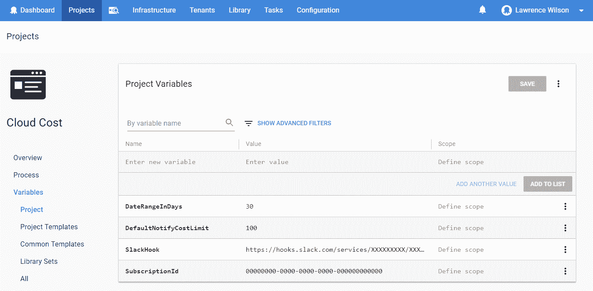
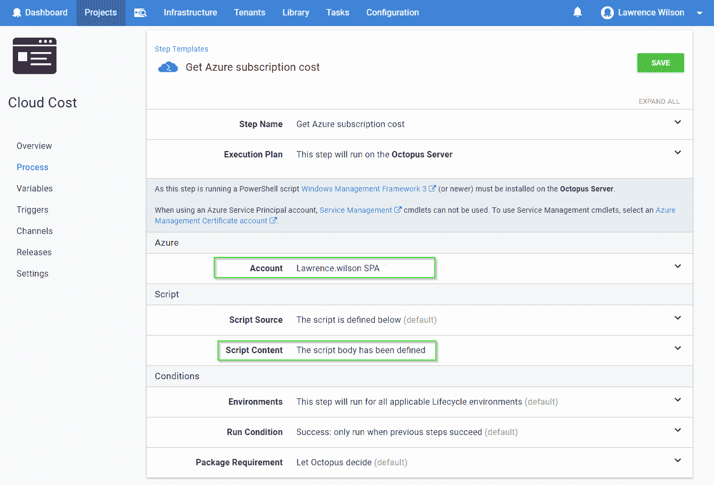
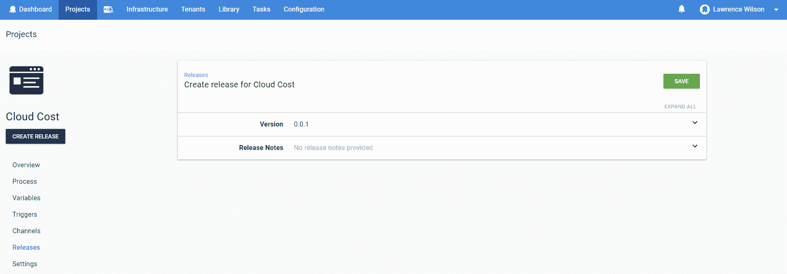
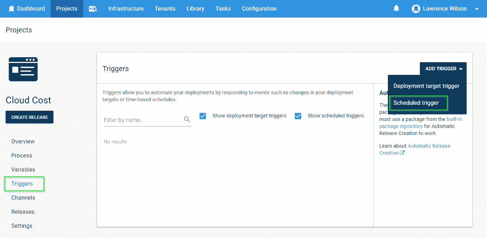
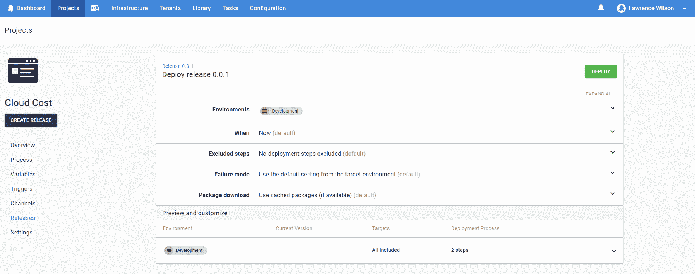
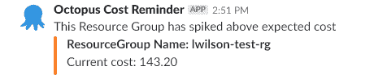

# 节省云成本:Azure - Octopus Deploy 中的消费使用细节

> 原文：<https://octopus.com/blog/saving-cloud-dollars>

更新于 2018-04-23 -这篇博客文章在我们的 Octopus 2018.4 发布后进行了更新，现在支持[重复计划部署](https://octopus.com/blog/octopus-release-2018.4#recurring-scheduled-deployments)，以说明如何按计划定期运行部署。

你是否曾经在 Azure 中部署了一个虚拟机，进行了 10 分钟的快速测试，却在两个月后回来，发现它一直在运行？这篇博文展示了如何使用 Octopus 通过 Slack 通知您 Azure 资源组的成本是否超过了预期值——您可以使用资源组标签来指定。由于 Octopus 有能力认证许多不同的云平台，并向它们部署资源，它自然也有能力获取有用的数据。这使得 Octopus 成为运行我们需要查看我们的资源消耗的脚本的绝佳候选。

## 方案

我喜欢好的场景，所以事不宜迟，请见见 OctoFX 一家虚构的公司，由技术高超的开发人员组成，他们将资源部署到云中并对其进行测试。最近，他们注意到当测试完成时很难记得删除某些资源，并且希望在资源的成本超过成本限制时得到通知。虽然每个云平台都有自己通知成本的方式，但 OctoFX 选择使用 Octopus 来运行这些脚本，因为它允许他们遵循一致的方法，而不管他们使用的是哪个云平台。在这个场景中，我们将定义一个名为 NotifyCostLimit 的标记，当达到这个限制时，Octopus 将发出 slack 通知。如果没有应用 NotifyCostLimit，将采用默认值$100。

这篇博客文章只涵盖了查询 Microsoft Azure 的步骤，但是您也可以对 AWS 应用类似的方法。所以，让我们开始吧！如果您想了解脚本执行的过程，您可以遵循以下每个目标。或者，你可以跳到这个博客的`Configure it in Octopus`部分来看完整的脚本。

## 限制

这里需要注意几个关键点:

*   用于检索成本项目的 cmdlet([Get-AzureRmConsumptionUsageDetail](https://docs.microsoft.com/en-us/powershell/module/azurerm.consumption/get-azurermconsumptionusagedetail?view=azurermps-5.4.0))只能获得资源管理器的详细信息，这意味着我们根本看不到任何服务管理器资源成本。
*   可能需要两周时间才能获得消费详情，我们应该考虑到我们看到的最早的数据条目可能是两周前的。
*   成本数字不含税。

## 目标 1:获取 Azure 中所有订阅的所有费用项目。

下面这段脚本的主要目的是检索消费使用情况的详细信息。这可以通过使用来自 Azure PowerShell 的 Get-AzureRmConsumptionUsageDetailcmdlet 来完成。这里我们提供了两个日期，开始日期(今天减去 30 天)和结束日期(今天)

```
write-output "Getting all cost items for this subscription in Azure"
write-output "Subscription ID: $SubscriptionId "

$now = get-Date

$startDate = $($now.Date.AddDays(-$DateRangeInDays))
$endDate = $($now.Date)

write-output "Start Date:  $startDate  "
write-output "end Date:  $endDate "

$SubConsumptionUsage = Get-AzureRmConsumptionUsageDetail -StartDate $startDate  -EndDate $endDate 
```

## 目标 2:查找在此开单期间存在的所有资源组名称。

现在，我们从消费使用详细信息中取出每一行，删除每个实例 ID 的开始部分。然后，我们去掉资源组名称之后的所有内容。最后，我们完成了资源组名称。因为资源组是不区分大小写的，所以我将每个资源组的名称都改成了小写。

```
write-output "Finding all of the resource group names which existed during this billing period."
$SubIdPrefix = "/subscriptions/" + $SubscriptionId
$RgIdPrefix = $SubIdPrefix + "/resourceGroups/"

$resourceGroupName = @()
$resourceGroups = @()

foreach ($line in $SubConsumptionUsage) {
    if ($line.InstanceId -ne $null ) {
        $thisRgName = $($line.InstanceId.ToLower()).Replace($RgIdPrefix.ToLower(),"")
        $toAdd = $thisRgName.Split("/")[0]
        $toAdd = $toAdd.ToString()
        $toAdd = $toAdd.ToLower()
        $toAdd = $toAdd.Trim()

        if ($resourceGroups.Name -notcontains $toAdd) {
            $resourceGroupName = [PSCustomObject]@{
            Name = $toAdd
            }
            $resourceGroups += $resourceGroupName
        }
    }
}

write-output "Found these Resource groups: "
$resourceGroups 
```

## 目标 3:计算每个资源组的成本，然后标记超出 NotifyCostLimit 的资源组。

对于遇到的每个资源组名称，我们按资源组过滤详细信息，并将所有成本加在一起。这成为每个资源组的总成本。

```
Write-Output "Calculating the cost of each Resource Group, then flag ones that exceed NotifyCostLimit."
$currentResourceGroups = Get-AzureRmResourceGroup
$rgIndexId = 0

foreach ($rg in $resourceGroups) {

    #$thisRg = $null
    $RgIdPrefix = $SubIdPrefix + "/resourceGroups/" + $rg.Name
    $ThisRgCost = $null
    $SubConsumptionUsage | ? { if ( $_.InstanceId -ne $null) { $($_.InstanceId.ToLower()).StartsWith($RgIdPrefix.ToLower()) } } |  ForEach-Object { $ThisRgCost += $_.PretaxCost   }
    $toaddCost = [math]::Round($ThisRgCost,2)
    $resourceGroups[$rgIndexId] | Add-Member -MemberType NoteProperty -Name "Cost" -Value $toaddCost

    if ($currentResourceGroups.ResourceGroupName -contains $rg.Name) {

        $addingResourceGroup = Get-AzureRmResourceGroup -Name $($rg.Name)
        $resourceGroups[$rgIndexId] | Add-Member -MemberType NoteProperty -Name "NotifyCostLimit" -Value $($addingResourceGroup.tags.NotifyCostLimit)

    }

    $rgIndexId ++

} 
```

## 目标 4:筛选成本高于预期的项目。

为了完成这下一部分，我们将把我们的资源组传送到`where-object`(它被缩短为`?`，以过滤大于或等于成本通知标签`NotifyCostLimit`的每个项目。

```
Write-Output "Filtering the items whose cost is higher than the allowed limit."
$reminderGroups = $resourceGroups | ? {
    if ($_.NotifyCostLimit -ne $Null) {

        $_.Cost -ge $_.NotifyCostLimit

    }
    else {

        $_.Cost -ge $DefaultNotifyCostLimit

    }
} 
```

## 目标 5:使用时差通知通知正确的人。

最后，我们将提醒人们，他们可能有一个已经达到资源成本极限的测试资源。

```
function new-SlackMessage ( $resourceGroup ) {

    $orange = "#F9812A"
    $attachments = @{}
    $fieldNumber = 0
    $username = "Octopus Cost Reminder"
    $IconUrl = "https://octopus.com/images/company/Logo-Blue_140px_rgb.png"
    $payload = @{
    #channel = "General";
    username = $username;
    icon_url = $IconUrl;
    attachments = @(
    );
    }

    $state = "Current cost: $($resourceGroup.Cost)"
    $description = "ResourceGroup Name: $($resourceGroup.Name)"
    $ownerContact = "OwnerContact: $($resourceGroup.OwnerContact)"
    $colour = $orange

    if ($fieldNumber -eq 0){
        $pretext = "This Resource Group has spiked above expected cost"
    }
    else {
        $pretext = $null
    }

    $thisFallbackMessage = "$description has spiked above expected cost (Current Cost: $state)"

    #Some results can have multiple fields:
    $fields = @(
        @{
        title = $description;
        value = $state;
        });

    $thisAttachment = @{
        fallback = $thisFallbackMessage;
        color = $colour;
        pretext = $pretext;
        fields = $fields;
    }

    $payload.attachments += $thisAttachment

    return $payload

}

function New-SlackNotification ($hook, $group)
{

    $message = New-SlackMessage -resourceGroup $group
    Invoke-Restmethod -Method POST -Body ($message | ConvertTo-Json -Depth 4) -Uri $hook

}

if ($reminderGroups -ne $null) {
    Write-Output "Sending a Slack notification about these groups"
    $reminderGroups
    foreach ($group in $reminderGroups) {

        New-SlackNotification -hook $slackHook -group $group

    }
}
else {
    Write-Output "There are no groups which need attention"
} 
```

## 在 Octopus 中配置它

现在进入有趣的部分，配置 Octopus！

## 先决条件

请确保您已经设置了这两个先决条件，以便开始工作:

*   Octopus 中的 Azure 服务主体设置。
*   使用您的备用挂钩 URL 配置的备用帐户。

## 设立八达通服务主账户

我们首先需要确保 Octopus 配置了一个服务主体帐户来查看您的 Azure 订阅。请随时查看我们关于[创建 Azure 服务主帐户](https://g.octopushq.com/AzureServicePrincipalAccount)的文档，了解如何执行该任务的更多信息。出于此帐户的目的，您需要确保该帐户至少拥有对套餐的`Reader`访问权限。

## 设置时差通知帐户

请查看 [slack 文档](https://api.slack.com/)，了解如何创建新的 slack 集成并获取 slack 挂钩 URL。一旦有了 URL，就需要确保它在 Octopus 中被设置为项目变量。

## 创建您的新项目

在 Octopus 中创建您的新项目，我的项目名为`Cloud Cost`，然后定义这 4 个项目变量:

*   SubscriptionId(类型:字符串)。可以通过运行`Get-AzureRmSubscription`从 Azure PowerShell 中检索的订阅 ID。
*   DateRangeInDays(类型:整数)。该脚本采用当天的天数，并以此天数进行倒计数，以形成一个范围来检查使用成本。
*   DefaultNotifyCostLimit(类型:整数)。如果一个资源组没有用`NotifyCostLimit`标记，Octopus 将默认为这个值。
*   SlackHook(类型:字符串)。您的 slack hook 的完整 URL。

[](#)

## 创建新步骤(Azure PowerShell 脚本)

使用`Run an Azure PowerShell Script`步骤模板创建一个名为`Get Azure subscription cost`的新步骤。将该帐户指定为您的服务主体帐户，该帐户有权访问您从中获取费用数据的订阅。将下面的完整脚本粘贴到您的脚本内容部分。省去第一步。

[](#)

```
write-output "Getting all cost items for this subscription in Azure"
write-output "Subscription ID: $SubscriptionId "

$now = get-Date

$startDate = $($now.Date.AddDays(-$DateRangeInDays))
$endDate = $($now.Date)

write-output "Start Date:  $startDate  "
write-output "end Date:  $endDate "

$SubConsumptionUsage = Get-AzureRmConsumptionUsageDetail -StartDate $startDate  -EndDate $endDate

write-output "Finding all of the resource group names which existed during this billing period."
$SubIdPrefix = "/subscriptions/" + $SubscriptionId
$RgIdPrefix = $SubIdPrefix + "/resourceGroups/"

$resourceGroupName = @()
$resourceGroups = @()

foreach ($line in $SubConsumptionUsage) {
    if ($line.InstanceId -ne $null ) {
        $thisRgName = $($line.InstanceId.ToLower()).Replace($RgIdPrefix.ToLower(),"")
        $toAdd = $thisRgName.Split("/")[0]
        $toAdd = $toAdd.ToString()
        $toAdd = $toAdd.ToLower()
        $toAdd = $toAdd.Trim()

        if ($resourceGroups.Name -notcontains $toAdd) {
            $resourceGroupName = [PSCustomObject]@{
            Name = $toAdd
            }
            $resourceGroups += $resourceGroupName
        }
    }
}

write-output "Found these Resource groups: "
$resourceGroups

Write-Output "Calculating the cost of each Resource Group, then flag ones that exceed NotifyCostLimit."
$currentResourceGroups = Get-AzureRmResourceGroup
$rgIndexId = 0

foreach ($rg in $resourceGroups) {

    #$thisRg = $null
    $RgIdPrefix = $SubIdPrefix + "/resourceGroups/" + $rg.Name
    $ThisRgCost = $null
    $SubConsumptionUsage | ? { if ( $_.InstanceId -ne $null) { $($_.InstanceId.ToLower()).StartsWith($RgIdPrefix.ToLower()) } } |  ForEach-Object { $ThisRgCost += $_.PretaxCost   }
    $toaddCost = [math]::Round($ThisRgCost,2)
    $resourceGroups[$rgIndexId] | Add-Member -MemberType NoteProperty -Name "Cost" -Value $toaddCost

    if ($currentResourceGroups.ResourceGroupName -contains $rg.Name) {

        $addingResourceGroup = Get-AzureRmResourceGroup -Name $($rg.Name)
        $resourceGroups[$rgIndexId] | Add-Member -MemberType NoteProperty -Name "NotifyCostLimit" -Value $($addingResourceGroup.tags.NotifyCostLimit)

    }

    $rgIndexId ++

}

Write-Output "Filtering the items whose cost is higher than the allowed limit."
$reminderGroups = $resourceGroups | ? {
    if ($_.NotifyCostLimit -ne $Null) {

        $_.Cost -ge $_.NotifyCostLimit

    }
    else {

        $_.Cost -ge $DefaultNotifyCostLimit

    }
}

function new-SlackMessage ( $resourceGroup ) {

    $orange = "#F9812A"
    $attachments = @{}
    $fieldNumber = 0
    $username = "Octopus Cost Reminder"
    $IconUrl = "https://octopus.com/images/company/Logo-Blue_140px_rgb.png"
    $payload = @{
        #channel = "General";
        username = $username;
        icon_url = $IconUrl;
        attachments = @(
        );
    }

    $state = "Current cost: $($resourceGroup.Cost)"
    $description = "ResourceGroup Name: $($resourceGroup.Name)"
    $colour = $orange

    if ($fieldNumber -eq 0){
        $pretext = "This Resource Group has spiked above expected cost"
    }
    else {
        $pretext = $null
    }

    $thisFallbackMessage = "$description has spiked above expected cost (Current Cost: $state)"

    $fields = @(
        @{
        title = $description;
        value = $state;
        });

    $thisAttachment = @{
        fallback = $thisFallbackMessage;
        color = $colour;
        pretext = $pretext;
        fields = $fields;
    }

    $payload.attachments += $thisAttachment

    return $payload

}

function New-SlackNotification ($hook, $group)
{

    $message = New-SlackMessage -resourceGroup $group
    Invoke-Restmethod -Method POST -Body ($message | ConvertTo-Json -Depth 4) -Uri $hook

}

if ($reminderGroups -ne $null) {
    Write-Output "Sending a Slack notification about these groups"
    $reminderGroups
    foreach ($group in $reminderGroups) {

        New-SlackNotification -hook $slackHook -group $group

    }
}
else {
    Write-Output "There are no groups which need attention"
} 
```

## 创建您的新版本。

保存您的新步骤并创建一个新版本！

[](#)

## 设置部署时间表(可选)

或者，您可以将云成本项目设置为定期运行。一种可能是每月在某一天运行一次该任务。在您的新项目中，选择触发器➜添加触发器➜预定触发器。

[](#)

*   在**名称**部分，提供一个名称来描述该计划，我选择使用“每月 25 日”
*   在**触发时间表**部分，我已经将它设置为每月**天**，并将这一天设置为每月的**25 日**——开始时间为上午 09:00。
*   在**触发动作**部分，您可以选择想要运行的版本。我已经选择部署这个项目的**最新**版本。
*   在**源环境**和**目的环境**下选择相同的环境。我已经选择了**生产**环境。

这将导致在每月的 25 日重新部署源环境中的最新版本。

[](#)

保存您的新计划。

## 部署您的新版本。

现在让我们开始部署！

[](#)

## 解决纷争

如果您的脚本因为找不到`Get-AzureRmConsumptionUsageDetails`而无法运行，请确保您的 Octopus 服务器上安装了最新的 AzureRM 模块，并创建另一个名为`Octopus.Action.Azure.UseBundledAzurePowerShellModules`的 Octopus 变量，其值为`False`。有关您为什么会收到此错误的更多信息，请查看关于配置 Azure PowerShell 模块版本的文档

## 收尾工作

恭喜你！您已经成功地在 Azure 中部署了检查成本的项目！

[](#)

让我们检查一下时差通知！

[](#)