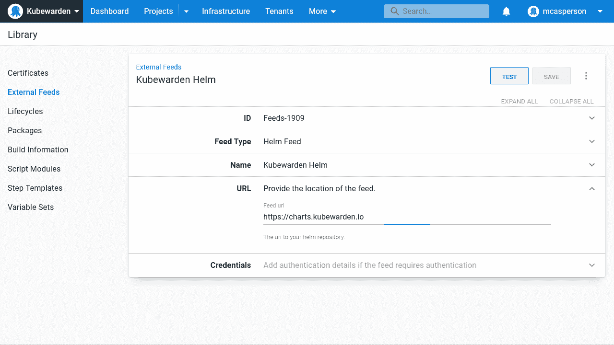
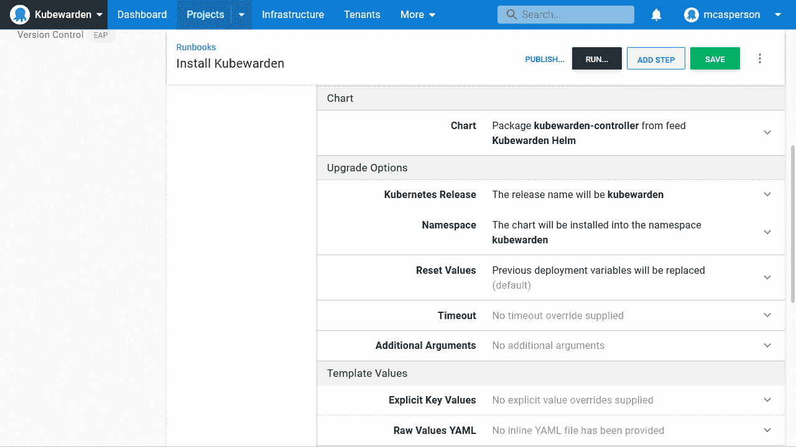
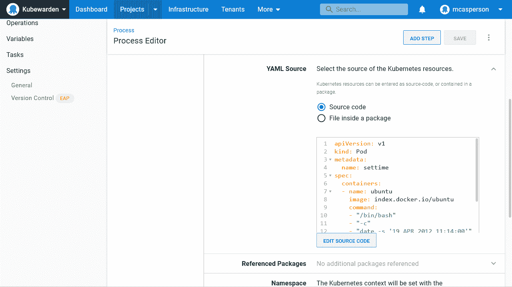
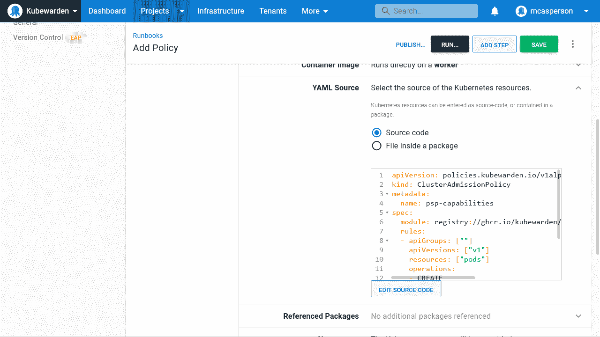

# 使用 Kubewarden - Octopus Deploy 保护您的 Kubernetes 集群

> 原文：<https://octopus.com/blog/securing-kubernetes-cluster-with-kubewarden>

Kubernetes 正在迅速成为云的操作系统。每个主要的云提供商都有一个受支持的 Kubernetes 平台，Kubernetes 可以在内部运行，Kubernetes 甚至有一个带 Helm 的包管理器。多亏了[操作模式](https://kubernetes.io/docs/concepts/extend-kubernetes/operator/)，Kubernetes 拥有内置的支持来描述和管理几乎[任何类型的工作负载](https://operatorhub.io/)。

这种灵活性是福也是祸。Kubernetes 几乎可以运行任何东西，但是几乎不可能维护任何真实世界的生产集群来托管任何随机的东西。

Kubernetes 基于角色的访问控制(RBAC)提供了对集群托管的资源的某种级别的控制。但是，RBAC 只允许创建顶级资源，如部署或 pod。

一个单元几乎可以承载任何东西，所以仅仅允许或禁止一个单元的部署通常是不够的。相反，在允许或拒绝之前，团队需要检查给定 pod 的属性。

[准入控制器](https://kubernetes.io/blog/2019/03/21/a-guide-to-kubernetes-admission-controllers/)通过将资源传递给定制服务，提供检查、修改、接受或拒绝新资源的能力。这允许对集群中创建的资源进行细粒度的控制，并确保只部署那些满足您特定需求的资源。

这篇文章着眼于 kube warden 准入控制器，这是一个早期的项目，支持用编译成 WebAssembly 的多种语言编写的准入策略。

我将带您在 Octopus 中创建一些操作手册和部署来管理 Kubewarden，并将 pods 部署到 Kubernetes，测试定制的准入策略。

## 安装 Kubewarden

安装 Kubewarden 最简单的方法是通过它的舵图。

在 Octopus 中创建一个指向[https://charts . kube warden . io](https://charts.kubewarden.io)的新 Helm Feed:

[](#)

Kubewarden 是通过一本手册安装的。Runbooks 对于管理任务很有用，比如部署跨领域服务，因为它们不受生命周期进程的限制。这允许在部署生命周期的后期在环境中启动新的集群(就像新的生产集群一样),而无需首先在生命周期的早期环境中部署服务:

[](#)

## 部署一个可疑的吊舱

为了演示 Kubewarden 如何保护您的集群的安全，请部署下面的 pod。这个 pod 赋予自己`SYS_TIME`功能，并使用`date`命令来设置容器中的系统时间。

pod 几乎没有理由设置系统时间，可以想象改变时间会导致应用程序出现故障。例如，如果日期倒退，仓库库存服务可能会下多个订单，或者任务调度程序可能会在不正确的时间触发作业。

尽管下面的窗格仅设置日期并退出，但它能够这样做表明其他窗格也可以部署设置日期的功能:

```
apiVersion: v1
kind: Pod
metadata:
  name: settime
spec:
  containers:
  - name: ubuntu
    image: index.docker.io/ubuntu
    command:
    - "/bin/bash"
    - "-c"
    - "date -s '19 APR 2012 11:14:00'"
    securityContext:
     capabilities:
       add:
       - SYS_TIME 
```

此 pod 部署有一个**部署原始 Kubernetes YAML** 步骤:

[](#)

果不其然，pod 被部署并更新其容器中的时间。这不是我们想要的结果，所以下一步是添加一个 Kubewarden 策略来防止这样的资源被部署。

## 部署准入策略

像所有 Kubernetes 资源一样，Kubewarden 政策可以在 YAML 定义。下面的例子使用 [psp-capabilities](https://github.com/kubewarden/psp-capabilities) 策略在创建或更新时从所有 pod 中删除`SYS_TIME`功能:

```
apiVersion: policies.kubewarden.io/v1alpha2
kind: ClusterAdmissionPolicy
metadata:
  name: psp-capabilities
spec:
  module: registry://ghcr.io/kubewarden/policies/psp-capabilities:v0.1.3
  rules:
  - apiGroups: [""]
    apiVersions: ["v1"]
    resources: ["pods"]
    operations:
    - CREATE
    - UPDATE
  mutating: true
  settings:
    required_drop_capabilities:
    - SYS_TIME 
```

使用操作手册中的**部署原始库本内特 YAML** 步骤部署资源:

[](#)

现在再次打开逃生舱。这一次部署失败了，因为 Kubewarden 策略阻止部署具有`SYS_TIME`功能的 pod，并出现以下错误:

```
Error from server: error when creating "customresource.yml": admission webhook "psp-capabilities.kubewarden.admission" denied the request: PSP capabilities policies doesn't allow these capabilities to be added: {"SYS_TIME"} 
```

## 结论

Kubewarden 是一个准入控制器的例子，它根据分配给各个资源属性的值，在创建资源时接受、拒绝或修改资源。这使得运营团队能够确保只部署满足其特定要求的资源。它提供了一个比标准库本内特斯 RBAC 更高水平的控制。

在这篇文章中，您使用 Helm chart 部署了 Kubewarden，使用 **Deploy raw Kubernetes YAML** 步骤部署了一个策略，并看到了不符合策略规则的 pod 部署是如何被拒绝的，从而确保了具有已知无效配置的 pod 不能被应用到集群。

## 观看网络研讨会

[https://www.youtube.com/embed/qlsk8zdTcLA](https://www.youtube.com/embed/qlsk8zdTcLA)

VIDEO

我们定期举办网络研讨会。请参见[网络研讨会页面](https://octopus.com/events)，了解过去的网络研讨会和即将举办的网络研讨会的详细信息。

愉快的部署！