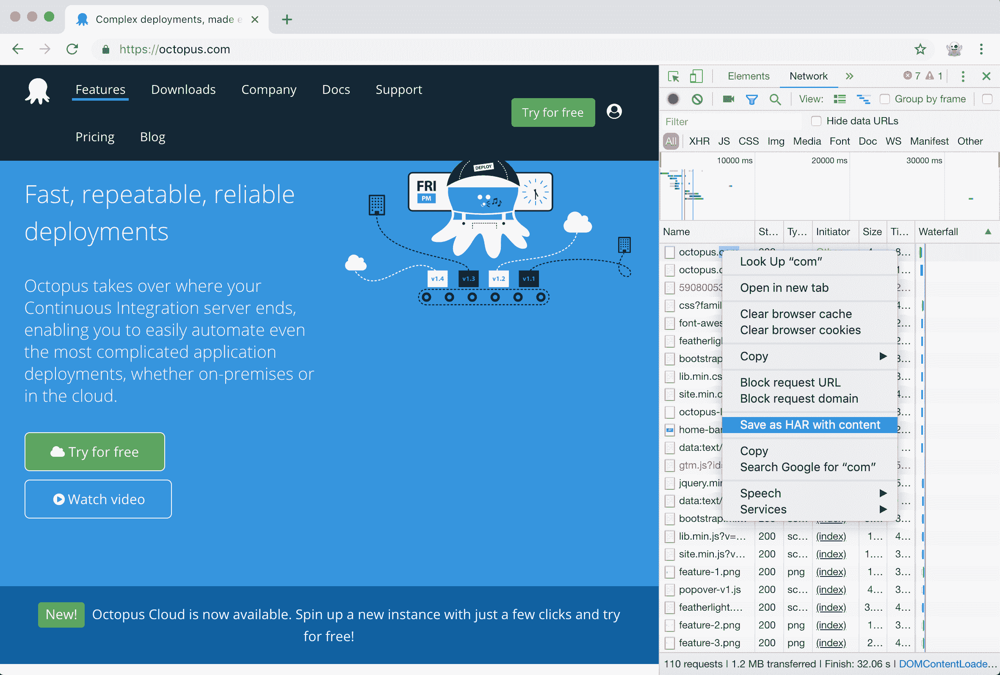
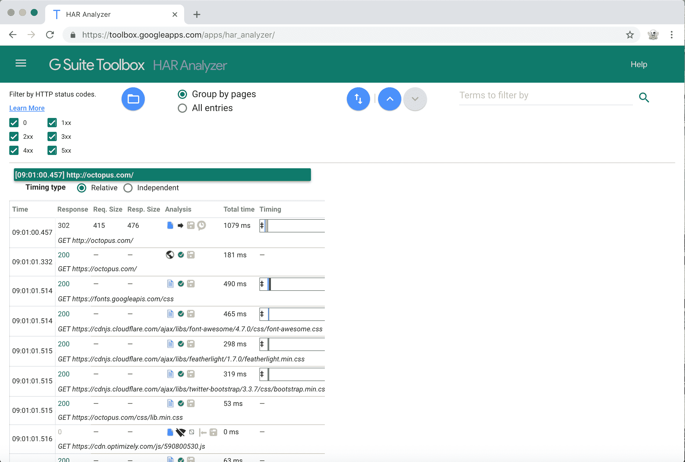
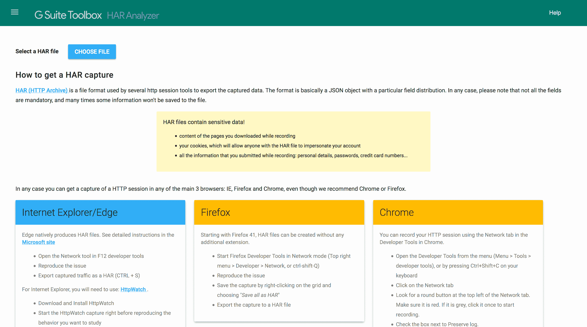
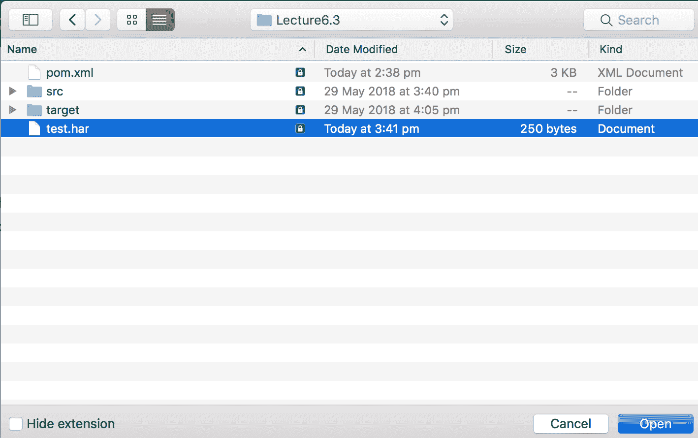
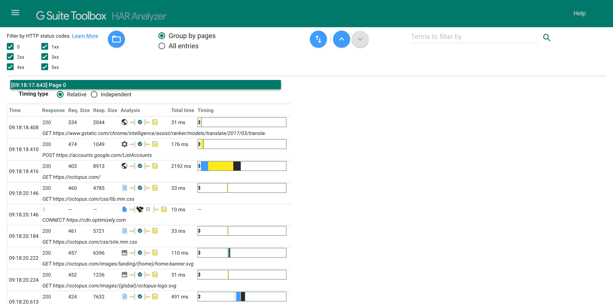
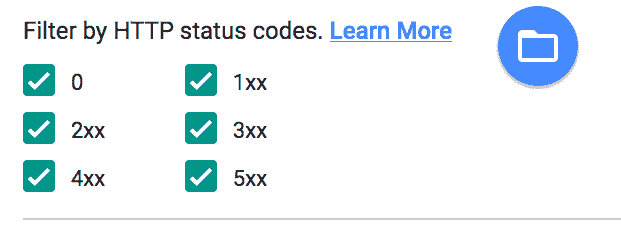
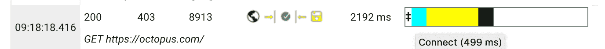
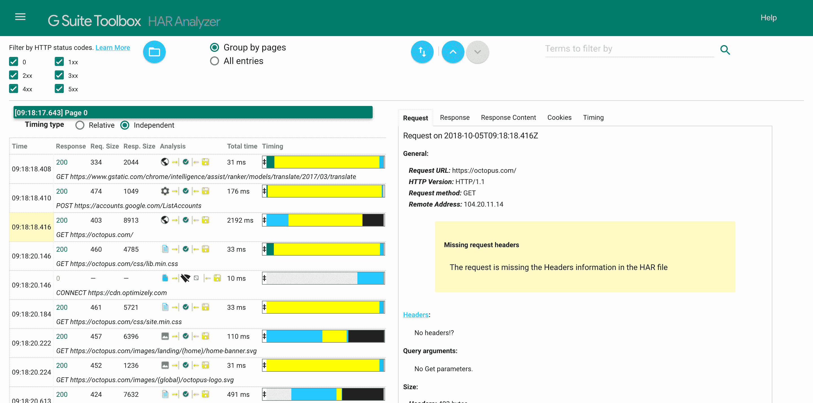
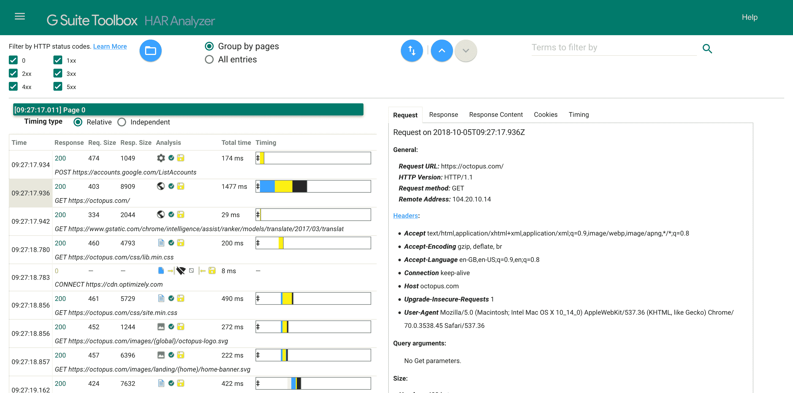

# 硒系列:捕捉 HAR 文件-章鱼部署

> 原文：<https://octopus.com/blog/selenium/13-capturing-har-files/capturing-har-files>

这篇文章是关于[创建 Selenium WebDriver 测试框架](/blog/selenium/0-toc/webdriver-toc)的系列文章的一部分。

HTTP 存档(HAR)文件是浏览器与外部 web 应用程序交互的标准 JSON 格式日志。

你可以通过打开 Chrome 开发者工具，点击`Network`标签，打开一个网站，然后在网络调用列表中右击并选择`Save as HAR with content`来生成一个 HAR 文件。

[](#)

这将生成一个 HAR 文件，其中包含开发人员工具捕获的所有网络调用的详细信息。

因为 HAR 文件具有开放的格式，所以您可以使用许多在线工具来检查其内容。一个这样的工具是 [HAR 分析器](https://toolbox.googleapps.com/apps/har_analyzer/)。该工具允许您上传一个 HAR 文件，然后通过 HTTP 响应代码进行过滤，检查与请求相关的内容，并查看每个网络调用的时间。当调试 web 应用程序的错误或了解站点的响应情况时，这种信息是无价的。

[](#)

BrowserMob 中一个有用的特性是能够根据通过它的网络请求生成 HAR 文件。

为了允许测试捕获 HAR 文件，我们将向`AutomatedBrowser`接口添加两个方法:

```
void captureHarFile();

void saveHarFile(String file); 
```

`captureHarFile()`方法用于指示 BrowserMob 开始捕获网络流量，而`saveHarFile()`方法将获取任何捕获的流量并将其保存到指定的文件中。

然后默认方法被添加到`AutomatedBrowserBase`:

```
@Override
public void captureHarFile() {
  if (getAutomatedBrowser() != null) {
    getAutomatedBrowser().captureHarFile();
  }
}

@Override
public void saveHarFile(final String file) {
  if (getAutomatedBrowser() != null) {
    getAutomatedBrowser().saveHarFile(file);
  }
} 
```

这些方法是在`BrowserMobDecorator`类中实现的。

为了开始捕获网络流量，我们调用 BrowserMob 代理对象上的`newHar()`:

```
@Override
public void captureHarFile() {
  proxy.newHar();
} 
```

通过调用`getHar().writeTo()`保存捕获的流量:

```
@Override
public void saveHarFile(final String file) {
  try {
    proxy.getHar().writeTo(new File(file));
  } catch (final IOException ex) {
    throw new SaveException(ex);
  }
} 
```

被检查的异常`IOException`被捕获并作为未检查的异常`SaveException`被重新抛出。这允许我们匹配接口方法签名，它不指定任何检查的异常。

这里是`SaveException`的代码。它扩展了`RuntimeException`类，这意味着它是一个未检查的异常:

```
package com.octopus.exceptions;

public class SaveException extends RuntimeException {

  public SaveException() {

  }

  public SaveException(final String message) {
    super(message);
  }

  public SaveException(final Throwable cause) {
    super(cause);
  }

  public SaveException(final String message, final Throwable cause) {
    super(message, cause);
  }
} 
```

现在，剩下的就是使用这些方法作为测试的一部分:

```
@Test
public void captureHarFile() throws URISyntaxException {
final AutomatedBrowser automatedBrowser =
  AUTOMATED_BROWSER_FACTORY.getAutomatedBrowser("Chrome");

  try {
    automatedBrowser.init();
    automatedBrowser.captureHarFile();
    automatedBrowser.goTo("https://octopus.com/");
  } finally {
    try {
      automatedBrowser.saveHarFile("test.har");
    } finally {
      automatedBrowser.destroy();
    }
  }
} 
```

在打开网页之前，我们先给`automatedBrowser.captureHarFile()`打了个电话。这可确保我们在测试中捕获所有网络流量。

在`finally`块中，我们嵌套了一个额外的`try` / `finally`块。在嵌套的`try`块中，我们称之为`automatedBrowser.saveHarFile("test.har")`，它将任何捕获的流量写入文件`test.har`。这个调用是在`finally`块中进行的，因为即使测试失败，我们也想保存这个网络流量。HAR 文件通常包含可用于调试失败测试的信息，因此我们希望确保在测试过程中保存该文件，而不考虑错误。

在嵌套的`finally`块中，我们调用`automatedBrowser.destroy()`。因为对`destroy()`的调用释放了资源，所以我们需要确保它在测试失败和保存 HAR 文件失败的情况下运行。以这种方式嵌套`try` / `finally`块保证了`destroy()`方法被调用，而不管任何其他失败。

生成的`test.har`文件捕获了由于打开【https://octopus.com/】的[而产生的网络流量。然后可以使用 HAR 分析器等工具检查该文件，以快速识别任何失败的请求(即 4xx 或 5xx 范围内的任何 HTTP 响应代码)，并提供可视的呼叫时间表。这些信息对于调试 web 应用程序的错误和理解性能瓶颈是非常宝贵的。](https://octopus.com/)

要用 HAR 分析仪打开文件，转到[https://toolbox.googleapps.com/apps/har_analyzer/](https://toolbox.googleapps.com/apps/har_analyzer/)并点击`CHOOSE FILE`按钮。

[](#)

选择`test.har`文件。

[](#)

然后，您将得到一个表格，显示测试过程中发出的所有网络请求。

【T2 

您可以使用这些复选框通过 HTTP 响应代码过滤结果。

[](#)

这些代码是 100 到 599 之间的数字，以 100 为一组。0 响应代码是一种特殊情况，表示没有返回响应。

下表显示了响应代码的一般含义。

| 代码范围 | 意义 |
| --- | --- |
| 1xx | 信息反应 |
| 2xx | 成功 |
| 3xx | 重寄 |
| 4xx | 客户端错误 |
| 5xx | 服务器错误 |

该表显示了 7 列。

| 圆柱 | 价值 |
| --- | --- |
| 时间 | 提出请求时的 UTC 时间。 |
| 反应 | HTTP 响应代码。这是使用上面的复选框过滤的代码。 |
| 请求。大小 | 浏览器发送的字节数。 |
| Resp。大小 | 浏览器接收的字节数。 |
| 分析 | 显示代表与请求相关联的数据、请求状态以及请求是否由浏览器缓存提供的图标。 |
| 时机 | 显示一个图表，显示构成请求的事件以及这些事件花费的时间。 |

响应时间显示在最后一列的图表中。将光标悬停在每个彩色列上可以显示发生了什么类型的事件，以及花费了多长时间。

如果选择了`Relative`计时类型，图表显示所有请求所用的总时间，彩色列显示单个请求相对于总时间所用的时间。

[](#)

如果选择了`Independent`计时类型，图表只显示每个事件相对于单个请求所花费的时间。

单击任何一行都会在页面右侧显示有关该请求的更多详细信息。

[](#)

您会注意到，当选择一个请求时，许多数据都丢失了。这是因为默认情况下，BrowserMob 只捕获一小部分可以保存在 HAR 文件中的数据。为了获取所有可用的信息，我们在`AutomatedBrowser`接口中创建了一个名为`captureCompleteHarFile()`的新方法:

```
void captureCompleteHarFile(); 
```

我们将默认实现添加到`AutomatedBrowserBase`类中:

```
@Override
public void captureCompleteHarFile() {
  if (getAutomatedBrowser() != null) {
    getAutomatedBrowser().captureCompleteHarFile();
  }
} 
```

然后我们在`BrowserMobDecorator`类中实现该方法:

```
@Override
public void captureCompleteHarFile() {
  final EnumSet<CaptureType> captureTypes =
    CaptureType.getAllContentCaptureTypes();
  captureTypes.addAll(CaptureType.getHeaderCaptureTypes());
  captureTypes.addAll(CaptureType.getCookieCaptureTypes());
  proxy.setHarCaptureTypes(captureTypes);
  proxy.newHar();
} 
```

这里的更改是指示 BrowserMob 捕获发送和接收的某些附加数据。BrowserMob 公开了一个名为`CaptureType`的枚举，它定义了可以保存在 HAR 文件中的各种细节。此外，`CaptureType` enum 有一些静态方法，这些方法提供了方便的 enum 组，这些 enum 组表示相关种类的细节的集合。

我们从代表内容的一组预定义的`CaptureType`枚举开始:

```
final EnumSet<CaptureType> captureTypes =
  CaptureType.getAllContentCaptureTypes(); 
```

然后，我们添加代表头部的预定义的`CaptureType`枚举组:

```
captureTypes.addAll(CaptureType.getHeaderCaptureTypes()); 
```

最后，我们添加代表 cookies 的一组预定义的`CaptureType`枚举:

```
captureTypes.addAll(CaptureType.getCookieCaptureTypes()); 
```

然后将这些`CaptureType`枚举传递给`setHarCaptureTypes()`方法，以配置 BrowserMob 将所有这些细节保存到生成的 HAR 文件中:

```
proxy.setHarCaptureTypes(captureTypes); 
```

更新测试以调用`captureCompleteHarFile()`方法，并再次运行它:

```
@Test
public void captureCompleteHarFile() throws URISyntaxException {

  final AutomatedBrowser automatedBrowser =
    AUTOMATED_BROWSER_FACTORY.getAutomatedBrowser("Chrome");

  try {
    automatedBrowser.init();
    automatedBrowser.captureCompleteHarFile();
    automatedBrowser.goTo("https://octopus.com/");
  } finally {
    try {
      automatedBrowser.saveHarFile("test.har");
    } finally {
      automatedBrowser.destroy();
    }
  }
} 
```

您会注意到，HAR 文件现在有几兆字节大小，这是针对一个相对简单的页面请求的。更完整的测试可能会生成相当大的 HAR 文件，所以尽量少用`captureCompleteHarFile()`方法。

当我们分析新的 HAR 文件时，我们可以看到不再有任何关于丢失信息的警告。

[](#)

HAR 文件是记录和分析测试过程中网络迭代的非常有用的方法，而且由于 BrowserMob 代理，生成 HAR 文件非常容易。但是 BrowserMob 可以做的不仅仅是记录流经它的流量，在下一篇文章中，我们将看到 BrowserMob 如何阻止或修改请求。

这篇文章是关于[创建 Selenium WebDriver 测试框架](/blog/selenium/0-toc/webdriver-toc)的系列文章的一部分。