# 硒系列:上传网页到 S3 -八达通部署

> 原文：<https://octopus.com/blog/selenium/16-uploading-to-s3/uploading-to-s3>

这篇文章是关于[创建 Selenium WebDriver 测试框架](/blog/selenium/0-toc/webdriver-toc)的系列文章的一部分。

到目前为止，我们测试了从本地磁盘加载的网页，并对公共网站进行了一些简单的测试。然而，当我们开始研究 WebDriver 的高级特性时，我们需要能够托管我们可以与之交互的真实公共网站的能力。

托管网站有一百万种方式，但是考虑到我们将在后面的文章中使用亚马逊网络服务(AWS ),使用 S3 服务托管网站对我们来说是一个合理的选择。

对于那些不熟悉它的人来说，AWS 是亚马逊提供的服务和平台的集合，允许你做诸如创建托管虚拟机(通过 EC2 服务)，创建托管数据库服务器(通过 RDS 服务)，存储文件(通过 S3 服务)，运行功能(通过 Lambda 服务)等等。AWS 有 100 多种不同的服务可以利用，尽管我们在这个博客系列中只使用了一小部分。

AWS 的一个好处是它提供了一个相当慷慨的免费层，这意味着你可以不花钱就开始使用 AWS。我们将在 AWS 中托管的小网页将很容易位于免费层的限制内。

AWS S3 是一种文件托管服务，让我们可以在云端保存数据，并让公众可以访问。S3 通常用于托管典型网络驱动器上的内容，如日志文件和文档，但它也可用于托管公共网站。通过上传 HTML 文件和任何其他资源，如图像或 CSS 文件，并配置 S3 作为一个网站托管这些文件，我们可以快速轻松地创建一个公开可用的，高度可靠的网站。这正是我们将对我们的测试网站所做的。

要访问 S3 控制台，从 AWS 控制台点击服务➜ S3 。

[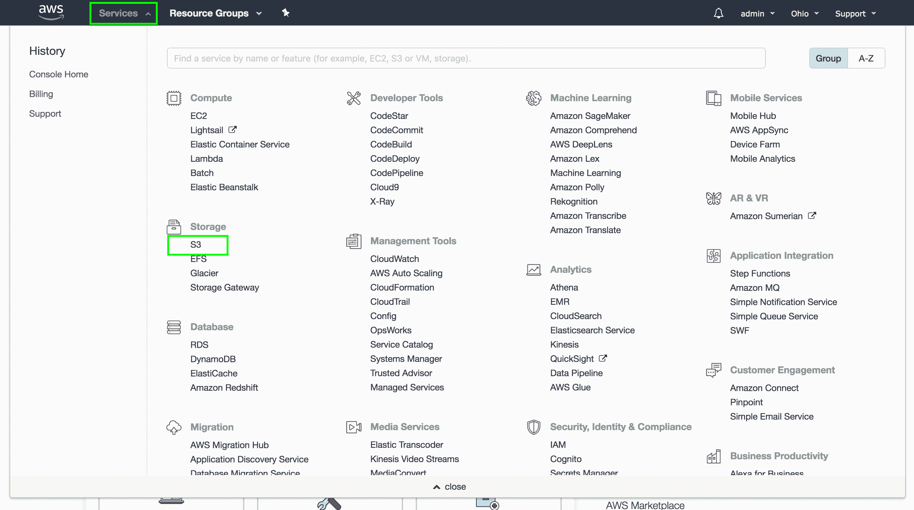](#)

首先，我们需要创建一个 bucket。存储桶大致类似于目录，但是有一个重要的警告，存储桶的名称必须是全局唯一的。这意味着您的存储桶的名称不能被任何其他 AWS 客户使用。

如果您看到 S3 存储桶名称似乎是随机生成的，这是因为所有常见的存储桶名称早已被其他 AWS 客户使用。

要创建新的存储桶，点击`Create bucket`按钮。

给你的 bucket 起一个名字(记住它必须是全局惟一的，我在这里使用的名字现在不可用)，然后点击`Next`按钮。

我们不需要启用向导的这个部分中显示的任何附加属性，所以单击`Next`按钮。

[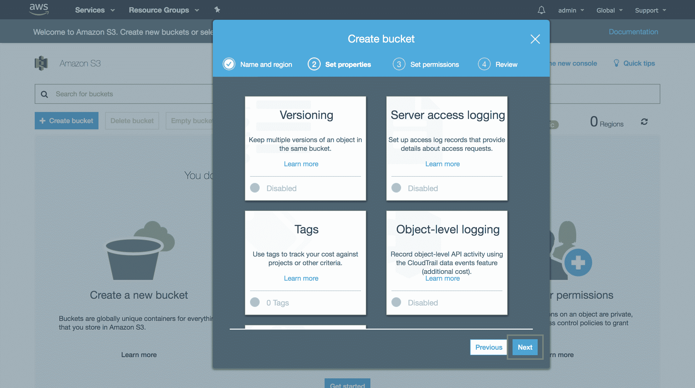](#)

默认权限没问题，所以点击`Next`按钮。

[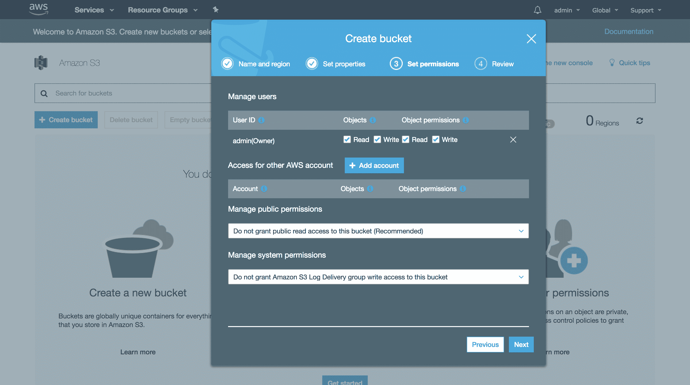](#)

审查屏幕向我们显示了我们选择的摘要。点击`Create bucket`按钮完成。

然后显示我们新创建的存储桶。点击它打开桶。

[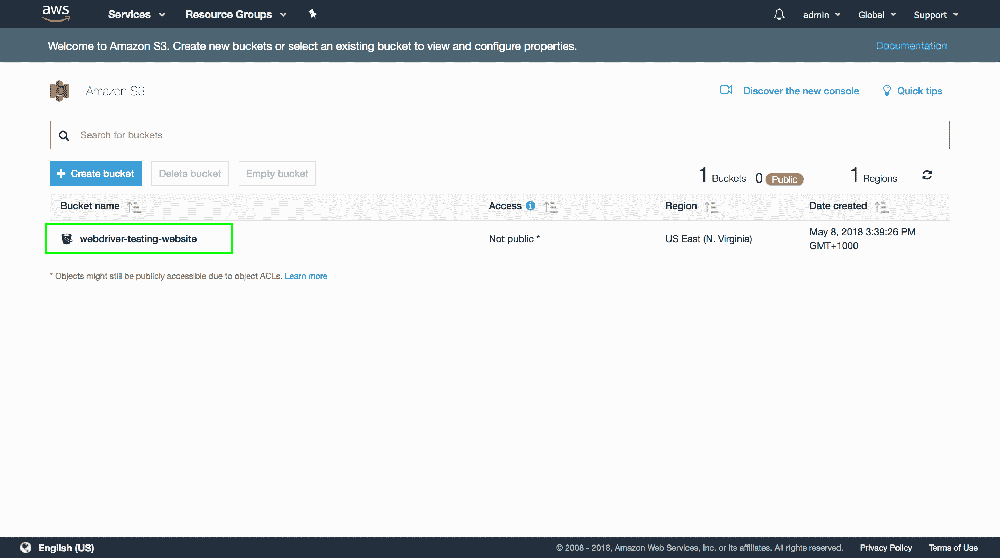](#)

桶当前是空的。点击`Upload`按钮。

单击添加文件按钮。这将显示一个文件选择对话框。

[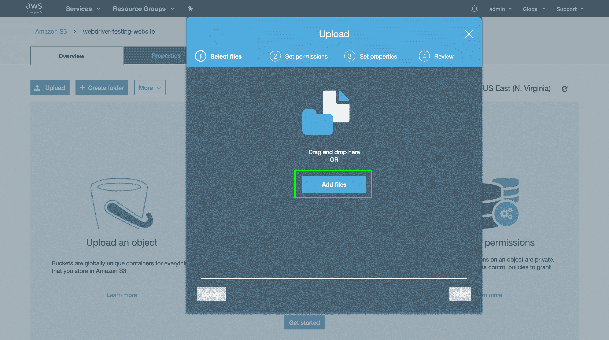](#)

在这里，我们上传各种测试网页的文件，这些文件是我们在测试期间从本地磁盘上下载的。这些文件将位于`src/test/resources`目录下。

这些文件将在向导中列出。点击`Next`按钮继续。

[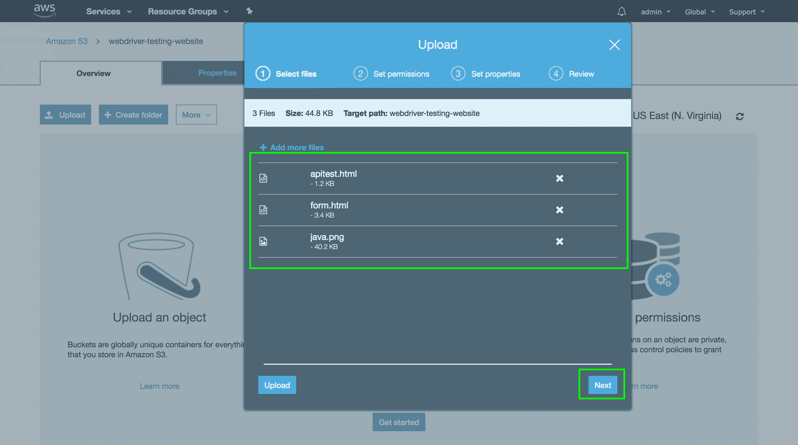](#)

我们现在接受默认权限，所以点击`Next`按钮。

默认属性没问题，所以点击`Next`按钮。

[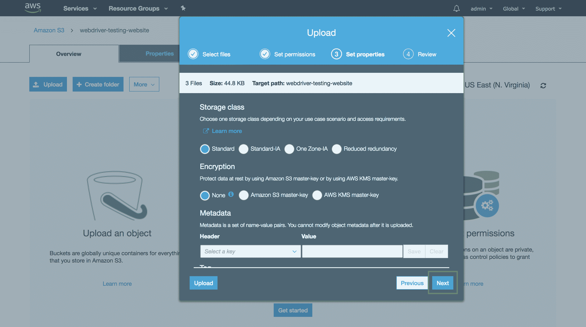](#)

查看屏幕显示了选项的摘要。点击`Upload`按钮，将选中的文件上传到 S3 桶。

几秒钟后(文件相当小，应该上传很快)，文件会显示在桶中。

[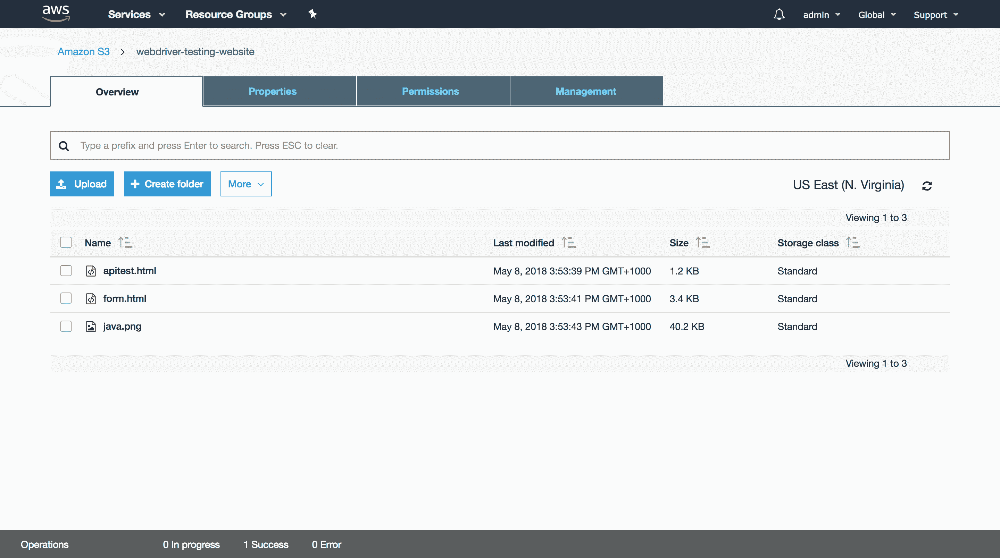](#)

要允许这些文件作为公共网页查看，我们需要更改权限以允许匿名公共访问它们。为此，选择所有文件，点击`More`按钮，然后选择`Make public`选项。

[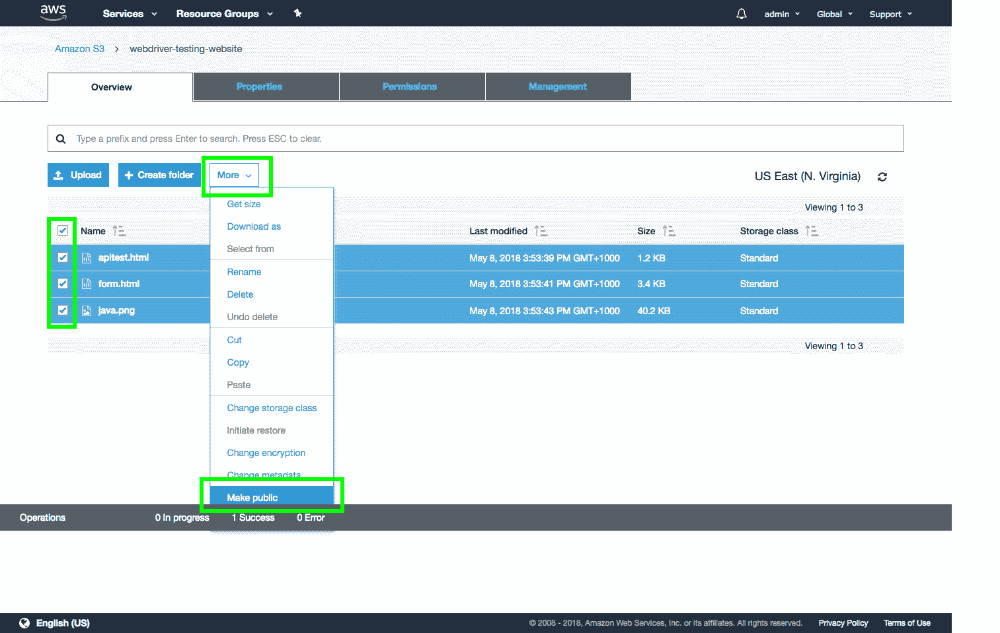](#)

点击`Make public`按钮，公开曝光文件。

[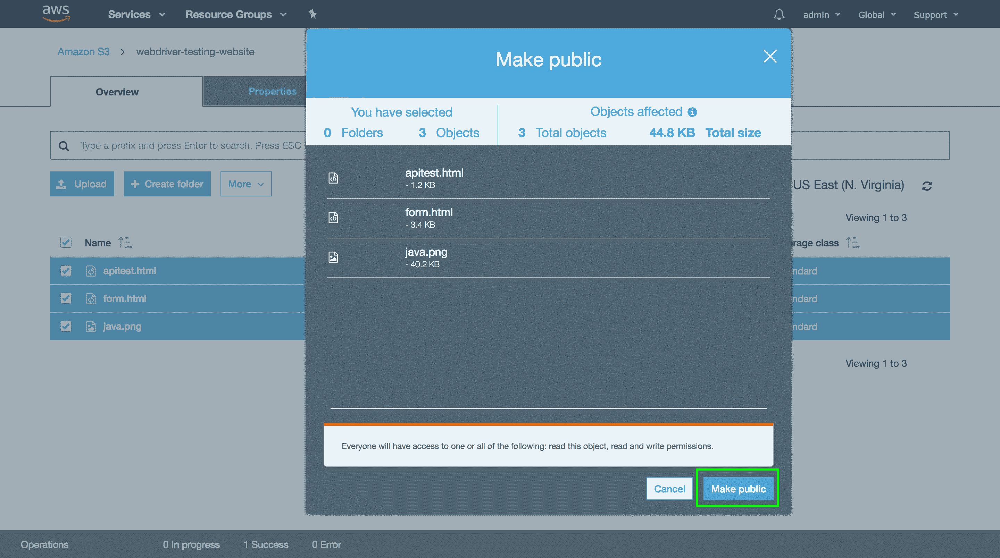](#)

现在这些文件已经公开了，我们需要找到可以用来在浏览器中打开它们的 URL。点击`form.html`文件。

打开该文件的链接显示在 Overview 选项卡中，在这种情况下，URL 是[https://S3 . amazonaws . com/web driver-testing-website/form . html](https://s3.amazonaws.com/webdriver-testing-website/form.html)。您可以单击此链接在浏览器中打开页面。

[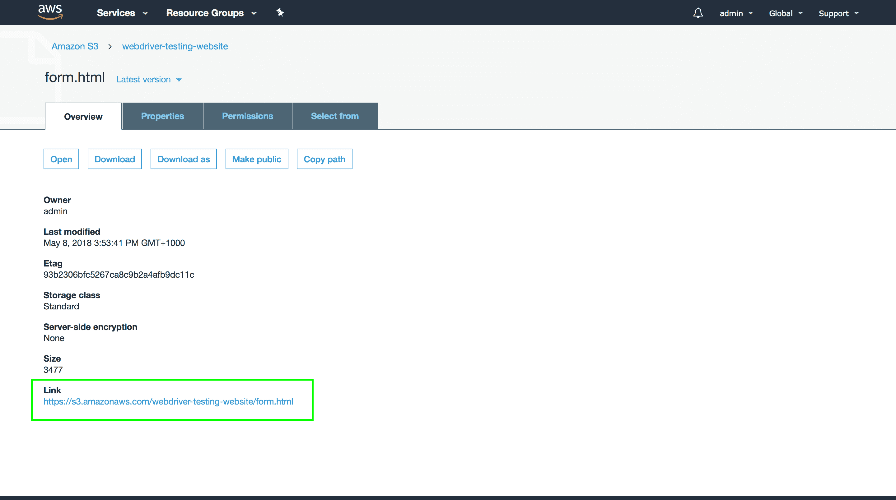](#)

通过将文件上传到 S3 并公之于众，我们有效地利用了 S3 作为网络主机。这为我们提供了一个公共 URL，我们可以将其作为测试的一部分进行加载，这意味着我们可以在无法访问 Java 项目中的本地 HTML 文件的平台上开始编写测试。我们将在下一篇文章中利用这个网站托管，在 BrowserStack 上运行测试，这将允许我们跨多个浏览器和移动设备运行测试。

这篇文章是关于[创建 Selenium WebDriver 测试框架](/blog/selenium/0-toc/webdriver-toc)的系列文章的一部分。