# Selenium 系列:填充 Git repo - Octopus 部署

> 原文：<https://octopus.com/blog/selenium/20-populating-the-git-repo/populating-the-git-repo>

这篇文章是关于[创建 Selenium WebDriver 测试框架](/blog/selenium/0-toc/webdriver-toc)的系列文章的一部分。

我们已经讨论了代码库，在这篇文章中，我们将注册 GitHub，这是一个免费的服务，提供托管的 Git 代码库，我们可以用它来管理我们的代码。

首先，打开[https://github.com](https://github.com)。在主页上，你会看到一个表格，在那里你可以注册一个免费帐户。

输入用户名、电子邮件地址和密码，然后点击`Sign up for GitHub`按钮。

选择`Unlimited public repositories for free`选项，点击`Continue`按钮。

[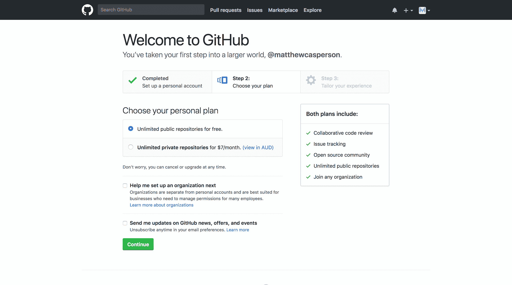](#)

我们现在不需要个性化 GitHub，所以点击`skip this step`链接。

现在我们已经创建了一个新的 GitHub 帐户。您将会收到一封发送到您注册地址的电子邮件。电子邮件中有一个链接，您需要点击它来验证您的电子邮件地址。

[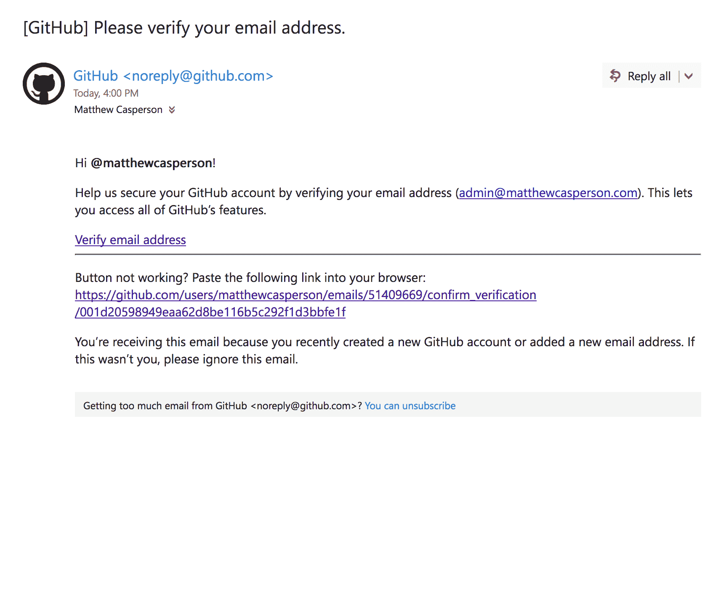](#)

单击链接后，您可以通过单击`Start a project`按钮创建一个新的 Git 存储库。

[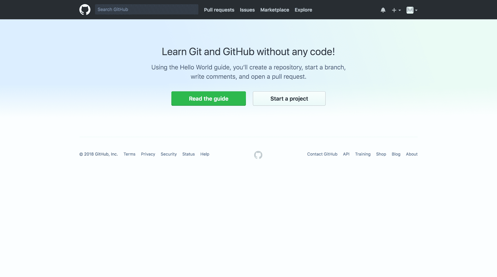](#)

给你的库起一个名字(我在这里用了名字`WebDriver`，选择`Public`选项，然后点击`Create repository`按钮。

我们创建一个公共存储库是很重要的，因为 GitHub 和 Travis CI 都为公共存储库提供免费计划。这意味着我们可以免费创建 CI 渠道。

[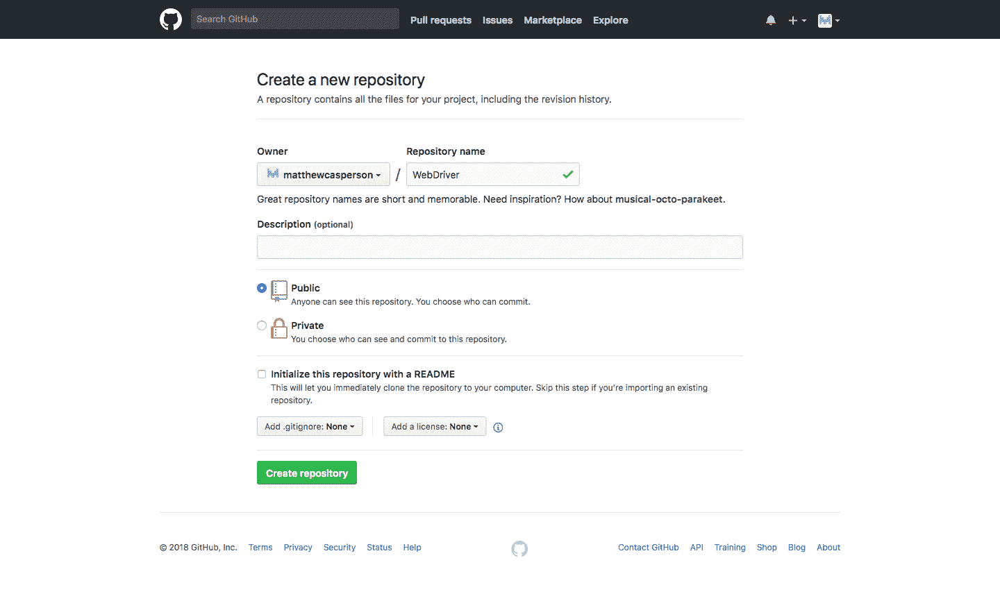](#)

随着存储库的创建，我们现在有了一个可以用来检入代码的 URL。在我的例子中，网址是 https://github.com/matthewcasperson/WebDriver.git。

[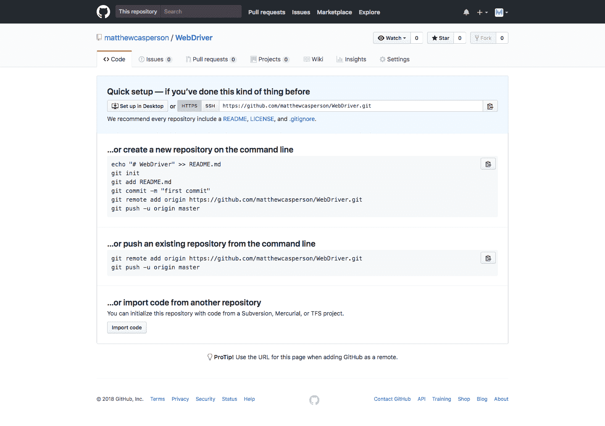](#)

我们现在有了一个空的 Git 存储库，可以用我们的代码填充了。IntelliJ 对处理 Git 存储库中的代码有很好的支持，所以我们将使用 IntelliJ 创建一个本地 Git 存储库，并将其链接到我们刚刚在 GitHub 中创建的存储库。

在加载 WebDriver 项目的情况下打开 Intellj。然后点击 VCS ➜启用版本控制集成...

[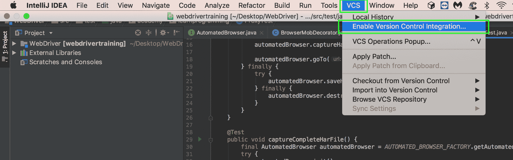](#)

选择`Git`作为要使用的版本控制系统，点击`OK`按钮。

[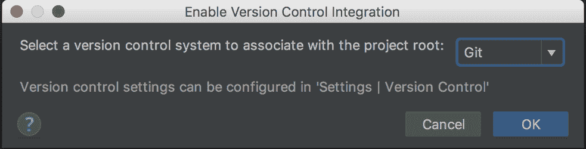](#)

这将在保存当前加载的项目的目录中创建一个本地 Git 存储库。这个 Git 存储库可以完全独立于我们在 GitHub 中创建的远程存储库运行，但是为了使用像 Travis CI 这样的 CI 工具，我们需要将本地 Git 存储库和 GitHub 中托管的远程存储库链接在一起。这是通过将 GitHub 配置为远程存储库来实现的。

要添加远程存储库，请单击 VCS ➜ Git ➜远程...

[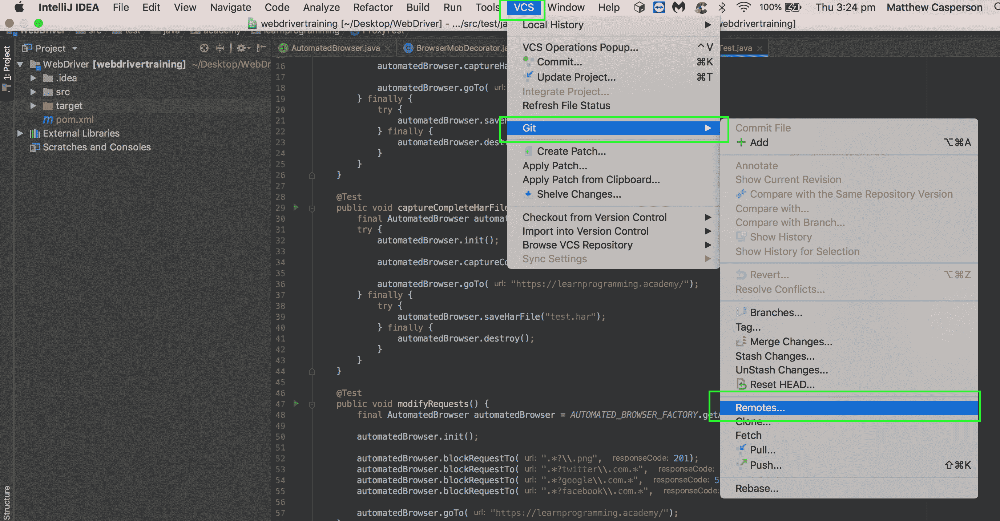](#)

单击加号图标添加新的远程存储库。

[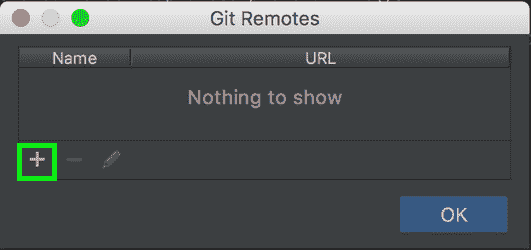](#)

保留默认名称`origin`。

对于 URL，我们需要使用 GitHub 提供给我们的 URL 的稍微修改的版本。如果您还记得，当我们在 GitHub 中创建 Git 存储库时，我们被赋予了 URL `https://github.com/matthewcasperson/WebDriver.git`。这是我们需要在这里输入的 URL，但是进行了修改，在 URL 中包含了 GitHub 用户名。这是通过在`https://`后添加用户名和 at 符号来实现的。在我的例子中，输入的 URL 是`https://matthewcasperson@github.com/matthewcasperson/WebDriver.git`。

在这里添加用户名意味着我们可以将代码推送到远程存储库。没有用户名，这个存储库将是只读的，我们不能使用 IntelliJ 来签入任何更改。

点击`OK`按钮保存更改。

[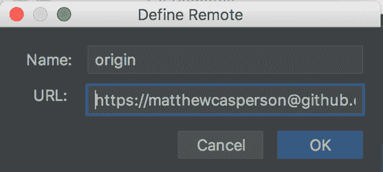](#)

点击`OK`按钮关闭`Git Remotes`对话框。

[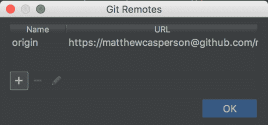](#)

您会注意到，现在组成我们项目的文件以红色显示。这表明这些文件还没有添加到 Git 存储库中。

[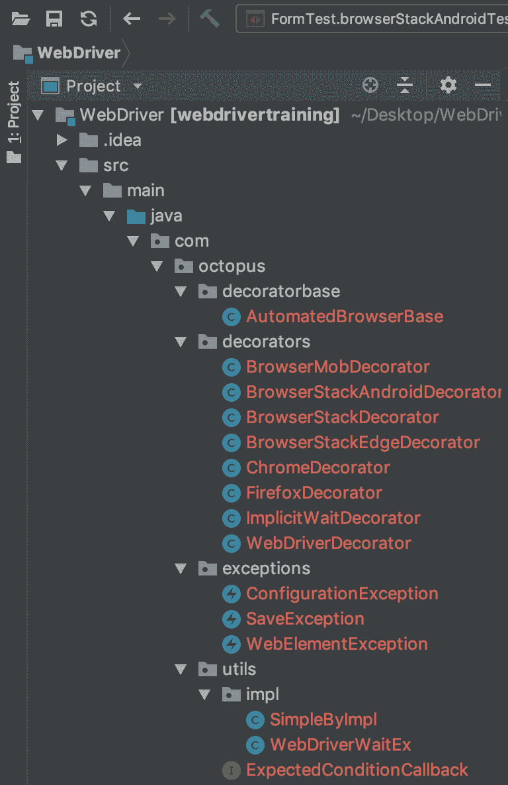](#)

一般来说，我们希望将所有的源代码文件添加到 Git 存储库中。此外，虽然我们的项目目录中也有许多由 IntelliJ 为自己的配置创建的文件。IntelliJ 提供了一些关于将哪些文件签入存储库的建议，网址为[https://IntelliJ-support . jetbrains . com/HC/en-us/articles/206544839](https://intellij-support.jetbrains.com/hc/en-us/articles/206544839):

*   项目根目录**中`.idea`目录下的所有文件，除了**中存储用户特定设置的`workspace.xml`和`tasks.xml`文件。
*   所有可以位于不同模块目录的`.iml`模块文件(适用于 IntelliJ IDEA)。

为了防止某些文件被添加到 Git 存储库中，我们需要创建一个名为`.gitignore`的文件。这个文件列出了我们目录中 Git 不应该添加到存储库中的那些文件。

右键单击顶层项目文件夹，选择新建➜文件。

[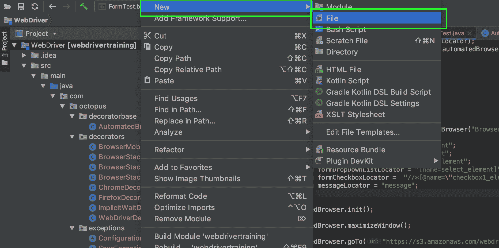](#)

输入文件名`.gitignore`并点击`OK`按钮。

[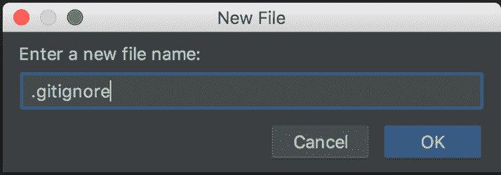](#)

IntelliJ 检测到我们正在创建一个新文件，并询问我们是否要将它添加到存储库中。我们希望默认添加新文件，所以单击`Remember, don’t ask again`选项，然后单击`Yes`按钮。

[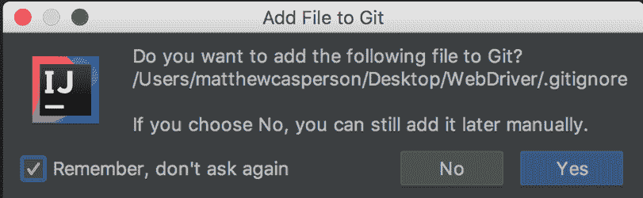](#)

在`.gitignore`文件中，我们列出了不应该添加到 Git 存储库中的两个文件。确保保存更改。

您的目录中可能还没有这两个文件。可以在`.gitignore`文件中列出不存在的文件。

右键单击顶层项目文件夹，选择 Git ➜添加。这将把除了那些在`.gitignore`文件中的文件之外的所有文件添加到存储库中。

[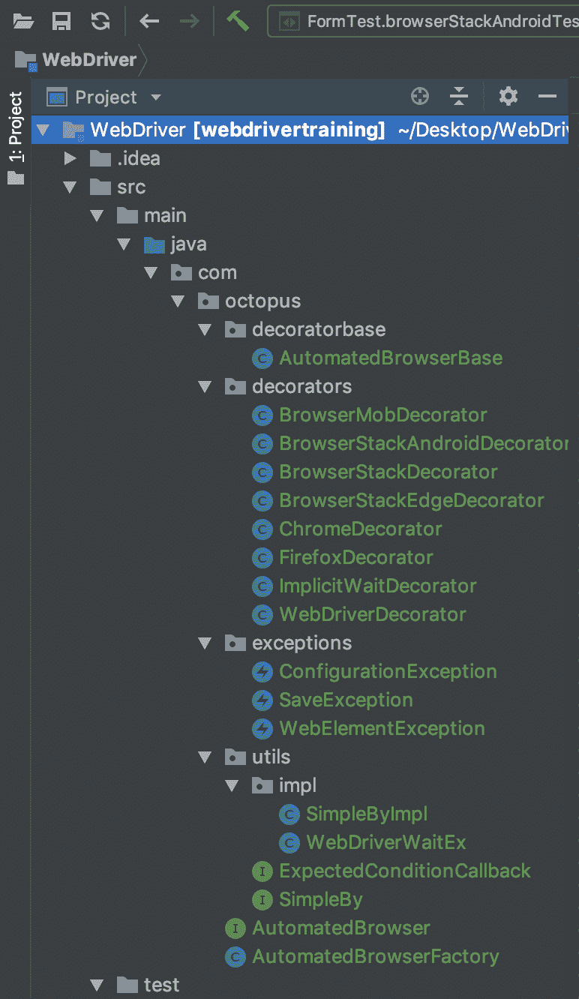](#)

现在所有的文件都是绿色的，除了`.idea/workspace.xml`。这个文件是我们添加到`.gitignore`文件中的一个，所以还没有添加到存储库中。

[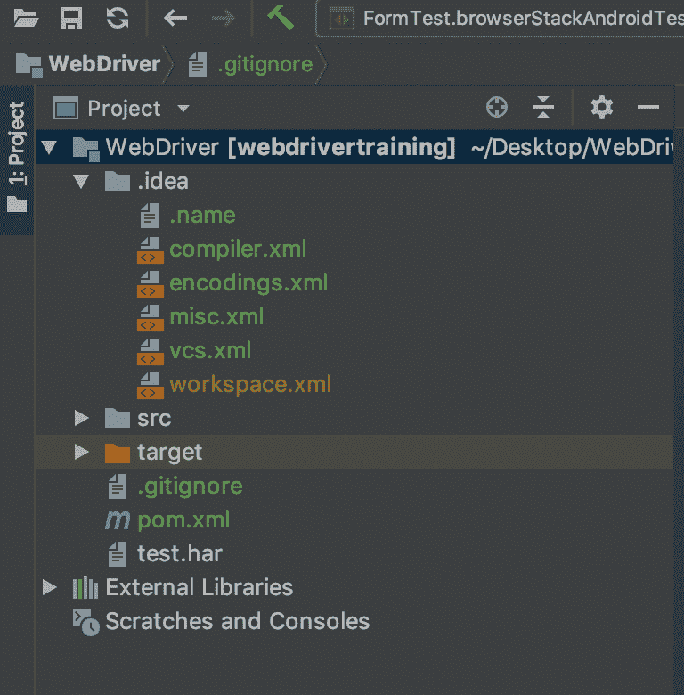](#)

既然我们已经将文件添加到了存储库中，我们希望将它们签入。为此，我们右键单击顶层项目文件夹并选择 Git ➜提交目录。

在`Commit Changes`对话框中，选择所有文件。然后添加提交消息。稍后可以使用该消息来了解提交时做了哪些更改，这对审计很有用。最后，点击`Commit`按钮右侧的箭头，并点击`Commit and Push`按钮。

[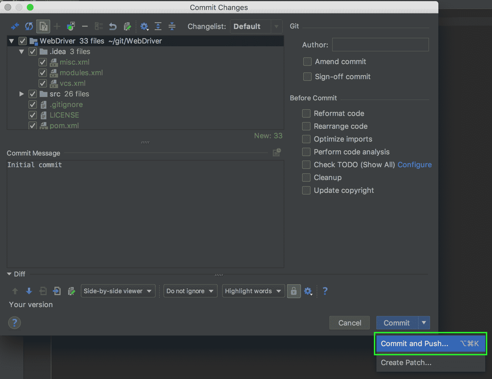](#)

`Push Commits`对话框将显示我们想要推送到 GitHub 上的远程存储库的变更列表。点击`Push`按钮进行更改。

[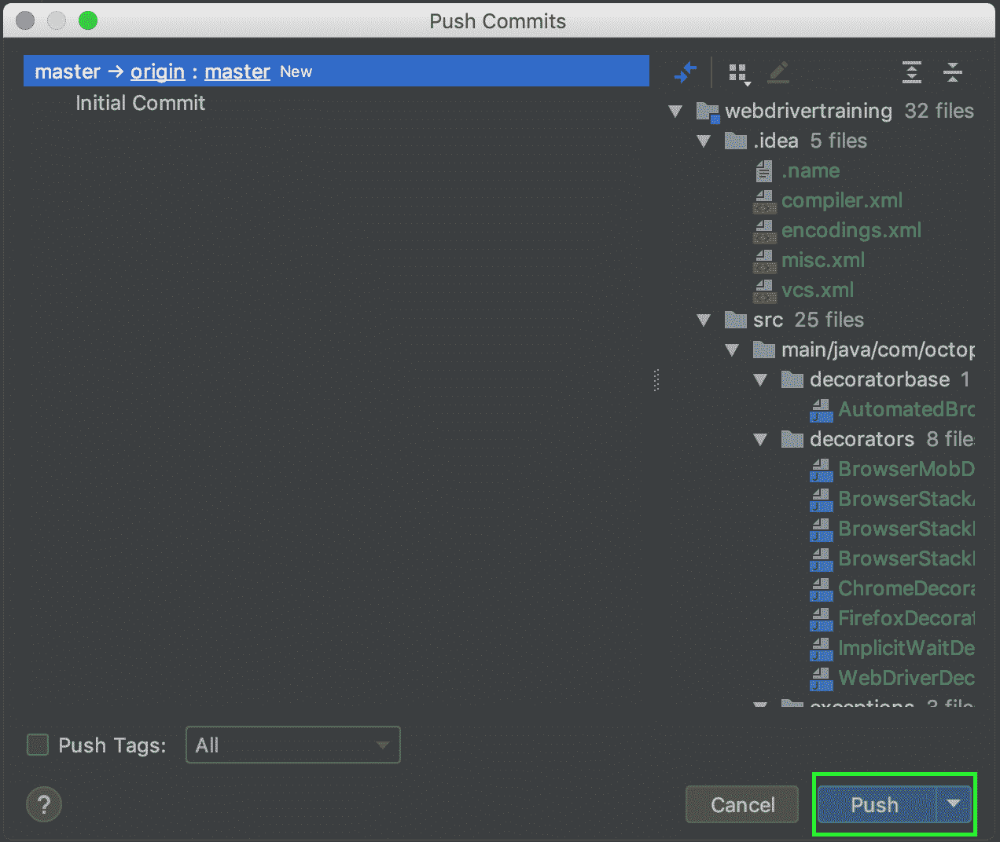](#)

系统会提示您提供 GitHub 密码。输入密码并点击`OK`按钮。

如果此时您得到一个错误消息，说推送失败，这可能是因为您在添加远程存储库时输入的 URL 没有嵌入 GitHub 用户名。

[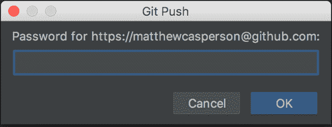](#)

推送操作完成后，您将看到一条消息。

回到 GitHub 中的存储库，我们可以看到文件被推送到远程存储库。

[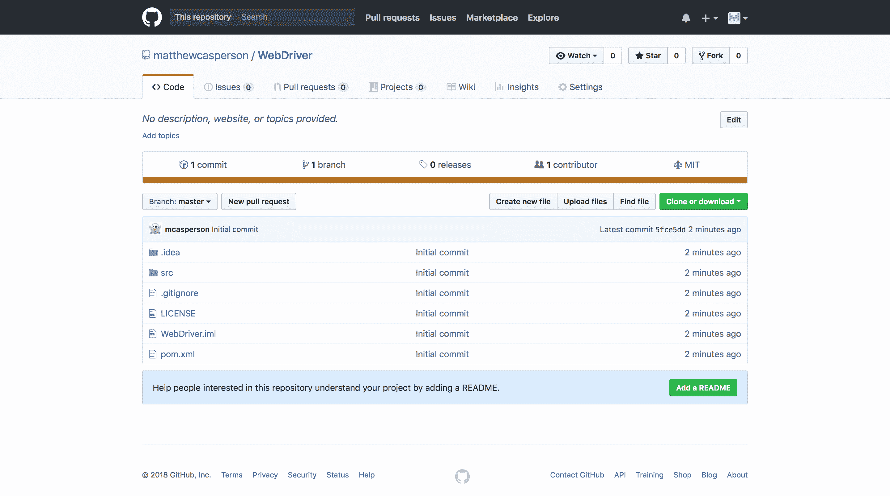](#)

使用源代码控制库通常被认为是良好的实践，因为它允许跟踪和审计变更，使您能够识别导致问题的代码，并在需要时撤销那些变更。GitHub 提供的托管 git 存储库意味着您的代码也备份在另一个位置，并且可以与从事同一项目的开发人员团队共享。将代码存储在 GitHub 中可以方便地与其他服务集成，在下一篇文章中，我们将链接 GitHub 和 Travis CI 来构建我们的代码，并在每次签入时自动运行我们的测试。

这篇文章是关于[创建 Selenium WebDriver 测试框架](/blog/selenium/0-toc/webdriver-toc)的系列文章的一部分。