# 硒系列:特拉维斯 CI -章鱼部署

> 原文：<https://octopus.com/blog/selenium/21-travis-ci/travis-ci>

这篇文章是关于[创建 Selenium WebDriver 测试框架](/blog/selenium/0-toc/webdriver-toc)的系列文章的一部分。

既然我们已经在一个公共的 GitHub 存储库中有了我们的代码，我们可以将它与 Travis CI 链接起来，以允许签入触发我们代码的构建和测试。

首先打开[https://travis-ci.com/](https://travis-ci.com/)并点击`Sign in with GitHub`按钮。

[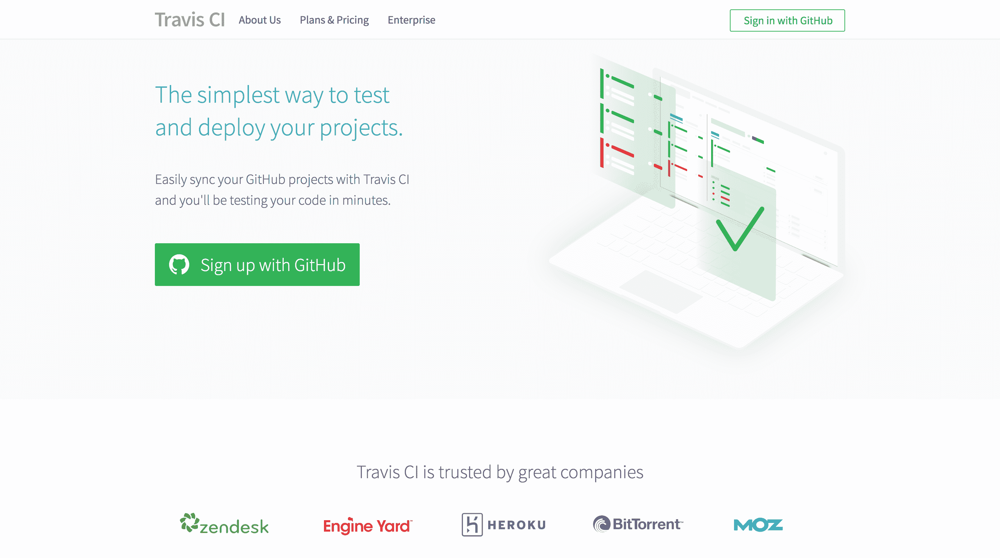](#)

GitHub 会要求你授权 Travis CI。点击`Authorize travis-pro`按钮。

[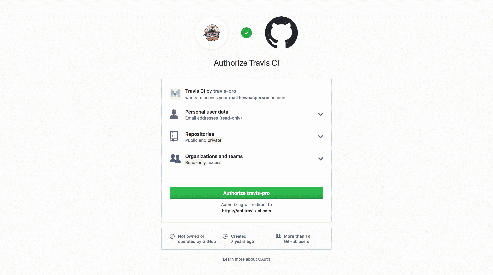](#)

你需要重新输入你的 GitHub 密码，然后点击`Confirm password`按钮。

[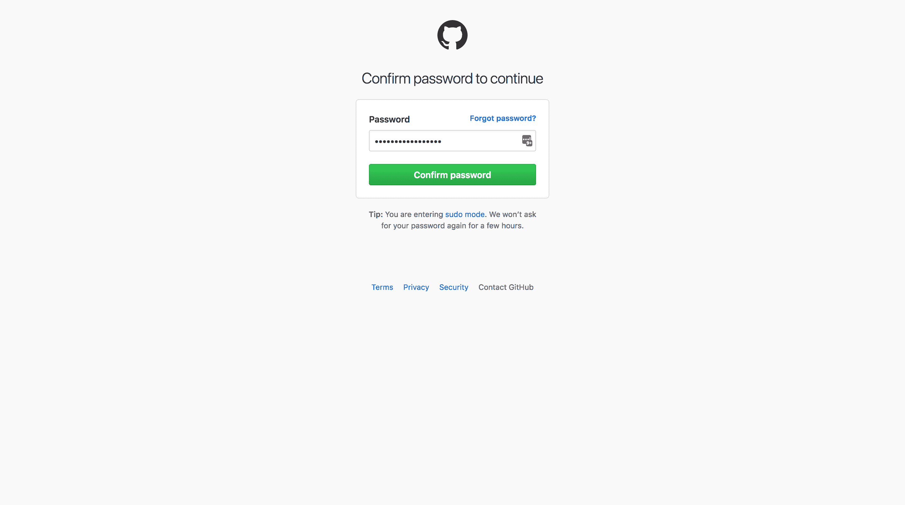](#)

几秒钟后，您将被带到一个屏幕，在这里您可以激活 GitHub 集成。点击`Active`按钮。

[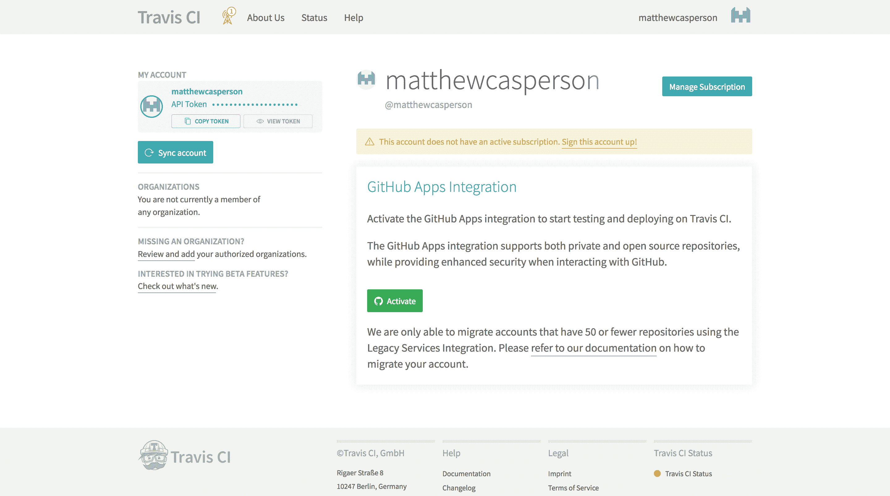](#)

选择`All repositories`选项，点击`Approve & Install`按钮。

[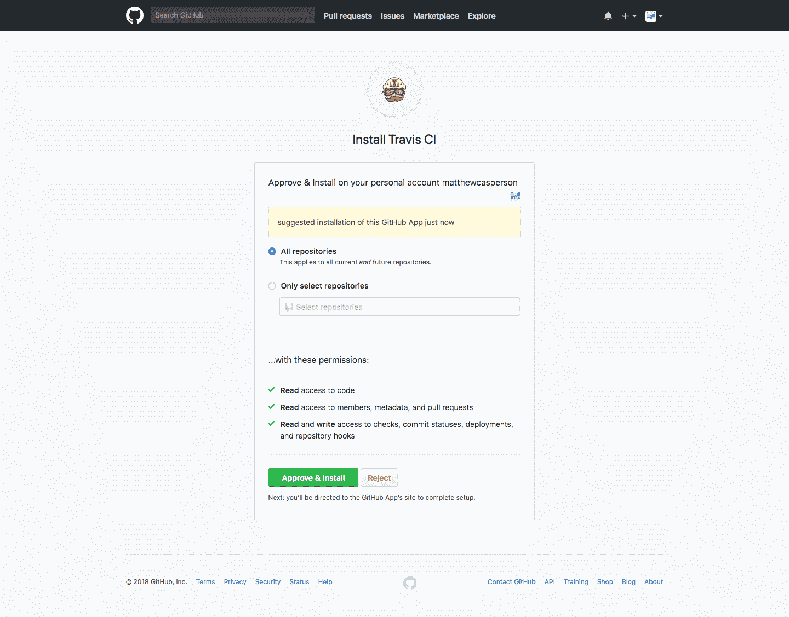](#)

几秒钟后，您将看到之前创建的公共 GitHub 存储库。

[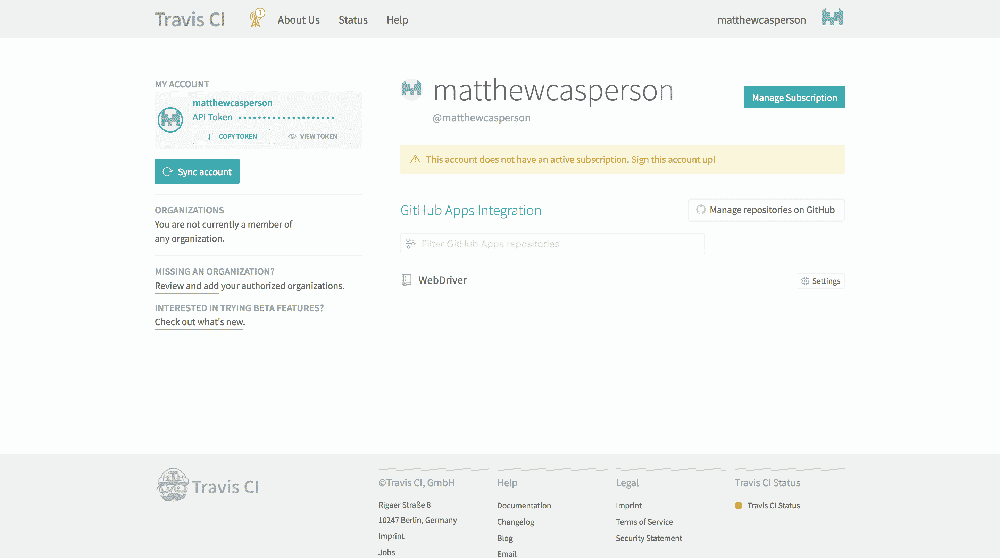](#)

单击存储库，进入构建列表。这个列表将是空的，因为我们还没有将所需的配置文件添加到存储库中，以允许 Travis CI 构建它。然而，我们现在已经成功地将 Travis CI 和 GitHub 链接在一起，这意味着 Travis CI 将监控 GitHub 存储库的变化。这是创建持续集成管道的第一步。

[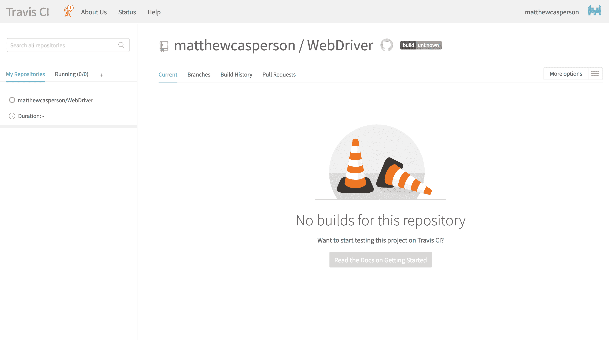](#)

Travis CI 和 GitHub 现在链接在一起了，Travis CI 正在监控保存我们的 Java 应用程序的存储库的任何签入。签入将触发 Travis CI 构建我们的代码并运行我们的测试，但是为了让 Travis CI 知道如何构建我们的项目，我们需要向我们的存储库添加一个名为`.travis.yml`的特殊文件。

`.travis.yml`文件是 Travis CI 在其监控的任何存储库中查找的配置文件。该文件包含 Travis CI 构建代码和运行测试所需的配置。

Travis CI 在 Linux 或 MacOS 实例上执行构建。我们将使用 Linux 来进行构建，因为 Linux 有许多有用的工具，我们可以在测试中加以利用。

让我们来看看完整的`.travis.yml`档案:

```
sudo: required
dist: trusty
language: java
jdk:
- oraclejdk8
addons:
  firefox: "60.0"
before_install:
- sudo apt-get update
- sudo apt-get install dbus-x11
- export DISPLAY=:99.0
- sh -e /etc/init.d/xvfb start
- export CHROME_BIN=/usr/bin/google-chrome
- sudo apt-get install -y libappindicator1 fonts-liberation
- wget https://dl.google.com/linux/direct/google-chrome-stable_current_amd64.deb
- sudo dpkg -i google-chrome*.deb
- wget https://chromedriver.storage.googleapis.com/2.38/chromedriver_linux64.zip
- unzip chromedriver_linux64.zip
- sudo cp chromedriver /usr/bin
- wget https://github.com/mozilla/geckodriver/releases/download/v0.20.1/geckodriver-v0.20.1-linux64.tar.gz
- tar -xzf geckodriver-v0.20.1-linux64.tar.gz
- sudo cp geckodriver /usr/bin 
```

现在让我们来分解这个文件。

`sudo`选项用于指示构建是否应该在可以运行`sudo`命令的环境中进行。通过将该选项设置为`required`，我们已经表明我们需要能够运行`sudo`命令，这意味着 Travis CI 将在虚拟机内部运行该构建。如果我们将这个选项设置为`false`，Travis CI 就会创建一个容器来运行构建。

容器比虚拟机快，但是因为我们需要在构建环境中安装一些额外的软件来支持运行 WebDriver 测试，所以我们必须使用虚拟机选项:

```
sudo: required 
```

`dist`选项配置我们的构建将运行的 Ubuntu 版本。Ubuntu 版本有一些押韵的名字，比如“精确的穿山甲”和“可靠的塔尔”。`dist`选项接受这些版本的简写，这里我们已经表明我们希望使用可信的 Tahr 版本的 Ubuntu(也称为版本 14.04)。

```
dist: trusty 
```

`language`选项定义了存储库中代码的编程语言。我们用 Java 编写代码，所以我们将这个选项设置为`java`:

```
language: java 
```

`jdk`选项配置用于构建代码的 JDK。您可以选择使用 OpenJDK，它是 Java 的开源实现，或者使用 Oracle JDK，它是 Oracle 提供的 Java 发行版。对于我们的代码来说，这两种选择都可以，但是我们将使用 Oracle JDK。

```
jdk:
- oraclejdk8 
```

Travis CI 提供了许多常见的应用程序，这些应用程序可以通过`addons`选项包含在构建环境中，Firefox 就是提供的应用程序之一。在这里，我们已经配置了要安装的 Firefox 60:

```
addons:
  firefox: "60.0" 
```

`before_install`选项为我们提供了运行原始脚本命令的能力，以便在构建代码之前进一步定制我们的构建环境。该选项下的每个项目都作为单独的命令运行，很像脚本文件:

```
before_install: 
```

`apt-get`命令是在 Ubuntu 中安装包的方式。大多数 Linux 发行版都有庞大的软件库，可以用包管理器安装，Ubuntu 也不例外。像这样用一个命令就能下载、安装和更新软件的能力是 Linux 如此受开发人员欢迎的原因之一。

在我们安装任何额外的软件包之前，我们使用`update`命令来刷新可用软件包的列表。这可确保我们在稍后调用`apt-get`时安装任何应用程序的最新版本:

```
- sudo apt-get update 
```

当从 Travis CI 环境中运行 Firefox 时，许多类似于`(firefox:9067): GConf-WARNING **: Client failed to connect to the D-BUS daemon`的警告被添加到日志文件中。这些可以忽略，但是很烦。问题[https://github.com/travis-ci/travis-ci/issues/8520,](https://github.com/travis-ci/travis-ci/issues/8520)中指出的解决方案是安装`dbus-x11`包:

```
- sudo apt-get install dbus-x11 
```

接下来的两个命令配置并启动 Xvfb。

在以前的帖子中，我们讨论了一些系统是如何无头的，这仅仅意味着它们没有连接监视器。Travis CI 使用的构建环境就是一个无头环境的例子。

然而，在某些情况下，比如在 web 浏览器上运行自动化测试，拥有一个即使没有监视器也能运行桌面应用程序的环境是很有用的。Xvfb 是 X 虚拟帧缓冲区的缩写，它允许这样的桌面应用程序在无头环境中运行。Xvfb 在内存中创建一个虚拟监视器，桌面应用程序将自己“画”到这个虚拟监视器上。

Xvfb 中的 X 来自名称 X Window System，这是可以在 Travis CI 中运行的 Linux 版本所使用的窗口系统。

通过使用 Xvfb，我们可以测试没有在 headless 环境中运行的本机支持的浏览器，或者运行像 Chrome 和 Firefox 这样的老版本浏览器，这些浏览器最近才获得本机 headless 支持。

导出`DISPLAY`环境变量将应用程序配置为将自己绘制到屏幕`99`，这是 Xvfb 默认提供的屏幕:

```
- export DISPLAY=:99.0 
```

然后我们手动启动`xvbf`服务:

```
- sh -e /etc/init.d/xvfb start 
```

导出`CHROME_BIN`环境变量可以确保 Chrome 二进制驱动程序可以在测试中定位并启动 Chrome:

```
- export CHROME_BIN=/usr/bin/google-chrome 
```

这两个命令安装 Chrome 所需的一些依赖项:

```
- sudo apt-get install -y libappindicator1 fonts-liberation 
```

与 Firefox 不同，Chrome 在 Travis CI 中不作为插件提供，所以我们必须自己手动安装。这里我们用 wget(Linux 下下载文件的工具)下载 Ubuntu 的 Chrome 包，用`dpkg`安装:

```
- wget https://dl.google.com/linux/direct/google-chrome-stable_current_amd64.deb
- sudo dpkg -i google-chrome*.deb 
```

正如我们在本地将 Chrome 二进制驱动程序安装到`PATH`上的一个目录中一样，我们为 Travis CI 构建环境做了同样的事情。在这里，我们下载 Chrome 二进制驱动程序，将其解压缩，并将可执行文件复制到`/usr/bin`目录。`/usr/bin`目录已经在`PATH`上了，这意味着任何复制到那里的可执行文件都可供我们的代码运行:

```
- wget https://chromedriver.storage.googleapis.com/2.38/chromedriver_linux64.zip
- unzip chromedriver_linux64.zip
- sudo cp chromedriver /usr/bin 
```

我们对 Firefox 二进制驱动程序做同样的事情:

```
- wget https://github.com/mozilla/geckodriver/releases/download/v0.20.1/geckodriver-v0.20.1-linux64.tar.gz
- tar -xzf geckodriver-v0.20.1-linux64.tar.gz
- sudo cp geckodriver /usr/bin 
```

要创建`.travis.yml`文件，右击项目根文件夹并选择新➜文件。

[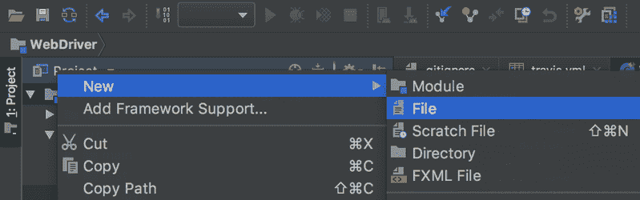](#)

输入文件名并点击`OK`按钮。

[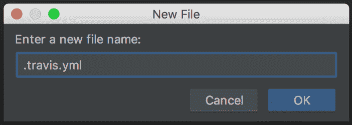](#)

填充`.travis.yml`文件并保存更改。

我们需要将变更推送到或者签入到远程存储库中。为此，右击项目根目录并选择 Git ➜提交目录。

输入提交消息，点击`Commit`按钮旁边的下拉箭头，然后点击`Commit and Push`。

[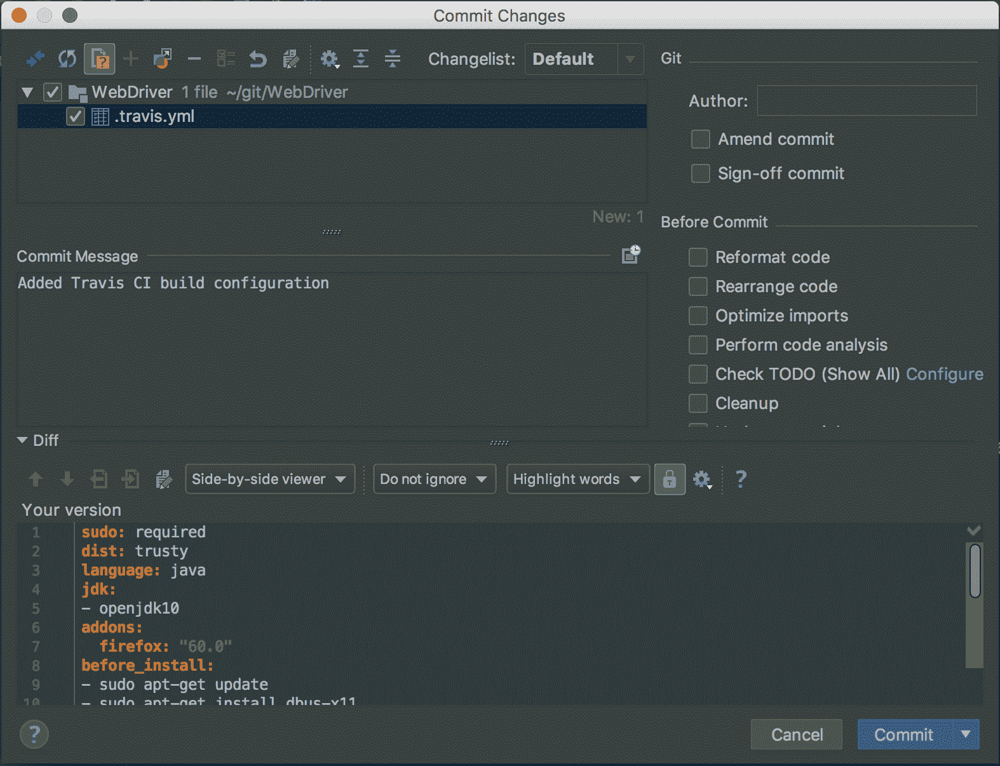](#)

点击`Push`按钮，将变更登记到远程存储库中。

[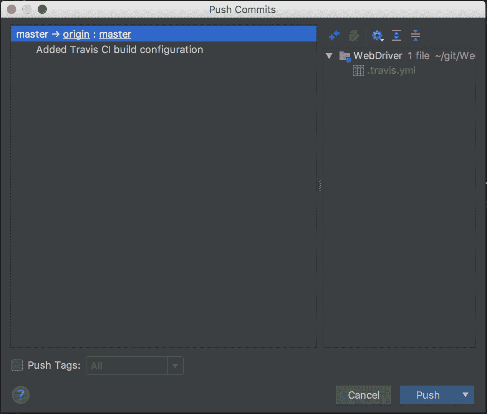](#)

推送完成后，新文件将显示在 GitHub 存储库中。

[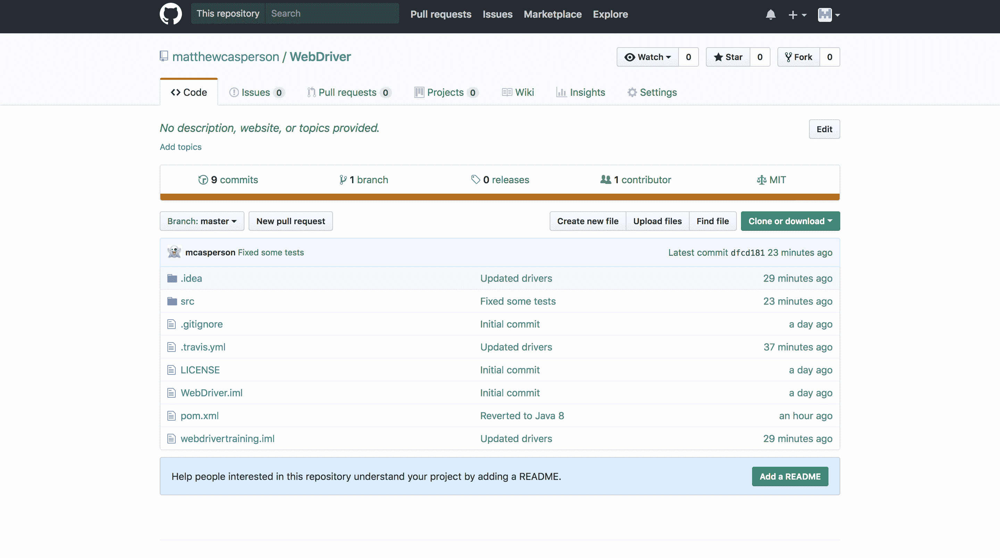](#)

更重要的是，Travis CI 已经检测到了对 GitHub 存储库的推送，并使用了`.travis.yml`文件中的配置来构建项目。

Travis CI 认识到我们的项目是使用 Maven [构建的，因为 pom.xml 文件](https://docs.travis-ci.com/user/languages/java/#Projects-Using-Maven)的存在。然后，它将通过运行以下命令自动安装 Maven 依赖项:

```
mvn install -DskipTests=true -Dmaven.javadoc.skip=true -B -V 
```

然后通过运行以下命令来运行测试:

```
mvn test -B 
```

这一切都是自动发生的，无需任何额外的配置。这意味着当我们的代码被签入 GitHub 时，Travis CI 将获得代码的副本，并运行我们编写的所有测试。

[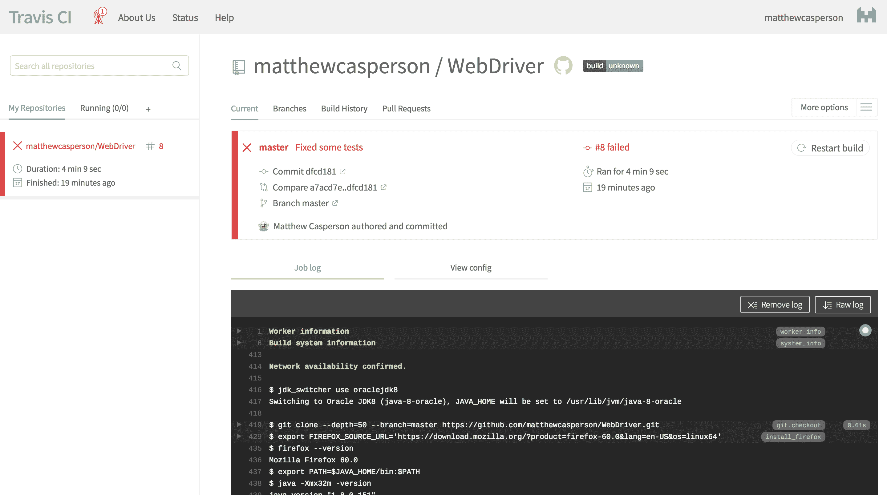](#)

然而有一个问题。如果我们查看日志文件的末尾，我们会看到一些测试失败了:

```
Results :

Tests in error:

browserStackAndroidTest(academy.learnprogramming.FormTest): Invalid username or password (WARNING: The server did not provide any stacktrace information)(..)

browserStackEdgeTest(academy.learnprogramming.FormTest): Invalid username or password (WARNING: The server did not provide any stacktrace information)(..)

Tests run: 19, Failures: 0, Errors: 2, Skipped: 1 
```

这些测试失败了，因为 BrowserStack 测试要求将用户名和密码存储在环境变量中。幸运的是，Travis CI 提供了一种为构建定义环境变量的简单方法。

点击`More Options`菜单，选择`Settings`选项。

[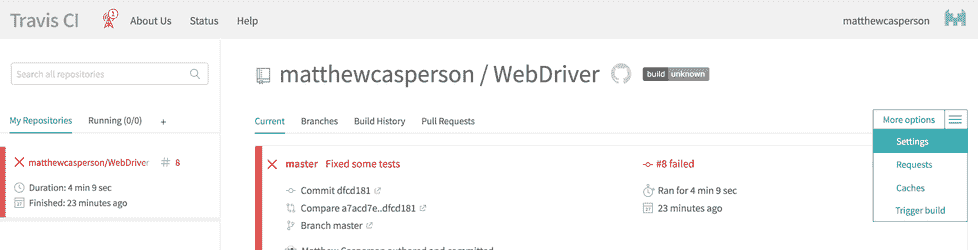](#)

在环境变量下添加`BROWSERSTACK_USERNAME`和`BROWSERSTACK_KEY`的值。您可以禁用构建日志中的`Display value`，这意味着这些值将从 Travis CI 生成的日志中隐藏。这是防止秘密值泄露到日志文件中的一个有用的方法。

[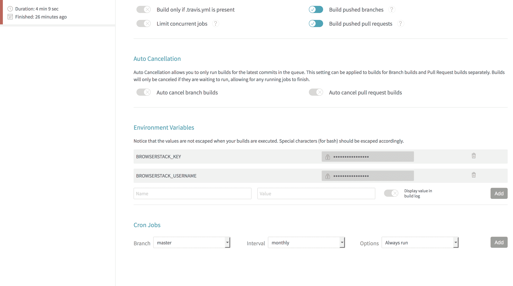](#)

单击左侧菜单中的 build，然后单击`Restart build`。这将重新构建代码，但是这次使用新的环境变量。

[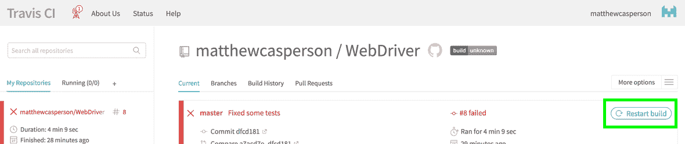](#)

这一次，构建和相关的测试成功完成。

[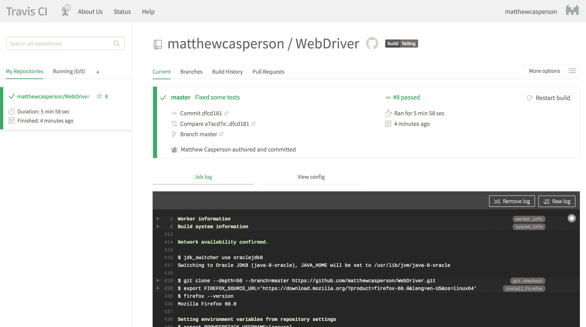](#)

您可能会看到如下日志消息:

```
GLib-GObject-CRITICAL **: g_object_ref: assertion 'object-&gt;ref_count &gt; 0' failed 
```

[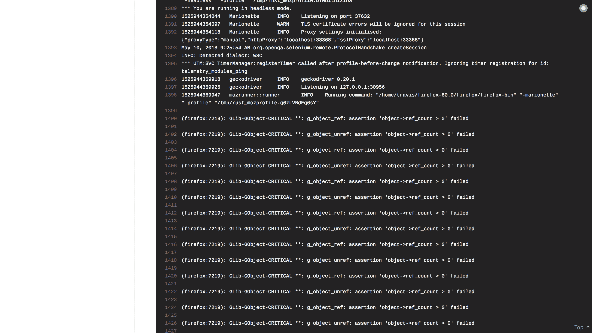](#)

这些可以忽略，因为它们不影响测试的结果。

我们现在已经成功地将代码签入到 GitHub 中托管的中央 Git 存储库中，Travis CI 已经检测到新代码，并自动构建它并运行所有测试。这是持续集成的核心思想，这意味着每次新代码被检入时，它都会被我们的测试自动验证。

您可以在此查看同一项目[的 Travis CI 构建。](https://travis-ci.org/OctopusDeploy/WebDriverTraining)

这篇文章是关于[创建 Selenium WebDriver 测试框架](/blog/selenium/0-toc/webdriver-toc)的系列文章的一部分。