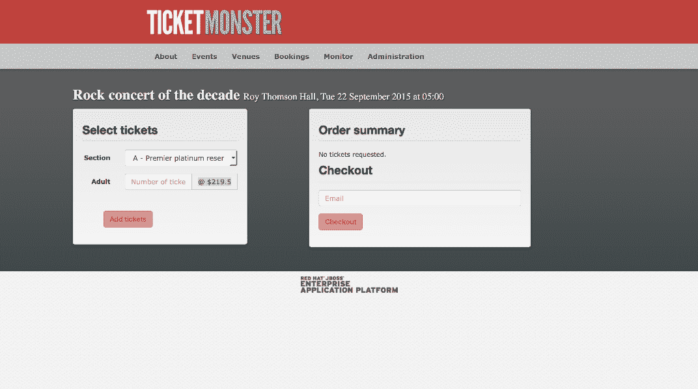

# Selenium 系列:重用 POM 类- Octopus Deploy

> 原文：<https://octopus.com/blog/selenium/24-reusing-pom-classes/reusing-pom-classes>

这篇文章是关于[创建 Selenium WebDriver 测试框架](/blog/selenium/0-toc/webdriver-toc)的系列文章的一部分。

既然我们已经使用 POM 设计模式重写了测试，那么让我们继续添加我们前面提到的第二个测试，验证不同部分的价格。

对于这个测试，我们需要进入结帐屏幕，但不是真正进行结帐。相反，我们希望遍历每个部分选项，并获得它们的票价。

[](#)

为了支持这个新的测试，我们需要向`CheckoutPage`类添加一些额外的方法:

```
public class CheckoutPage extends BasePage {
  private static final Pattern TICKET_PRICE_REGEX = Pattern.compile("@ \\$(\\d+\\.\\d+)");
  private static final String ADULT_TICKET_PRICE = ".input-group-addon";

  // ...

  public CheckoutPage selectSection(final String section) {
      automatedBrowser.selectOptionByTextFromSelect(section, SECTION_DROP_DOWN_LIST, WAIT_TIME);
      return this;
  }

  public float getSectionAdultPrices() {
      final String price = automatedBrowser.getTextFromElement(ADULT_TICKET_PRICE);
      return getPriceFromTicketPriceString(price);
  }

  // ...

  private float getPriceFromTicketPriceString(final String input) {
    final Matcher matcher = TICKET_PRICE_REGEX.matcher(input);
    if (matcher.matches()) {
      final String priceString = matcher.group(1);
      return Float.parseFloat(priceString);
    }

    throw new IllegalArgumentException("String " + input + " does not match the regex");
  }
} 
```

首先，我们定义一个正则表达式`Pattern`，它匹配应用程序显示的价格字符串。价格显示为类似于`@ $219.5`、`@ $149.5`的字符串(末尾缺少的零可能是 Ticketmonster 中的一个错误，但我们现在忽略它)。我们希望将美元金额从 at 和美元符号中分离出来，因此我们将字符串的这一部分捕获到一个组中:

```
private static final Pattern TICKET_PRICE_REGEX = Pattern.compile("@ \\$(\\d+\\.\\d+)"); 
```

新方法`selectSection()`允许我们从下拉列表中选择一个事件部分。这将更新显示票价的元素:

```
public CheckoutPage selectSection(final String section) {
  automatedBrowser.selectOptionByTextFromSelect(section, SECTION_DROP_DOWN_LIST, WAIT_TIME);
  return this;
} 
```

新的`getSectionAdultPrices()`方法首先从显示价格的元素中获取原始文本。这个原始文本看起来像是`@ $219.5`或`@ $149.5`。

然后，它将该文本传递给方法`getPriceFromTicketPriceString()`，该方法将它转换成一个`float`值:

```
public float getSectionAdultPrices() {
  final String price = automatedBrowser.getTextFromElement(ADULT_TICKET_PRICE);
  return getPriceFromTicketPriceString(price);
} 
```

最后添加的是`getPriceFromTicketPriceString()`方法。这个方法的存在是为了支持`getSectionAdultPrices()`方法，所以它是`private`。

在这个方法中，我们试图将输入与之前定义的正则表达式`Pattern`进行匹配。如果匹配成功，我们提取组 1，它将包含类似于`219.5`或`149.5`的字符串。这些字符串然后被转换成`float`值并返回。

如果输入与正则表达式不匹配，则会引发异常:

```
 private float getPriceFromTicketPriceString(String input) {
    final Matcher matcher = TICKET_PRICE_REGEX.matcher(input);
    if (matcher.matches()) {
      final String priceString = matcher.group(1);
      return Float.parseFloat(priceString);
  }

  throw new IllegalArgumentException("String " + input + " does not match the regex");
} 
```

有了对`CheckoutPage`的这些更改，我们现在可以编写测试了:

```
@Test
public void verifyPricesPageObjectModel() {

  final AutomatedBrowser automatedBrowser =
    AUTOMATED_BROWSER_FACTORY.getAutomatedBrowser("ChromeNoImplicitWait");

  try {
    automatedBrowser.init();

    final EventsPage eventsPage = new MainPage(automatedBrowser)
      .openPage()
      .buyTickets();

    final VenuePage venuePage = eventsPage
      .selectEvent("Theatre", "Shane's Sock Puppets");

    final CheckoutPage checkoutPage = venuePage
      .selectVenue("Toronto : Roy Thomson Hall")
      .book();

    checkoutPage.selectSection("A - Premier platinum reserve");

    final float platinumAdultPrices = checkoutPage.getSectionAdultPrices();
    Assert.assertTrue(platinumAdultPrices > 10);
    Assert.assertTrue(platinumAdultPrices < 1000);

    checkoutPage.selectSection("B - Premier gold reserve");

    final float goldAdultPrices = checkoutPage.getSectionAdultPrices();
    Assert.assertTrue(goldAdultPrices > 10);
    Assert.assertTrue(goldAdultPrices < 1000);

    checkoutPage.selectSection("C - Premier silver reserve");

    final float silverAdultPrices = checkoutPage.getSectionAdultPrices();
    Assert.assertTrue(silverAdultPrices > 10);
    Assert.assertTrue(silverAdultPrices < 1000);

    checkoutPage.selectSection("D - General");

    final float generalAdultPrices = checkoutPage.getSectionAdultPrices();
    Assert.assertTrue(generalAdultPrices > 10);
    Assert.assertTrue(generalAdultPrices < 1000);
  } finally {
    automatedBrowser.destroy();
  }
} 
```

为了让 web 应用程序能够找到票价，我们重用了`MainPage`、`EventsPage`和`VenuePage` POM 类。这里的代码与之前的测试几乎相同，但是在这个例子中，我们选择了一个不同的事件，称为`Shane's Sock Puppets`:

```
@Test
public void verifyPricesPageObjectModel() {
final AutomatedBrowser automatedBrowser =
  AUTOMATED_BROWSER_FACTORY.getAutomatedBrowser("ChromeNoImplicitWait");

try {

  automatedBrowser.init();

  final EventsPage eventsPage = new MainPage(automatedBrowser)
    .openPage()
    .buyTickets();

  final VenuePage venuePage = eventsPage
    .selectEvent("Theatre", "Shane's Sock Puppets");

  final CheckoutPage checkoutPage = venuePage
    .selectVenue("Toronto : Roy Thomson Hall")
    .book(); 
```

现在，我们开始骑自行车通过部分，以获得他们的票价。

我们调用`selectSection()`来改变当前选择的部分。对`getSectionAdultPrices()`的调用然后获得显示的票价作为`float`。然后，两条`Assert`语句验证价格在下限和上限之间:

```
checkoutPage.selectSection("A - Premier platinum reserve");

final float platinumAdultPrices = checkoutPage.getSectionAdultPrices();

Assert.assertTrue(platinumAdultPrices > 10);
Assert.assertTrue(platinumAdultPrices < 1000); 
```

对其他 3 个部分重复这些检查:

```
checkoutPage.selectSection("B - Premier gold reserve");

final float goldAdultPrices = checkoutPage.getSectionAdultPrices();

Assert.assertTrue(goldAdultPrices > 10);
Assert.assertTrue(goldAdultPrices < 1000);

checkoutPage.selectSection("C - Premier silver reserve");

final float silverAdultPrices = checkoutPage.getSectionAdultPrices();

Assert.assertTrue(silverAdultPrices > 10);
Assert.assertTrue(silverAdultPrices < 1000);

checkoutPage.selectSection("D - General");

final float generalAdultPrices = checkoutPage.getSectionAdultPrices();

Assert.assertTrue(generalAdultPrices > 10);
Assert.assertTrue(generalAdultPrices < 1000); 
```

然后，我们完成了清理`finally`块中的资源的测试:

```
 } finally {
    automatedBrowser.destroy();
    }
} 
```

我们用 POM 类`MainPage`、`EventsPage`和`VenuePage`创建的公共 API 使得编写这个测试变得快速而简单。让 web 应用程序显示票价所需的大部分逻辑已经实现，只剩下一些新方法要添加到`CheckoutPage`类中。

这就是 POM 设计模式的强大之处。它将实现细节封装到 Java 对象中，让测试自由地描述他们在测试什么，而不是如何测试。如果 TicketMonster 将来要更新新的元素 id、名称属性或重新排列的屏幕，我们有一个集中的重用 API，可以在那里进行更新，而不是通过复制和粘贴代码进行多次测试。

这篇文章是关于[创建 Selenium WebDriver 测试框架](/blog/selenium/0-toc/webdriver-toc)的系列文章的一部分。