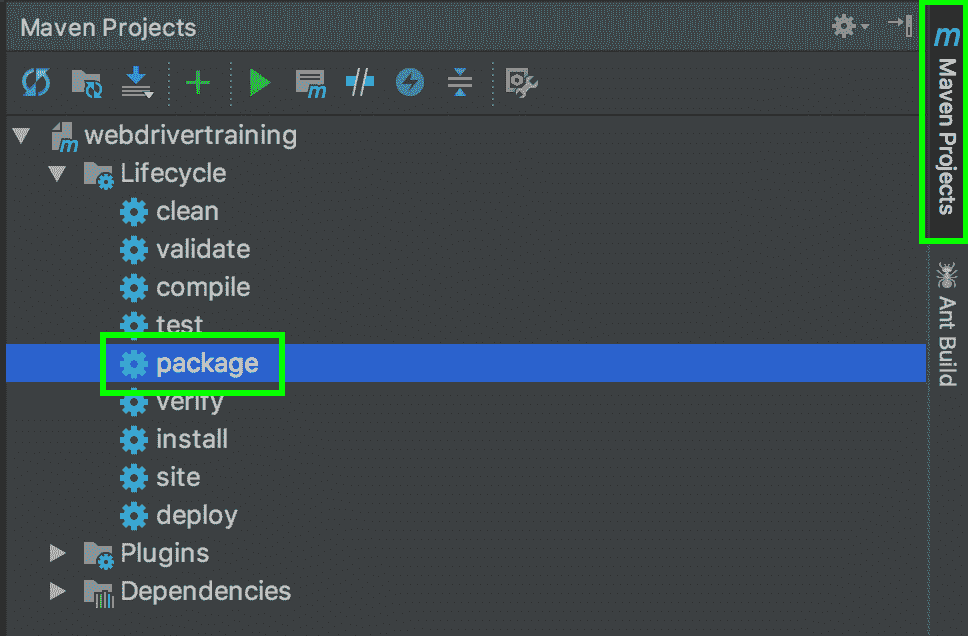
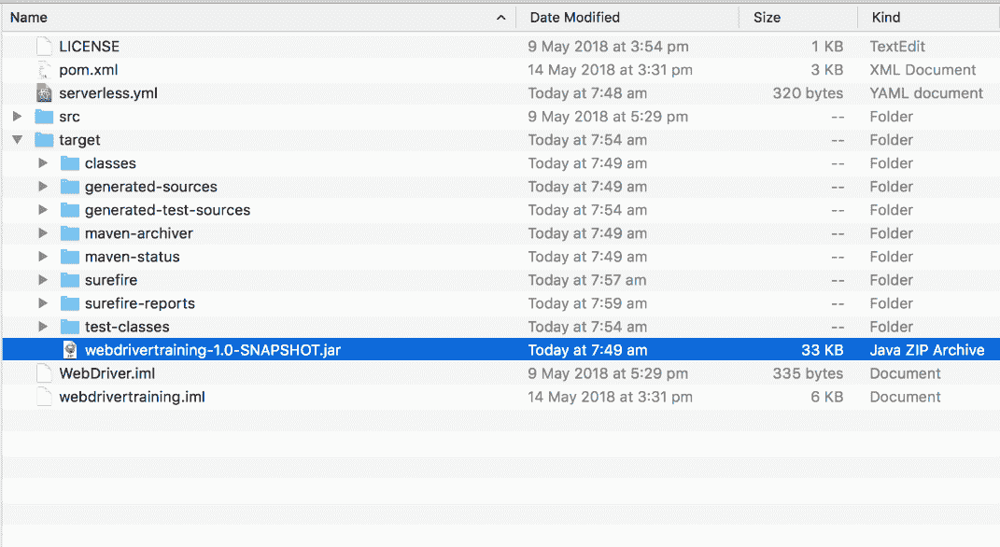
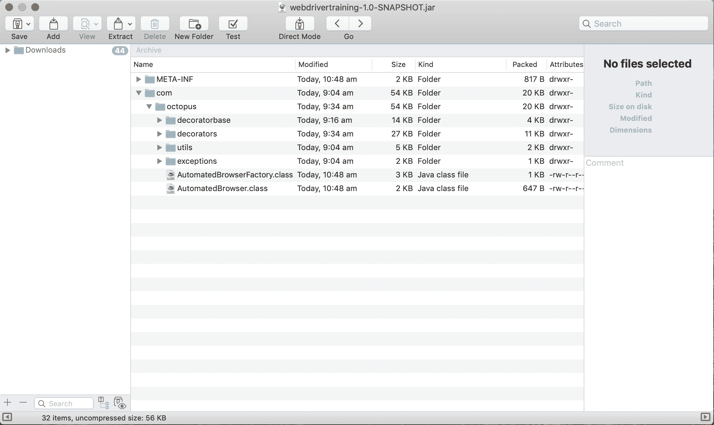
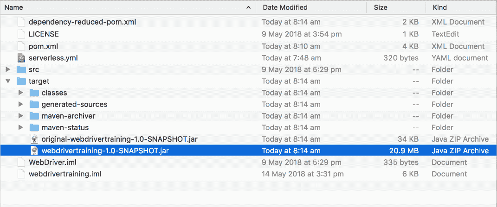
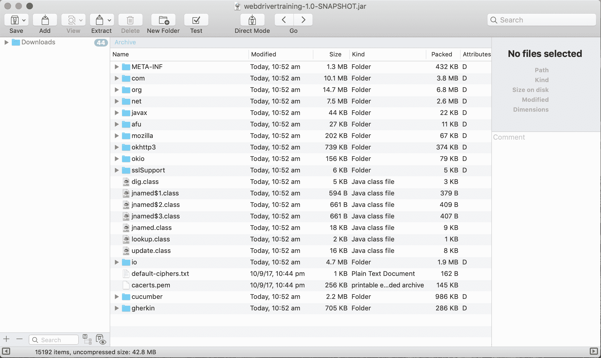
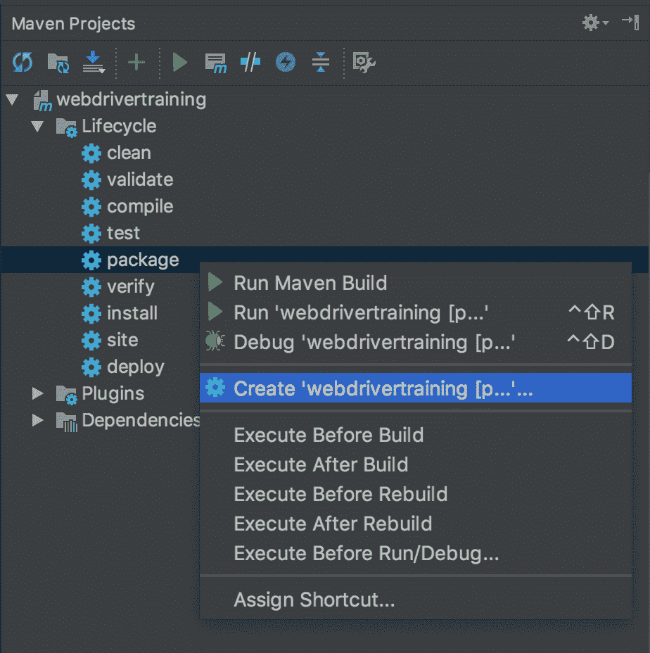
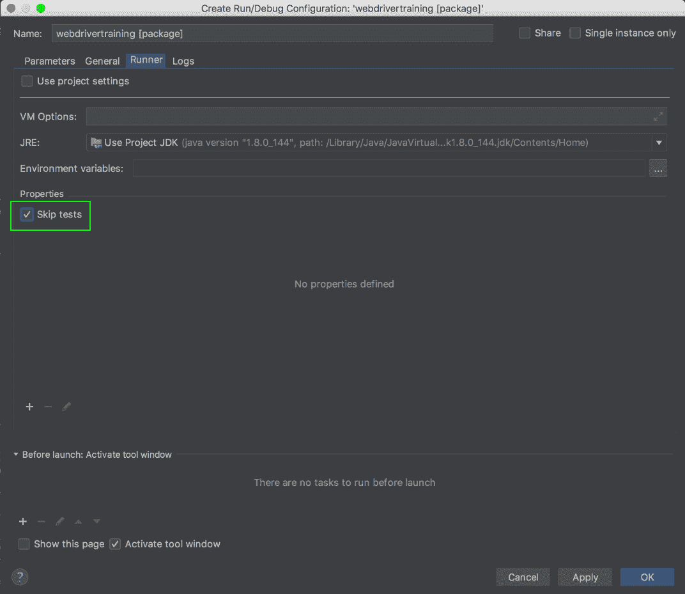
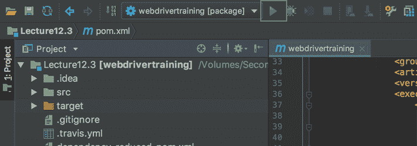

# Selenium 系列:创建 UberJAR - Octopus 部署

> 原文：<https://octopus.com/blog/selenium/30-create-an-uberjar/create-an-uberjar>

这篇文章是关于[创建 Selenium WebDriver 测试框架](/blog/selenium/0-toc/webdriver-toc)的系列文章的一部分。

我们用来构建代码的 Maven 项目会将我们的类打包到一个 JAR 文件中。我们可以通过运行 Maven 包生命周期来创建这个 JAR 文件。为此，打开`Maven Projects`工具窗口，双击生命周期➜包选项。

[](#)

打包应用程序将首先运行所有的测试，然后在`target`目录下构建 JAR 文件。

[](#)

然而，这个文件本身不足以运行应用程序，因为它不包括我们所依赖的所有附加库，如 WebDriver 和 Cucumber。我们可以通过在任何查看 ZIP 文件的应用程序中打开 JAR 文件来确认这一点，因为 JAR 文件只是具有不同扩展名的 ZIP 文件。你可以看到这个档案中唯一的类是我们自己写的。这个档案中没有来自 WebDriver 或 Cucumber 库的类。

[](#)

这带来了一些问题，因为组成 Lambda 函数的代码必须打包到一个单独的归档文件中。一种解决方案是构建一个完全自包含的 JAR 文件，也称为 UberJAR。

UberJAR 是一个 JAR 文件，它包含运行应用程序所需的所有类，这意味着它包含我们编写的代码的所有类，以及我们的代码所依赖的库中的所有类。Maven 使得用 [Shade](https://maven.apache.org/plugins/maven-shade-plugin/) 插件构建 UberJAR 变得很容易。

要配置 Shade 插件，我们需要将其配置添加到`<build><plugins>`元素下。

这个配置指定插件的`shade`目标应该在`package`阶段运行。这意味着当我们用 Maven 打包代码时，Shade 插件将自动运行以生成 UberJAR:

```
<project xmlns=\"http://maven.apache.org/POM/4.0.0\"
xmlns:xsi=\"http://www.w3.org/2001/XMLSchema-instance\"
xsi:schemaLocation=\"http://maven.apache.org/POM/4.0.0
http://maven.apache.org/xsd/maven-4.0.0.xsd\">
  <modelVersion>4.0.0</modelVersion>
  <!-- ... -->
  <properties>
    <!-- ... -->
    <shade.version>3.1.0</shade.version>
    <!-- ... -->
  </properties>
    <build>
      <plugins>
      <!-- ... -->
      <plugin>
        <groupId>org.apache.maven.plugins</groupId>
        <artifactId>maven-shade-plugin</artifactId>
        <version>${shade.version}</version>
        <executions>
          <execution>
            <phase>package</phase>
            <goals>
              <goal>shade</goal>
            </goals>
          </execution>
        </executions>
      </plugin>
      <!-- ... -->
    </plugins>
  </build>
  <!-- ... -->
</project> 
```

现在，当我们打包应用程序时，创建了两个 JAR 文件。

`original-webdrivertraining-1.0-SNAPSHOT.jar`文件是常规的 JAR 文件，只包含我们自己代码中的类。你可以看到这个文件只有几千字节大小。

`webdrivertraining-1.0-SNAPSHOT.jar`是包含运行这个应用程序所需的所有类的 UberJAR 文件。它要大得多，有几兆字节的大小。

[](#)

查看 UberJAR 文件的内容，我们可以看到它有更多的类。这些类来源于我们在`pom.xml`文件中定义的所有依赖项，以及它们所有的依赖项。

[](#)

您会注意到，运行`package` Maven 生命周期会导致所有的测试都在运行。假设我们编写的测试涉及启动 web 浏览器，如果您只想生成 JAR 文件，这些测试可能会碍事。为了防止测试运行，右键单击 package lifecycle 菜单项并选择`Create 'webdrivertraining...'...`选项。

[](#)

然后选择`Runner`选项卡。取消选择`Use project settings`选项，然后选择`Skip tests`选项。点击`OK`按钮保存更改后的内容。

[](#)

这将创建一个名为`webdrivertraining [package]`的新配置。在选中这个配置的情况下，单击绿色箭头将运行 Maven 包的生命周期，但是跳过测试，允许您快速构建 JAR 文件。

[](#)

由此产生的 UberJAR 文件提供了一个方便的、自包含的包，我们可以轻松地分发和运行它，这就是我们将作为 AWS Lambda 部署的内容。在下一篇文章中，我们将添加在 Lambda 中运行 WebDriver 测试所需的代码，并使用无服务器应用程序发布 UberJAR 文件。

这篇文章是关于[创建 Selenium WebDriver 测试框架](/blog/selenium/0-toc/webdriver-toc)的系列文章的一部分。