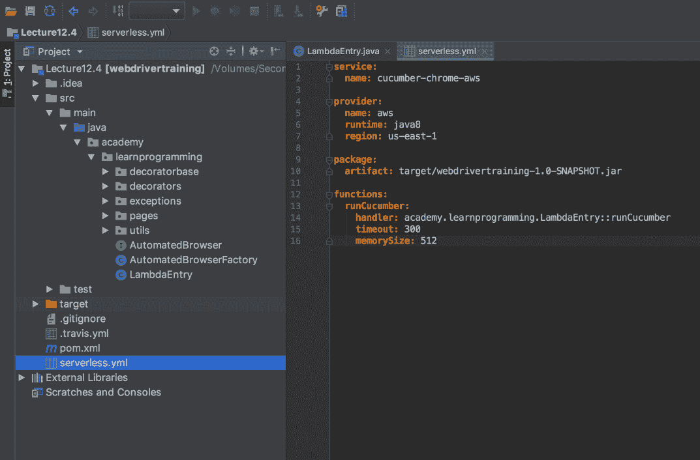
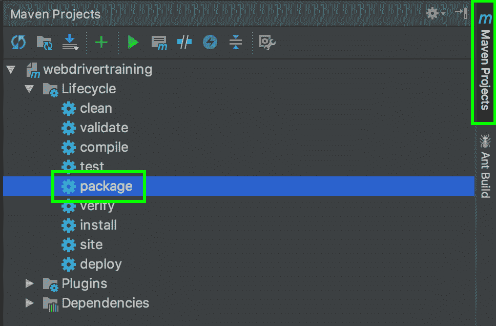
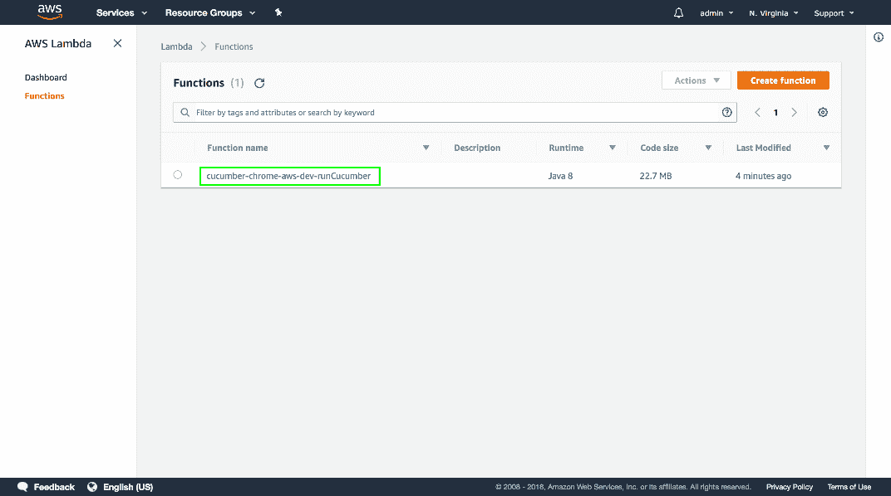
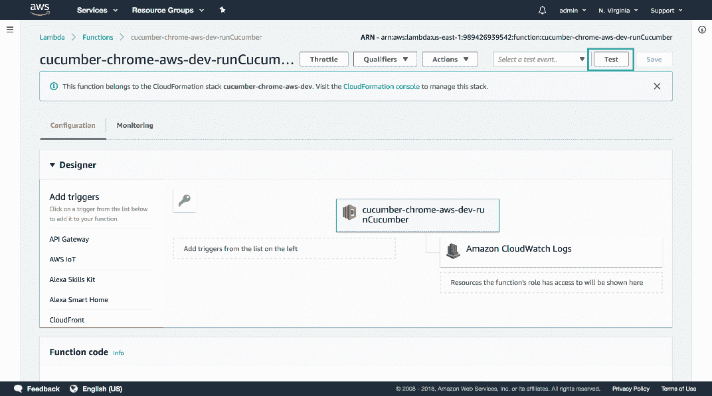
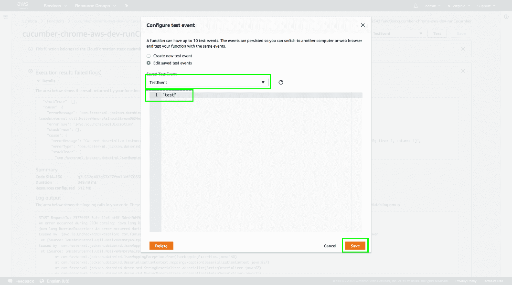
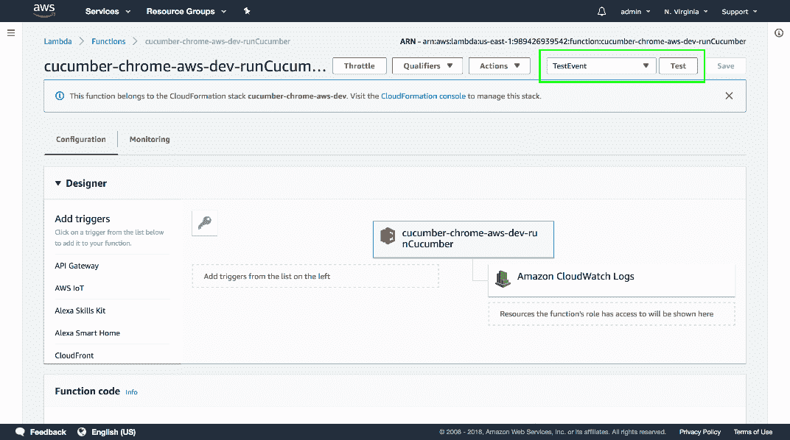
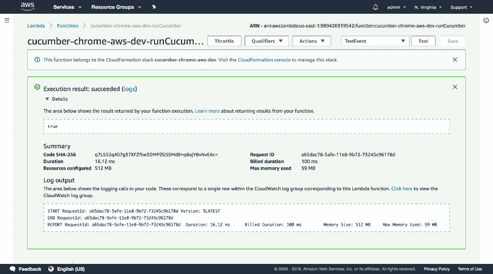

# Selenium 系列:部署简单的 Lambda 函数——Octopus Deploy

> 原文：<https://octopus.com/blog/selenium/31-deploying-a-simple-lambda-function/deploying-a-simple-lambda-function>

这篇文章是关于[创建 Selenium WebDriver 测试框架](/blog/selenium/0-toc/webdriver-toc)的系列文章的一部分。

在之前的文章中，我们配置了 Lambda 函数所需的所有先决条件:

*   创建了一个 AWS 帐户，并在本地配置了凭据。
*   无服务器应用程序已安装。
*   Lambda Chrome 发行版和二进制驱动程序被上传到 S3。
*   Maven build 现在生成了一个 UberJAR。

我们现在正处于可以开始编写 Lambda 代码的阶段。为此，我们需要添加三个新的依赖项:

*   `com.amazonaws:aws-lambda-java-core`
*   `com.amazonaws:aws-java-sdk-lambda`
*   `commons-io:commons-io`

前两个依赖项为我们提供了作为 Lambda 函数运行所需的库。第三个依赖项在处理文件时提供了一些方便的实用函数:

```
<project 
xmlns:xsi="http://www.w3.org/2001/XMLSchema-instance"
xsi:schemaLocation="http://maven.apache.org/POM/4.0.0
http://maven.apache.org/xsd/maven-4.0.0.xsd">
  <modelVersion>4.0.0</modelVersion>
  <!-- ... -->
  <properties>
    <!-- ... -->
    <aws.lambda.version>1.2.0</aws.lambda.version>
    <aws.sdk.version>1.11.305</aws.sdk.version>
    <commons.io.version>2.6</commons.io.version>
  </properties>
  <!-- ... -->
  <dependencies>
    <!-- ... -->
    <dependency>
      <groupId>com.amazonaws</groupId>
      <artifactId>aws-lambda-java-core</artifactId>
      <version>${aws.lambda.version}</version>
    </dependency>
    <dependency>
      <groupId>com.amazonaws</groupId>
      <artifactId>aws-java-sdk-lambda</artifactId>
      <version>${aws.sdk.version}</version>
    </dependency>
    <dependency>
      <groupId>commons-io</groupId>
      <artifactId>commons-io</artifactId>
      <version>${commons.io.version}</version>
    </dependency>
  </dependencies>
</project> 
```

在传统的 Java 应用程序中，我们以一个`static main()`方法开始执行。Lambda 函数则不同。Lambda 函数的入口点可以是任何带有签名的方法:

```
returntype methodname(inputType input, Context context) 
```

或者，如果不需要`Context`(我们的目的也不需要),则该签名也有效:

```
returntype methodname(inputType input) 
```

此方法的返回和输入类型可以是任何类型，方法本身可以有任何名称。让我们写一个最简单的 Lambda 函数。

下面的代码定义了一个 Lambda 函数，该函数返回一个总是为`true`的`boolean`类型。这段代码不是很有用，但足以测试 Lambda 的工作情况:

```
package com.octopus;

import com.amazonaws.services.lambda.runtime.Context;

public class LambdaEntry {
  public boolean runCucumber(String feature) throws Throwable {
    return true;
  }
} 
```

为了部署这个 Lambda，我们需要在项目的根目录下创建一个名为`serverless.yml`的文件。无服务器应用程序使用这个配置文件来配置和部署 Lambda。

[](#)

```
service:
  name: cucumber-chrome-aws

provider:
  name: aws
  runtime: java8
  region: us-east-1

package:
  artifact: target/webdrivertraining-1.0-SNAPSHOT.jar

functions:
  runCucumber:
    handler: com.octopus.LambdaEntry::runCucumber
    timeout: 300
    memorySize: 512 
```

让我们把这个文件分解一下。

我们首先定义服务的名称，它将成为 Lambda 的名称:

```
service:
  name: cucumber-chrome-aws 
```

然后，我们定义要部署到的云平台的详细信息。该无服务器应用程序与云无关，可用于部署到多个云提供商，如 AWS、Azure 和 Google Cloud。我们使用 AWS，因此 providers 部分将配置 AWS Lambda 服务的全局属性。

`name`属性是云提供商的名称，在本例中设置为`aws`。

`runtime`属性定义了编写 Lambda 函数的语言，即`java8`。

`region`属性定义了我们将 Lambda 部署到的 AWS 区域。AWS 在全球有很多地区，你可以在[https://docs . AWS . Amazon . com/general/latest/gr/rande . html # Lambda _ region](https://docs.aws.amazon.com/general/latest/gr/rande.html#lambda_region)找到支持 Lambda 的完整地区列表。这里我们将使用`us-east-1`区域:

```
provider:
  name: aws
  runtime: java8
  region: us-east-1 
```

package 部分定义了 Lambda 代码的位置。在我们的例子中，Lambda 代码在文件`target/webdrivertraining-1.0-SNAPSHOT.jar`中，我们通过`artifact`属性引用它。请注意，这个文件是 UberJAR，它将我们的整个应用程序及其依赖项打包在一个文件中:

```
package:
  artifact: target/webdrivertraining-1.0-SNAPSHOT.jar 
```

`functions`部分是我们定义 Lambda 函数的地方。

`runCucumber`部分定义了一个单独的功能。这个部分可以有任何名称，为了方便起见，我们使用了与入口点方法相同的名称。

属性定义了入口点方法名。这个方法名由完全限定的类名、两个冒号和方法名组成。值`com.octopus.LambdaEntry::runCucumber`意味着这个 Lambda 函数将执行`com.octopus`包中`LambdaEntry`类的方法`runCucumber()`。

`timeout`属性设置该函数可以运行的最长时间。Lambda 有一个 5 分钟的硬限制，我们也将超时设置为 5 分钟(表示为 300 秒)。

属性定义了我们的 Lambda 环境可以使用多少内存。我们已经把自己限制在 512MB 了。请注意，该值包括外部应用程序(如 Chrome)使用的任何内存，以及我们自己的代码。

增加`timeout`和`memorySize`会增加每个 Lambda 执行的成本:

```
functions:
  runCucumber:
    handler: com.octopus.LambdaEntry::runCucumber
    timeout: 300
    memorySize: 512 
```

在部署 Lambda 函数之前，我们需要确保文件`target/webdrivertraining-1.0-SNAPSHOT.jar`是最新的。在部署之前，Serverless 不会为我们重新构建应用程序，因此由我们手动重新构建。点击 Maven 项目➜包来重建 JAR 文件。

[](#)

我们现在可以部署 Lambda 函数了。打开终端、命令提示符或 PowerShell 窗口，并切换到项目根目录。然后运行命令:

```
$ serverless deploy 
```

您将看到如下输出:

```
Serverless: Packaging service...
Serverless: Uploading CloudFormation file to S3...
Serverless: Uploading artifacts...
Serverless: Uploading service .zip file to S3 (19.78 MB)...
Serverless: Validating template...
Serverless: Updating Stack...
Serverless: Checking Stack update progress...
.....................
Serverless: Stack update finished...
Service Information
service: cucumber-chrome-aws
stage: dev
region: us-east-1
stack: cucumber-chrome-aws-dev
api keys:
  None
endpoints:
  None
functions:
  runCucumber: cucumber-chrome-aws-dev-runCucumber 
```

Serverless 在后台做了很多工作来上传我们的 JAR 文件作为 Lambda 函数，这是使用 Serverless 而不是手动上传我们的 Lambda 函数的好处之一。

如果我们返回 AWS Lambda 控制台，我们现在可以看到新的 Lambda 函数已经部署。单击功能链接。

[](#)

本页向我们展示了 Lambda 函数的细节。

要测试该功能是否工作，点击`Test`按钮。

[](#)

用字符串替换测试数据(任何字符串都可以)。因为我们的 Lambda 函数的第一个参数接受一个字符串，所以我们需要在测试时提供一个字符串。

Lambda 函数总是将 JSON 作为输入，它被转换成一个 Java 对象。在这种情况下，字符串是一个有效的 JSON 结构，然后被转换成 Java 字符串。

Lambda 函数也总是将返回的对象转换成 JSON。

Lambda 函数只接受 JSON 作为输入，并提供 JSON 作为输出，这一事实在我们稍后将这个函数链接到 HTTP 端点时非常重要。

然后填充`Event`名称字段，并点击`Create`按钮。

[](#)

现在我们有了一个测试事件，再次点击`Test`按钮。

[](#)

我们的测试 Lambda 函数已经通过返回`true`成功执行。

[](#)

尽管这个 Lambda 函数没有做任何有用的事情，但它确实证明了我们已经编写了一个有效的 Lambda 函数，并且可以使用无服务器应用程序来部署它。完成这些工作后，我们可以继续编写实际运行 WebDriver 测试的 Lambda 函数，这将在下一篇文章中进行。

这篇文章是关于[创建 Selenium WebDriver 测试框架](/blog/selenium/0-toc/webdriver-toc)的系列文章的一部分。