# Selenium 系列:创建框架- Octopus Deploy

> 原文：<https://octopus.com/blog/selenium/4-creating-the-framework/creating-the-framework>

这篇文章是关于[创建 Selenium WebDriver 测试框架](/blog/selenium/0-toc/webdriver-toc)的系列文章的一部分。

WebDriver API 的优势之一是它是浏览器不可知的。你可以从之前的帖子中看到，在我们的测试中，只需要一个新的二进制驱动程序和一个新的驱动程序类就可以启动 Firefox，而不是 Chrome。

尽管 WebDriver 允许我们编写测试而不用担心哪个浏览器会运行它们，但我们仍然需要创建和配置各种驱动程序类，如`ChromeDriver`和`FirefoxDriver`。为了使这个过程尽可能灵活，我们将创建一个名为`AutomatedBrowserFactory`的工厂类来为我们配置这些对象。

在创建这个类之前，我们需要在项目中添加一个新目录来保存 Java 文件。我们在以前的文章中创建的目录`src/test/java/com/octopus`是只在测试中使用的文件的默认位置。在`src/main/java/com/octopus`下有第二个目录保存常规的 Java 类，我们需要创建这个目录结构。

右键点击`src`目录，选择新➜目录。

[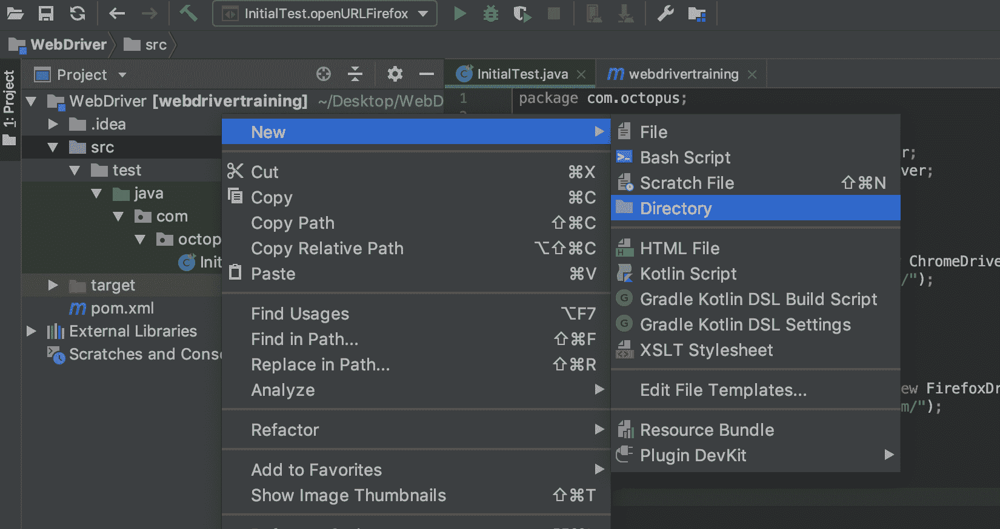](#)

输入`main/java/com/octopus`作为目录名，点击`OK`。

[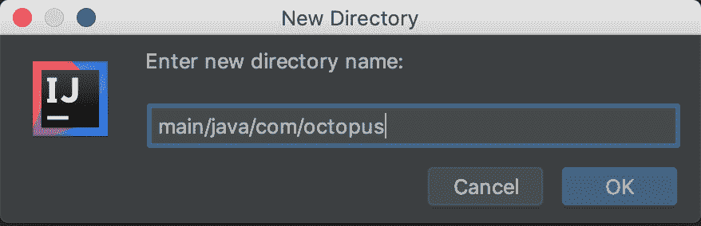](#)

和以前一样，新的目录结构被创建，但是它还没有被 IntelliJ 识别为保存 Java 类的目录。

[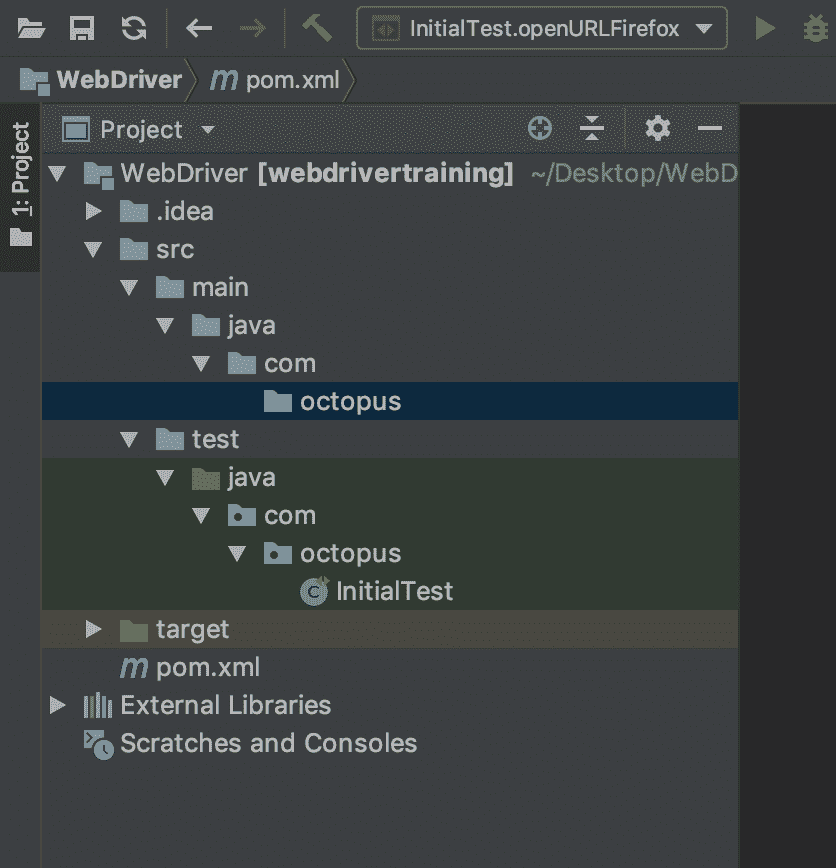](#)

要解决这个问题，打开`Maven Projects`工具窗口并点击`Reimport All Maven Projects`按钮。

[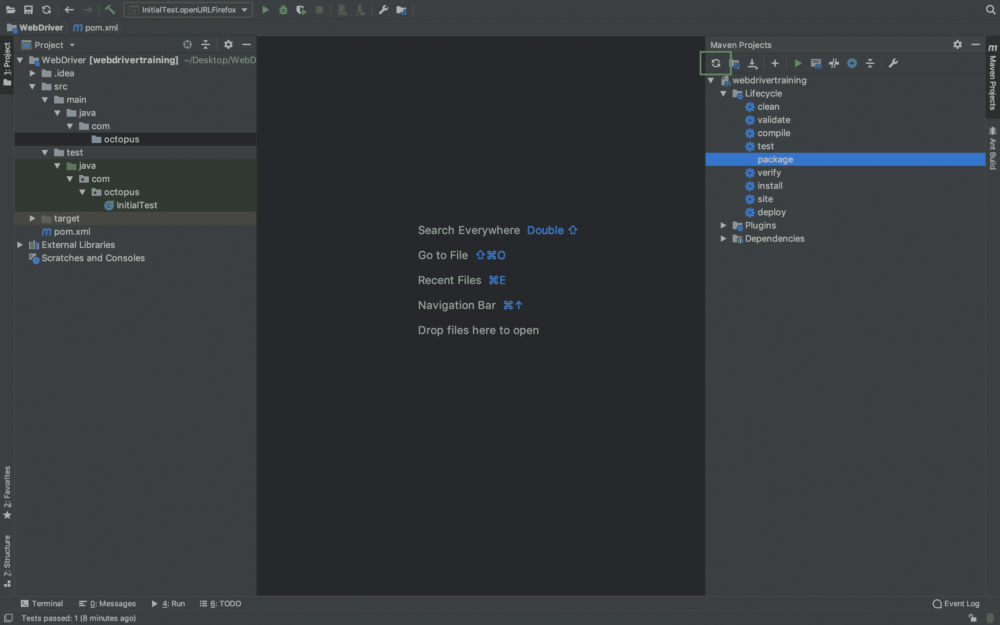](#)

`java`目录现在显示为蓝色图标，这表示它将保存 Java 类。

[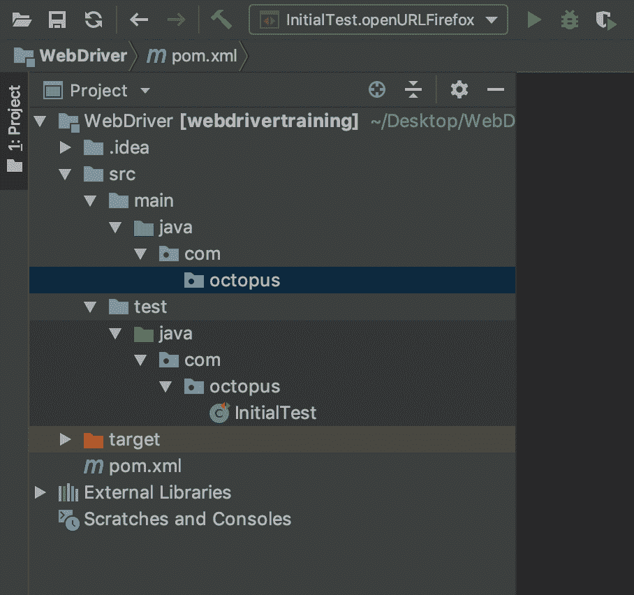](#)

我们现在可以在`src/main/java/com/octopus`目录中创建类`AutomatedBrowserFactory`。要创建新类，右击`octopus`文件夹并选择新➜ Java 类。

[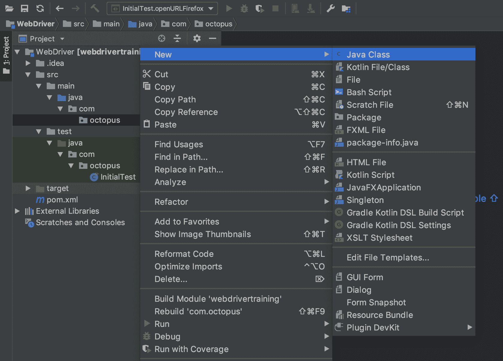](#)

在`Name`字段输入`AutomatedBrowserFactory`并点击`OK`按钮。

[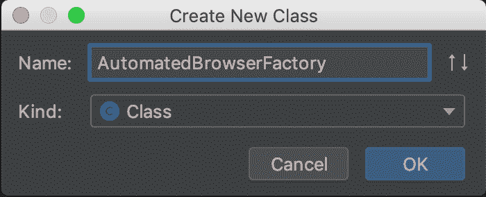](#)

在下面的代码片段中，我们有一个工厂框架，它包含一个名为`getAutomatedBrowser()`的方法，该方法接受我们想要测试的浏览器的名称。这个方法返回一个`AutomatedBrowser`接口的实例:

```
package com.octopus;

public class AutomatedBrowserFactory {

  public AutomatedBrowser getAutomatedBrowser(final String browser) {

    if ("Chrome".equalsIgnoreCase(browser)) {
      return getChromeBrowser();
    }

    if ("Firefox".equalsIgnoreCase(browser)) {
      return getFirefoxBrowser();
    }

    throw new IllegalArgumentException("Unknown browser " + browser);

  }

  private AutomatedBrowser getChromeBrowser() {
    return null;
  }

  private AutomatedBrowser getFirefoxBrowser() {
    return null;
  }
} 
```

接口公开了我们将对浏览器执行的所有交互。首先，我们将定义一些方法来初始化 WebDriver 实例，打开一个 URL，并与通过 ID 定位的元素进行交互。

要创建`AutomatedBrowser`接口，右击`octopus`目录并选择新➜ Java 类。

[T34](#)

在`Name`字段中输入`AutomatedBrowser`，从`Kind`字段中选择`Interface`选项，点击`OK`按钮。

[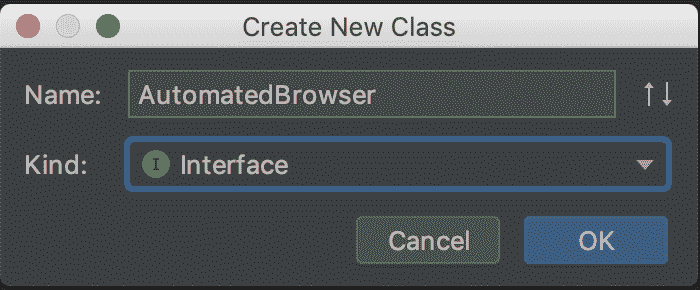](#)

然后将以下代码粘贴到新文件中:

```
package com.octopus;

import org.openqa.selenium.WebDriver;

public interface AutomatedBrowser {

  WebDriver getWebDriver();

  void setWebDriver(WebDriver webDriver);

  void init();

  void destroy();

  void goTo(String url);

  void clickElementWithId(String id);

  void selectOptionByTextFromSelectWithId(String optionText, String id);

  void populateElementWithId(String id, String text);

  String getTextFromElementWithId(String id);

} 
```

我们将利用装饰模式来构建`AutomatedBrowser`接口的实例，我们最终将调用该接口来与浏览器交互。

那么为什么要使用装饰模式而不是直接实现`AutomatedBrowser`的类层次结构呢？

在实现 decorator 模式的过程中，我们赋予自己创建一系列独立实现的能力，这些实现具有增强和定制我们与浏览器交互方式的特性，而不需要试图用一个深层次的类来表示这些实现。

两个明显的实现是配置`ChromeDriver`或`FirefoxDriver`类的实例，允许我们打开 Chrome 或 Firefox 浏览器。但是当我们浏览这个博客系列时，我们将介绍一系列实现代理、移动浏览器不支持的功能的存根方法、远程浏览器等特性的装饰器。

所有这些灵活性的框架从这里开始。

为了让我们更容易创建装饰类，我们将创建一个名为`AutomatedBrowserBase`的类，它将实现`AutomatedBrowser`，并将所有方法调用传递给`AutomatedBrowser`的父实例。

因为`AutomatedBrowserBase`类提供了`AutomatedBrowser`接口中每个方法的实现，所以扩展`AutomatedBrowserBase`的装饰类只能覆盖特定于它们的方法。这大大减少了创建装饰器所需的锅炉板代码的数量。

注意`AutomatedBrowserBase`类是在`com.octopus.decoratorbase`包中创建的。将这个类放在它自己的包中是一个重要的设计决策，我们将在后面的课程中研究这些特性。

要创建新的包，右击`octopus`目录，选择新➜包。

[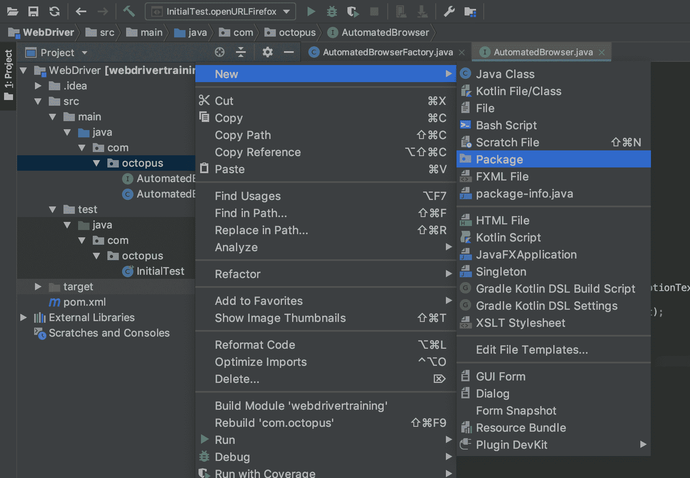](#)

输入名称`decoratorbase`，点击`OK`按钮。

[T32](#)

然后，新的包被添加到目录结构中。

[T35【](#)

在`com.octopus.decoratorbase`包中，用下面的代码创建一个名为`AutomatedBrowserBase`的新类。在`AutomatedBrowser`接口中定义的每个方法都是通过传递给`automatedBrowser`实例变量来实现的(如果它不是`null`):

```
package com.octopus.decoratorbase;

import com.octopus.AutomatedBrowser;
import org.openqa.selenium.WebDriver;

public class AutomatedBrowserBase implements AutomatedBrowser {

  private AutomatedBrowser automatedBrowser;

  public AutomatedBrowserBase() {

  }

  public AutomatedBrowserBase(AutomatedBrowser automatedBrowser) {
    this.automatedBrowser = automatedBrowser;
  }

  public AutomatedBrowser getAutomatedBrowser() {
    return automatedBrowser;
  }

  @Override
  public WebDriver getWebDriver() {
    if (getAutomatedBrowser() != null) {
      return getAutomatedBrowser().getWebDriver();
    }
    return null;
  }

  @Override
  public void setWebDriver(WebDriver webDriver) {
    if (getAutomatedBrowser() != null) {
      getAutomatedBrowser().setWebDriver(webDriver);
    }

  }

  @Override
  public void init() {
    if (getAutomatedBrowser() != null) {
      getAutomatedBrowser().init();
    }
  }

  @Override
  public void destroy() {
    if (getAutomatedBrowser() != null) {
      getAutomatedBrowser().destroy();
    }
  }

  @Override
  public void goTo(String url) {
    if (getAutomatedBrowser() != null) {
      getAutomatedBrowser().goTo(url);
    }
  }

  @Override
  public void clickElementWithId(String id) {
    if (getAutomatedBrowser() != null) {
      getAutomatedBrowser().clickElementWithId(id);
    }
  }

  @Override
  public void selectOptionByTextFromSelectWithId(String optionText, String id) {
    if (getAutomatedBrowser() != null) {
      getAutomatedBrowser().selectOptionByTextFromSelectWithId(optionText, id);
    }
  }

  @Override
  public void populateElementWithId(String id, String text) {
    if (getAutomatedBrowser() != null) {
      getAutomatedBrowser().populateElementWithId(id, text);
    }
  }

  @Override
  public String getTextFromElementWithId(String id) {
    if (getAutomatedBrowser() != null) {
      return getAutomatedBrowser().getTextFromElementWithId(id);
    }

    return null;
  }
} 
```

现在让我们扩展`AutomatedBrowserBase`类来创建`ChromeDecorator`类。`ChromeDecorator`将覆盖`init()`方法来创建一个`ChromeDriver`类的实例。

`ChromeDecorator`类将被放在`com.octopus.decorators`包中，所以创建新的`decorators`包，就像你创建`decoratorbase`包一样。

在`com.octopus.decorators`包中，用下面的代码创建一个名为`ChromeDecorator`的类。

注意，`ChromeDecorator`类只实现了一个方法。这就是扩展`AutomatedBrowserBase`类而不是`AutomatedBrowser`接口的好处:

```
package com.octopus.decorators;

import com.octopus.AutomatedBrowser;
import com.octopus.decoratorbase.AutomatedBrowserBase;
import org.openqa.selenium.WebDriver;
import org.openqa.selenium.chrome.ChromeDriver;

public class ChromeDecorator extends AutomatedBrowserBase {
    public ChromeDecorator(final AutomatedBrowser automatedBrowser) {
        super(automatedBrowser);
    }

    @Override
    public void init() {
        final WebDriver webDriver = new ChromeDriver();
        getAutomatedBrowser().setWebDriver(webDriver);
        getAutomatedBrowser().init();
    }
} 
```

我们遵循相同的过程来创建`FirefoxDecorator`类，它创建了`FirefoxDriver`类的一个实例:

```
package com.octopus.decorators;

import com.octopus.AutomatedBrowser;
import com.octopus.decoratorbase.AutomatedBrowserBase;
import org.openqa.selenium.WebDriver;
import org.openqa.selenium.firefox.FirefoxDriver;

public class FirefoxDecorator extends AutomatedBrowserBase {

    public FirefoxDecorator(final AutomatedBrowser automatedBrowser) {
        super(automatedBrowser);
    }

    @Override
    public void init() {
        final WebDriver webDriver = new FirefoxDriver();
        getAutomatedBrowser().setWebDriver(webDriver);
        getAutomatedBrowser().init();
    }
} 
```

`ChromeDecorator`和`FirefoxDecorator`类包含我们打开 Chrome 或 Firefox 浏览器所需的逻辑，它们通过创建`ChromeDriver`或`FirefoxDriver`类的实例来实现这一点。然后这些驱动类被传递给`ChromeDecorator`和`FirefoxDecorator`类*通过调用`getAutomatedBrowser().setWebDriver(webDriver)`包装*的`AutomatedBrowser`实例。

最后一步是通过调用`getAutomatedBrowser().init()`初始化驱动程序。调用`init()`方法现在没有任何作用，但是我们稍后将使用这个方法来配置驱动程序的一些高级特性。

我们需要的最后一个装饰器是一个使用 WebDriver API 对由`ChromeDecorator`或`FirefoxDecorator`类初始化的浏览器执行操作的装饰器。为此，我们将创建`WebDriverDecorator`类。

`WebDriverDecorator`类将托管一个`WebDriver`实例，并通过`getWebDriver()`和`setWebDriver()`方法公开它。方法`destroy()`将关闭 web 浏览器，方法`goTo()`打开提供的 URL。

注意`WebDriverDecorator`有一个默认的构造函数。这与`ChromeDecorator`和`FirefoxDecorator`不同，它们都提供一个带`AutomatedBrowser`的构造函数。这种差异的存在是因为`WebDriverDecorator`旨在成为其他装饰者包装的基础`AutomatedBrowser`。当我们更新`AutomatedBrowserFactory`类时，我们将看到这一点。

在上一篇文章中，我们已经看到了许多进入`WebDriverDecorator`类的代码，其中`webDriver.get()`方法打开一个 URL，而`webDriver.quit()`方法关闭浏览器:

```
package com.octopus.decorators;

import com.octopus.AutomatedBrowser;
import com.octopus.decoratorbase.AutomatedBrowserBase;
import org.openqa.selenium.WebDriver;

public class WebDriverDecorator extends AutomatedBrowserBase {

  private WebDriver webDriver;

  public WebDriverDecorator() {

  }

  public WebDriverDecorator(final AutomatedBrowser automatedBrowser) {
    super(automatedBrowser);
  }

  @Override
  public WebDriver getWebDriver() {
    return webDriver;
  }

  @Override
  public void setWebDriver(final WebDriver webDriver) {
    this.webDriver = webDriver;
  }

  @Override
  public void destroy() {
    if (webDriver != null) {
      webDriver.quit();
    }
  }

  @Override
  public void goTo(final String url) {
    webDriver.get(url);
  }
} 
```

装饰器完成后，我们需要更新`AutomatedBrowserFactory`来使用它们。

先前的`getChromeBrowser()`和`getFirefoxBrowser()`方法返回了`null`。现在我们可以创建装饰类的实例来构建定制的`AutomatedBrowser`接口实例，以打开 Chrome 或 Firefox。

注意装饰器构造函数是如何包装彼此的。这是 decorator 模式的关键，意味着我们可以混合和匹配 decorator 类来构造各种各样的对象，而无需创建具有继承性的深层类层次结构:

```
private AutomatedBrowser getChromeBrowser() {
  return new ChromeDecorator(
    new WebDriverDecorator()
  );
}

private AutomatedBrowser getFirefoxBrowser() {
  return new FirefoxDecorator(
    new WebDriverDecorator()
  );
} 
```

下图显示了装饰者如何包装彼此，并将方法调用传递给他们装饰的实例。

[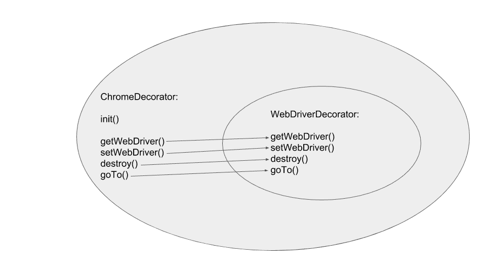](#)

让我们创建一个测试，利用我们的工厂和它创建的`AutomatedBrowser`实例。

因为这是一个测试类，所以它将被创建在`src/test/java/com/octopus`目录中:

```
package com.octopus;

import org.junit.Test;
import org.junit.runner.RunWith;
import org.junit.runners.Parameterized;
import java.util.Arrays;

@RunWith(Parameterized.class)
public class FactoryTest {

  private static final AutomatedBrowserFactory AUTOMATED_BROWSER_FACTORY
    = new AutomatedBrowserFactory();

  private String browser;

  public FactoryTest(final String browser) {
    this.browser = browser;
  }

  @Parameterized.Parameters
  public static Iterable data() {
    return Arrays.asList(
      "Chrome",
      "Firefox"
    );
  }

  @Test
  public void openURL() {
    final AutomatedBrowser automatedBrowser =
      AUTOMATED_BROWSER_FACTORY.getAutomatedBrowser(browser);
    automatedBrowser.init();
    automatedBrowser.goTo("https://octopus.com/");
    automatedBrowser.destroy();
  }
} 
```

`FactoryTest`类利用 JUnit 参数化，用不同的输入多次运行测试方法。我们将使用这一功能，用一种测试方法对 Chrome 和 Firefox 浏览器进行测试。

为了启用参数化，测试类需要注释`@RunWith(Parameterized.class)`:

```
@RunWith(Parameterized.class)
public class FactoryTest {

} 
```

然后它需要一个静态方法来返回将被传递给`FactoryTest`构造函数的值。在我们的例子中，这些值是我们将要测试的浏览器名称的字符串:

```
@Parameterized.Parameters
public static Iterable data() {
  return Arrays.asList(
    "Chrome",
    "Firefox"
  );
} 
```

最后，`FactoryTest()`构造函数被配置为接受一个参数，该参数将被设置为由`data()`方法返回的值之一。在这种情况下，我们将参数保存到`browser`实例变量:

```
private String browser;

public FactoryTest(final String browser) {
  this.browser = browser;
} 
```

然后，测试方法可以利用`browser`实例变量来启动 Chrome 或 Firefox 浏览器，作为测试的一部分。

这种在运行时通过`AutomatedBrowserFactory`选择浏览器的能力将为我们以后的测试提供极大的灵活性:

```
@Test

public void openURL() {
  final AutomatedBrowser automatedBrowser =
    AUTOMATED_BROWSER_FACTORY.getAutomatedBrowser(browser);

  automatedBrowser.init();
  automatedBrowser.goTo("https://octopus.com/");
  automatedBrowser.destroy();
} 
```

作为这个博客的一部分，我们已经创建了许多新的类，您最终应该会得到一个类似这样的目录结构。

[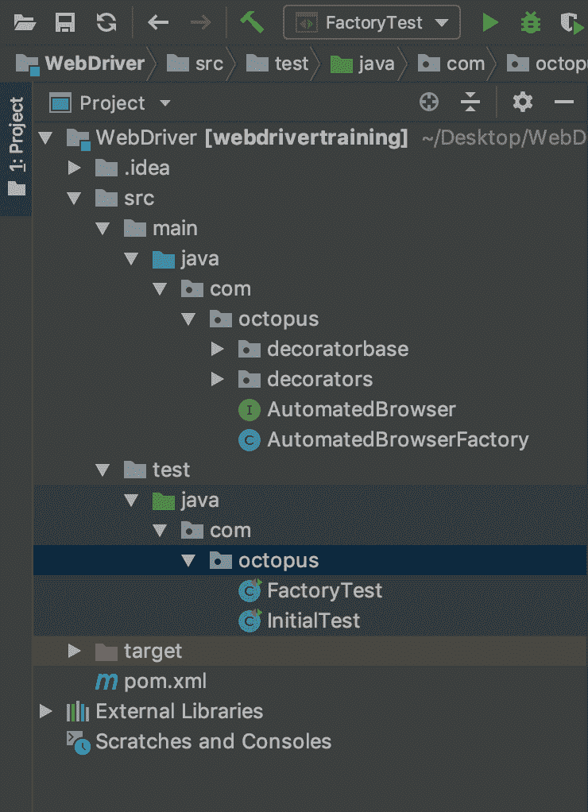](#)

要运行测试，单击`FactoryTest`类旁边的绿色箭头并选择`Run 'FactoryTest'`选项。

[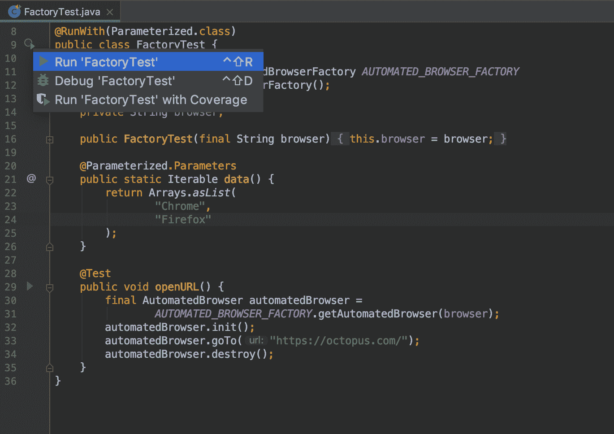](#)

你会看到 Chrome 和 Firefox 都打开，显示[https://octopus.com](https://octopus.com)，然后再次关闭。

现在我们有了一个简单的框架来运行针对多种浏览器的测试，我们需要一个网页来进行交互，我们将在下一篇文章中创建这个网页。

这篇文章是关于[创建 Selenium WebDriver 测试框架](/blog/selenium/0-toc/webdriver-toc)的系列文章的一部分。