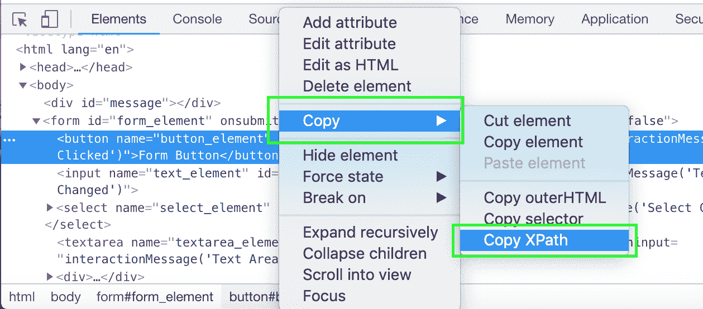
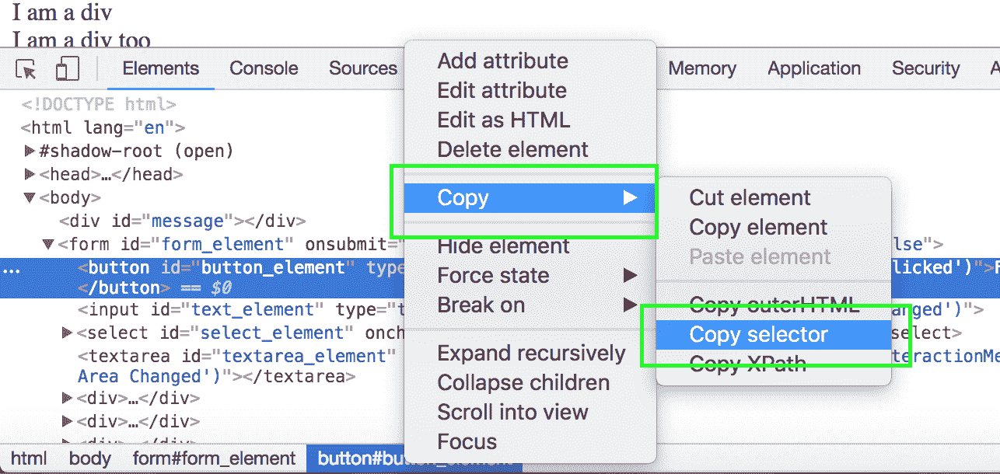

# Selenium 系列:通过 XPaths 和 CSS 选择器查找元素

> 原文：<https://octopus.com/blog/selenium/6-finding-elements-by-xpaths-and-css-selectors/finding-elements-by-xpaths-and-css-selectors>

这篇文章是关于[创建 Selenium WebDriver 测试框架](/blog/selenium/0-toc/webdriver-toc)的系列文章的一部分。

在上一节中，我们通过 ID 属性搜索了想要与之交互的元素。使用 ID 属性非常方便，但是在现实世界的场景中，并不是每个想要与之交互的元素都有 ID，或者 ID 是由模板语言生成的，而不是静态的。

与 ID 属性不同，网页中的每个元素都有唯一的 XPath。XPath (XML Path Language)是一种查询语言，用于从类似 XML 的文档中选择节点，比如我们的例子中的 HTML。

XPath 查询可能会变得非常复杂。独特的 XPaths 看起来像`//*[@id="request-summary"]/div/div[2]/div/form/div[2]/input`并不罕见。

幸运的是，Chrome 和其他浏览器提供了一种为元素生成唯一 XPaths 的简单方法。右键单击`Elements`选项卡中的元素并选择复制➜复制 Xpath 会将标识该元素的最简洁的唯一 Xpath 放入剪贴板。这个功能意味着您不需要理解 XPath 的本质细节就可以使用它们，因为您可以让浏览器为您生成 XPath。

[](#)

对于我们的测试网页，Chrome 生成的 XPath 利用了这样一个事实，即元素都有唯一的 ID 属性，这导致了相对简洁的 XPath，如`//*[@id="button_element"]`。

为了使用 XPaths 而不是 id 来定位页面中的元素，我们需要向`AutomatedBrowser`接口添加四个新方法:

```
void clickElementWithXPath(String xpath);

void selectOptionByTextFromSelectWithXPath(String optionText, String xpath);

void populateElementWithXPath(String xpath, String text);

String getTextFromElementWithXPath(String xpath); 
```

反过来，我们将这四个方法的实现添加到`AutomatedBrowserBase`类中:

```
@Override
public void clickElementWithXPath(final String xpath) {
  if (getAutomatedBrowser() != null) {
      getAutomatedBrowser().clickElementWithXPath(xpath);
  }
}

@Override
public void selectOptionByTextFromSelectWithXPath(final String optionText, final String xpath) {
  if (getAutomatedBrowser() != null) {
    getAutomatedBrowser().selectOptionByTextFromSelectWithXPath(optionText, xpath);
  }
}

@Override
public void populateElementWithXPath(final String xpath, final String text) {
  if (getAutomatedBrowser() != null) {
    getAutomatedBrowser().populateElementWithXPath(xpath, text);
  }
}

@Override
public String getTextFromElementWithXPath(final String xpath) {
  if (getAutomatedBrowser() != null) {
    return getAutomatedBrowser().getTextFromElementWithXPath(xpath);
  }
  return null;
} 
```

然后我们在`WebDriverDecorator`类中定义这些方法的实现。

注意，我们在这些方法中调用`By.xpath()`而不是`By.id()`。这是我们根据元素的 XPath 搜索元素的方法:

```
@Override
public void clickElementWithXPath(final String xpath) {
  webDriver.findElement(By.xpath(xpath)).click();
}

@Override
public void selectOptionByTextFromSelectWithXPath(final String optionText, final String xpath) {
  new Select(webDriver.findElement(By.xpath(xpath))).selectByVisibleText(optionText);
}

@Override
public void populateElementWithXPath(final String xpath, final String text) {
  webDriver.findElement(By.xpath(xpath)).sendKeys(text);
}

@Override
public String getTextFromElementWithXPath(final String xpath) {
  return webDriver.findElement(By.xpath(xpath)).getText();
} 
```

最后，我们创建了一个新的测试方法，它与我们的示例 web 页面进行交互，但是这次利用了新的基于 XPath 的方法:

```
@Test
public void formTestByXPath() throws URISyntaxException {

  final AutomatedBrowser automatedBrowser = AUTOMATED_BROWSER_FACTORY.getAutomatedBrowser("Chrome");

  try {
    automatedBrowser.init();

    automatedBrowser.goTo(FormTest.class.getResource("/form.html").toURI().toString());

    automatedBrowser.clickElementWithXPath("//*[@id=\"button_element\"]");
    assertEquals("Button Clicked", automatedBrowser.getTextFromElementWithId("message"));

    automatedBrowser.populateElementWithXPath("//*[@id=\"text_element\"]", "test text");
    assertEquals("Text Input Changed", automatedBrowser.getTextFromElementWithId("message"));

    automatedBrowser.populateElementWithXPath("//*[@id=\"textarea_element\"]", "test text");
    assertEquals("Text Area Changed", automatedBrowser.getTextFromElementWithId("message"));

    automatedBrowser.selectOptionByTextFromSelectWithXPath("Option 2.1", "//*[@id=\"select_element\"]");
    assertEquals("Select Changed", automatedBrowser.getTextFromElementWithId("message"));

    automatedBrowser.clickElementWithXPath("//*[@id=\"radio3_element\"]");
    assertEquals("Radio Button Changed", automatedBrowser.getTextFromElementWithId("message"));

    automatedBrowser.clickElementWithXPath("//*[@id=\"checkbox2_element\"]");
    assertEquals("Checkbox Changed", automatedBrowser.getTextFromElementWithId("message"));

    automatedBrowser.clickElementWithXPath("//*[@id=\"image_element\"]");
    assertEquals("Image Clicked", automatedBrowser.getTextFromElementWithId("message"));

    automatedBrowser.clickElementWithXPath("//*[@id=\"div_element\"]");
    assertEquals("Div Clicked", automatedBrowser.getTextFromElementWithId("message"));
  } finally {
    automatedBrowser.destroy();
  }
} 
```

像 XPaths 一样，HTML 文档中的所有元素都有一个唯一的 CSS 选择器来标识它们。

CSS 选择器与 CSS 规则集中使用的标识符相同。如果你做过任何网页开发，那么你很可能熟悉 CSS 选择器。但即使你不是，Chrome 和其他浏览器也提供了一种为 HTML 元素生成 CSS 选择器的方法。在 Chrome 中，右击`Elements`标签中的元素，选择复制➜复制选择器。

[](#)

在我们的例子中，因为我们正在交互的元素都有 ID 属性，这个菜单选项将把一个 CSS 选择器如`#button_element`放入剪贴板。

使用 CSS 选择器的过程与我们支持 XPaths 的过程非常相似。

我们在`AutomatedBrowser`接口中定义新方法:

```
void clickElementWithCSSSelector(final String cssSelector);

void selectOptionByTextFromSelectWithCSSSelector(final String optionText, final String cssSelector);

void populateElementWithCSSSelector(final String cssSelector, final String text);

String getTextFromElementWithCSSSelector(final String cssSelector); 
```

然后，我们在`AutomatedBrowserBase`类中提供默认实现:

```
@Override
public void clickElementWithCSSSelector(final String cssSelector) {
  if (getAutomatedBrowser() != null) {
    getAutomatedBrowser().clickElementWithCSSSelector(cssSelector);
  }
}

@Override
public void selectOptionByTextFromSelectWithCSSSelector(final String optionText, final String cssSelector) {
  if (getAutomatedBrowser() != null) {
    getAutomatedBrowser().selectOptionByTextFromSelectWithCSSSelector(optionText, cssSelector);
  }
}

@Override
public void populateElementWithCSSSelector(final String cssSelector, final String text) {
  if (getAutomatedBrowser() != null) {
    getAutomatedBrowser().populateElementWithCSSSelector(cssSelector, text);
  }
}

@Override
public String getTextFromElementWithCSSSelector(final String cssSelector) {
  if (getAutomatedBrowser() != null) {
    return getAutomatedBrowser().getTextFromElementWithCSSSelector(cssSelector);
  }
  return null;
} 
```

用新方法更新了`WebDriverDecorator`类。我们使用`By.cssSelector()`方法通过元素的 CSS 选择器来搜索元素:

```
@Override
public void clickElementWithCSSSelector(final String cssSelector) {
  webDriver.findElement(By.cssSelector(cssSelector)).click();
}

@Override
public void selectOptionByTextFromSelectWithCSSSelector(final String optionText, final String cssSelector) {
  new Select(webDriver.findElement(By.cssSelector(cssSelector))).selectByVisibleText(optionText);
}

@Override
public void populateElementWithCSSSelector(final String cssSelector, final String text) {
  webDriver.findElement(By.cssSelector(cssSelector)).sendKeys(text);
}

@Override
public String getTextFromElementWithCSSSelector(final String cssSelector) {
  return webDriver.findElement(By.cssSelector(cssSelector)).getText();
} 
```

最后，我们将所有新方法与使用 CSS 选择器定位元素的新测试结合在一起:

```
@Test
public void formTestByCSSSelector() throws URISyntaxException {
  final AutomatedBrowser automatedBrowser = AUTOMATED_BROWSER_FACTORY.getAutomatedBrowser("Chrome");

  try {
    automatedBrowser.init();

    automatedBrowser.goTo(FormTest.class.getResource("/form.html").toURI().toString());

    automatedBrowser.clickElementWithCSSSelector("#button_element");
    assertEquals("Button Clicked", automatedBrowser.getTextFromElementWithId("message"));

    automatedBrowser.populateElementWithCSSSelector("#text_element", "test text");
    assertEquals("Text Input Changed", automatedBrowser.getTextFromElementWithId("message"));

    automatedBrowser.populateElementWithCSSSelector("#textarea_element", "test text");
    assertEquals("Text Area Changed", automatedBrowser.getTextFromElementWithId("message"));

    automatedBrowser.selectOptionByTextFromSelectWithCSSSelector("Option 2.1", "#select_element");
    assertEquals("Select Changed", automatedBrowser.getTextFromElementWithId("message"));

    automatedBrowser.clickElementWithCSSSelector("#radio3_element");
    assertEquals("Radio Button Changed", automatedBrowser.getTextFromElementWithId("message"));

    automatedBrowser.clickElementWithCSSSelector("#checkbox2_element");
    assertEquals("Checkbox Changed", automatedBrowser.getTextFromElementWithId("message"));

    automatedBrowser.clickElementWithCSSSelector("#image_element");
    assertEquals("Image Clicked", automatedBrowser.getTextFromElementWithId("message"));

    automatedBrowser.clickElementWithCSSSelector("#div_element");
    assertEquals("Div Clicked", automatedBrowser.getTextFromElementWithId("message"));
  } finally {
    automatedBrowser.destroy();
  }
} 
```

我们已经看到了三种不同的方法来识别 HTML 页面中的元素:使用 ID、使用 XPaths 和使用 CSS 选择器。但是哪种方式是最好的呢？

在有效的 HTML 中，`id`属性必须是唯一的。在一个设计良好的页面中,`id`属性还为定义它的元素提供了一些有意义的上下文。当开发人员更新应用程序时，元素在页面中移动时，通常也会保留相同的`id`属性。这使得通过 ID 查找元素成为在页面中定位元素的最简洁可靠的方式。

不幸的是，因为`id`属性必须手动分配给一个元素，所以您不能依赖于您希望与之交互的具有`id`属性的元素。事实上，以我的经验来看，在针对现实世界的应用程序编写测试时，很少有`id`属性可用。

与`id`属性不同，所有元素都可以使用 XPaths 和 CSS 选择器来定位。因此，在没有可用 ID 的情况下，您将不得不求助于这些定位器中的一个。

CSS 选择器往往比 XPaths 更熟悉，因为 CSS 选择器被 web 开发人员用来设计 CSS 规则集。出于这个原因，我推荐 CSS 选择器而不是 XPaths。

这篇文章是关于[创建 Selenium WebDriver 测试框架](/blog/selenium/0-toc/webdriver-toc)的系列文章的一部分。