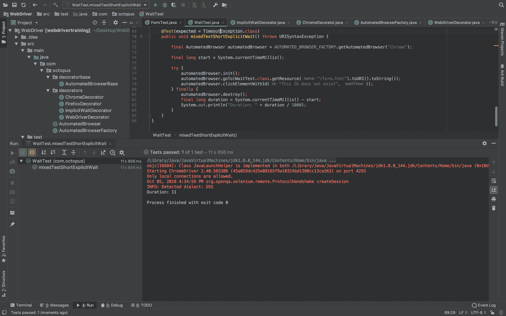
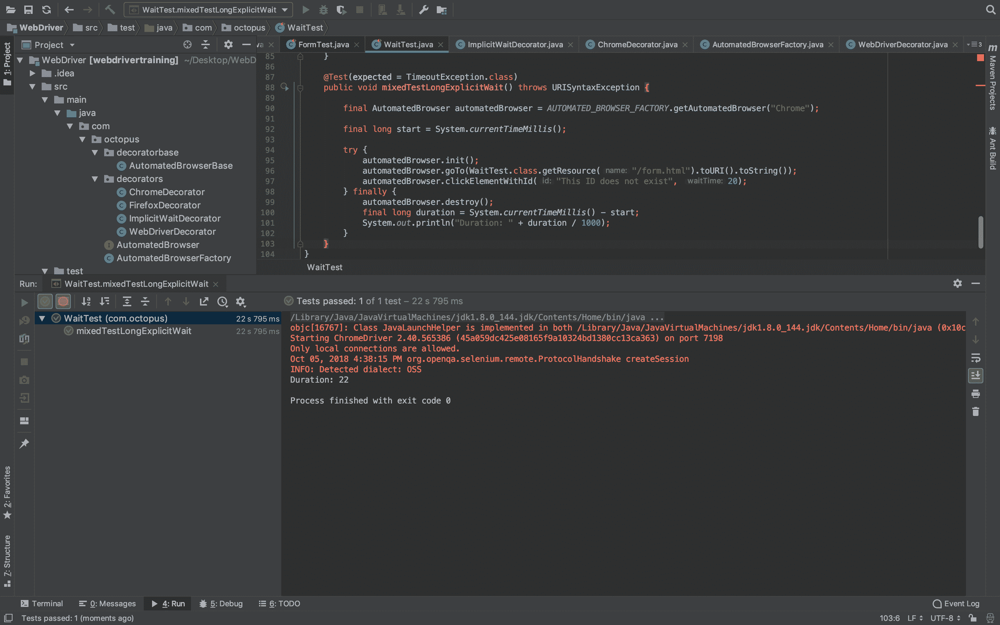
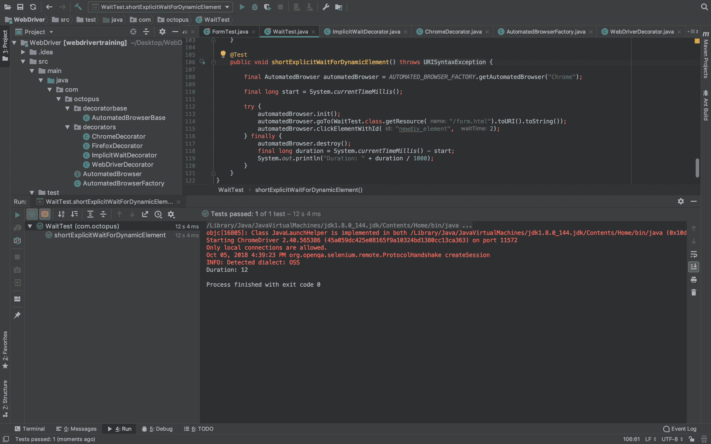

# Selenium 系列:混合隐式和显式等待- Octopus Deploy

> 原文：<https://octopus.com/blog/selenium/8-mixing-waits/mixing-waits>

这篇文章是关于[创建 Selenium WebDriver 测试框架](/blog/selenium/0-toc/webdriver-toc)的系列文章的一部分。

我们已经看到有两种类型的等待:隐式和显式。两者都是彼此独立实现的，那么当您在一个测试中既有隐式等待又有显式等待时会发生什么呢？

为了找到答案，让我们创建一个实现这两种等待的测试。

在我们的`AutomatedBrowserFactory`类中，我们创建了`ImplicitWaitDecorator`类，作为打开 Chrome 浏览器的`AutomatedBrowser`的构造的一部分。所以我们知道测试将利用隐式等待:

```
private AutomatedBrowser getChromeBrowser() {
  return new ChromeDecorator(
    new ImplicitWaitDecorator(10,
      new WebDriverDecorator()
    )
  );
} 
```

让我们创建一个测试，尝试单击一个在页面上永远找不到的元素。

在`@Test`注释上添加的`expected`异常表明，只有在抛出`TimeoutException`异常的情况下，这个测试才会通过，我们希望抛出这个异常，因为永远不会有 ID 为`This ID does not exist`的元素:

```
@Test(expected = TimeoutException.class)
public void mixedTestShortExplicitWait() throws URISyntaxException {

  final AutomatedBrowser automatedBrowser = AUTOMATED_BROWSER_FACTORY.getAutomatedBrowser("Chrome");

  final long start = System.currentTimeMillis();

  try {
    automatedBrowser.init();
    automatedBrowser.goTo(WaitTest.class.getResource("/form.html").toURI().toString());
    automatedBrowser.clickElementWithId("This ID does not exist", 1);
  } finally {
    automatedBrowser.destroy();
    final long duration = System.currentTimeMillis() - start;
    System.out.println("Duration: " + duration / 1000);
  }
} 
```

为了跟踪我们等待元素的时间，我们从测试开始前获取当前系统时间开始:

```
final long start = System.currentTimeMillis(); 
```

在`finally`块中，我们显示当前系统时间和测试开始时间之间的差异。这让我们大致了解了完成测试需要多长时间:

```
final long duration = System.currentTimeMillis() - start;
System.out.println("Duration: " + duration / 1000); 
```

当试图单击元素时，我们使用需要等待时间的方法，这反过来意味着我们实现了显式等待。在这个测试中，我们使用 1 秒的显式等待。请记住，这种显式等待是对作为`AutomatedDriver`一部分配置的 10 秒隐式等待的补充:

```
automatedBrowser.clickElementWithId("This ID does not exist", 1); 
```

运行该测试显示，测试总是需要 10 秒以上才能完成。

[](#)

当代码使用仅 1 秒钟的显式等待来等待丢失的元素时，这个结果可能会令人惊讶。它表明，当混合一个短的显式等待和一个长的隐式等待时，测试将在隐式等待的整个时间内暂停。

让我们颠倒一下测试，添加一个更长的显式等待。这一次我们将使用 20 秒的显式等待:

```
@Test(expected = TimeoutException.class)
public void mixedTestLongExplicitWait() throws URISyntaxException {

  final AutomatedBrowser automatedBrowser = AUTOMATED_BROWSER_FACTORY.getAutomatedBrowser("Chrome");

  final long start = System.currentTimeMillis();

  try {
    automatedBrowser.init();
    automatedBrowser.goTo(WaitTest.class.getResource("/form.html").toURI().toString());
    automatedBrowser.clickElementWithId("This ID does not exist", 20);
  } finally {
    automatedBrowser.destroy();
    final long duration = System.currentTimeMillis() - start;
    System.out.println("Duration: " + duration / 1000);
  }
} 
```

运行该测试显示，测试总是需要 20 多秒才能完成。这是一个更符合预期的结果，显示了分配给隐式和显式等待的时间使用得越多。

[](#)

让我们尝试第三个场景，其中我们为 5 秒后创建的 div 元素使用 2 秒的显式等待时间。如果您还记得以前的帖子，ID 为`newdiv_element`的 div 被创建，并在 5 秒钟后使用 JavaScript 函数动态添加到页面中。

您可以向测试中添加类似的步骤，以确保 web 应用程序在可接受的时间内执行操作，而不会让用户等待继续他们的进程。

```
@Test
public void shortExplicitWaitForDynamicElement() throws URISyntaxException {

  final AutomatedBrowser automatedBrowser = AUTOMATED_BROWSER_FACTORY.getAutomatedBrowser("Chrome");

  final long start = System.currentTimeMillis();

  try {
    automatedBrowser.init();
    automatedBrowser.goTo(WaitTest.class.getResource("/form.html").toURI().toString());
    automatedBrowser.clickElementWithId("newdiv_element", 2);
  } finally {
    automatedBrowser.destroy();
    final long duration = System.currentTimeMillis() - start;
    System.out.println("Duration: " + duration / 1000);
  }
} 
```

这个测试通过了。即使我们已经明确地为一个我们知道在 5 秒钟内不会被创建的元素等待了 2 秒钟，这个元素还是被找到并被点击了。

[](#)

这种行为是违反直觉的，如果我们使用 2 秒的等待时间来执行应用程序的性能要求，这个测试将会产生一个误报。

让我们纠正这个限制。对于最后一个场景，我们需要获得一个没有隐式等待的`AutomatedBrowser`实例。为此，我们将在`AutomatedBrowserFactory`职业中增加两个新选项:`ChromeNoImplicitWait`和`FirefoxNoImplicitWait`。

这些选项依次调用`getChromeBrowserNoImplicitWait()`和`getFirefoxBrowserNoImplicitWait()`方法，它们构建没有定义隐式等待的`AutomatedBrowser`对象:

```
package com.octopus;

import com.octopus.decorators.*;

public class AutomatedBrowserFactory {

  public AutomatedBrowser getAutomatedBrowser(String browser) {

    if ("ChromeNoImplicitWait".equalsIgnoreCase(browser)) {
      return getChromeBrowserNoImplicitWait();
    }

    if ("FirefoxNoImplicitWait".equalsIgnoreCase(browser)) {
      return getFirefoxBrowserNoImplicitWait();
    }

    // ...
  }

  // ...

  private AutomatedBrowser getChromeBrowserNoImplicitWait() {
    return new ChromeDecorator(
      new WebDriverDecorator()
      );
  }

  private AutomatedBrowser getFirefoxBrowserNoImplicitWait() {
    return new FirefoxDecorator(
      new WebDriverDecorator()
    );
  }
} 
```

然后，我们使用显式等待重新创建相同的测试，等待的时间比生成元素所需的时间要短。但是这一次，我们通过将`ChromeNoImplicitWait`选项传递给工厂来运行测试，没有任何隐式等待:

```
@Test(expected = TimeoutException.class)
public void shortExplicitWaitNoImplicitWaitForDynamicElement() throws URISyntaxException {
  final AutomatedBrowser automatedBrowser = AUTOMATED_BROWSER_FACTORY.getAutomatedBrowser("ChromeNoImplicitWait");
  final long start = System.currentTimeMillis();

  try {
    automatedBrowser.init();
    automatedBrowser.goTo(WaitTest.class.getResource("/form.html").toURI().toString());
    automatedBrowser.clickElementWithId("newdiv_element", 2);
  } finally {
    automatedBrowser.destroy();
    final long duration = System.currentTimeMillis() - start;
    System.out.println("Duration: " + duration / 1000);
  }
} 
```

这一次我们得到了抛出`TimeoutException`的测试的预期结果。

这些测试告诉我们隐式和显式等待并不相互排斥。尽管它们是独立定义的，彼此之间没有明显的影响，但隐式等待时间确实会影响显式等待操作。

因为显式等待允许我们编写更健壮的测试，在一段时间内强制元素的状态，并为要完成的每个交互提供单独的持续时间，所以在我们的测试中使用显式等待是有意义的。我们在这里看到的是，为了利用显式等待，我们还需要禁用隐式等待。

这篇文章是关于[创建 Selenium WebDriver 测试框架](/blog/selenium/0-toc/webdriver-toc)的系列文章的一部分。