# 利用 Octopus Runbooks 和 Redgate SQL Clone - Octopus Deploy 实现自助式数据库供应

> 原文：<https://octopus.com/blog/self-service-database-provisioning-with-octopus-runbooks-and-redgate-sql-clone>

## TL；博士；医生

我想写关于自助式数据库环境创建的文章。

它对任何开发过程都是至关重要的，并且对生产率、质量和安全性有着巨大的影响。这也是一个迷人的技术挑战，通常结合了基础设施即代码、测试数据管理、自动化和有趣的数据虚拟化技术。由于理论在很大程度上是假设的，除非它被转化为实践，所以我想包括一个逐步走查，以便您可以创建自己的概念证明。

不用说，这篇文章有点长。为了分解它，我跟随了西蒙·西内克的《为什么？怎么会？什么？ 概念将它分割成一口大小的部分。你可以从你最感兴趣的部分开始:

## 为什么？这很重要

2018 年，Nicole Forsgren、Gene Kim 和 Jez Humble 为我们带来了 [Accelerate](https://www.amazon.co.uk/Accelerate-Software-Performing-Technology-Organizations/dp/1942788339) 。该书阐述了 4 个关键指标，这些指标被证明可以预测任何组织中卓越的 IT 性能和积极的业务成果(包括盈利能力、市场份额和生产力)。这些指标是:

*   部署频率
*   研制周期
*   平均恢复时间(MTTR)
*   更改失败百分比

作者清楚地解释了通过关注这些指标，企业如何逆转开发和运营之间(速度和安全之间)的核心长期冲突，并创建更小、更规则和更安全的发布的良性循环。这导致了更好的灵活性、创新性，以及更好的业务成果。

为了缩短交付周期，有必要了解将待办事项中的任务投入生产所需的所有工作。流程中的某个地方总是存在瓶颈或约束，导致延迟、严重的交付周期，并导致大量的在制品(WIP)、更大更复杂的发布，以及更频繁的灾难。

在[超越凤凰计划](https://www.audible.co.uk/pd/Beyond-the-Phoenix-Project-Audiobook/B07B7CH7FQ?source_code=M2M30DFT1BkSH11221601A7&&ipRedirectOverride=true)中，Gene Kim 评论道:

> 我发现令人惊奇的是，当一个组织从几个月，甚至几个季度的代码部署交付时间减少到几分钟时，约束以一些相当可预测的方式移动。

他继续告诉我们，这种约束倾向于按顺序落在以下位置:

1.  环境创造
2.  代码部署
3.  测试
4.  体系结构
5.  创新ˌ革新

我帮助人们管理他们的数据库代码。从我的角度来看，吉恩是个大富翁。

许多人被共享的开发数据库所困扰。对于这些人来说，管理多项工作的并发开发是一个可怕的泥潭，充满了不必要的官僚主义、繁琐的过程和代价高昂的错误。糟糕的交付周期和大量的在制品加剧了这种情况。

旧的测试代码和大的、复杂的、和/或长期以来被放弃的或未完成的工作在开发和测试数据库中徘徊。同时，生产修补程序经常缺失。这破坏了所有的测试，并且任何自动化部署的尝试都被留下所有垃圾的需求所阻碍——以防万一。这同时使得部署过程(无论是手动的还是自动的)更加复杂和不可靠，进一步加剧了核心的长期冲突。

为了打破这种恶性循环，并实现更快的交付时间和部署频率，有必要转向一种模型，在这种模型中，开发人员和测试人员可以按需使用可任意处理的开发和测试环境，包括数据库，并在工作完成后丢弃。这确保了每个人看到的是代码的真实版本，没有被共享环境中的垃圾所感染。

这对您的 IT 绩效具有变革性的影响，因为(对大多数组织而言)它有助于解决与前 3 个瓶颈相关的许多挑战，从而使交付周期大幅缩短。随之而来的必然是部署频率的大幅提高。

此外，通过在 Accelerate 的前两个(以速度为导向的)关键指标上取得重大进展，您几乎可以肯定地看到后两个(以安全为导向的)指标上的同步改进。这些指标用良性循环取代了核心的长期冲突，在良性循环中，速度提高了安全性，安全性提高了速度。

然而，可任意使用的数据库的自助供应通常感觉是最难解决的问题，尤其是当您有大量和/或敏感的数据要考虑时。同时，这可能是您显著提高 it 团队绩效，进而提高业务成效的最佳机会。

这篇文章向你介绍了一些可能有帮助的技术。最后，我使用 Octopus Deploy 和 [Redgate SQL Clone](https://www.red-gate.com/products/dba/sql-clone/) 创建了一个概念验证解决方案。如果你还没有使用八达通，你可以[开始免费试用](https://octopus.com/start)。 [Redgate SQL Clone](https://www.red-gate.com/products/dba/sql-clone/) 也提供免费试用。

## 怎么会？介绍技术

Rob 出版了一本关于运营手册的概述。

Octopus Runbooks 是一种组织、审计和共享用于执行常规操作任务的脚本和流程的方式。它们有助于提高效率、共享知识并减少错误。它是一个调度任务或使用户能够按需触发任务的平台，而不需要个人访问相关的服务器、脚本或其他工件。

这是一个为开发人员或测试人员构建自助服务环境创建流程的绝佳平台。

例如，runbooks 允许 DBA 在合适的时间管理源数据映像和配置过程。源数据映像适合开发人员或测试人员使用，开发人员/测试人员可以按照自己的计划使用源映像，而不会打扰可能(例如)忙于处理 sev-1 中断的 DBA。这同时减少了开发团队的延迟和运营人员的中断。更少的支持票对每个人都是一个胜利。更重要的是，我们刚刚移除了吉恩·金列表中的第一个主要约束(见上图)。

然而，Runbooks 本身没有任何数据库智能。用户需要弄清楚如何创建一个源映像，以及如何自动将其提供给一个适当的开发/测试实例。这是一个挑战，原因有几个。

例如，您可以从使用源映像的生产备份和运行手册开始，将该备份恢复到开发人员的工作站。这立即引发了一些挑战:

*   **数据保护:**在您的开发和测试环境中，并且可能在开发人员工作站上，不加选择地恢复敏感的生产数据，这是一种导致数据泄露的不良做法。
*   **磁盘空间:**如果您的生产数据库大于 100GB，您可能会尝试使用一个共享的开发/测试实例(不要这样做，见上文)，或者您需要租用/购买大量基础设施来托管所有这些开发/测试数据库。这有可能导致高昂的前期成本以及令人头疼的管理开销。你还会浪费大量的时间和带宽到处复制那些 1 和 0。

进入第三方数据库屏蔽和克隆工具，如 [dbaclone](https://github.com/sqlcollaborative/dbaclone) (开源)和 [Redgate SQL Provision](https://www.red-gate.com/products/dba/sql-provision/) 。

Redgate SQL Provision 有两个组件:[SQL Server 的数据屏蔽器](https://www.red-gate.com/products/dba/data-masker/)(解决数据保护问题)和 [SQL 克隆](https://www.red-gate.com/products/dba/sql-clone/)(解决磁盘空间问题)。

dbaclone 是 Redgate SQL Clone 的免费替代品，其工作方式大致相同。然而，它缺乏各种重要的特性，包括用户友好的 UI、细粒度的用户权限，并且(在撰写本文时)没有 Octopus Deploy 步骤模板。它不包括任何数据屏蔽功能，但它被设计为与 [dbatools](https://dbatools.io/) 、[协同使用，后者负责](https://docs.dbatools.io/#Invoke-DbaDbDataMasking)。

为了简单起见，在本文的其余部分，我使用 SQL Clone 而不是 dbaclone，但是如果您想尝试 dbaclone，您应该会发现这里提倡的一般模式和实践也适用于您。您只需要编写自己的 PowerShell 脚本，而不是使用您将在下面读到的 SQL 克隆步骤模板。(当你这样做的时候，为什么不做一个好公民，向公众发布你的 step 模板 [Octopus Deploy 库](https://library.octopus.com/listing)，这样其他人也能受益。)

在 Redgate 文档网站上有关于 SQL Clone 如何工作的详细解释，如果你投资于 SQL Clone 或 dbaclone(工作方式相同)，我鼓励你阅读。

[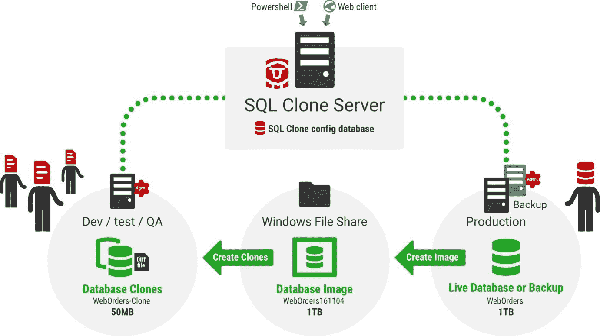](#)

简而言之，SQL Clone 读取一个源数据库或备份文件，该文件最大可达 64TB，并将它恢复到虚拟硬盘(VHD)上的一个文件共享中，您的开发人员应该对该文件共享具有读取权限。这个过程很慢，而且 VHD 需要足够大才能容纳完整的数据库。

当您拥有 VHD 时，它的速度快如闪电，几乎不需要磁盘空间来创建一个*差异 VHD* (或*差异文件*)，这实际上是一个返回到源 VHD 的奇特重定向。然而，它有一个重要的区别。对数据库所做的任何更改都存储在本地 diff 文件中，而不是文件共享上的源 VHD 中。这意味着每个开发人员都可以写入数据库，而不会影响源映像或任何其他开发人员。他们实际上有自己的迷你沙箱，我们称之为“克隆”。

[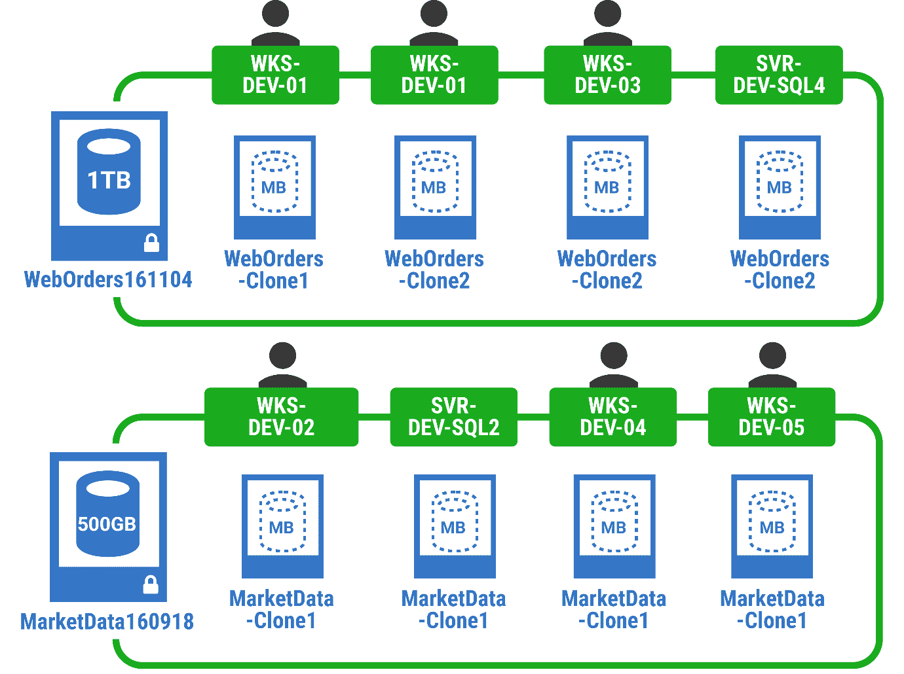](#)

因为复制一个克隆是如此容易，即使源数据库是巨大的，如果开发人员破坏了什么也没关系。他们简单地删除它，并拉下一个新的克隆，有点像本地 git 回购。它只需要几秒钟，几乎不占用任何磁盘空间。这是开发、测试、故障排除或试验的安全场所。

当你开始使用它时，感觉就像变魔术一样，但它是虚拟机、容器和数据中心用来有效利用可用系统资源的相同底层技术或概念。

问题是，如果开发人员开始重建大表，更改将存储在本地的 *diff 文件*中。该开发人员将很快用完磁盘空间。这使得它成为开发和测试大多数模式更改的一个很好的解决方案，但是不适合批量数据操作，比如测试完整的 ETL 加载或数据屏蔽操作。

这意味着数据掩蔽过程需要在创建源映像之前或期间运行，而不是在克隆本身上运行。这还有一个好处，那就是对于任何严肃的数据治理来说，这是一个更加可靠和易于管理的基础，因为敏感数据永远不需要离开生产环境。

我不打算在这里讨论数据屏蔽。这是一个足够大的话题，值得有自己的博文；[我这里写的是](https://www.red-gate.com/blog/audit-and-compliance/traditional-database-security-doesnt-protect-data)。有关 SQL 供应的数据屏蔽的更多信息，请查看 [Redgate University](https://www.red-gate.com/hub/university/courses/sql-provision/sql-provision/introduction-to-sql-clone/creating-clones) 。

您还希望确保克隆在物理上靠近源映像。作为一个思考练习，让我们想象一下，你的公司决定要求你所有的开发人员在家工作一段时间。您可能想考虑一下，对于开发人员来说，使用位于中央的基础设施来托管他们的开发沙箱是否更明智，而不是依赖脆弱的 VPN 和开发人员的家庭 Wi-Fi 来处理 VHD 和 *diff 文件*之间的连接。 [Chris Unwin 详细讲述了这一点](https://chrisunwin.home.blog/2020/04/16/cloning-from-home-a-consideration/)。)

总之，Octopus Runbooks 和 SQL Provision 是管理开发/测试数据库供应流程的完美组合，原因如下:

*   **职责分离:**DBA、ops 或数据治理人员可以管理屏蔽和想象流程，但开发和测试人员需要扣动扳机来部署/调配数据库。
*   **保护安全边界:**安全可以在 SQL Clone 和 Octopus Deploy 中独立管理，这意味着开发人员被意外授权访问任何生产数据的可能性极小。SQL Clone 中的安全性将完全基于数据治理考虑，而 Octopus 中的安全性将基于开发需求。
*   **自助服务:**开发和测试人员可以即时访问他们工作所需的数据库和数据，而不会出现交接、延迟或中断。
*   **打破限制:**在撰写本文时，Octopus Deploy 和 Redgate SQL Provision 是帮助您解决自助式数据库供应问题和打破最常见的第一个限制(环境创建)的最佳工具，这种限制会导致交付周期缩短并加剧核心的长期冲突。

## 演练:使用 Octopus Runbooks 和 SQL Clone 提供开发和测试数据库

本文假设您已经安装了 Octopus Deploy 和 SQL Clone。如果您还没有，请在继续之前遵循以下说明:

### SQL 克隆中的准备工作

这篇文章还假设你已经创建了一个图像。

如果您还没有这样做，您可以使用任何您喜欢的数据库来尝试。然而，如果可能的话，我建议使用[公共 StackOverflow 数据库](https://www.brentozar.com/archive/2015/10/how-to-download-the-stack-overflow-database-via-bittorrent/)作为您的第一个概念证明，因为它很容易掌握，足够大以看到克隆技术的好处，但足够小以避免重大挑战。在现实世界的设置中，我会使用最近的生产备份作为我的映像源。

[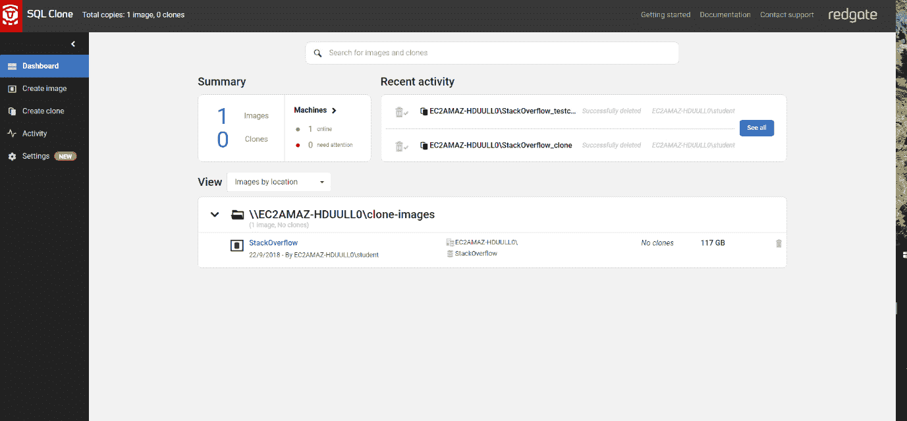](#)

如果您的源数据库包含不应该存在于开发或测试域中的敏感数据，请考虑在映像过程中运行 SQL 脚本或 Redgate 屏蔽集，以确保映像被适当地匿名化。我不会在这篇文章中讨论屏蔽，因为它本身就是一个大话题，而且 StackOverflow 数据库只包含公共数据。

如果您尚未使用 SQL Clone 生成映像，请遵循以下说明:

创建映像后，在启动 runbook 之前，使用 SQL Clone UI 为映像创建一个克隆。

[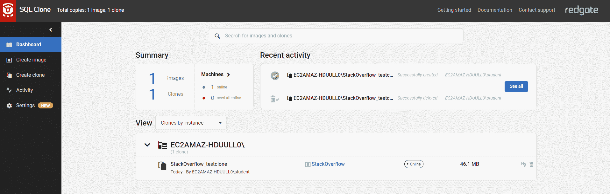](#)

这是一个好主意，原因如下:

1.  它将帮助您理解克隆过程是如何工作的。(在尝试自动化之前，了解如何手动执行任务是有好处的。例如，在将配置抽象成 Octopus Deploy 变量之前，您可以练习上下文 UI 中的术语。)
2.  有些步骤，例如添加目标服务器实例，需要从 UI 执行一次，然后才能使用 PowerShell cmdlets 自动执行。通过首先使用 UI 创建一个克隆，应该可以解决所有这些问题。
3.  如果您遇到任何问题，如果您更接近失败的原因，就更容易修复它们。当您开始时，由于您仍在学习诀窍，从 SQL Clone UI 内部对 SQL Clone 进行故障诊断可能更容易。

您可以按照以下说明使用 UI 创建您的第一个克隆:

当您知道可以使用 SQL Clone 从您的映像创建一个克隆时，您就可以尝试使用 Octopus Deploy 将其自动化。

### Octopus 部署的准备工作

这篇文章假设你有 Octopus 部署环境、触角和部署目标的工作知识([文档](https://octopus.com/docs/infrastructure))。

配置一个具有网络连接并且可以针对 SQL 克隆进行身份验证的部署目标。为这个目标赋予角色`sqlclone`，并将目标添加到一个或多个环境中(例如，开发/测试)。

[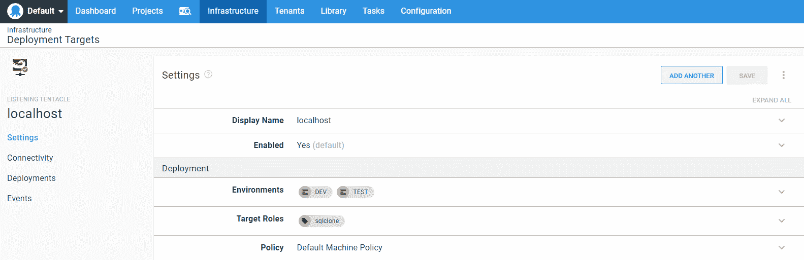](#)

要预先测试连接性，请尝试从运行触手的虚拟机上手动运行 Connect-SqlClone PowerShell cmdlet([文档](https://documentation.red-gate.com/clone/automation/powershell-cmdlet-reference/connect-sqlclone))。试着以章鱼触手运行的用户身份运行这个命令。如果连接有任何问题，请检查您的网络、防火墙和 SQL 克隆凭据。

或者，简单地推进到下一步。如果您有任何连接问题，您很快就会发现。

### 创建操作手册

如果您已经有一个项目来部署您的数据库，您可以在那里添加您的 runbook。如果没有，在 Octopus Deploy 中为您的数据库创建一个项目([参见这些帮助说明](https://octopus.com/docs/projects))。

现在，您可以在项目中创建一个操作手册。从左侧菜单中选择 **Runbooks** ，然后点击右上角绿色 **ADD RUNBOOK** 按钮。

[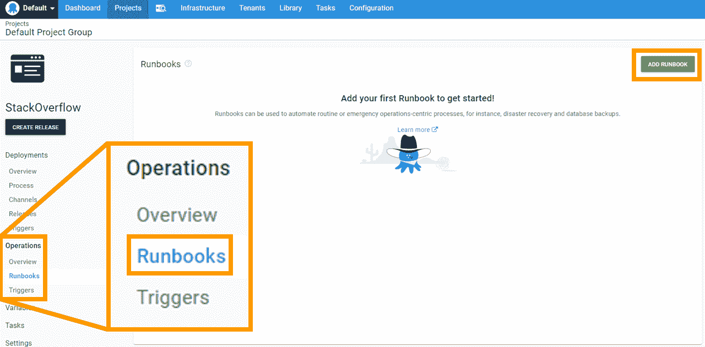](#)

为 runbook 命名并提供合适的描述:

[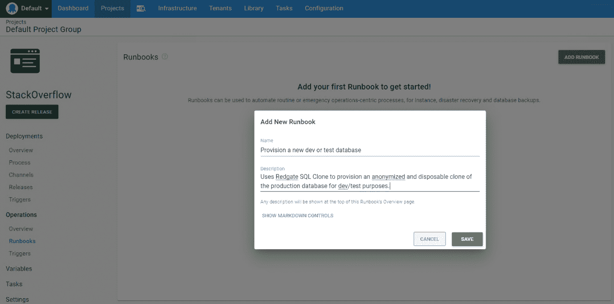](#)

接下来，定义您的操作手册流程。进程是 Octopus 在 Octopus 触手上执行的一系列自动化步骤，以完成手头的任务。(类似于常规部署的过程。)

点击**定义您的 RUNBOOK 流程**，然后**添加步骤**。您将看到一系列现成的步骤，您可以将它们添加到您的 runbook 流程中。在搜索栏中键入`redgate sql clone`并点击输入。您应该从 [Octopus Deploy 社区步骤模板库](https://library.octopus.com/listing)中找到一堆 SQL 克隆步骤模板。

[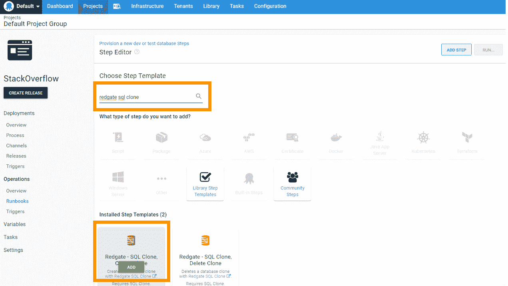](#)

将鼠标悬停在**Redgate–SQL Clone，Create Clone** 步骤模板上，您会看到一个绿色按钮，上面写着 **ADD** 或 **INSTALL AND ADD** ，这取决于您的 Octopus Deploy 服务器上是否已经安装了步骤模板。点击绿色按钮。

([如果想在安装前检查代码，可以在这里](https://library.octopus.com/step-templates/96d88bbf-2e0a-4630-b4b6-bd179effedd7/actiontemplate-redgate-sql-clone,-create-clone)进行。所有 4 个 SQL 克隆步骤模板主要是从 Redgate 文档页面上的示例 PowerShell 片段中复制/粘贴的作业。)

在步骤编辑器中，为角色中的目标**输入`sqlclone`:**

[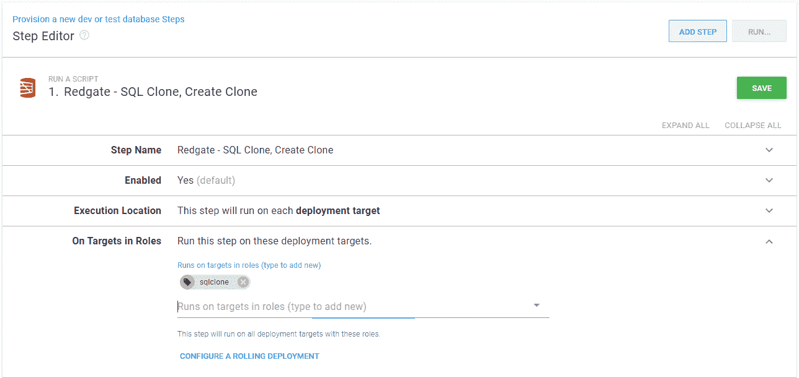](#)

对于 SQL 克隆参数，尝试使用变量来简化配置。在我的例子中，我使用 Windows Auth 对 SQL Clone 进行身份验证，所以我将 **SQL Clone 用户**和 **SQL Clone 密码**字段留空。

我没有使用一个 **SQL 克隆模板** ( [文档](https://documentation.red-gate.com/clone/modifications-during-provisioning/clone-modifications))。但是，这些可能对以下任务有用:

*   在我的一些表格中插入一些开发/测试友好的测试用例。
*   根据数据库是在开发环境中运行还是在测试环境中运行来修改数据库安全性，尤其是当映像只包含生产数据库用户和角色成员等时。

记住，模板是针对克隆执行的，而不是映像，所以它增加了 *diff 文件*的大小。不要对模板文件中的任何大型表上的数据进行批量更改或重建索引，否则开发人员的硬盘将为此付出代价。

通常，您的克隆会希望使用生产数据库名称，但是，在某些情况下，这可能会导致问题。例如，要在同一个实例上创建多个克隆，您需要给它们不同的名称。您不希望意外替换任何预先存在的开发/测试数据库。为此，我对`SQL Server`和`Clone Name`使用了特殊的变量。

这是我的配置:

[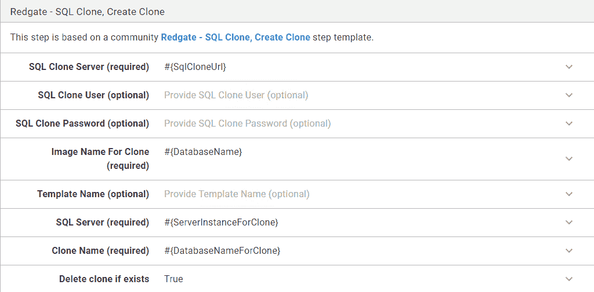](#)

请注意，如果您的开发人员正在处理他们自己的实例，他们会希望在运行时设置`SQL Server`变量。类似地，如果您的开发人员都将在一个共享的开发/测试实例上构建他们的克隆，或者如果他们可能想要同时使用多个克隆，(例如，因为他们正在同时处理几个任务，或者他们想要比较一个问题的几个不同的解决方案)，他们可能想要在运行时选择一个定制的`Clone Name`。

出于这个原因，您很快将`#{ServerInstanceForClone}`和`#{DatabaseNameForClone}`变量设置为可在运行时设置。但是在你这样做之前，你必须设置你的步骤**条件**。我只想在开发或测试中运行它，所以我相应地指定了:

[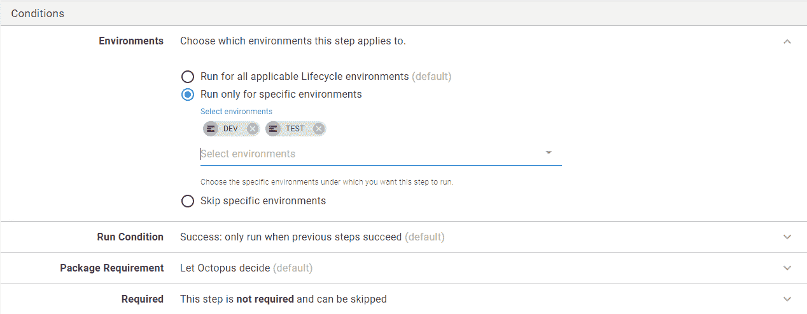](#)

查看所有步骤配置，并点击右上角的绿色**保存**按钮。

您的流程现已完成。然而，在运行它之前，您需要返回并设置您的变量。从左侧菜单中选择**变量**，并为我们上面使用的每个变量提供值。以下是我的:

[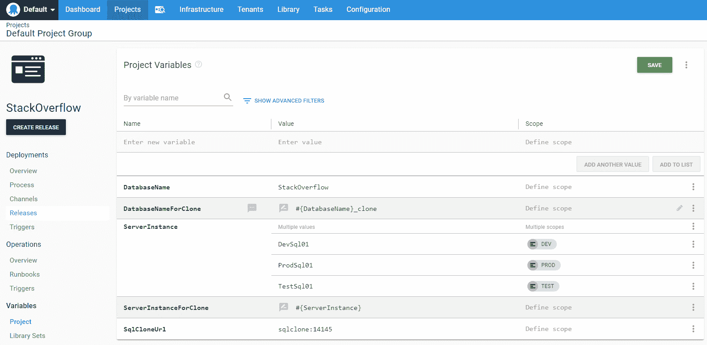](#)

因为我要将这个操作手册添加到一个现有的项目中，所以我已经有了`#{DatabaseName}`和`#{ServerInstance}`变量，但是我需要添加`#{SqlCloneUrl}`、`#{DatabaseNameForClone}`和`#{ServerInstanceForClone}`变量。对于后 2 个，当我输入值时，我点击了**打开编辑器**选项:

在完整编辑器中，我可以选择**值提示**复选框。这将确保这些值在运行时可设置。

[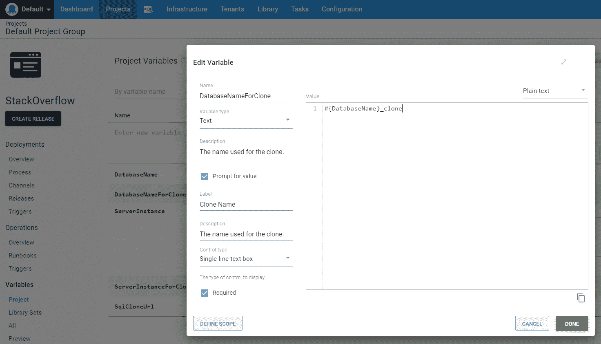](#)

### 运行您的 runbook:

设置好所有变量后，就可以运行 runbook 了。

从您的项目中，从左侧菜单中选择 **Runbooks** ，然后点击 runbook 旁边的 **RUN** 按钮。

[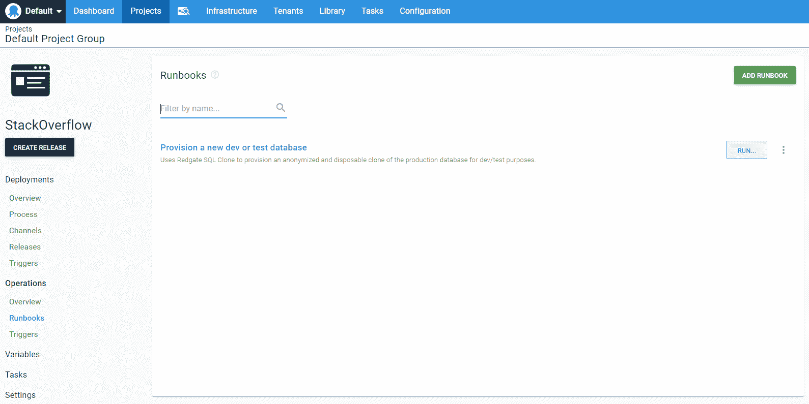](#)

提供所需的环境和提示变量。幸运的话，你会看到绿色:

[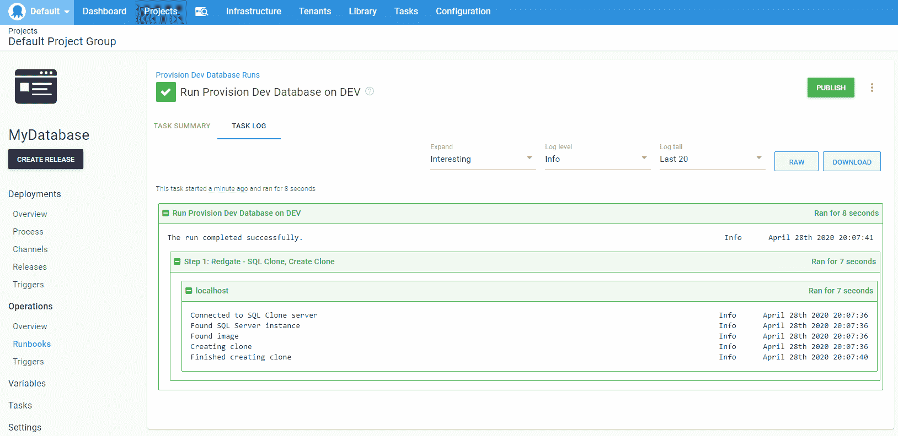](#)

现在，您的团队可以非常轻松地在商用笔记本电脑或廉价的虚拟机上按需调配他们自己的 64TB 开发和测试数据库。

### 扩展:

在你为创造克隆创造了你的操作手册之后，2 个进一步的操作手册跃入你的脑海。

1.  你可能想要一个类似的 runbook 来删除克隆。(查看[删除克隆步骤模板](https://library.octopus.com/step-templates/b13ba90b-3e67-4175-aad4-9531783c4c11/actiontemplate-redgate-sql-clone,-delete-clone)。)
2.  您可能希望 runbook 创建一个新的 SQL 克隆映像并清除旧映像。(查看[创建图像](https://library.octopus.com/step-templates/4ff62eff-f615-453e-9a14-ca7bf67cb586/actiontemplate-redgate-sql-clone,-create-image)和[删除图像](https://library.octopus.com/step-templates/5ba6d0f2-04f1-4b52-adbf-9cf23b12ee58/actiontemplate-redgate-sql-clone,-delete-image)步骤模板。)

以下是我的完整列表:

[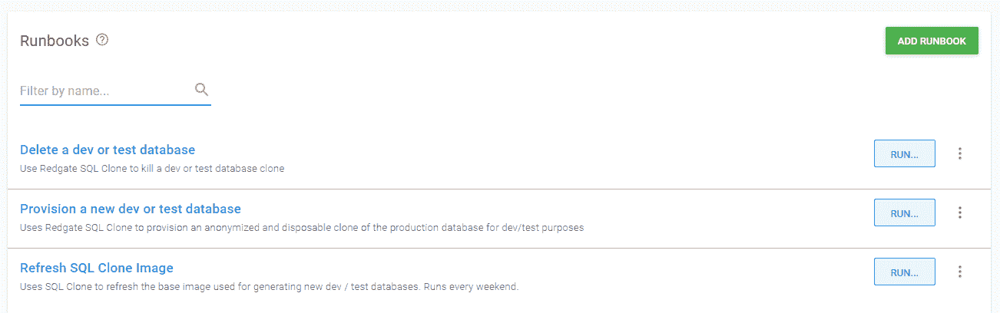](#)

此外，您可能希望将**刷新 SQL 克隆映像**运行手册设置为按计划运行([文档](https://octopus.com/docs/projects/project-triggers/scheduled-runbook-trigger))，以确保克隆始终使用相对最新的数据。请注意，虽然创建克隆应该非常快，但创建映像往往需要更长时间。这意味着这是典型的通宵/周末工作。

您应该与您的开发/测试团队就映像刷新的节奏达成一致。这一点很重要，因为他们需要在每次刷新后重新调配克隆资源。对于他们来说，在每周或 dev sprint 结束时运行映像刷新可能会很方便，这样他们就可以用新的克隆开始新的一周/sprint。

[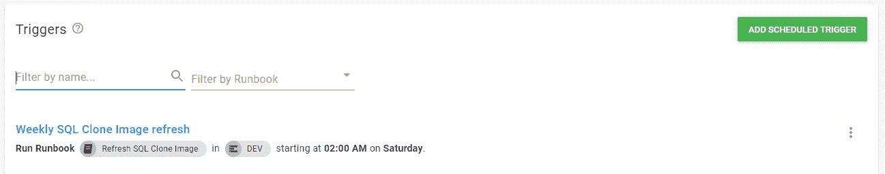](#)

这加强了各种良好的实践，例如确保所有代码都被合理地频繁提交到源代码控制，并且开发/测试数据库保持合理的一致性。此外，每次开发人员将他们最新的开发或测试源代码部署到一个新的克隆中时，您都在有效地实践您的生产部署，因此您会发现部署问题往往会更早地被发现——“在我的机器上”。

当然，为了简单起见，整篇文章都基于一个数据库。在现实世界中，您可能有多个数据库，通常具有跨数据库依赖性(哎哟)。将 SQL Clone 和 runbook 结合起来的好处是，您的 run book 可以提供所有需要的数据库，因此您知道您永远不会缺少依赖项。

所有这些数据库/克隆都需要驻留在 SQL 实例上，而 SQL 实例需要驻留在某个地方的虚拟机或容器上。这些虚拟机和容器需要驻留在您的云提供商或您自己的裸机上的一些基础架构上。

扩展这些 run book，或者将它们与其他 run book 结合起来是一个很好的主意，这样您就可以通过点击一个按钮来有效地重生您的整个开发、测试和生产环境。如果你对此感兴趣，这里有一些进一步的阅读材料:

## 下一步是什么？

如果你已经做到了这一步，我希望你已经被激励去行动了。

要了解关于数据库环境创建的更多信息，以及它如何适应更广泛的 DevOps 策略，您可能会喜欢我的关于安全模式更新的博客系列。它始于[数据库交付地狱](https://octopus.com/blog/safe-schema-updates-1-delivery-hell)。

特别是，您可能对第 6 部分感兴趣，该部分处理数据库环境供应。

阅读我们的 [Runbooks 系列](https://octopus.com/blog/tag/Runbooks%20Series)的其余部分。

愉快的部署！