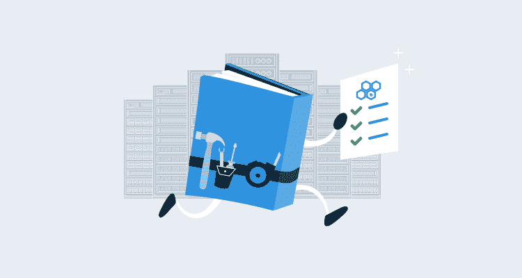

# 自助操作手册示例- Octopus 部署

> 原文：<https://octopus.com/blog/self-service-runbook-examples>

打破开发者和运营之间的壁垒是 DevOps 理念的基石。开发人员希望快速安全地交付他们的代码，为了做到这一点，他们需要执行常见的管理任务，这些任务通常都属于运营领域。安全性、审计以及如何正确执行操作是阻碍开发人员完成这些任务的最常见原因。

在这篇文章中，我将介绍一些例子[run book](https://octopus.com/docs/runbooks)，它们让开发人员能够访问自助服务任务，这将使他们继续工作，而不会授予他们不需要的额外权限。使用操作手册意味着他们对基础架构所做的更改会被捕获并可审计。

## 审计和安全

开箱即用，Octopus Deploy 为 runbooks 提供了一个健壮的审计机制，可以捕获谁在何时做了什么。除了审核之外，还可以将特定于 runbook 的用户角色分配给环境并确定其范围:

*   **Runbook 消费者** : Runbook 消费者可以查看和执行 Runbook。
*   **Runbook 制作者** : Runbook 制作者可以编辑和执行 Runbook。

将这些角色与范围一起使用，您可以赋予开发人员执行操作手册的能力，例如，在开发和测试中，而不是在阶段化或生产中。

## 自助服务任务的示例

下面列出了一些可以为自助服务实施的活动类型。这绝不是一个详尽的列表，但我希望它能给你一个可能的起点。

### 重新启动 web 应用程序

开发人员通常对他们的开发环境拥有提升的甚至是管理员的权限。一旦他们的应用程序被部署到服务器上，权限通常被限制为模拟类似生产的环境。IIS 能够授予[远程管理权限](https://docs.microsoft.com/en-us/iis/manage/remote-administration/remote-administration-for-iis-manager)；但是，这是针对整个 IIS 实例的，而不是针对特定站点/应用程序的。使用 runbook，您可以创建特定于项目的流程，这些流程只启动/停止与 Octopus 项目相关的应用程序。

### 重新启动服务

测试期间发现的错误会导致服务变得无响应。重启服务的能力通常需要相当高的权限级别。使用 runbook，可以让开发人员能够在服务器上重新启动服务，而无需为他们分配任何额外的权限。这有助于消除提交支持票证并等待操作人员执行任务的需要。

### 备份数据库

测试数据库更新通常是单向的。除非您在同一个事务中执行所有操作并回滚，否则更改是永久的，并且通常很难恢复。阻力最小的方法是在开始之前备份数据库，这样您就有东西可以返回。数据库服务器上的备份操作通常需要提升数据库服务器权限。数据库管理员(DBA)通常已经建立了备份过程，有时会使用第三方工具来帮助管理它们。使用 runbook，DBA 可以创建或至少提供如何进行数据库备份的输入，并使开发人员能够在需要时备份数据库。

### 恢复数据库

除了备份数据库的能力之外，在不需要等待 DBA 或填写支持单的情况下恢复数据库的能力可以大大缩短开发周期。使用 runbook，您不仅可以恢复备份，还可以提供从不同环境恢复数据库的方法，例如将生产拷贝恢复到测试环境。

### 为功能分支开发提供整个环境

在之前的一篇博客文章中，我们谈到了[特性分支](https://octopus.com/blog/rethinking-feature-branch-deployments)以及每当一个新的特性分支被创建时实现动态环境，然后当该分支被删除时再将其拆除。这种类型的自助服务允许开发人员提供类似生产的环境来测试他们的代码，然后在不再需要时删除它们。

## 重新启动服务器

重启服务器是确保操作系统干净启动的好方法。与其他场景一样，重启服务器的能力需要对机器的一些提升的权限。使用 runbook，您可以给开发人员重新启动机器的能力，而无需授予开发人员任何权限。

## 结论

操作手册提供了一种自动化操作任务的机制。让开发人员能够以自助方式执行这些任务可能会减少交付时间，并促进开发和运营人员之间的协作。